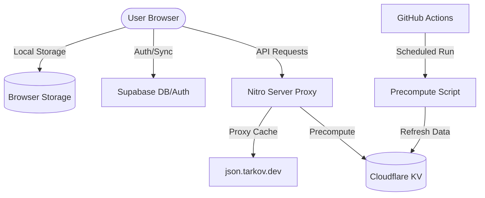

Relevant source files

The following files were used as context for generating this wiki page:

- [README.md](README.md)
- [AGENTS.md](AGENTS.md)
- [DESIGN.md](DESIGN.md)
- [public/llms.txt](public/llms.txt)
- [tests/llms-txt.test.ts](tests/llms-txt.test.ts)

# Introduction & Setup

TarkovTracker is a specialized progress-tracking application designed for *Escape from Tarkov* players. It enables users to monitor task completion, hideout upgrades, required items, and character levels separately for PvP and PvE game modes. The application is built as a highly tactile, fast-to-scan single-page application (SPA) that emphasizes functional density for power users.

The project operates on a client-first model where progress is saved in the browser's local storage by default, allowing immediate use without an account. Authentication enables advanced features such as real-time team collaboration, multi-device synchronization, and programmatic access via API tokens.

Sources: [README.md:9-30](README.md#L9-L30), [public/llms.txt:3-5](public/llms.txt#L3-L5), [DESIGN.md:121-125](DESIGN.md#L121-L125)

## Technical Stack & Architecture

TarkovTracker utilizes a modern, typed stack focused on performance and developer experience. It is strictly an SPA; Server-Side Rendering (SSR) is disabled to maintain a client-only tracking model.

### Core Technologies
- **Frontend Framework**: Nuxt 4 (SPA mode) with Vue 3 Composition API.
- **State Management**: Pinia (using `pinia-plugin-persistedstate` for persistence).
- **Styling**: Tailwind CSS v4 (Strictly no `<style>` blocks or scoped CSS).
- **Backend Services**: Supabase (Database, Auth, Realtime).
- **Infrastructure**: Cloudflare Pages for hosting and Cloudflare Workers for the public API gateway.
- **Testing**: Vitest for unit and integration testing.

Sources: [AGENTS.md:52-54](AGENTS.md#L52-L54), [README.md:112-114](README.md#L112-L114), [AGENTS.md:144-146](AGENTS.md#L144-L146), [DESIGN.md:126-128](DESIGN.md#L126-L128)

### System Data Flow
The application aggregates game data from external sources and proxies it through internal server routes to provide caching and corrections.

The diagram illustrates the flow between the local browser state, the Supabase backend for authenticated users, and the Nitro server proxy that interfaces with Tarkov.dev for game metadata.

Sources: [AGENTS.md:55-66](AGENTS.md#L55-L66), [AGENTS.md:79-85](AGENTS.md#L79-L85), [public/llms.txt:7-9](public/llms.txt#L7-L9)

## Development Setup

To begin development, ensure your environment meets the minimum requirement of Node.js >= 24.12.0. The project uses `pnpm` as the primary package manager.

### Local Installation
1. **Enable Corepack**: Ensure `pnpm` is available via `corepack enable`.
2. **Install Dependencies**: Execute `pnpm install`.
3. **Environment Configuration**: Copy `.env.example` to `.env`. 
4. **Supabase Setup**: At a minimum, `NUXT_PUBLIC_SUPABASE_URL` and `NUXT_PUBLIC_SUPABASE_ANON_KEY` must be provided to enable authentication and synchronization features. Without these, the app defaults to offline localStorage mode.

Sources: [README.md:95-107](README.md#L95-L107), [AGENTS.md:55-57](AGENTS.md#L55-L57)

### Common Commands
| Task | Command |
| :--- | :--- |
| Start Dev Server | `pnpm run dev` |
| Production Build | `pnpm run build` |
| Run Linting | `pnpm run lint` |
| Run Typecheck | `pnpm run typecheck` |
| Run Tests | `pnpm run test` |
| API Gateway Tests | `pnpm run test:api-gateway` |
| i18n Check | `pnpm run i18n:check` |

Sources: [README.md:116-124](README.md#L116-L124), [AGENTS.md:90-100](AGENTS.md#L90-L100)

## Project Map & Organization

The repository is organized into distinct modules to separate concerns between frontend logic, database management, and API infrastructure.

- **`app/`**: The Nuxt 4 source, containing features, stores, composables, and locales.
- **`app/features/`**: Domain slices such as `tasks`, `hideout`, `maps`, and `team`.
- **`app/server/api/`**: Nitro server routes. Specifically, `app/server/api/tarkov/` handles the Tarkov.dev proxying.
- **`supabase/`**: Database migrations and Deno-based Edge Functions.
- **`workers/`**: Cloudflare Workers for the public API gateway.
- **`scripts/precompute/`**: Tooling for heavy task-core payloads stored in Cloudflare KV.

Sources: [README.md:129-136](README.md#L129-L136), [AGENTS.md:68-87](AGENTS.md#L68-L87)

## Development Standards

### Naming & Coding Conventions
- **Components**: PascalCase filenames (e.g., `TaskCard.vue`).
- **Composables**: `useCamelCase` naming convention.
- **Stores**: `useXStore` pattern in `app/stores/`.
- **Imports**: Alphabetically sorted. Absolute imports using `@/` aliases are required; parent-relative imports are forbidden.
- **Typing**: Explicit types for exports are preferred over `any`.

Sources: [AGENTS.md:131-142](AGENTS.md#L131-L142), [AGENTS.md:144-146](AGENTS.md#L144-L146), [AGENTS.md:162-164](AGENTS.md#L162-L164)

### Visual Design System
The application adheres to a strict "tactical dark" aesthetic.
- **Palette**: Two-layer architecture using HSL static fallbacks and OKLCH overrides for perceptually tuned colors in modern browsers.
- **Typography**: Monospace stack (`ui-monospace`) for both UI elements and data display.
- **Components**: Nuxt UI primitives (`UButton`, `UInput`, etc.) are the baseline for all controls.

Sources: [DESIGN.md:121-125](DESIGN.md#L121-L125), [DESIGN.md:131-140](DESIGN.md#L131-L140), [DESIGN.md:155-157](DESIGN.md#L155-L157)

## Conclusion

The Introduction & Setup phase of TarkovTracker is designed to be frictionless for both users and developers. Users can start tracking immediately via browser storage, while developers can bootstrap a full development environment with minimal configuration. The combination of a strict Nuxt 4 SPA architecture and a Cloudflare/Supabase backend ensures a performant, scalable foundation for tracking complex game progression.

Sources: [README.md:16-18](README.md#L16-L18), [AGENTS.md:52-54](AGENTS.md#L52-L54)
