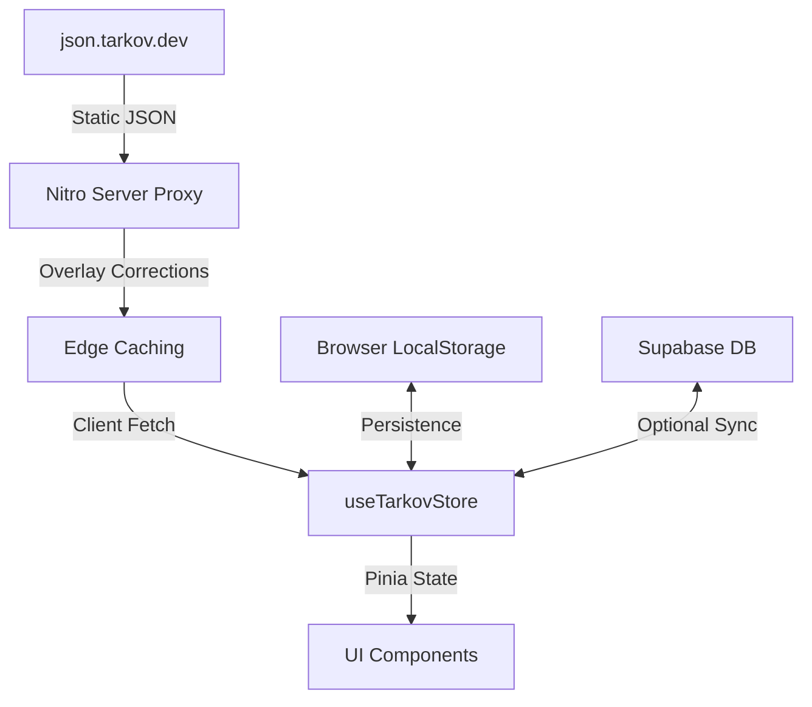

Relevant source files

The following files were used as context for generating this wiki page:

- [README.md](README.md)
- [AGENTS.md](AGENTS.md)
- [DESIGN.md](DESIGN.md)
- [public/llms.txt](public/llms.txt)
- [app/locales/en.json](app/locales/en.json)

# Introduction & Features

TarkovTracker is a specialized single-page application (SPA) designed to track player progression within the game *Escape from Tarkov*. It provides comprehensive monitoring for tasks, hideout upgrades, item requirements, and player levels, supporting both PvP (Regular) and PvE game modes separately. The system is architected as a client-side application that preserves progress in local storage while offering optional cloud synchronization and team collaboration features for authenticated users.

Sources: [README.md:10-13](README.md#L10-L13), [public/llms.txt:3-4](public/llms.txt#L3-L4), [app/locales/en.json:694-697](app/locales/en.json#L694-L697)

## Core Progression Tracking

The application centers on four primary tracking domains: Tasks, Hideout, Needed Items, and Storyline. These modules allow players to visualize their path toward significant end-game milestones like the Kappa Secure Container or unlocking the Lightkeeper trader.

### Feature Breakdown

- **Task & Objective Tracking:** Users can track the status of quests (available, locked, completed, or failed) and specific sub-objectives. The system includes a graph view to visualize task dependencies and prerequisite chains.
- **Hideout Management:** Tracks module upgrades, station levels, and the specific parts required for future construction. It enforces station, skill, and trader loyalty requirements to determine upgrade availability.
- **Item Consolidation:** The "Needed Items" feature aggregates all material requirements from active tasks and planned hideout upgrades into a single, filterable list. It distinguishes between items that must be "Found in Raid" (FIR) and those that do not.
- **Storyline Progress:** Tracks progress through sequential story chapters, providing insights into route choices, blocked paths, and estimated timing for unlocks.

Sources: [README.md:17-21](README.md#L17-L21), [public/llms.txt:14-22](public/llms.txt#L14-L22), [app/locales/en.json:442-450](app/locales/en.json#L442-L450), [app/locales/en.json:579-583](app/locales/en.json#L579-L583)

### Progression Data Flow

The following diagram illustrates how game data is retrieved and processed by the tracker.

Explanation: Game data is proxied from tarkov.dev through a Nitro server route that applies corrections and caching before reaching the client-side Pinia stores for rendering.

Sources: [AGENTS.md:83-84](AGENTS.md#L83-L84), [AGENTS.md:54-58](AGENTS.md#L54-L58), [public/llms.txt:6-7](public/llms.txt#L6-L7)

## Account vs. Guest Experience

TarkovTracker is designed to be functional immediately without user registration. Progress is stored in the browser's local storage by default. However, creating an account via OAuth providers (Discord, Twitch, Google, or GitHub) unlocks extended capabilities.

| Feature | Guest (No Account) | Authenticated User |
| :--- | :---: | :---: |
| Local Progress Persistence | ✅ | ✅ |
| PvP / PvE Mode Separation | ✅ | ✅ |
| Interactive Maps | ✅ | ✅ |
| Cross-Device Sync | ❌ | ✅ |
| Team Progress Sharing | ❌ | ✅ |
| Public Profile Sharing | ❌ | ✅ |
| Public API Tokens | ❌ | ✅ |
| Data Backups (Cloud) | ❌ | ✅ |

Sources: [README.md:15-32](README.md#L15-L32), [public/llms.txt:11-12](public/llms.txt#L11-L12)

## Technical Architecture

The project is built on a modern full-stack JavaScript environment leveraging the Nuxt 4 framework. It is strictly a Single-Page Application (SPA) with Server-Side Rendering (SSR) disabled.

- **Frontend:** Nuxt 4, Vue 3 (Composition API), Pinia for state management.
- **Styling:** Tailwind CSS v4, utilizing a monospace typography stack and a two-layer color system (HSL fallbacks and OKLCH for perceptually tuned colors).
- **Backend:** Supabase provides database, authentication, and real-time synchronization.
- **Edge Infrastructure:** Deployed on Cloudflare Pages and Workers. Heavy task-core payloads are precomputed into Cloudflare KV namespaces via scheduled GitHub Actions.

Sources: [README.md:61-63](README.md#L61-L63), [AGENTS.md:28-31](AGENTS.md#L28-L31), [AGENTS.md:54-58](AGENTS.md#L54-L58), [DESIGN.md:41-45](DESIGN.md#L41-L45)

## Specialized Tools & Integration

TarkovTracker offers several advanced features for power users and content creators.

### Streamer Tools
The application includes a specialized "Streamer Tools" module that generates browser-source URLs for software like OBS or Streamlabs. These sources provide real-time overlays for Kappa quest progress, item collection status, or combined summaries.
Sources: [app/locales/en.json:784-790](app/locales/en.json#L784-L790), [public/llms.txt:24-25](public/llms.txt#L24-L25)

### Public JSON APIs
The platform exposes several public API endpoints for programmatic access to game and progress data.

| Endpoint | Description | Parameters |
| :--- | :--- | :--- |
| `/api/tarkov/tasks-core` | Core task, map, and trader data | `lang`, `gameMode` |
| `/api/tarkov/hideout` | Hideout stations and requirements | `lang`, `gameMode` |
| `/api/tarkov/items` | Full item metadata index | `lang`, `gameMode` |
| `/api/tarkov/prestige` | Prestige requirement tracking data | `lang` |

Sources: [public/llms.txt:27-38](public/llms.txt#L27-L38), [tests/llms-txt.test.ts:98-105](tests/llms-txt.test.ts#L98-L105)

### Third-Party Companion Integration
The system integrates with community tools such as:
- **TarkovMonitor:** A desktop app that watches game log files to automatically update quest completion in the tracker via API.
- **RatScanner:** An open-source tool for identifying items from screenshots and checking their relevance to tracked tasks.
Sources: [public/llms.txt:20-22](public/llms.txt#L20-L22), [app/locales/en.json:1152-1154](app/locales/en.json#L1152-L1154)

## User Interface Design

The design philosophy prioritizes a "tactical" and "quiet" aesthetic suitable for a hardcore survival shooter.

- **Surface Ladder:** The UI uses a "ladder" of dark surfaces, ranging from `surface-950` (canvas) to `surface-800` (raised controls).
- **Typography:** A strictly monospace font stack (`ui-monospace`, `SFMono-Regular`, etc.) is used for all interface elements to maintain a technical feel.
- **Density:** The layout favors functional density over white space, allowing players to scan large amounts of task and item data quickly.

Sources: [DESIGN.md:38-40](DESIGN.md#L38-L40), [DESIGN.md:46-55](DESIGN.md#L46-L55), [DESIGN.md:81-84](DESIGN.md#L81-L84)

## Summary

TarkovTracker serves as a comprehensive companion platform for *Escape from Tarkov* players, bridging the gap between game data and personal progression. Its architecture balances privacy (local-first storage) with utility (cloud sync and team features), while its technical stack ensures performance through edge caching and precomputed data pipelines. The inclusion of streamer-specific tools and public APIs further extends its utility beyond simple tracking into a robust data hub for the game's community.

Sources: [README.md:10-13](README.md#L10-L13), [AGENTS.md:28-35](AGENTS.md#L28-L35), [public/llms.txt:1-9](public/llms.txt#L1-L9)
