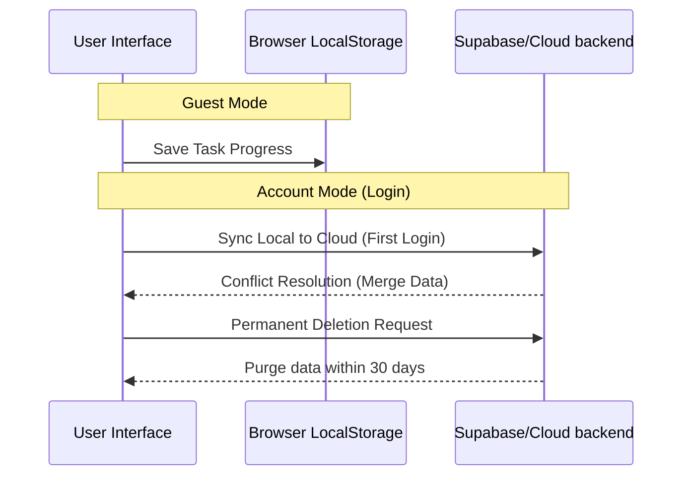

<details>
<summary>Relevant source files</summary>

The following files were used as context for generating this wiki page:

- [SUPPORT.md](SUPPORT.md)
- [CODE_OF_CONDUCT.md](CODE_OF_CONDUCT.md)
- [SECURITY.md](SECURITY.md)
- [README.md](README.md)
- [app/pages/terms-of-service.vue](app/pages/terms-of-service.vue)
- [app/pages/privacy.vue](app/pages/privacy.vue)
</details>

# Usage & Community Guidelines

TarkovTracker is an open-source, community-driven progress tracking application for Escape from Tarkov. These guidelines establish the standards for using the service, participating in the community, and contributing to the project. The platform operates as a volunteer-run project with a focus on tactical efficiency, transparency, and inclusive collaboration.

Sources: [README.md:14-16](README.md#L14-L16), [app/pages/privacy.vue:15-18](app/pages/privacy.vue#L15-L18)

## 1. Acceptable Use and Conduct

Users are expected to engage with the service for its intended purpose: tracking game progression (tasks, hideout, level, items) and collaborating with teammates. Accessing the service constitutes a legally binding agreement to follow these terms.

### 1.1 Prohibited Activities
The project maintains strict boundaries regarding interactions with game integrity and service infrastructure. Users must not:
*  **Violate Game Terms:** Use the service to facilitate violations of Battlestate Games' Terms of Service or anti-cheat policies.
*  **Market Abuse:** Promote or facilitate Real Money Trading (RMT), account boosting, or third-party cheat software.
*  **Infrastructure Stress:** Excessively burden systems via API spamming, unauthorized data scraping, or bypassing rate limits.
*  **Malicious Content:** Transmit viruses, worms, or any technologically harmful material.

Sources: [app/pages/terms-of-service.vue:245-285](app/pages/terms-of-service.vue#L245-L285)

### 1.2 Community Interaction Standards
Participation in community spaces (Discord, GitHub, Crowdin) is governed by the Contributor Covenant. The primary goal is to maintain a harassment-free experience for everyone.

| Behavior Type | Examples |
| :--- | :--- |
| **Positive** | Empathy, kindness, respecting differing opinions, and accepting responsibility. |
| **Unacceptable** | Trolling, insults, public/private harassment, and sexualized language. |

Sources: [CODE_OF_CONDUCT.md:7-31](CODE_OF_CONDUCT.md#L7-L31)

## 2. Community Channels and Support

The project utilizes specific channels for different types of interactions to ensure requests are routed to the appropriate volunteers.

```mermaid
flowchart TD
    Start[User Need] --> Help[General Questions]
    Start --> Bug[Bug Reports]
    Start --> Security[Security Vulnerability]
    Start --> Translate[Localization]

    Help --> Discord[Discord Community]
    Help --> GH_Disc[GitHub Discussions]

    Bug --> GH_Issue[GitHub Issue Tracker]

    Security --> Sec_Email[legal@tarkovtracker.org]

    Translate --> Crowdin[Crowdin Project]
```

The diagram shows the routing logic for user requests based on the nature of the inquiry.
Sources: [README.md:46-53](README.md#L46-L53), [SUPPORT.md](SUPPORT.md), [SECURITY.md:8-12](SECURITY.md#L8-L12)

### 2.1 Technical Support
Technical issues and feature requests are tracked through the GitHub Organization. General "how-to" questions should be directed to community forums rather than the bug tracker to keep the development queue manageable.

| Channel | Purpose |
| :--- | :--- |
| **Discord** | Real-time community help and team collaboration. |
| **GitHub Discussions** | Asynchronous community Q&A and planning. |
| **GitHub Issues** | Formal bug reporting and feature tracking. |

Sources: [README.md:46-50](README.md#L46-L50), [app/pages/terms-of-service.vue:624-644](app/pages/terms-of-service.vue#L624-L644)

## 3. Account and Data Usage

TarkovTracker provides tiered functionality depending on whether a user chooses to create an account.

### 3.1 Guest vs. Authenticated Usage
*  **Guest Access:** Progress is saved in the browser's local storage. This data is persistent between visits on the same browser but does not sync across devices.
*  **Authenticated Access:** Users can sign in via Discord, Twitch, Google, or GitHub. This enables server-side backups, real-time team progress sharing, and public API tokens.

Sources: [README.md:18-38](README.md#L18-L38)

### 3.2 Data Management Flows
Users have specific rights regarding their data, including portability (JSON export) and the "Right to be Forgotten" (account deletion).



The sequence diagram illustrates the flow of progress data between local storage and cloud synchronization.
Sources: [README.md:33-38](README.md#L33-L38), [app/pages/privacy.vue:152-168](app/pages/privacy.vue#L152-L168)

## 4. Security Reporting

Security vulnerabilities must never be reported via public GitHub issues or community Discord channels. Reports must be sent privately to ensure a coordinated disclosure process.

### 4.1 Vulnerability Report Requirements
A valid security report should include:
1.  Description of the vulnerability and its potential impact.
2.  Step-by-step instructions to reproduce the issue.
3.  The specific URL or component affected.

Reports should be sent to **legal@tarkovtracker.org** with "SECURITY" in the subject line. The team acknowledges receipt within 48 hours and provides status updates every 7 days.

Sources: [SECURITY.md:8-25](SECURITY.md#L8-L25), [app/pages/privacy.vue:245-248](app/pages/privacy.vue#L245-L248)

## 5. Enforcement Guidelines

Community leaders are responsible for enforcing the Code of Conduct. Consequences for violations follow a graduated "Enforcement Ladder."

| Stage | Impact | Consequence |
| :--- | :--- | :--- |
| **1. Correction** | Unprofessional language. | Private written warning; possible public apology. |
| **2. Warning** | Single incident violation. | Warning with consequences for continued behavior. |
| **3. Temporary Ban** | Serious violation. | Ban from communication for a specified period. |
| **4. Permanent Ban** | Pattern of harassment. | Permanent removal from all community spaces. |

Sources: [CODE_OF_CONDUCT.md:58-94](CODE_OF_CONDUCT.md#L58-L94)

## 6. Intellectual Property and Trademarks

TarkovTracker is an independent fan project. It is **not** affiliated with Battlestate Games Limited or BattlEye Innovations.
*  **Source Code:** Distributed under the GNU General Public License v3.0 (GPLv3).
*  **Game Assets:** Names, images, and descriptions from Escape from Tarkov remain the property of Battlestate Games Limited.
*  **Third-Party Data:** Aggregated from tarkov.dev and the Escape from Tarkov Wiki under their respective licenses.

Sources: [README.md:120](README.md#L120), [app/pages/terms-of-service.vue:195-240](app/pages/terms-of-service.vue#L195-L240)

Usage of the service is entirely at the user's own risk. The project provides no warranty of accuracy for game data, which may be outdated or subject to change by the game developers at any time.

Sources: [app/pages/terms-of-service.vue:440-475](app/pages/terms-of-service.vue#L440-L475)
