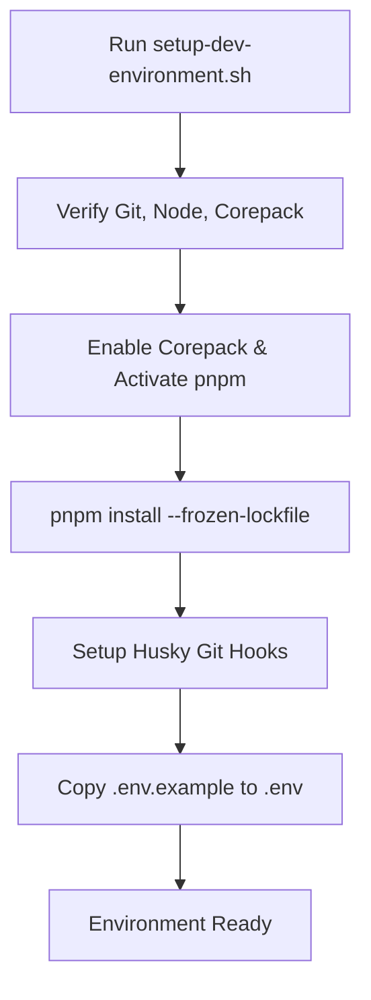
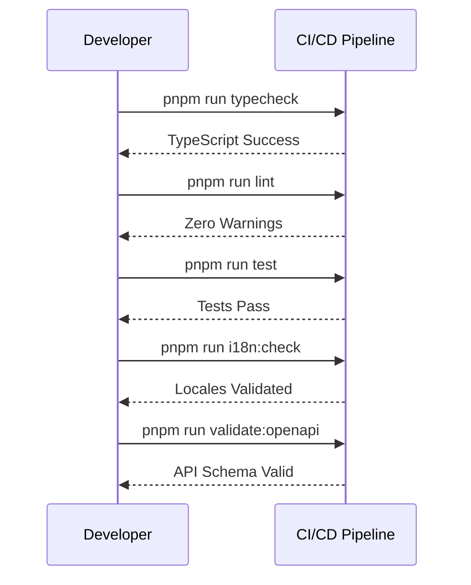

<details>
<summary>Relevant source files</summary>

The following files were used as context for generating this wiki page:

- [README.md](README.md)
- [scripts/setup-dev-environment.sh](scripts/setup-dev-environment.sh)
- [AGENTS.md](AGENTS.md)
- [DESIGN.md](DESIGN.md)
- [code_review.md](code_review.md)
</details>

# Local Setup & Development

TarkovTracker is a Nuxt 4 single-page application (SPA) built for tracking Escape from Tarkov progression. The development environment is designed to be highly automated, utilizing Node.js, pnpm, and Corepack to maintain consistency across different development machines.

The environment supports two primary modes: an "offline" mode using browser `localStorage` for simple task tracking, and a "cloud" mode that enables authentication, synchronization, and team features via Supabase. Developers can switch between these modes by configuring environment variables in a local `.env` file.
Sources: [README.md:1-74](README.md#L1-L74), [AGENTS.md:1-50](AGENTS.md#L1-L50)

## Quick Start

To begin local development, ensure you have Node.js (version 24.12.0 or higher) and Git installed. The project uses Corepack to manage the `pnpm` package manager version.

```bash
corepack enable        # enables pnpm via Corepack
pnpm install           # installs project dependencies
pnpm run dev           # starts dev server at http://localhost:3000
```

Sources: [README.md:70-74](README.md#L70-L74), [scripts/setup-dev-environment.sh:10-18](scripts/setup-dev-environment.sh#L10-L18)

## Prerequisites and Automated Setup

The project provides a comprehensive setup script located at `scripts/setup-dev-environment.sh` that automates prerequisite checking, dependency installation, and environment configuration.

### Prerequisite Checks
The setup script verifies the following:
- **Command Availability**: Checks for `git`, `node`, and `corepack`.
- **Node Version**: Validates that the installed Node.js version matches the requirement in `.nvmrc` (defaults to 24.12.0).
- **pnpm Version**: Automatically activates the specific version of `pnpm` defined in `package.json` using `corepack prepare`.
- **Git Hooks**: Initializes `husky` for pre-commit validation.

Sources: [scripts/setup-dev-environment.sh:7-55](scripts/setup-dev-environment.sh#L7-L55), [AGENTS.md:27-28](AGENTS.md#L27-L28)

### Environment Initialization Flow
The following flowchart illustrates the automated setup process executed by the setup script:



The script specifically prevents overwriting existing `.env` files to protect contributor secrets while migrating legacy `.env.local` files if present.
Sources: [scripts/setup-dev-environment.sh:57-111](scripts/setup-dev-environment.sh#L57-L111)

## Tech Stack & Architecture

TarkovTracker follows a modern SPA architecture. It is strictly client-side only; Server-Side Rendering (SSR) is disabled.

| Layer | Technology |
| :--- | :--- |
| **Framework** | Nuxt 4 (SPA mode, `ssr: false`) |
| **UI Library** | Vue 3 (Composition API), Nuxt UI |
| **Styling** | Tailwind CSS v4 |
| **State Management** | Pinia (with persisted state plugin) |
| **Backend/Auth** | Supabase (Database, Auth, Realtime) |
| **Runtime** | Node.js >= 24.12.0 |
| **Package Manager** | pnpm@11.14.0 |
| **Testing** | Vitest |

Sources: [README.md:77-78](README.md#L77-L78), [AGENTS.md:27-31](AGENTS.md#L27-L31), [AGENTS.md:118-120](AGENTS.md#L118-L120)

## Configuration and Environment Variables

The application behavior is controlled primarily through environment variables. Variables prefixed with `NUXT_PUBLIC_` are exposed to the browser, while `NUXT_` variables remain server-side.

| Variable | Required | Description |
| :--- | :--- | :--- |
| `NUXT_PUBLIC_SUPABASE_URL` | Optional* | The URL of your Supabase project. Required for cloud features. |
| `NUXT_PUBLIC_SUPABASE_ANON_KEY` | Optional* | The anonymous public key for SupABASE. Required for cloud features. |
| `NUXT_PUBLIC_CLIENT_LOG_SINK_URL`| Optional | URL for browser log forwarding (opt-in). |

*\*If these are missing, the app defaults to "offline mode" using `localStorage` only.*
Sources: [README.md:75-81](README.md#L75-L81), [AGENTS.md:243-251](AGENTS.md#L243-L251), [code_review.md:104-114](code_review.md#L104-L114)

## Common Development Commands

The project uses `pnpm` scripts for routine development tasks.

| Task | Command |
| :--- | :--- |
| **Start Dev Server** | `pnpm run dev` |
| **Production Build** | `pnpm run build` |
| **Lint Code** | `pnpm run lint` |
| **Fix Lint Issues** | `pnpm run lint:fix` |
| **Run Tests** | `pnpm run test` |
| **Typecheck** | `pnpm run typecheck` |
| **API Gateway Dev** | `pnpm --filter api-gateway run dev` |

Sources: [README.md:83-93](README.md#L83-L93), [AGENTS.md:68-80](AGENTS.md#L68-L80), [scripts/setup-dev-environment.sh:124-126](scripts/setup-dev-environment.sh#L124-L126)

## Coding Standards and Development Rules

To maintain codebase health, several strict rules are enforced via linting and manual review policies:

1.  **SPA Consistency**: Do not use SSR-only features like server-only middleware or `useAsyncData` SSR options.
2.  **Imports**: Use `@/` aliases for all internal imports. Parent-relative imports (`../`) are forbidden.
3.  **Styling**: Use Tailwind v4 theme tokens. Hex values and `<style>` blocks are prohibited.
4.  **Localization**: Only edit `app/locales/en.json`. Other languages are managed by Crowdin.
5.  **Git Workflow**: PRs must address exactly one change. Husky pre-commit hooks run Prettier and ESLint on staged files automatically.

Sources: [AGENTS.md:118-144](AGENTS.md#L118-L144), [code_review.md:32-45](code_review.md#L32-L45)

### PR Validation Sequence
Before a pull request is considered production-ready, the following validation sequence must pass:



Sources: [AGENTS.md:82-95](AGENTS.md#L82-L95), [code_review.md:15-28](code_review.md#L15-L28)

## Design System

The application uses a "tactical" dark theme. Design tokens are defined in `app/assets/css/tailwind.css`.

- **Surfaces**: Follow a ladder from `surface-950` (canvas) up to `surface-600` (dividers).
- **Semantic Colors**: Golden-tan for `primary` actions, teal for `accent`/`info`, and standard semantic colors for `success`, `warning`, and `error`.
- **Typography**: Uses a monospace stack (`ui-monospace`) for all UI text to maintain a tactical aesthetic.

Sources: [DESIGN.md:1-120](DESIGN.md#L1-L120)

Local setup is designed for rapid iteration. By utilizing the provided setup scripts and adhering to the SPA-only development patterns, contributors can ensure their changes remain compatible with the project's Cloudflare and Supabase deployment infrastructure.
Sources: [AGENTS.md:33-46](AGENTS.md#L33-L46), [code_review.md:128-140](code_review.md#L128-L140)
