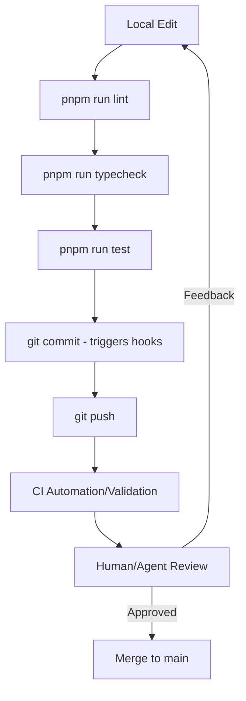

<details>
<summary>Relevant source files</summary>

The following files were used as context for generating this wiki page:

- [README.md](README.md)
- [AGENTS.md](AGENTS.md)
- [DESIGN.md](DESIGN.md)
- [CODE_OF_CONDUCT.md](CODE_OF_CONDUCT.md)
- [SECURITY.md](SECURITY.md)
</details>

# Contributor Workflow

The TarkovTracker project follows a structured contributor workflow designed to maintain code quality, ensure system invariants are held, and facilitate seamless collaboration between human developers and AI agents. The workflow spans from local development environment setup to pull request validation and final production readiness reviews.

Contributors are expected to adhere to specific coding standards, including a strict "SPA-only" architecture and Tailwind CSS v4 styling, while following a "one change per PR" policy to ensure focused and reviewable contributions.
Sources: [README.md:95-97](README.md#L95-L97), [AGENTS.md:129-140](AGENTS.md#L129-L140)

## Local Development Setup

To begin contributing, developers must enable Corepack and install dependencies using `pnpm`. The project requires Node.js version 24.12.0 or higher.

```bash
corepack enable        # enables pnpm via Corepack
pnpm install
pnpm run dev           # starts local server at http://localhost:3000
```

Sources: [README.md:73-77](README.md#L73-L77), [AGENTS.md:86-88](AGENTS.md#L86-L88)

### Environment Configuration
Contributors must copy `.env.example` to `.env`. For full functionality, `NUXT_PUBLIC_SUPABASE_URL` and `NUXT_PUBLIC_SUPABASE_ANON_KEY` are required. Without these, the application operates in an "offline mode" utilizing `localStorage` only, disabling features like authentication, real-time sync, and teams.
Sources: [README.md:79-84](README.md#L79-L84)

## Development Cycle and Validation

The project utilizes a comprehensive suite of commands to ensure code health before submission. Contributors must run linting, typechecking, and tests locally.

### Common Developer Commands

| Task | Command | Description |
| :--- | :--- | :--- |
| **Development** | `pnpm run dev` | Start the Nuxt 4 development server. |
| **Linting** | `pnpm run lint` | Run ESLint and check for warnings. |
| **Formatting** | `pnpm run format` | Run Prettier and ESLint fixes. |
| **Typecheck** | `pnpm run typecheck` | Validate TypeScript types. |
| **Testing** | `pnpm run test` | Execute Vitest test suite. |
| **i18n** | `pnpm run i18n:check` | Validate naming conventions in `en.json`. |

Sources: [README.md:89-91](README.md#L89-L91), [AGENTS.md:99-106](AGENTS.md#L99-L106)

### Validation Policy
Before completing any task, contributors (especially AI agents) must run the smallest relevant validation. Formatting is enforced via a pre-commit hook using `husky` and `lint-staged`.
Sources: [AGENTS.md:108-115](AGENTS.md#L108-L115)

## Pull Request Guidelines

The repository enforces a "PR Review Gate" policy to ensure all automated and human feedback is addressed before merging.

### PR Requirements
- **Scope**: Each PR must address one change only (single fix, update, or feature).
- **In-Scope Feedback**: Must be fixed on the same branch. Follow-up PRs for current scope feedback are discouraged.
- **Out-of-Scope Feedback**: Should be tracked as a new GitHub issue rather than expanding the current PR.
- **Approval**: PRs cannot be merged until every in-scope thread has an explicit disposition and unresolved thread count is zero.

Sources: [README.md:95-97](README.md#L95-L97), [AGENTS.md:200-213](AGENTS.md#L200-L213)

### Workflow Flowchart
The following diagram illustrates the standard progression from local development to merge.



The diagram shows the iterative cycle of validation required for every contribution.
Sources: [AGENTS.md:108-125](AGENTS.md#L108-L125), [AGENTS.md:200-205](AGENTS.md#L200-L205)

## Technical and Design Standards

Contributors must follow specific architectural constraints to ensure project consistency.

### Hard Rules
- **Architecture**: Single Page Application (SPA) only. SSR-specific features are disabled.
- **Styling**: Tailwind CSS v4 only. No `<style>` blocks or scoped CSS. Hex values are prohibited in templates; use Tailwind theme tokens.
- **Localization**: Only `app/locales/en.json` should be edited. Non-English files are managed by Crowdin.
- **Imports**: Use `@/` aliases for all internal imports. Parent-relative imports (`../`) are enforced against by ESLint.

Sources: [AGENTS.md:129-140](AGENTS.md#L129-L140), [DESIGN.md:99-102](DESIGN.md#L99-L102)

### Design System Invariants
Contributors must adhere to the tactical, dark-themed design contract. The "Surface Ladder" defines specific token mappings:
- `canvas` maps to `surface-950`.
- `shell` maps to `surface-900`.
- `raised` controls map to `surface-800`.
- Typography uses a monospace stack across both interface and display text.

Sources: [DESIGN.md:108-121](DESIGN.md#L108-L121), [DESIGN.md:131-133](DESIGN.md#L131-L133)

## Production Readiness and Security

A "Production Readiness Review" is required for critical changes, looking at command validation and risk areas defined in `code_review.md`.

### Security Policy
Contributors must not open public issues for security vulnerabilities. Instead, private reporting through GitHub or email (`security@tarkovtracker.org`) is required. Only the latest version of the `main` branch receives security fixes.
Sources: [AGENTS.md:121-125](AGENTS.md#L121-L125), [SECURITY.md:6-15](SECURITY.md#L6-L15)

## Conclusion

The TarkovTracker contributor workflow prioritizes strict validation and architectural consistency. By combining automated hooks, standardized developer commands, and a rigorous review gate, the project ensures that both human and AI contributors maintain a high standard of code quality and design integrity.
Sources: [AGENTS.md:108-112](AGENTS.md#L108-L112), [AGENTS.md:200-205](AGENTS.md#L200-L205)
