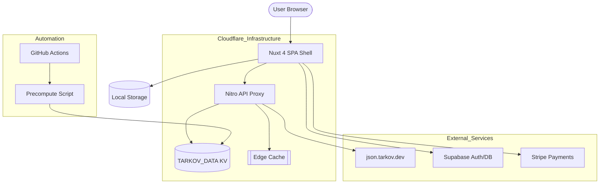
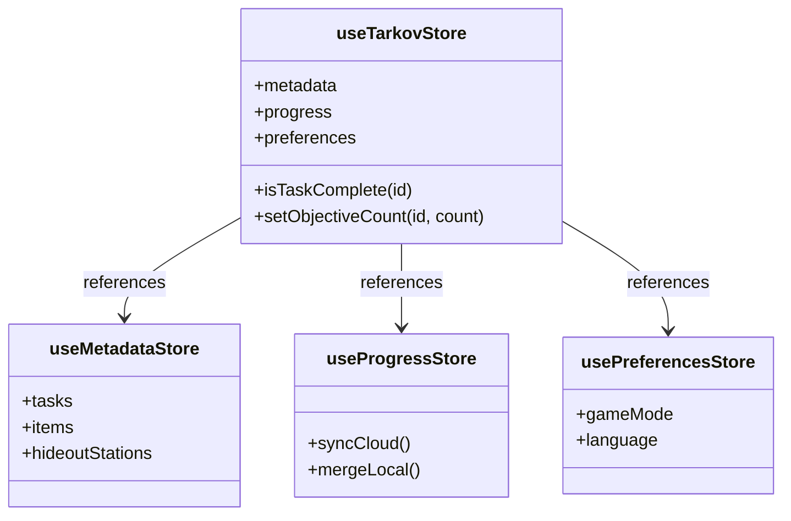

Relevant source files

The following files were used as context for generating this wiki page:

- [README.md](README.md)
- [AGENTS.md](AGENTS.md)
- [DESIGN.md](DESIGN.md)
- [code_review.md](code_review.md)
- [public/llms.txt](public/llms.txt)
- [tests/llms-txt.test.ts](tests/llms-txt.test.ts)

# Architecture Overview

TarkovTracker is a client-side tracking application built with Nuxt 4, designed for Escape from Tarkov players to manage task progress, hideout upgrades, and team collaboration. The architecture is primarily a Single-Page Application (SPA) that operates in a "client-first" mode, where user progress is persisted in local storage by default and optionally synchronized to a backend for multi-device support and real-time team features.

Sources: [README.md:1-13](README.md#L1-L13), [AGENTS.md:41-45](AGENTS.md#L41-L45), [public/llms.txt:3-6](public/llms.txt#L3-L6)

The system integrates heavily with external data providers, specifically `tarkov.dev`, and utilizes a multi-layer caching strategy involving Cloudflare Workers and KV namespaces to ensure high performance and reliability.

Sources: [AGENTS.md:65-74](AGENTS.md#L65-L74), [code_review.md:58-65](code_review.md#L58-L65)

## Core Tech Stack

The application follows a modern JavaScript/TypeScript stack optimized for deployment on edge infrastructure.

| Layer | Technology |
| :--- | :--- |
| **Frontend Framework** | Nuxt 4 (SPA mode, `ssr: false`), Vue 3 Composition API |
| **State Management** | Pinia with `pinia-plugin-persistedstate` |
| **Styling** | Tailwind CSS v4 |
| **Backend/Auth** | Supabase (Database, Auth, Realtime) |
| **Deployment** | Cloudflare Pages & Workers |
| **Local Runtime** | Node >=24.12.0, pnpm |

Sources: [README.md:124-126](README.md#L124-L126), [AGENTS.md:41-43](AGENTS.md#L41-L43), [code_review.md:104-110](code_review.md#L104-L110)

## System Architecture

The high-level architecture consists of a static SPA shell served via Cloudflare Pages, which communicates with a Nitro-based server proxy for game data and directly with Supabase for user-specific data.

The diagram illustrates the flow from the user browser through the edge infrastructure to external data and auth providers.

Sources: [README.md:124-126](README.md#L124-L126), [AGENTS.md:65-74](AGENTS.md#L65-L74), [code_review.md:38-42](code_review.md#L38-L42), [public/llms.txt:5-8](public/llms.txt#L5-L8)

## Data Management and Caching

TarkovTracker employs a multi-tier data fetching and caching pipeline to minimize dependency on the upstream `tarkov.dev` API and ensure low latency for users.

### Game Data Pipeline
1.  **Precompute**: A standalone script runs via GitHub Actions to transform heavy `tarkov.dev` payloads into optimized segments.
2.  **KV Namespace**: These segments are stored in the `TARKOV_DATA` KV namespace on Cloudflare.
3.  **API Proxy**: Nitro server routes (`/api/tarkov/*`) handle client requests. They attempt to read from the KV namespace first.
4.  **Edge Cache**: If the KV binding is missing or the entry is absent, the proxy falls back to the per-colo Cache API.

Sources: [AGENTS.md:65-74](AGENTS.md#L65-L74), [code_review.md:58-65](code_review.md#L58-L65)

### User Progress Sync
The application supports two modes of operation:
*  **Guest Mode**: Progress is saved exclusively in the browser's local storage. No account is required.
*  **Account Mode**: Sign-in via Discord, Twitch, Google, or GitHub enables server-side synchronization via Supabase. Progress is merged between local and cloud states upon login.

Sources: [README.md:21-48](README.md#L21-L48), [AGENTS.md:131-135](AGENTS.md#L131-L135)

## Module Map

The project is organized into several distinct modules based on their functional domain:

*  **`app/`**: The Nuxt 4 source code containing the frontend application logic.
  *  **`features/`**: Domain slices such as `tasks`, `hideout`, `maps`, and `team`.
  *  **`stores/`**: Pinia stores managing core state like `useTarkovStore`, `useMetadataStore`, and `useProgressStore`.
  *  **`server/api/`**: Nitro server routes, including the Tarkov API proxy.
*  **`supabase/`**: Contains database migrations and Deno edge functions.
*  **`workers/`**: Cloudflare Workers for the public API gateway and rate limiting.
*  **`scripts/`**: Tooling for precomputing data and environment setup.

Sources: [README.md:144-150](README.md#L144-L150), [AGENTS.md:52-64](AGENTS.md#L52-L64)

## Component Architecture

The UI is built using Nuxt UI components and custom feature-specific components. Design consistency is maintained through Tailwind CSS v4 theme tokens.

The diagram shows the relationship between the primary Pinia stores that manage the application's global state.

Sources: [AGENTS.md:58-60](AGENTS.md#L58-L60), [DESIGN.md:164-171](DESIGN.md#L164-L171), [code_review.md:92-97](code_review.md#L92-L97)

## API Surface

The project exposes several JSON APIs for both internal use and external programmatic access.

| Endpoint | Purpose | Parameters |
| :--- | :--- | :--- |
| `/api/tarkov/bootstrap` | Minimal level/XP data | `lang`, `gameMode` |
| `/api/tarkov/tasks-core` | Core task, map, and trader data | `lang`, `gameMode` |
| `/api/tarkov/hideout` | Hideout stations and requirements | `lang`, `gameMode` |
| `/api/tarkov/items` | Full item data | `lang`, `gameMode` |
| `/api/contributors` | Listing of project contributors | N/A |

Sources: [public/llms.txt:30-41](public/llms.txt#L30-L41), [tests/llms-txt.test.ts:114-123](tests/llms-txt.test.ts#L114-L123)

## Deployment and CI/CD

Deployment is fully automated through GitHub Actions, targeting three distinct platforms:
1.  **Cloudflare Pages**: Hosts the static frontend and Nitro server functions.
2.  **Cloudflare Workers**: Manages the API gateway and rate-limiting via Durable Objects.
3.  **Supabase**: Manages the PostgreSQL database, authentication, and edge functions.

Sources: [AGENTS.md:46-50](AGENTS.md#L46-L50), [code_review.md:104-110](code_review.md#L104-L110)

### Validation Workflow
The CI pipeline enforces strict quality gates:
*  **Linting & Formatting**: Prettier and ESLint.
*  **Typechecking**: Strict TypeScript validation.
*  **Testing**: Vitest for unit and integration tests.
*  **i18n**: Validation of snake_case naming in locale files.
*  **OpenAPI**: Validation of the public API surface.

Sources: [AGENTS.md:79-92](AGENTS.md#L79-L92), [code_review.md:16-25](code_review.md#L16-L25)

## Conclusion
The TarkovTracker architecture is a robust, edge-optimized SPA that balances user convenience (offline-first, no account required) with powerful collaborative features (cloud sync, real-time teams). By leveraging Cloudflare's edge infrastructure for both hosting and data caching, the system provides a high-performance experience while maintaining an open-source, community-driven development model.

Sources: [README.md:124-126](README.md#L124-L126), [AGENTS.md:41-45](AGENTS.md#L41-L45), [public/llms.txt:3-8](public/llms.txt#L3-L8)
