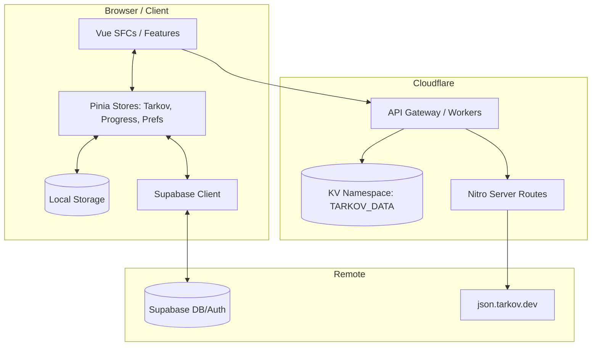
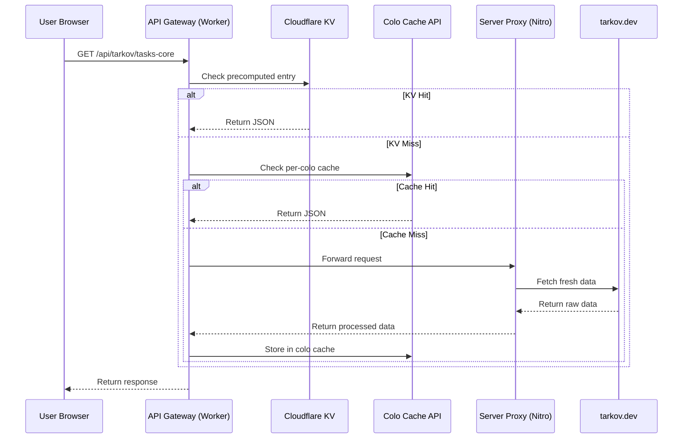

Relevant source files

The following files were used as context for generating this wiki page:

- [README.md](README.md)
- [DESIGN.md](DESIGN.md)
- [AGENTS.md](AGENTS.md)
- [code_review.md](code_review.md)
- [public/llms.txt](public/llms.txt)

# Architecture Overview

TarkovTracker is a client-side tracking application designed for Escape from Tarkov players to manage tasks, hideout upgrades, and item requirements. The project is built as a Nuxt 4 Single-Page Application (SPA) with a focus on local-first persistence, optionally syncing with a Supabase backend for multi-device support and team collaboration.

Sources: [README.md:1-12](README.md#L1-L12), [AGENTS.md:52-54](AGENTS.md#L52-L54), [public/llms.txt:3-5](public/llms.txt#L3-L5)

The architecture prioritizes functional density and a tactical UI, utilizing a modern web stack including Vue 3, TypeScript, and Tailwind CSS v4. It integrates with external data providers like tarkov.dev to provide real-time game data while maintaining a robust edge-caching layer via Cloudflare.

Sources: [DESIGN.md:104-106](DESIGN.md#L104-L106), [AGENTS.md:52-54](AGENTS.md#L52-L54), [public/llms.txt:7-9](public/llms.txt#L7-L9)

## Core Tech Stack

The application employs a specialized set of tools to ensure high performance and strict type safety across the client and serverless boundaries.

| Layer | Technology |
| :--- | :--- |
| **Frontend** | Nuxt 4 (SPA), Vue 3 Composition API |
| **State Management** | Pinia with `pinia-plugin-persistedstate` |
| **Styling** | Tailwind CSS v4 |
| **Backend/Auth** | Supabase (Auth, Database, Realtime) |
| **Infrastructure** | Cloudflare Pages, Cloudflare Workers, Cloudflare KV |
| **Language** | TypeScript (Strict mode) |

Sources: [README.md:73-75](README.md#L73-L75), [AGENTS.md:52-54](AGENTS.md#L52-L54), [code_review.md:100-104](code_review.md#L100-L104)

## Component Hierarchy and Data Flow

The application is structured into domain-specific "features" to maintain modularity. State is centralized in Pinia stores, which handle the synchronization between local storage, the Supabase database, and real-time updates.

This diagram illustrates the flow from the user interface through localized stores to the edge caching layer and backend services.
Sources: [AGENTS.md:52-70](AGENTS.md#L52-L70), [code_review.md:112-117](code_review.md#L112-L117), [public/llms.txt:7-9](public/llms.txt#L7-L9)

## State Management and Persistence

State is primarily managed through Pinia stores located in `app/stores/`. The `useTarkovStore` acts as the primary orchestrator, coordinating with `useMetadataStore` for game data and `useProgressStore` for user-specific progression.

### Local-First Workflow
1.  **Guest Mode**: Progress is saved immediately to the browser's local storage. No account is required for core tracking features.
2.  **Account Sync**: Upon signing in (via Discord, GitHub, etc.), local progress is uploaded and merged with cloud data in Supabase.
3.  **Realtime**: When in a team, Supabase Realtime handles synchronization of progress increments across teammate clients.

Sources: [README.md:18-35](README.md#L18-L35), [AGENTS.md:63-65](AGENTS.md#L63-L65), [code_review.md:95-98](code_review.md#L95-L98)

## Data Pipeline and Caching

TarkovTracker implements a multi-layer caching strategy to minimize latency and reduce load on upstream game data providers.

### Precompute Workflow
To handle heavy task-core payloads, a standalone precompute script (`scripts/precompute/`) runs via GitHub Actions. It populates a Cloudflare KV namespace (`TARKOV_DATA`) with optimized JSON objects.

Sources: [AGENTS.md:68-71](AGENTS.md#L68-L71), [code_review.md:46-51](code_review.md#L46-L51)

### Edge Cache Strategy

The data pipeline ensures that the most expensive computations (task dependencies and objective trees) are served from the edge.
Sources: [AGENTS.md:68-71](AGENTS.md#L68-L71), [code_review.md:53-56](code_review.md#L53-L56), [public/llms.txt:7-12](public/llms.txt#L7-L12)

## Infrastructure and Security

The deployment is split across Cloudflare and Supabase, with specific rules for environment variables and access control.

### Environment Variable Mapping
-  `NUXT_PUBLIC_*`: Browser-exposed variables for Nuxt runtime (e.g., `SUPABASE_URL`).
-  `NUXT_*`: Server-side only variables (e.g., API secrets).
-  `SUPABASE_*`: Native secrets for Edge Functions.

Sources: [AGENTS.md:179-185](AGENTS.md#L179-L185), [code_review.md:88-92](code_review.md#L88-L92)

### Security Constraints
-  **No Client-Side Secrets**: All external API calls (except Supabase) are proxied through Nitro server routes.
-  **Row Level Security (RLS)**: Database access is governed by Supabase RLS policies to ensure users only access their own progress or their team's data.
-  **User-Agent Requirements**: Public API clients must provide a normalized User-Agent (5–200 characters) for usage reporting.

Sources: [AGENTS.md:129-130](AGENTS.md#L129-L130), [code_review.md:38-44](code_review.md#L38-L44), [public/llms.txt:28-30](public/llms.txt#L28-L30)

## UI/UX Design System

The visual architecture follows a "Tactical UI" philosophy defined in `DESIGN.md`. It utilizes a monospace typography stack and a perceptual OKLCH color system.

| Category | Token Ladder | Purpose |
| :--- | :--- | :--- |
| **Surface** | `surface-950` to `surface-600` | Backgrounds, panels, and raised controls |
| **Action** | `primary` (Golden-tan) | Primary buttons and status focus |
| **Accent** | `accent` (Teal) | Secondary informational tones |
| **Modes** | `pvp` / `pve` | Game mode differentiation |

Sources: [DESIGN.md:92-102](DESIGN.md#L92-L102), [DESIGN.md:113-115](DESIGN.md#L113-L115)

## Conclusion

The architecture of TarkovTracker is designed to be highly resilient and performant by leveraging edge computing and local-first data patterns. By offloading heavy data processing to a precompute stage and utilizing a tiered caching system, the application provides a fast, reliable experience for tracking complex game progression while maintaining strict data integrity through a managed Supabase backend.
