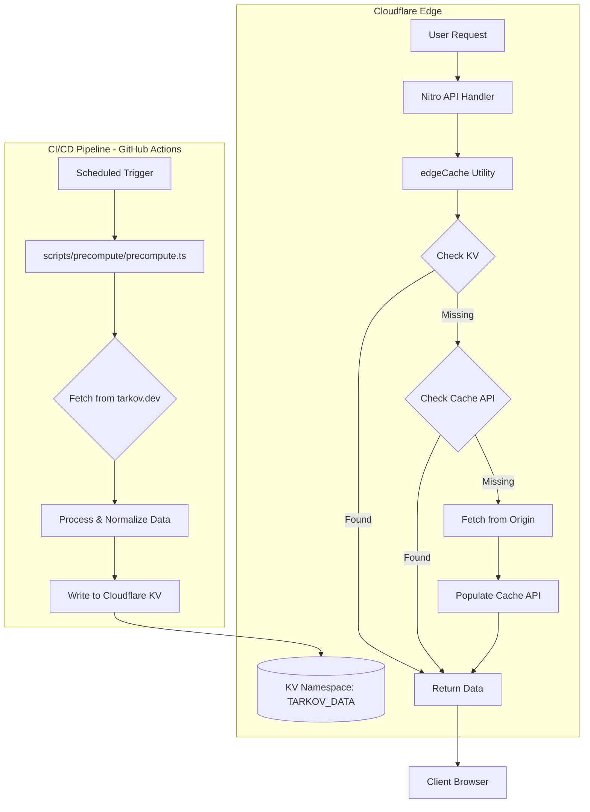
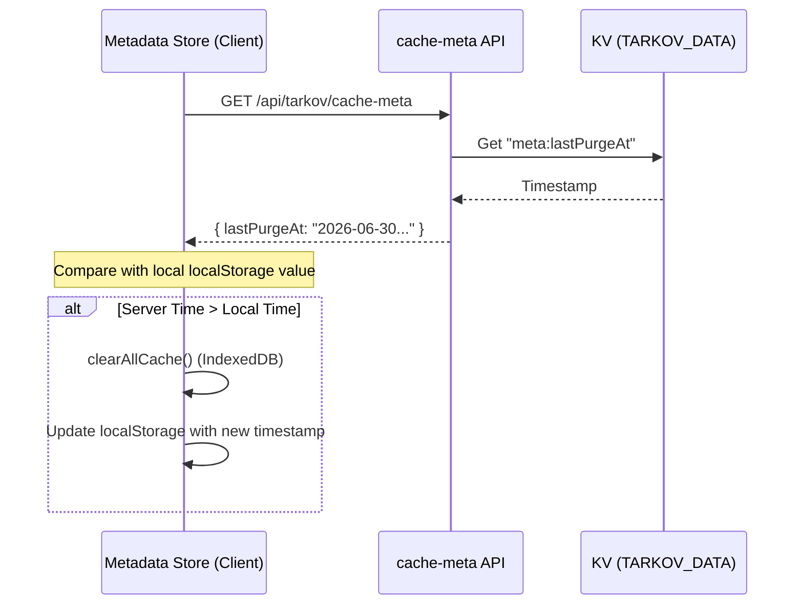

<details>
<summary>Relevant source files</summary>

The following files were used as context for generating this wiki page:

- [scripts/precompute/precompute.ts](scripts/precompute/precompute.ts)
- [app/server/utils/edgeCache.ts](app/server/utils/edgeCache.ts)
- [app/server/api/tarkov/cache-meta.get.ts](app/server/api/tarkov/cache-meta.get.ts)
- [AGENTS.md](AGENTS.md)
- [wrangler.toml](wrangler.toml)
- [code_review.md](code_review.md)
- [app/stores/useMetadata.ts](app/stores/useMetadata.ts)
</details>

# Caching & Precompute System

The Caching & Precompute System is a multi-layer data delivery architecture designed to optimize the performance of TarkovTracker, specifically for heavy game data payloads like `tasks-core`. Due to the CPU limits of the Cloudflare Workers Free tier, complex data processing is offloaded to a standalone precompute stage. This system ensures high availability and low latency by utilizing Cloudflare Key-Value (KV) storage as a globally replicated primary cache, falling back to the per-colo Cache API or origin fetches when necessary.

The system bridges external data from `tarkov.dev` with the client-side [Metadata Store](#app-stores-usemetadata-ts) through an efficient edge-side pipeline. It maintains data consistency across deployments by providing a centralized metadata endpoint for cache invalidation and ensuring schema compatibility between the precompute script and runtime request handlers.

Sources: [AGENTS.md](AGENTS.md), [app/server/utils/edgeCache.ts](app/server/utils/edgeCache.ts), [scripts/precompute/precompute.ts](scripts/precompute/precompute.ts)

---

## System Architecture

The architecture consists of a decoupled producer-consumer model where the producer (GitHub Actions) populates global storage, and the consumer (Nitro server routes) serves the data to users.

### High-Level Data Flow

The following diagram illustrates how game data moves from the upstream source to the end user:



The diagram shows the transition from the precompute script in CI/CD to the Cloudflare KV storage, and the fallback logic used by server handlers.
Sources: [scripts/precompute/precompute.ts](scripts/precompute/precompute.ts), [app/server/utils/edgeCache.ts](app/server/utils/edgeCache.ts), [wrangler.toml](wrangler.toml)

---

## Component Breakdown

### 1. Precompute Script (`scripts/precompute/precompute.ts`)
This script is responsible for generating optimized payloads for every supported language and game mode combinations. It prevents the web application from having to perform heavy computations (like building task graphs or normalizing large JSON objects) during a user request.

- **Storage Target**: Cloudflare KV Namespace `TARKOV_DATA`.
- **Concurrency**: It uses a configurable concurrency limit (defaulting to 10) to avoid overloading upstream APIs or storage write limits.
- **Key Strategy**: Keys are structured as `route:lang:gameMode`. For example: `tasks-core:en:regular`.

Sources: [scripts/precompute/precompute.ts:1-25](scripts/precompute/precompute.ts#L1-L25), [scripts/precompute/precompute.ts:98-105](scripts/precompute/precompute.ts#L98-L105)

### 2. Edge Cache Utility (`app/server/utils/edgeCache.ts`)
A server-side utility that abstracts the complexity of multi-layer caching. It handles the `Cache-Control` headers and orchestrates the retrieval of precomputed data.

| Layer | Component | Description |
| :--- | :--- | :--- |
| **L1** | Cloudflare KV | Replicated globally. Checked first if the `precomputed` flag is set. |
| **L2** | Cache API | Per-datacenter (colo) cache. Used as a fallback or for non-precomputed routes. |
| **L3** | Origin Fetch | Direct request to `json.tarkov.dev` if no cache hits occur. |

Sources: [app/server/utils/edgeCache.ts:40-65](app/server/utils/edgeCache.ts#L40-L65), [wrangler.toml:22-26](wrangler.toml#L22-L26)

### 3. Cache Metadata API (`app/server/api/tarkov/cache-meta.get.ts`)
This endpoint provides a way for the client to determine if local caches need to be purged. It reads the `lastPurgeAt` value from the `TARKOV_DATA` KV store.

- **Endpoint**: `/api/tarkov/cache-meta`
- **Function**: Returns a JSON object containing the timestamp of the last manual or automated cache purge.

Sources: [app/server/api/tarkov/cache-meta.get.ts](app/server/api/tarkov/cache-meta.get.ts)

---

## Implementation Details

### The `edgeCache` Strategy
The `edgeCache` function is the core of the runtime system. It accepts an `H3Event` and a fetch function. If the `precomputed` option is enabled, it attempts to read from the `TARKOV_DATA` KV binding before continuing to standard caching logic.

```typescript
// Conceptual logic from app/server/utils/edgeCache.ts
export async function edgeCache<T>(event: H3Event, options: EdgeCacheOptions<T>) {
  if (options.precomputed) {
    const kv = event.context.cloudflare?.env?.TARKOV_DATA;
    const kvKey = `${options.key}:${options.lang}:${options.gameMode}`;
    const cached = await kv?.get(kvKey);
    if (cached) return JSON.parse(cached);
  }
  // Fallback to Cache API...
}
```

Sources: [app/server/utils/edgeCache.ts:68-80](app/server/utils/edgeCache.ts#L68-L80)

### Key Configuration Values
The system relies on specific environment variables and bindings defined in `wrangler.toml`:

| Binding | Type | Description |
| :--- | :--- | :--- |
| `TARKOV_DATA` | KV Namespace | Stores precomputed JSON payloads (e.g., `tasks-core`). |
| `API_GATEWAY_LIMITER` | Durable Object | While primarily for rate limiting, it ensures consistent access to edge resources. |

Sources: [wrangler.toml:13-33](wrangler.toml#L13-L33)

---

## Cache Invalidation & Consistency

Data consistency is maintained through a "Purge Timestamp" mechanism. When an admin purges the cache, a timestamp is updated in KV. The client store (`useMetadata.ts`) periodically checks this metadata.

### Client-Side Validation Sequence



The sequence shows how the client validates its local IndexedDB cache against the server's global purge state.
Sources: [app/stores/useMetadata.ts:607-635](app/stores/useMetadata.ts#L607-L635), [app/server/api/tarkov/cache-meta.get.ts](app/server/api/tarkov/cache-meta.get.ts)

---

## Operational Risk Areas

1.  **Entry Shape Compatibility**: The precompute script and runtime request handlers must agree on the JSON schema. If the schema changes in `precompute.ts`, the script must run and populate KV before the new server code is deployed to avoid parsing errors.
2.  **KV Consistency**: KV storage is eventually consistent. While writes are usually visible globally within seconds, there can be a window where different colos see different data versions.
3.  **Graceful Degradation**: If the `TARKOV_DATA` binding is missing (e.g., in local development without Miniflare), the `edgeCache` utility is designed to fall back to the Cache API and origin fetch automatically, ensuring the app remains functional.

Sources: [code_review.md:55-62](code_review.md#L55-L62), [app/server/utils/edgeCache.ts:85-90](app/server/utils/edgeCache.ts#L85-L90)

---

## Summary
The TarkovTracker Caching & Precompute System effectively bypasses platform limitations by utilizing external CI/CD for heavy processing. By layering Cloudflare KV, the Cache API, and origin fetches, it provides a robust and performant data delivery pipeline that maintains consistency via a shared metadata heartbeat. This ensures that the application remains responsive and accurate even during periods of heavy game data updates.
