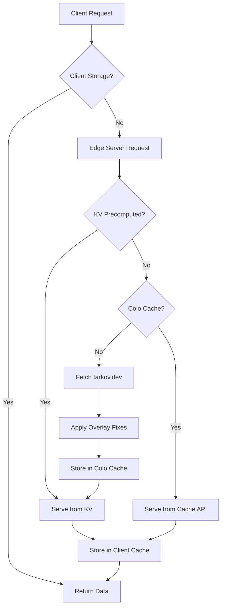
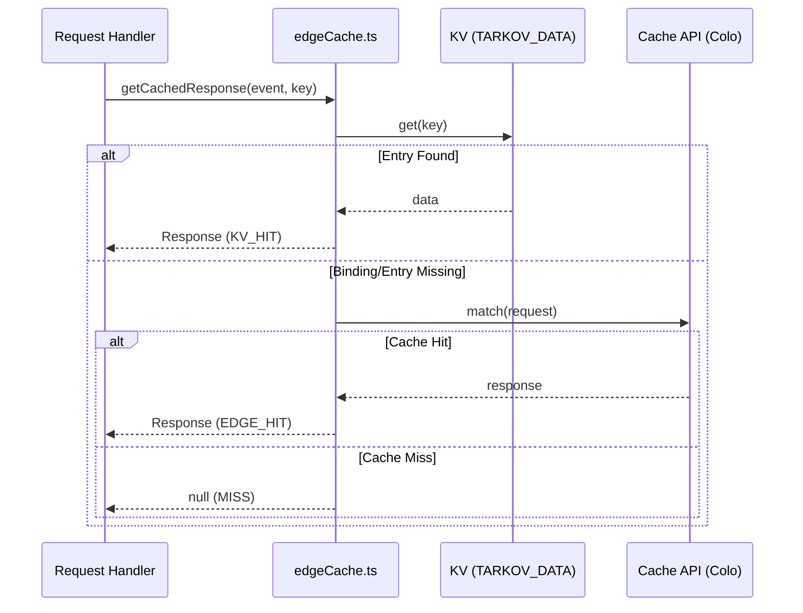
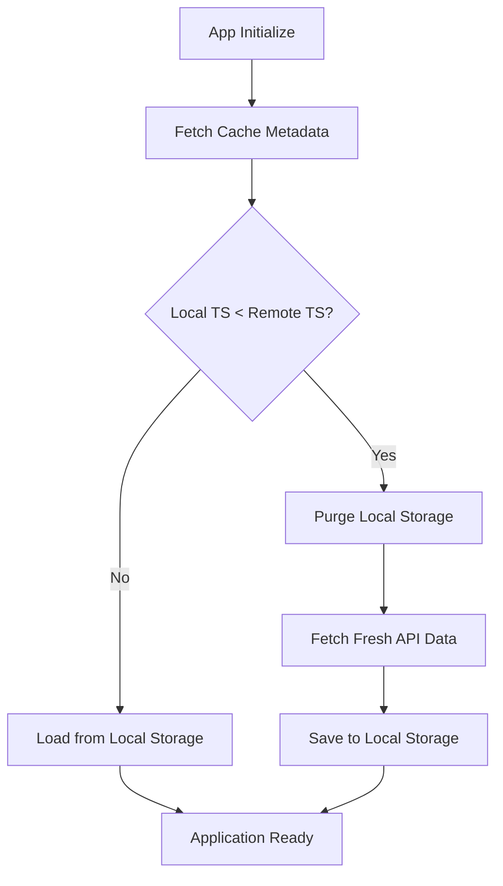

Relevant source files

The following files were used as context for generating this wiki page:

- [app/server/utils/edgeCache.ts](app/server/utils/edgeCache.ts)
- [app/server/utils/sharedEdgeStore.ts](app/server/utils/sharedEdgeStore.ts)
- [app/utils/tarkovCache.ts](app/utils/tarkovCache.ts)
- [AGENTS.md](AGENTS.md)
- [docs/SYSTEMS.md](docs/SYSTEMS.md)
- [README.md](README.md)

# Data Pipeline & Caching

The Data Pipeline and Caching system in TarkovTracker is a multi-layered architecture designed to provide high-performance access to game data while minimizing the load on upstream providers like `tarkov.dev`. It utilizes Cloudflare's edge infrastructure to serve data from the closest possible location to the user, employing a combination of precomputed data, edge-level caching, and client-side persistence.

The pipeline ensures that heavy game data—including tasks, hideout requirements, and item metadata—is processed and cached efficiently. It handles language and game-mode (`regular` vs `pve`) variations through specialized cache keys and edge logic.

## Multi-Layer Caching Architecture

The system operates across three primary layers: the Cloudflare KV store for precomputed data, the Cloudflare Cache API for per-datacenter (colo) caching, and the browser's local storage for client-side persistence.

### High-Level Data Flow

The following diagram illustrates how a request for game data is resolved through the various caching layers.

Sources: [AGENTS.md](AGENTS.md), [app/server/utils/edgeCache.ts:1-20](app/server/utils/edgeCache.ts#L1-L20)

### Cache Layer Definitions

| Layer | Component | Description |
| :--- | :--- | :--- |
| **Precompute** | Cloudflare KV (`TARKOV_DATA`) | Standalone precompute of heavy payloads run by GitHub Actions. Request handlers read these first. |
| **Edge Cache** | Cloudflare Cache API | Per-colo (datacenter) cache that falls back to upstream if KV or Cache is missing. |
| **Client Cache** | Browser `localStorage` | Persists game data locally in the browser to enable offline functionality and instant loads. |

Sources: [AGENTS.md](AGENTS.md), [README.md](README.md)

## Edge Caching Logic

The edge caching logic is primarily implemented in `edgeCache.ts`. It provides a unified interface for checking precomputed data and managing the lifecycle of cached responses at the network edge.

### Core Caching Functions

The `edgeCache` utility handles the complexity of environment-specific bindings and cache header management.

- **`getCachedResponse`**: Attempts to retrieve data from the `TARKOV_DATA` KV namespace. If the binding or entry is absent, it signals a fallback to the standard Cache API.
- **`saveToEdgeCache`**: Stores a response in the Cloudflare Cache API with specific TTLs (Time-To-Live).
- **`getPrecomputedKey`**: Generates standardized keys for KV lookups based on route, language, and game mode.

Sources: [app/server/utils/edgeCache.ts:31-75](app/server/utils/edgeCache.ts#L31-L75), [AGENTS.md](AGENTS.md)

### Cache Configuration Constants

The system uses specific durations to balance data freshness with performance.

| Constant | Value | Description |
| :--- | :--- | :--- |
| `DEFAULT_CACHE_TTL` | 3600 (1 hour) | Standard duration for caching game data at the edge. |
| `STALE_IF_ERROR_TTL` | 86400 (24 hours) | Allows serving stale data if the upstream fetch fails. |

Sources: [app/server/utils/edgeCache.ts:11-15](app/server/utils/edgeCache.ts#L11-L15)

## Client-Side Pipeline

On the client side, the `tarkovCache.ts` utility manages data synchronization between the API and local storage. This ensures that users can track progress immediately—even without an account.

### TarkovCache Management

The client-side pipeline is responsible for:
1.  **Hydration**: Loading initial data from `localStorage`.
2.  **Validation**: Checking cache metadata (purge timestamps) to invalidate old data.
3.  **Persistence**: Saving updated game data and user progress.

Sources: [app/utils/tarkovCache.ts:5-40](app/utils/tarkovCache.ts#L5-L40), [README.md](README.md)

## Public API Gateway

The API Gateway (located in `workers/api-gateway/`) acts as the entry point for programmatic access. It enforces rate limits using Cloudflare Durable Objects to prevent abuse while ensuring high availability for game data.

### Public API Endpoints
The following endpoints serve processed and cached game data:
- `/api/tarkov/bootstrap`: Level and XP metadata.
- `/api/tarkov/tasks-core`: Tasks, maps, and traders.
- `/api/tarkov/tasks-objectives`: Detailed task requirements.
- `/api/tarkov/hideout`: Station and upgrade data.
- `/api/tarkov/items`: Full item index.

Sources: [AGENTS.md](AGENTS.md), [public/llms.txt](public/llms.txt)

## Precompute Workflow

Heavy payloads, specifically for `tasks-core`, are precomputed into the `TARKOV_DATA` KV namespace. This process is triggered by a scheduled GitHub Actions workflow rather than a scheduled Worker to stay within the Workers Free tier CPU limits.

### Precompute Logic
1.  **Trigger**: Scheduled GitHub Action runs.
2.  **Fetch**: Queries `json.tarkov.dev` for all languages and game modes.
3.  **Process**: Normalizes the data and applies TarkovTracker-specific corrections (overlays).
4.  **Upload**: Writes the resulting JSON into Cloudflare KV.

Sources: [AGENTS.md](AGENTS.md), [docs/SYSTEMS.md](docs/SYSTEMS.md)

## Summary

The TarkovTracker Data Pipeline and Caching system utilizes a multi-layered approach to ensure reliability and speed. By combining GitHub-driven precomputation with Cloudflare Edge caching and browser-local persistence, the application achieves sub-second load times for complex game data while remaining resilient to upstream API outages. This architecture supports both guest users with local-only storage and authenticated users with cloud-synchronized progress.

Sources: [README.md](README.md), [AGENTS.md](AGENTS.md), [docs/SYSTEMS.md](docs/SYSTEMS.md)
