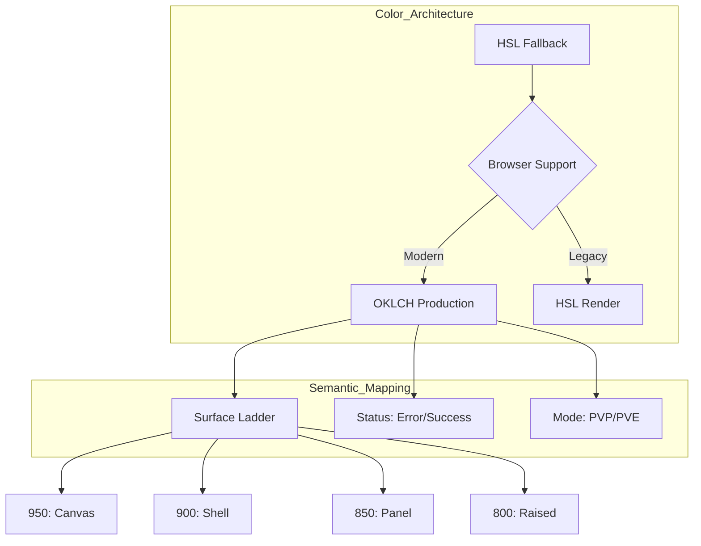
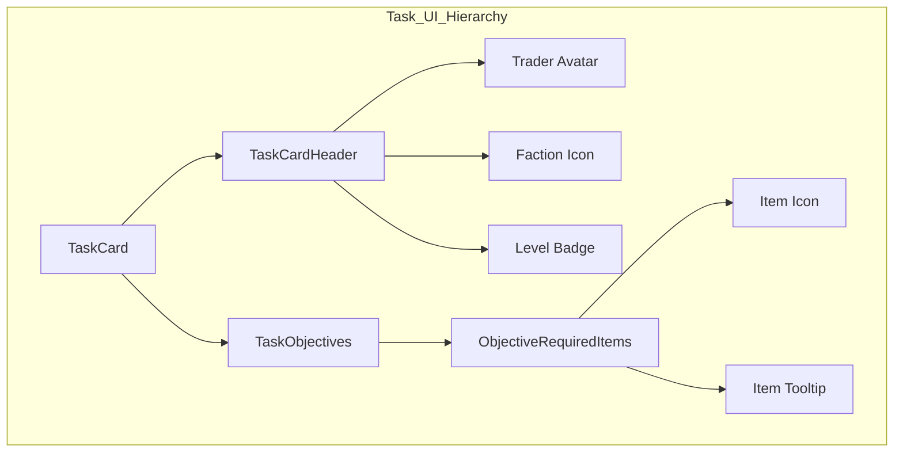
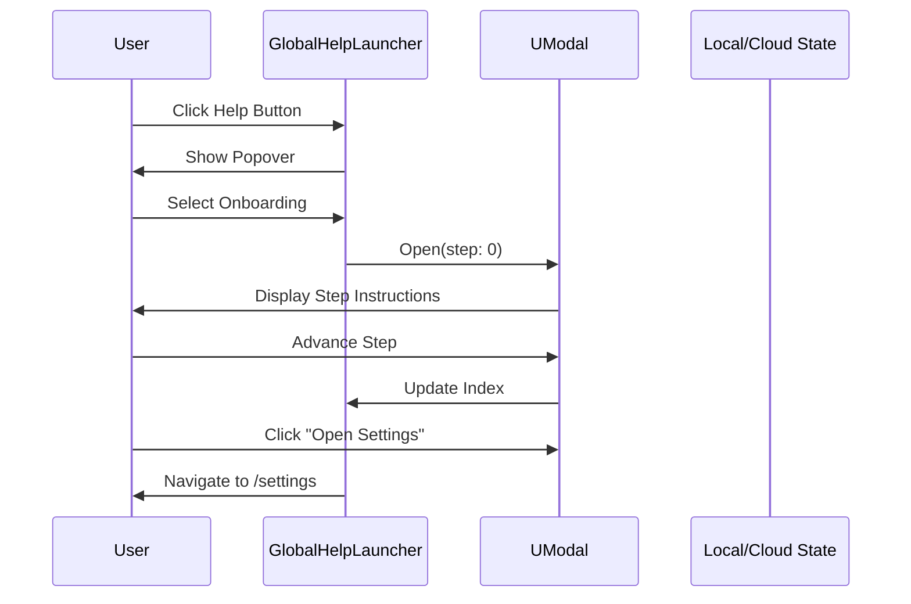

Relevant source files

The following files were used as context for generating this wiki page:

- [DESIGN.md](DESIGN.md)
- [AGENTS.md](AGENTS.md)
- [README.md](README.md)
- [app/features/tasks/TaskCardHeader.vue](app/features/tasks/TaskCardHeader.vue)
- [app/components/ui/GlobalHelpLauncher.vue](app/components/ui/GlobalHelpLauncher.vue)
- [app/server/routes/overlay/kappa/[userId]/[mode].get.ts](app/server/routes/overlay/kappa/%5BuserId%5D/%5Bmode%5D.get.ts)
- [app/features/tasks/ObjectiveRequiredItems.vue](app/features/tasks/ObjectiveRequiredItems.vue)
- [app/pages/resources/[slug].vue](app/pages/resources/%5Bslug%5D.vue)

# UI & Design System

The TarkovTracker UI is designed as a dense, tactical, and high-performance single-page application (SPA) built with Nuxt 4 and Tailwind CSS v4. The design philosophy emphasizes a "tactical and quiet" interface that allows for rapid scanning of complex game data through a dark application chrome, compact panels, and a strong visual hierarchy.

The system relies on a multi-layered color architecture and a standardized component library (Nuxt UI) combined with bespoke feature-specific components. It is optimized for functional density over decorative elements, prioritizing readability in low-light environments typical of the Escape from Tarkov aesthetic.

Sources: [DESIGN.md:10-15](DESIGN.md#L10-L15), [AGENTS.md:30-35](AGENTS.md#L30-L35), [README.md:90-95](README.md#L90-L95)

## Color System and Visual Hierarchy

TarkovTracker utilizes a sophisticated two-layer color architecture. HSL values provide static browser fallbacks, while OKLCH overrides are used in modern browsers to ensure perceptual uniformity across different hues. This ensures that chroma steps remain consistent and desaturation looks natural at low lightness levels.

### The Surface Ladder
The UI hierarchy is defined by a "surface ladder" that maps specific semantic roles to tonal steps within the dark palette.

| Role | Token | Usage |
| :--- | :--- | :--- |
| Canvas | `surface-950` | Primary page background |
| Shell | `surface-900` | Application chrome and navigation |
| Panel | `surface-850` | Content panels and containers |
| Raised | `surface-800` | Cards and interactive controls |
| Hover | `surface-700` | Active state for buttons and list items |
| Divider | `surface-600` | Borders and subtle separation lines |

Sources: [DESIGN.md:32-47](DESIGN.md#L32-L47)

### Semantic and Game Mode Colors
The system reserves specific palettes for functional status and game-specific data:
*  **Primary Action**: Golden-tan palette (`primary`).
*  **Secondary Accents**: Teal (`secondary` or `accent`).
*  **Status Colors**: Standard semantic mapping (`success`, `warning`, `error`, `info`). Note that Nuxt UI's `info` is mapped to the teal `accent` palette for informational tone consistency.
*  **Game Modes**: Specific tokens for `pvp` (tan/neutral) and `pve` (blue/teal) modes.

Sources: [DESIGN.md:30-31](DESIGN.md#L30-L31), [DESIGN.md:49-55](DESIGN.md#L49-L55)

The diagram shows the logic behind the multi-layered color system and how it flows into the semantic surface ladder. 
Sources: [DESIGN.md:23-45](DESIGN.md#L23-L45)

## Typography and Layout

The application enforces a strictly monospace font stack for both display and interface text to maintain the tactical aesthetic.

### Layout Principles
*  **Functional Density**: Spacing uses predictable Tailwind increments (e.g., `gap-4`, `p-4`) but is tightened locally in complex feature views like task lists or item grids.
*  **Structure**: Pages utilize full-width shell bands or constrained layouts. Nested cards and decorative floating shapes are discouraged to maintain scanning speed.
*  **Rounding**: A standardized scale is used: `rounded-sm` (4px) for controls, `rounded-md` (8px) for cards, and `rounded-lg` (12px) for larger components.

Sources: [DESIGN.md:60-80](DESIGN.md#L60-L80)

## Component Architecture

TarkovTracker combines standard Nuxt UI primitives with domain-specific features.

### Core Component Usage
| Component | Implementation Detail |
| :--- | :--- |
| `UButton` | Standardized for primary (tan) and neutral (raised) actions. |
| `AppTooltip` | Custom wrapper for Nuxt UI tooltips, used extensively for task details and item previews. |
| `GenericCard` | Shared local primitive for feature panels. |
| `NuxtImg` | Used for trader avatars and faction icons with specific sizing (e.g., 36px for traders). |

Sources: [app/features/tasks/TaskCardHeader.vue:5-20](app/features/tasks/TaskCardHeader.vue#L5-L20), [DESIGN.md:85-95](DESIGN.md#L85-L95)

### Task and Item Components
Feature components like `TaskCardHeader` and `ObjectiveRequiredItems` implement the design system by using tactical iconography (MDI icons) and faction-specific badges.

This diagram illustrates the composition of the Task UI components and their sub-elements.
Sources: [app/features/tasks/TaskCardHeader.vue](app/features/tasks/TaskCardHeader.vue), [app/features/tasks/ObjectiveRequiredItems.vue](app/features/tasks/ObjectiveRequiredItems.vue)

## Streamer Tools and Overlays

TarkovTracker provides specialized browser-source overlays that deviate from the main SPA design system to accommodate stream layouts. These components support dynamic styling through query parameters.

### Overlay Configuration Options
| Option | Type | Description |
| :--- | :--- | :--- |
| `layout` | `card`, `minimal`, `text` | The visual density and structure of the overlay. |
| `metric` | `items`, `summary`, `tasks` | Determines which progress data is displayed. |
| `accent` | `kappa`, `info`, `success`, `warning`, `custom` | Sets the glow and bar colors (e.g., Kappa red). |
| `font` | `inter`, `oswald`, `rajdhani`, etc. | Overrides the system monospace font for better stream integration. |

Sources: [app/server/routes/overlay/kappa/[userId]/[mode].get.ts:10-50]()

### CSS Custom Variables
The overlays use CSS variables to allow live customization without re-renders. This includes:
*  `--accent-bar`: Primary fill color.
*  `--accent-glow`: Alpha-blended shadow for the progress fill.
*  `--overlay-scale`: Linear scaling factor for all dimensions and font sizes.

Sources: [app/server/routes/overlay/kappa/[userId]/[mode].get.ts:300-350]()

## Onboarding and Help System

The UI includes a structured help system (`GlobalHelpLauncher.vue`) designed to guide users through the complex tracking setup. This system uses a modal-based flow with "bullets" and "actions" to explain tasks, imports, and profile settings.

### Onboarding Step Structure
Each onboarding step is defined as an object containing:
*  `title`: Clear heading for the phase.
*  `description`: High-level purpose.
*  `bullets`: Specific pedagogical points.
*  `actions`: Navigation buttons to relevant SPA routes (e.g., `/settings#imports`).

Sources: [app/components/ui/GlobalHelpLauncher.vue:240-300](app/components/ui/GlobalHelpLauncher.vue#L240-L300)

The sequence shows the interaction between the help system and the user to facilitate onboarding.
Sources: [app/components/ui/GlobalHelpLauncher.vue:400-450](app/components/ui/GlobalHelpLauncher.vue#L400-L450)

## Conclusion
The TarkovTracker UI and Design System bridge the gap between a high-density data tool and a tactical game utility. By leveraging modern CSS features (OKLCH) and a consistent surface ladder, it provides a performant, accessible experience for tracking complex progression across different game modes and collaborative environments.

Sources: [DESIGN.md](DESIGN.md), [AGENTS.md](AGENTS.md)
