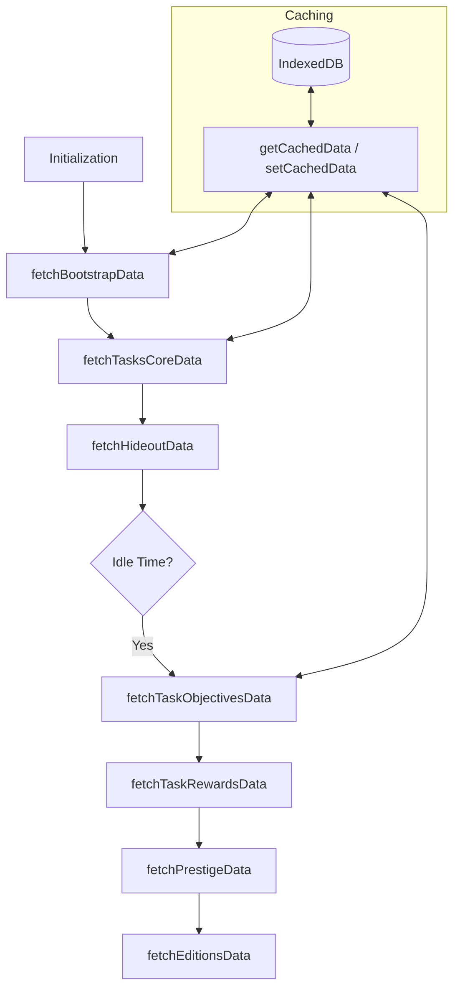
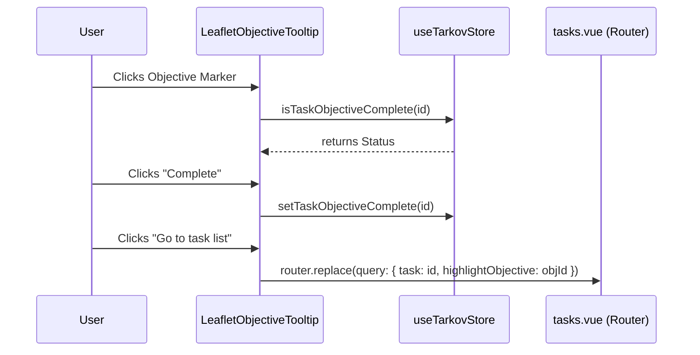

Relevant source files

The following files were used as context for generating this wiki page:

- [app/features/tasks/TaskCard.vue](app/features/tasks/TaskCard.vue)
- [app/features/tasks/TaskCardHeader.vue](app/features/tasks/TaskCardHeader.vue)
- [app/features/tasks/TaskLink.vue](app/features/tasks/TaskLink.vue)
- [app/stores/useMetadata.ts](app/stores/useMetadata.ts)
- [app/features/maps/LeafletObjectiveTooltip.vue](app/features/maps/LeafletObjectiveTooltip.vue)
- [app/locales/en.json](app/locales/en.json)
- [AGENTS.md](AGENTS.md)

# Tasks & Storyline Tracking

TarkovTracker provides a comprehensive system for monitoring progression in *Escape from Tarkov*, covering tasks (quests), storyline chapters, hideout upgrades, and item requirements. The system is designed to handle PvP and PvE progression separately, ensuring that player milestones are accurate to their active game mode. 

Sources: [README.md](README.md), [public/llms.txt](public/llms.txt)

The tracking engine relies on a robust metadata layer that synchronizes game data from external providers, processes complex task dependency graphs, and renders reactive UI components that allow users to manage their objectives in real-time. This includes tracking completion status, failure conditions, and required items for every quest in the game.

Sources: [app/stores/useMetadata.ts:1-50](app/stores/useMetadata.ts#L1-L50), [app/features/tasks/TaskCard.vue:1-100](app/features/tasks/TaskCard.vue#L1-L100)

## Metadata and Data Flow Architecture

The task system is powered by the `useMetadataStore`, which manages the fetching and normalization of game data. Data is primarily sourced from `json.tarkov.dev` via a server proxy and is cached using a multi-layer approach involving Pinia state, browser local storage, and IndexedDB.

Sources: [app/stores/useMetadata.ts:60-100](app/stores/useMetadata.ts#L60-L100), [AGENTS.md](AGENTS.md)

### Data Fetching Pipeline
The system uses a phased loading approach to ensure the UI remains responsive. "Bootstrap" data (player levels) is fetched first, followed by "Task Core" (names and maps), and finally heavy payloads like task objectives and rewards are hydrated asynchronously or during idle time.

The diagram shows the sequential and priority-based fetching logic used to populate the metadata store.
Sources: [app/stores/useMetadata.ts:383-460](app/stores/useMetadata.ts#L383-L460)

### Task Dependency Graph
The store builds a directed acyclic graph (DAG) of tasks using `predecessors` and `successors`. This allows the UI to calculate:
*  **Locked Before**: How many prerequisites must be completed to unlock a task.
*  **Locked Behind**: How many future tasks are gated by the current task.
*  **Impact**: The total number of incomplete tasks that depend on the current task.

Sources: [app/stores/useMetadata.ts:646-665](app/stores/useMetadata.ts#L646-L665), [app/features/tasks/TaskCard.vue:425-450](app/features/tasks/TaskCard.vue#L425-L450)

## Task Representation and UI Components

The `TaskCard.vue` component is the primary interface for individual quests. It encapsulates state logic, visual indicators for task status, and interactive controls for objective management.

Sources: [app/features/tasks/TaskCard.vue](app/features/tasks/TaskCard.vue)

### Task Status States
Tasks move through several logical states determined by player level, trader reputation, and prerequisite completion.

| State | Description | UI Indicator |
| :--- | :--- | :--- |
| **Available** | Prerequisites met, level requirement met. | Standard border, "Complete" button visible. |
| **Locked** | Gated by level, reputation, or parent tasks. | Grayscale/Dimmed, shows specific blockers. |
| **Completed** | Marked as finished by user or auto-sync. | Success accent (Green), 80% opacity. |
| **Failed** | Failed due to conflict quests or manual mark. | Error accent (Red), shows failure reason. |
| **Invalid** | Permanently blocked by choices in other tasks. | Surface border, muted appearance. |

Sources: [app/features/tasks/TaskCard.vue:360-385](app/features/tasks/TaskCard.vue#L360-L385), [app/locales/en.json:page.tasks.questcard](app/locales/en.json:page.tasks.questcard)

### Component Hierarchy
The task UI is broken down into specialized sub-components:
*  **TaskCardHeader**: Displays the trader's avatar, task name, and faction icons. It also provides links to external resources like the EFT Wiki or Tarkov.dev.
*  **TaskCardBadges**: Renders badges for level requirements, map locations, and specific quest types (e.g., Kappa required).
*  **TaskCardRewards**: A footer section summarizing XP, currency, items, and trader standing unlocked upon completion.
*  **QuestObjectives**: (Referenced in TaskCard) Manages the checklist of sub-tasks for the quest.

Sources: [app/features/tasks/TaskCardHeader.vue:1-60](app/features/tasks/TaskCardHeader.vue#L1-L60), [app/features/tasks/TaskCard.vue:1-120](app/features/tasks/TaskCard.vue#L1-L120)

## Objective Tracking and Map Integration

Each task contains one or more objectives. TarkovTracker allows granular tracking of these objectives, which is especially critical for item collection quests (e.g., "Hand over 5 Bolts").

Sources: [app/features/tasks/TaskCard.vue:536-560](app/features/tasks/TaskCard.vue#L536-L560), [app/features/maps/LeafletObjectiveTooltip.vue](app/features/maps/LeafletObjectiveTooltip.vue)

### Item Objective Logic
Objectives involving items track `currentCount` vs `requiredCount`. Users can manually increment/decrement these or use a "Reset item counts" feature.
Sources: [app/features/tasks/TaskCard.vue:205-230](app/features/tasks/TaskCard.vue#L205-L230)

### Map tooltips
When viewing tasks via the Map view, `LeafletObjectiveTooltip.vue` provides a compact interface for tracking objectives directly on interactive maps.

This sequence illustrates how a user interacts with a task objective through the map interface and navigates back to the main list.
Sources: [app/features/maps/LeafletObjectiveTooltip.vue:133-180](app/features/maps/LeafletObjectiveTooltip.vue#L133-L180)

## Storyline Progress Tracking

Beyond individual quests, the system supports tracking "Storyline Chapters." This feature groups related tasks into a narrative sequence, helping players understand the overarching progression of the game.

Sources: [app/stores/useMetadata.ts:602-630](app/stores/useMetadata.ts#L602-L630), [app/locales/en.json:page.storyline](app/locales/en.json:page.storyline)

### Chapter Organization
Storyline data is fetched from a dedicated overlay hosted on GitHub. Each chapter contains:
*  **Order**: The sequential position of the chapter.
*  **Description/Notes**: Contextual lore and gameplay tips.
*  **Objectives**: Specific milestones required to "finish" the chapter.
*  **Unlocks**: Maps or traders that become available after completion.

Sources: [app/stores/useMetadata.ts:615-640](app/stores/useMetadata.ts#L615-L640), [app/locales/en.json:page.storyline](app/locales/en.json:page.storyline)

## Summary

The Tasks & Storyline Tracking system in TarkovTracker is a sophisticated architecture that bridges raw game data with user-specific progression. By utilizing a reactive metadata store, complex graph logic for prerequisites, and a modular component design, it provides players with a tactical overview of their journey. Key features like map-integrated tooltips and separate PvP/PvE state management ensure the tool remains essential for both casual and veteran players.

Sources: [README.md](README.md), [DESIGN.md](DESIGN.md)
