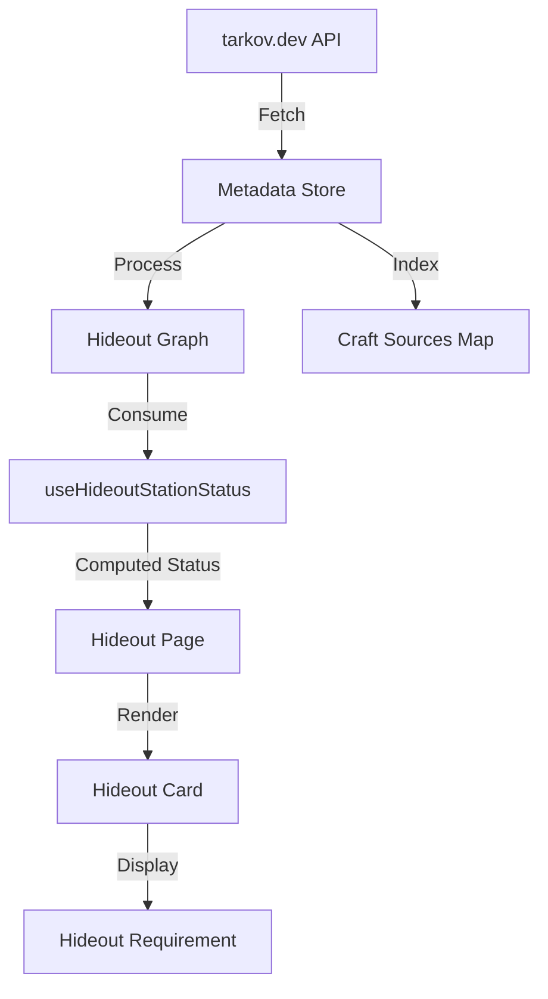
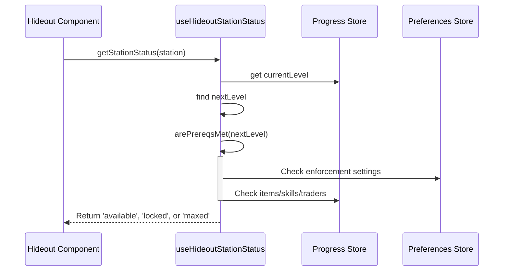

<details>
<summary>Relevant source files</summary>

The following files were used as context for generating this wiki page:

- [app/features/hideout/HideoutCard.vue](app/features/hideout/HideoutCard.vue)
- [app/features/hideout/HideoutRequirement.vue](app/features/hideout/HideoutRequirement.vue)
- [app/composables/useHideoutStationStatus.ts](app/composables/useHideoutStationStatus.ts)
- [app/pages/hideout.vue](app/pages/hideout.vue)
- [app/stores/useMetadata.ts](app/stores/useMetadata.ts)
</details>

# Hideout Management

The Hideout Management system is a core feature of TarkovTracker designed to track player progression through various hideout stations (e.g., Medstation, Shooting Range, Water Collector). It manages complex dependency chains involving item requirements, other station levels, player skill levels, and trader loyalty levels. The system provides users with real-time feedback on buildable upgrades and consolidated shopping lists for required materials.

Sources: [app/pages/hideout.vue:15-18](app/pages/hideout.vue#L15-L18), [app/stores/useMetadata.ts:1330-1345](app/stores/useMetadata.ts#L1330-L1345)

## System Architecture

The hideout system follows a reactive architecture where game data is fetched from an external API, processed into a graph-based structure in the store, and consumed by functional components and composables.

### Data Flow Overview

The following diagram illustrates the path hideout data takes from the API to the user interface.



The system relies on the `MetadataStore` to maintain the authoritative state of hideout stations and modules. Data is fetched via the `/api/tarkov/hideout` endpoint and normalized into `HideoutStation` and `HideoutModule` objects.

Sources: [app/stores/useMetadata.ts:892-915](app/stores/useMetadata.ts#L892-L915), [app/stores/useMetadata.ts:1098-1110](app/stores/useMetadata.ts#L1098-L1110)

## Logic and State Management

### Status Calculation
The core logic for determining if a station is buildable resides in the `useHideoutStationStatus.ts` composable. It evaluates the current state of a player's profile against the requirements for the next station level.

A station's status is determined as follows:
1.  **Maxed**: The player has reached the maximum level for that station.
2.  **Available**: All prerequisites (items, skills, trader levels, and other stations) are met for the next level.
3.  **Locked**: One or more prerequisites are missing.

Sources: [app/composables/useHideoutStationStatus.ts:110-142](app/composables/useHideoutStationStatus.ts#L110-L142)

### Dependency Resolution Sequence



Sources: [app/composables/useHideoutStationStatus.ts:40-108](app/composables/useHideoutStationStatus.ts#L40-L108)

## Component Hierarchy

The UI is divided into several layers to manage complexity and provide granular interactions.

### Component Descriptions

| Component | Responsibility | Relevant File |
| :--- | :--- | :--- |
| `hideout.vue` | The top-level page component. Handles high-level filtering (All/Locked/Available/Maxed) and infinite scrolling for performance. | [app/pages/hideout.vue](app/pages/hideout.vue) |
| `HideoutCard.vue` | Displays a single station. Shows the current level, progress toward the next level, and handles construction time logic. | [app/features/hideout/HideoutCard.vue](app/features/hideout/HideoutCard.vue) |
| `HideoutRequirement.vue` | Displays a specific requirement (Item, Skill, Station Level, or Trader). Handles "Mark as Collected" interactions for items. | [app/features/hideout/HideoutRequirement.vue](app/features/hideout/HideoutRequirement.vue) |

Sources: [app/pages/hideout.vue:104-124](app/pages/hideout.vue#L104-L124), [app/features/hideout/HideoutCard.vue:1-10](app/features/hideout/HideoutCard.vue#L1-L10), [app/features/hideout/HideoutRequirement.vue:1-12](app/features/hideout/HideoutRequirement.vue#L1-L12)

### Construction Time Logic
For modules currently being upgraded, `HideoutCard` calculates the remaining time using construction timestamps. It visualizes this as a progress bar with a countdown timer.

Sources: [app/features/hideout/HideoutCard.vue:105-120](app/features/hideout/HideoutCard.vue#L105-L120)

## Filtering and User Preferences

The system allows users to customize how strictly requirements are checked through the `PreferencesStore`. These settings directly impact the `Available` and `Locked` counts on the hideout dashboard.

### Requirement Enforcement Options

| Preference Key | Type | Description |
| :--- | :--- | :--- |
| `hideoutRequireStationLevels` | Boolean | If true, a module is "Locked" if prerequisite stations are not at the required level. |
| `hideoutRequireSkillLevels` | Boolean | If true, player skill levels (e.g., Strength, Crafting) are validated before marking a module as "Available". |
| `hideoutRequireTraderLoyalty` | Boolean | If true, trader reputation and loyalty levels are checked. |
| `hideoutCollapseCompleted` | Boolean | Automatically collapses station cards that have reached their maximum level. |

Sources: [app/pages/hideout.vue:261-267](app/pages/hideout.vue#L261-L267), [app/composables/useHideoutStationStatus.ts:45-55](app/composables/useHideoutStationStatus.ts#L45-L55)

## Data Structures

### Hideout Metadata Processing
In the `MetadataStore`, hideout stations are processed using a `GraphBuilder` to establish relationships between modules. This allows the application to calculate the total construction time required to reach a specific level from zero, including all prerequisite modules.

```typescript
// Example of building craft sources in the store
function buildCraftSourcesMap(stations: HideoutStation[]): Map<string, CraftSource[]> {
  const map = new Map<string, CraftSource[]>();
  for (const station of stations) {
    for (const level of station.levels || []) {
      for (const craft of level.crafts || []) {
        for (const reward of craft.rewardItems || []) {
          // Links item IDs to the stations that can produce them
        }
      }
    }
  }
  return map;
}
```

Sources: [app/stores/useMetadata.ts:1113-1140](app/stores/useMetadata.ts#L1113-L1140), [app/stores/useMetadata.ts:1330-1345](app/stores/useMetadata.ts#L1330-L1345)

## Summary

Hideout Management in TarkovTracker is a sophisticated coordination between the `MetadataStore` for static game data, the `ProgressStore` for user-specific data, and the `useHideoutStationStatus` logic layer. By modularizing the display into Cards and Requirements, the system maintains high performance through techniques like infinite scrolling while providing complex, nested dependency tracking. This ensures players can efficiently plan their progression and manage the significant resource investments required for hideout upgrades.

Sources: [app/pages/hideout.vue:350-370](app/pages/hideout.vue#L350-L370), [app/composables/useHideoutStationStatus.ts:144-150](app/composables/useHideoutStationStatus.ts#L144-L150)
