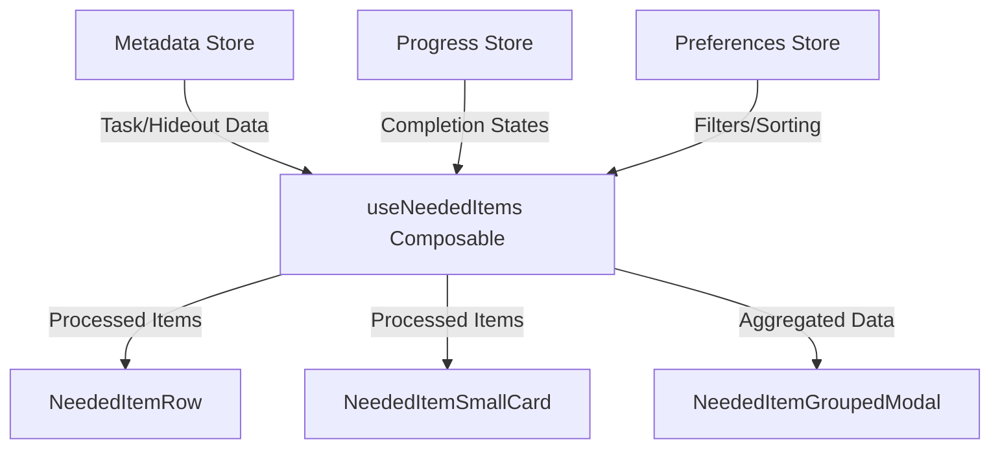
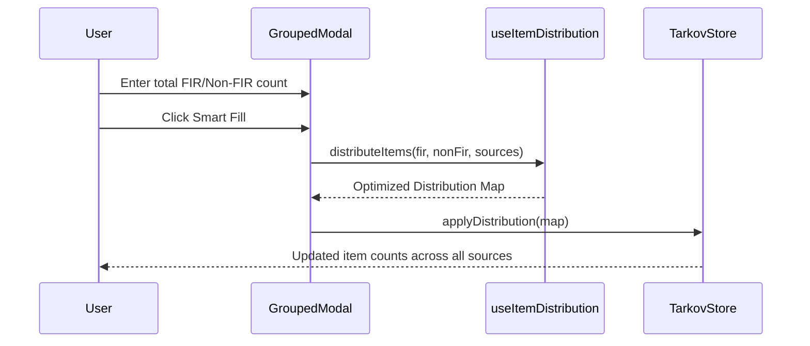

<details>
<summary>Relevant source files</summary>

The following files were used as context for generating this wiki page:

- [app/features/neededitems/NeededItemRow.vue](app/features/neededitems/NeededItemRow.vue)
- [app/features/neededitems/NeededItemSmallCard.vue](app/features/neededitems/NeededItemSmallCard.vue)
- [app/features/neededitems/NeededItemGroupedModal.vue](app/features/neededitems/NeededItemGroupedModal.vue)
- [app/composables/useNeededItems.ts](app/composables/useNeededItems.ts)
- [app/composables/__tests__/useNeededItems.test.ts](app/composables/__tests__/useNeededItems.test.ts)
- [app/pages/__tests__/neededitems.page.test.ts](app/pages/__tests__/neededitems.page.test.ts)
</details>

# Needed Items Tracker

The **Needed Items Tracker** is a core system within TarkovTracker designed to consolidate and manage all item requirements across multiple game progression paths. It aggregates item needs from active task objectives and pending hideout module upgrades, providing players with a unified "shopping list" to track what items they need to find in raid (FIR) or purchase.

This system serves as a central hub for inventory management and planning, allowing users to filter items by source (Tasks vs. Hideout), status (Collected vs. Missing), and specific game requirements such as Kappa or Lightkeeper questlines. By bridging the gap between quest tracking and hideout progression, it ensures players can efficiently manage their stash space and prioritize item gathering based on their current progression state.

Sources: [app/features/neededitems/NeededItemRow.vue](app/features/neededitems/NeededItemRow.vue), [app/composables/useNeededItems.ts:1-20](app/composables/useNeededItems.ts#L1-L20), [README.md:14-25](README.md#L14-L25)

## System Architecture

The tracker architecture follows a composable-driven pattern, utilizing a central logic layer to process raw game data into a filtered and sorted display format.

### Core Data Flow

The system retrieves raw data from the `MetadataStore` (containing item and task definitions) and merges it with user-specific progress from the `ProgressStore` and `TarkovStore`.



The `useNeededItems` composable acts as the primary engine, performing complex calculations to determine which items are currently relevant based on the player's active tasks and unbuilt hideout modules.

Sources: [app/composables/useNeededItems.ts:25-100](app/composables/useNeededItems.ts#L25-L100), [app/features/neededitems/NeededItemRow.vue:150-180](app/features/neededitems/NeededItemRow.vue#L150-L180)

## Data Models and Types

The tracker operates on two primary "need" types, distinguished by their source in the game logic.

| Need Type | Source | Properties |
| :--- | :--- | :--- |
| `taskObjective` | Quest/Task Objectives | `taskId`, `foundInRaid` (boolean), `count` |
| `hideoutModule` | Hideout Station Upgrades | `hideoutModule.id`, `hideoutModule.level`, `count` |

Both types are unified into a common interface for the UI, including shared properties like `item` (TarkovItem metadata) and the specific quantity required.

Sources: [app/composables/__tests__/useNeededItems.test.ts:5-40](app/composables/__tests__/useNeededItems.test.ts#L5-L40), [app/features/neededitems/NeededItemRow.vue:140-145](app/features/neededitems/NeededItemRow.vue#L140-L145)

## View Modes and Components

The UI supports multiple visualization styles to cater to different user preferences.

### List and Grid Displays
- **NeededItemRow.vue**: A detailed horizontal row view showing item icons, names, related tasks or stations, and manual count controls. It highlights items based on rarity and completion status using dynamic CSS classes like `bg-gradient-to-l from-complete to-surface`.
- **NeededItemSmallCard.vue**: A compact card view optimized for grid layouts. It uses an image-heavy design with absolute-positioned badges for counts and requirement indicators.

Sources: [app/features/neededitems/NeededItemRow.vue:220-240](app/features/neededitems/NeededItemRow.vue#L220-L240), [app/features/neededitems/NeededItemSmallCard.vue:130-150](app/features/neededitems/NeededItemSmallCard.vue#L130-L150), [app/pages/__tests__/neededitems.page.test.ts:110-140](app/pages/__tests__/neededitems.page.test.ts#L110-L140)

### Grouped and Smart Fill Logic
The "Combined View" groups identical items from different sources (e.g., 5 Bolts for a task and 10 Bolts for the Hideout) into a single entry.



The **Smart Fill** feature automatically distributes a user-provided total item count across multiple objectives, prioritizing active tasks over available ones.

Sources: [app/features/neededitems/NeededItemGroupedModal.vue:150-200](app/features/neededitems/NeededItemGroupedModal.vue#L150-L200), [app/features/neededitems/NeededItemGroupedModal.vue:240-260](app/features/neededitems/NeededItemGroupedModal.vue#L240-L260)

## Filtering and Sorting Logic

The `useNeededItems` composable implements extensive filtering to handle the high density of item data in Escape from Tarkov.

### Supported Filters
- **Source Scopes**: Filter by all items, tasks only, hideout only, or already completed needs.
- **FIR Status**: Toggle between items specifically requiring the "Found in Raid" status vs. those that can be purchased.
- **Special Requirements**: Filter for items required specifically for the "Kappa" or "Lightkeeper" questlines.
- **Ownership**: Option to hide items the user has already marked as "owned" or "collected".

Sources: [app/composables/useNeededItems.ts:350-450](app/composables/useNeededItems.ts#L350-L450), [app/composables/__tests__/useNeededItems.test.ts:250-320](app/composables/__tests__/useNeededItems.test.ts#L250-L320)

### Priority Sorting
Items can be sorted by several criteria, with "Priority" being the default:
1. **Active Tasks**: Highest priority (assigned value 3).
2. **Hideout Modules**: High priority (assigned value 2).
3. **Available Tasks**: Low priority (assigned value 1).
4. **Locked Tasks**: Lowest priority (assigned value 0).

Sources: [app/composables/__tests__/useNeededItems.test.ts:400-420](app/composables/__tests__/useNeededItems.test.ts#L400-L420), [app/composables/useNeededItems.ts:500-520](app/composables/useNeededItems.ts#L500-L520)

## Implementation Details

### Composable Logic Snippet
The following logic illustrates how items are filtered by source in `useNeededItems.ts`:

```typescript
// app/composables/useNeededItems.ts
const filteredItems = computed(() => {
  return allItems.value.filter((item) => {
    // Filter by type (Task vs Hideout)
    if (activeFilter.value === 'tasks' && item.needType !== 'taskObjective') return false;
    if (activeFilter.value === 'hideout' && item.needType !== 'hideoutModule') return false;
    
    // Filter by FIR requirement
    if (firFilter.value === 'fir' && !item.foundInRaid) return false;
    
    // Filter by Special Status (Kappa)
    if (kappaOnly.value && item.needType === 'taskObjective') {
      const task = metadataStore.getTaskById(item.taskId);
      if (!task?.kappaRequired) return false;
    }
    return true;
  });
});
```

Sources: [app/composables/useNeededItems.ts:380-410](app/composables/useNeededItems.ts#L380-L410), [app/composables/__tests__/useNeededItems.test.ts:270-300](app/composables/__tests__/useNeededItems.test.ts#L270-L300)

## Summary
The Needed Items Tracker is a sophisticated data-aggregation system that transforms static game requirements into a dynamic, user-specific checklist. By utilizing Vue 3's Composition API and a robust filtering engine, it provides players with precise control over their progression goals, ensuring that every item collected contributes effectively toward their next major milestone in *Escape from Tarkov*.
