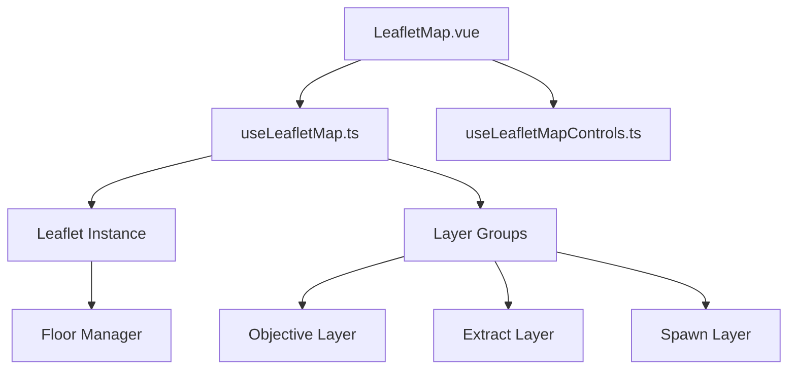
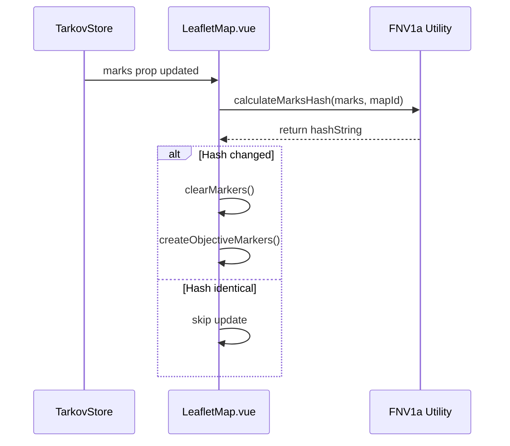

Relevant source files

The following files were used as context for generating this wiki page:

- [app/features/maps/LeafletMap.vue](app/features/maps/LeafletMap.vue)
- [app/features/maps/LeafletObjectiveTooltip.vue](app/features/maps/LeafletObjectiveTooltip.vue)
- [app/composables/useLeafletMap.ts](app/composables/useLeafletMap.ts)
- [app/features/maps/composables/useLeafletMapControls.ts](app/features/maps/composables/useLeafletMapControls.ts)
- [app/utils/mapCoordinates.ts](app/utils/mapCoordinates.ts)
- [app/utils/mapClustering.ts](app/utils/mapClustering.ts)

# Interactive Maps

The Interactive Maps system in TarkovTracker provides users with a geospatial interface to visualize game-world data, including quest objectives, extraction points, and player spawn locations. It utilizes the Leaflet library to render either SVG-based vector maps or tiled raster maps, overlaid with dynamic markers that synchronize with the user's progression state.

This module is integrated with the project's task tracking system, allowing users to view specifically where quest objectives are located on a map and update their completion status directly from the map interface. It supports multi-floor environments, customizable visual preferences, and complex coordinate transformations to map in-game positions to geographical coordinates.

Sources: [app/features/maps/LeafletMap.vue:1-150](app/features/maps/LeafletMap.vue#L1-L150), [app/features/maps/LeafletObjectiveTooltip.vue:120-150](app/features/maps/LeafletObjectiveTooltip.vue#L120-L150)

## Architecture and Components

The map system follows a composable-based architecture where the visual layer (`LeafletMap.vue`) delegates map lifecycle and control logic to specialized composables.

### Core Map Lifecycle
The `useLeafletMap` composable manages the initialization of the Leaflet instance, layer group management, and floor switching logic. It handles the cleanup of Leaflet resources to prevent memory leaks in the SPA environment.

The diagram shows the relationship between the main Vue component and its supporting composables that manage the Leaflet instance and specialized data layers.

Sources: [app/features/maps/LeafletMap.vue:145-170](app/features/maps/LeafletMap.vue#L145-L170), [app/composables/useLeafletMap.ts](app/composables/useLeafletMap.ts)

### Marker and Overlay Layers
Interactive elements are separated into distinct Leaflet `LayerGroup` instances to allow independent toggling and performance optimization:

| Layer | Purpose | Interactive |
| :--- | :--- | :--- |
| **Objective Layer** | Displays quest zones (polygons) and point objectives (circle markers). | Yes (Tooltips/Click) |
| **Extract Layer** | Visualizes PMC, Scav, Shared, and Co-op extraction points. | No (Static Badges) |
| **Spawn Layer** | Shows PMC spawn points, utilizing clustering at low zoom levels. | No |

Sources: [app/features/maps/LeafletMap.vue:640-750](app/features/maps/LeafletMap.vue#L640-L750), [app/features/maps/composables/useLeafletMapControls.ts](app/features/maps/composables/useLeafletMapControls.ts)

## Data Flow and State Synchronization

The map system maintains high reactivity by watching props and store states. When quest data changes in the `useTarkovStore`, the map updates its markers to reflect the new state (e.g., changing marker colors or removing completed objectives).

### Marker Hashing and Updates
To prevent expensive DOM re-renders, the system uses an FNV-1a hashing algorithm to determine if the set of marks (objectives/locations) has truly changed before clearing and recreating markers.

This flow ensures that markers are only regenerated when the underlying data (user ownership, positions, or IDs) changes.

Sources: [app/features/maps/LeafletMap.vue:205-245](app/features/maps/LeafletMap.vue#L205-L245), [app/features/maps/LeafletMap.vue:566-600](app/features/maps/LeafletMap.vue#L566-L600)

### Coordinate Transformation
Game coordinates (X, Y, Z) are converted to Leaflet-compatible Latitude and Longitude (`LatLng`) using the `mapCoordinates` utility. This utility accounts for coordinate rotation and axis swapping (mapping game Z to Lat and game X to Lng).

Sources: [app/utils/mapCoordinates.ts:5-40](app/utils/mapCoordinates.ts#L5-L40)

## User Interaction and Controls

### Objective Tooltips
The `LeafletObjectiveTooltip.vue` component is mounted dynamically into Leaflet popups. It provides:
*  **Navigation:** Scroll the main task list to the specific objective.
*  **Completion Toggle:** Update the objective's completion status in the store.
*  **Contextual Links:** Direct links to the EFT Wiki and Tarkov.dev for the parent task.

Sources: [app/features/maps/LeafletObjectiveTooltip.vue:1-60](app/features/maps/LeafletObjectiveTooltip.vue#L1-L60), [app/features/maps/LeafletMap.vue:490-505](app/features/maps/LeafletMap.vue#L490-L505)

### Input Handling
The system supports multiple input methods for navigating the map:

| Method | Controls | Implementation Detail |
| :--- | :--- | :--- |
| **Mouse** | Panning, Click to Pin, Scroll to Zoom | Standard Leaflet events. |
| **Keyboard** | WASD / Arrows (Pan), Q/E (Zoom), F (Click) | Custom loop via `requestAnimationFrame`. |
| **Touch** | Drag to Pan, Pinch to Zoom | Native Leaflet mobile support. |

Sources: [app/features/maps/LeafletMap.vue:260-350](app/features/maps/LeafletMap.vue#L260-L350), [app/features/maps/LeafletMap.vue:115-140](app/features/maps/LeafletMap.vue#L115-L140)

### Spawn Clustering
To maintain clarity at low zoom levels, PMC spawns are clustered using a grid-based approach. The `clusterSpawns` utility groups points within a defined pixel radius, rendering a single marker with a count label instead of overlapping individual dots.

Sources: [app/utils/mapClustering.ts](app/utils/mapClustering.ts), [app/features/maps/LeafletMap.vue:755-790](app/features/maps/LeafletMap.vue#L755-L790)

## Configuration Options

Users can customize the map experience through the `usePreferencesStore`, with real-time application of these settings to the map instance.

| Setting | Type | Range / Options |
| :--- | :--- | :--- |
| **Zoom Speed** | Number | 0.1 to 2.0 |
| **Pan Speed** | Number | 0.1 to 2.0 |
| **Zone Opacity** | Number | 0.0 to 1.0 |
| **Tooltip Density** | String | 'default', 'compact' |
| **Marker Colors** | Object | Key-value pairs for all marker types |

Sources: [app/features/maps/composables/useLeafletMapControls.ts](app/features/maps/composables/useLeafletMapControls.ts), [app/features/maps/LeafletMap.vue:70-110](app/features/maps/LeafletMap.vue#L70-L110)

## Conclusion

The Interactive Maps feature provides a performant and highly integrated spatial view of the Escape from Tarkov progression. By combining specialized coordinate utilities, optimized marker rendering through hashing, and a rich set of user controls, it serves as a critical bridge between tabular task data and in-game execution. Its architecture ensures that as map data or user progress evolves, the visual representation remains accurate and responsive.

Sources: [app/features/maps/LeafletMap.vue](app/features/maps/LeafletMap.vue), [app/composables/useLeafletMap.ts](app/composables/useLeafletMap.ts)
