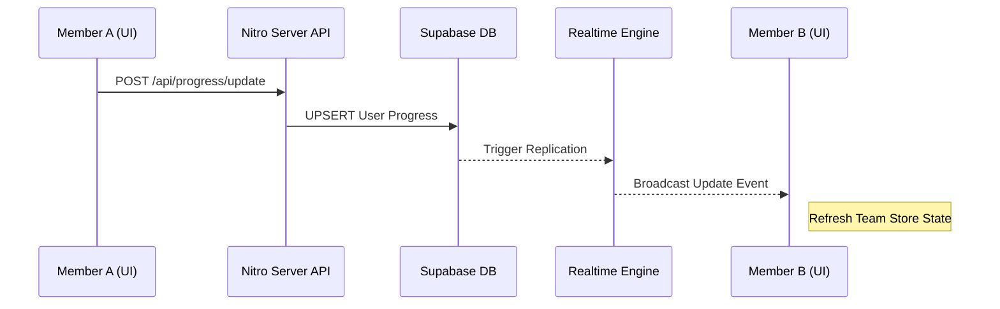
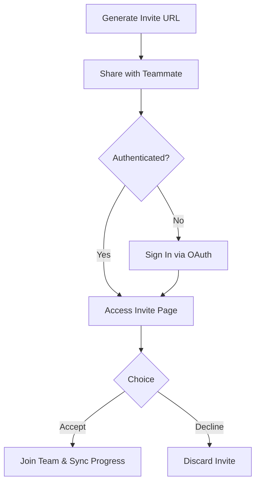
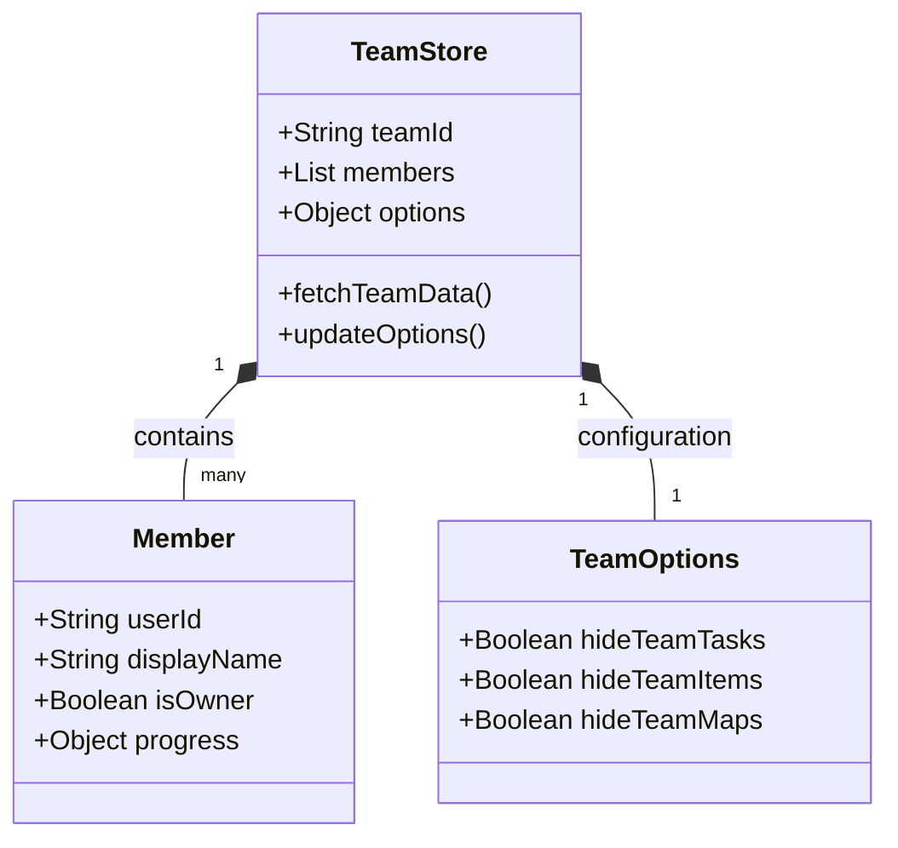

Relevant source files

The following files were used as context for generating this wiki page:

- [app/features/team/MyTeam.vue](app/features/team/MyTeam.vue)
- [app/features/team/TeamMembers.vue](app/features/team/TeamMembers.vue)
- [app/stores/useTeamStore.ts](app/stores/useTeamStore.ts)
- [AGENTS.md](AGENTS.md)
- [README.md](README.md)
- [app/pages/terms-of-service.vue](app/pages/terms-of-service.vue)
- [app/locales/zh.json](app/locales/zh.json)
- [public/llms.txt](public/llms.txt)
- [code_review.md](code_review.md)

# Team Collaboration

Team Collaboration in TarkovTracker allows authenticated users to coordinate their progress in real time. This system facilitates shared visibility of task completions, hideout status, and consolidated item requirements across a group of players. It supports both PvP and PvE game modes, ensuring that progression tracking is synchronized for collective group goals.

Sources: [README.md](README.md), [AGENTS.md:65-68](AGENTS.md#L65-L68), [app/locales/zh.json:710-713](app/locales/zh.json#L710-L713)

## Architecture and Real-Time Sync

The collaboration system is built upon a Nuxt 4 SPA architecture with a Supabase backend. Supabase handles authentication, database operations, and real-time synchronization via Nitro server routes. This enables teammates to see each other's progress immediately after an update is made by any member of the team.

Sources: [AGENTS.md:46-48](AGENTS.md#L46-L48), [README.md:28-30](README.md#L28-L30), [code_review.md:62-65](code_review.md#L62-L65)

### Real-Time Data Flow

When a player updates their progress (e.g., marking a task as complete), the change is persisted to Supabase and broadcast to all current team members.

The sequence above illustrates the transition from a local user action to a team-wide data update. Sources: [AGENTS.md:46-48](AGENTS.md#L46-L48), [code_review.md:62-65](code_review.md#L62-L65)

## Team Management

Teams are managed through a dedicated interface (`/team`) where owners can invite members, and members can view their group status.

### Core Management Features

| Feature | Description |
| :--- | :--- |
| **Team Creation** | Users can create a new team to begin hosting a shared session. |
| **Invite URLs** | A shareable link allows other players to join the team. Links can be toggled for visibility and copied. |
| **Membership** | The interface lists all current members and identifies the team owner. |
| **Owner Transfer** | Upon account deletion, team ownership automatically transfers to the oldest member. |
| **Disbanding/Leaving** | Members can exit a team, while owners have the option to disband the group entirely. |

Sources: [app/locales/zh.json:738-757](app/locales/zh.json#L738-L757), [app/pages/terms-of-service.vue:491-493](app/pages/terms-of-service.vue#L491-L493)

### The Joining Process

Joining a team requires valid authentication via supported OAuth providers (Discord, Twitch, Google, or GitHub). Sources: [README.md:23-26](README.md#L23-L26), [app/locales/zh.json:759-762](app/locales/zh.json#L759-L762)

## Integration Options

Team collaboration extends into individual feature views, such as tasks, maps, and needed items. Users can customize how much teammate data is visible to them to reduce UI clutter.

### Collaborative Display Settings
- **Task Visibility**: Option to show or hide tasks currently being tracked by team members.
- **Item Coordination**: Consolidated view of items needed by the entire team, with the ability to hide non-FIR (Found in Raid) or hideout-specific needs.
- **Map Objectives**: Real-time markers on interactive maps showing where teammates need to go for their active objectives.

Sources: [app/locales/zh.json:727-736](app/locales/zh.json#L727-L736), [app/locales/zh.json:673-674](app/locales/zh.json#L673-L674)

## Data Security and Privacy

Team data is subject to specific handling and privacy rules:
1. **API Tokens**: Teams can utilize API tokens for programmatic access, which are categorized by permissions (read-write or read-only).
2. **Data Deletion**: If a user deletes their account, their team membership is revoked. If they are the sole member, the team is deleted.
3. **Streamer Mode**: A privacy toggle is available to hide sensitive team information (like member names or specific IDs) during live broadcasts.

Sources: [app/pages/terms-of-service.vue:354-355](app/pages/terms-of-service.vue#L354-L355), [app/pages/terms-of-service.vue:485-494](app/pages/terms-of-service.vue#L485-L494), [app/locales/zh.json:843-844](app/locales/zh.json#L843-L844)

## Technical Implementation Details

The team state is maintained globally via Pinia in `useTeamStore.ts`. This store manages the list of members, their current progression snapshots, and the team's configuration settings.

### Team Integration Model

The data model above reflects the structure used to track group progress and individual contributions. Sources: [app/stores/useTeamStore.ts](app/stores/useTeamStore.ts), [app/locales/zh.json:715-725](app/locales/zh.json#L715-L725)

## Conclusion

Team Collaboration transforms TarkovTracker from a personal progress tool into a collective management platform. By leveraging Supabase's real-time capabilities and providing granular visibility controls, teams can effectively divide task objectives and coordinate item acquisition across both PvP and PvE environments.
