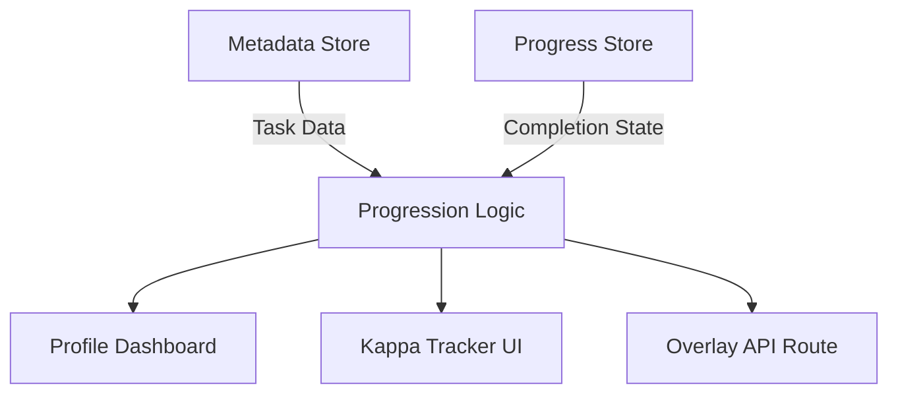
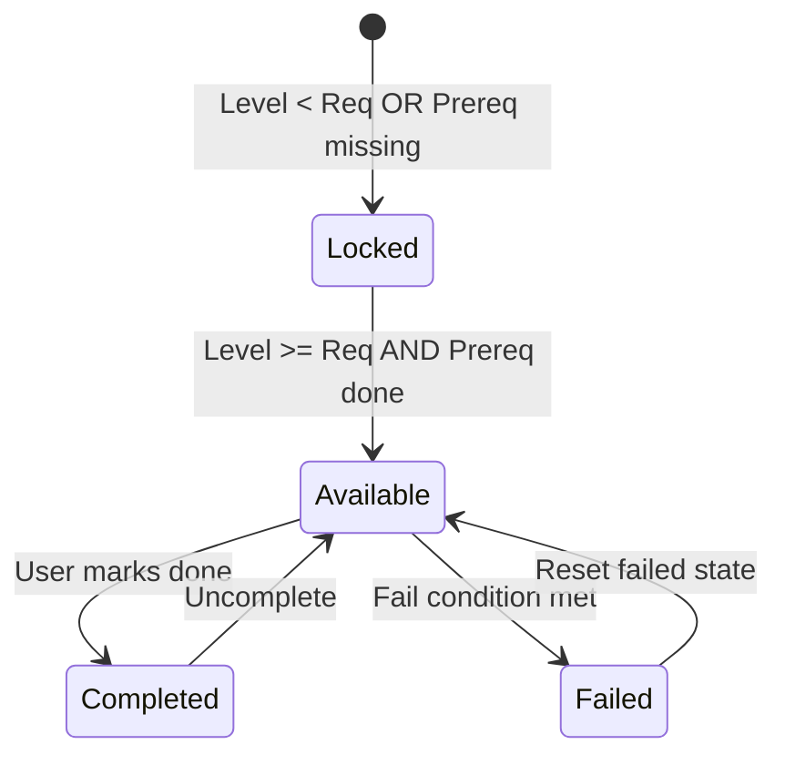
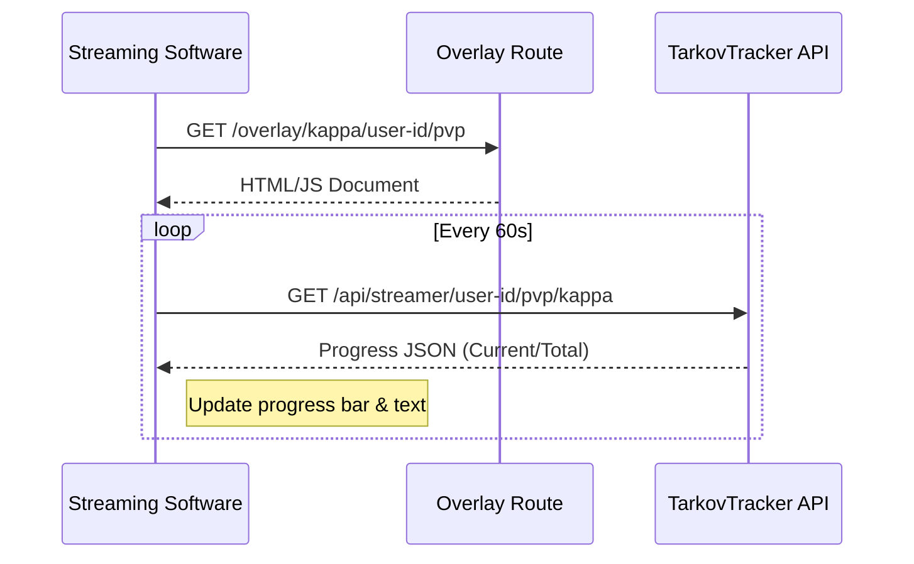

Relevant source files

The following files were used as context for generating this wiki page:

- [app/features/profile/ProfileProgression.vue](app/features/profile/ProfileProgression.vue)
- [app/features/kappa/TrackerSummary.vue](app/features/kappa/TrackerSummary.vue)
- [app/server/routes/overlay/kappa/[userId]/[mode].get.ts](app/server/routes/overlay/kappa/%5BuserId%5D/%5Bmode%5D.get.ts)
- [app/features/tasks/TaskCardHeader.vue](app/features/tasks/TaskCardHeader.vue)
- [AGENTS.md](AGENTS.md)
- [README.md](README.md)

# Kappa & Progression

The Kappa & Progression system in TarkovTracker is a comprehensive suite of features designed to track a player's journey toward the "Kappa" secure container and overall character advancement in Escape from Tarkov. This system handles complex task dependencies, level requirements, and faction-specific progression for both PvP and PvE game modes.

The system integrates real-time data from Pinia stores, provides visual feedback through detailed profile dashboards, and offers specialized tools such as streamer overlays to broadcast progression metrics. It specifically focuses on "Kappa-required" tasks, which are a subset of the game's total quests necessary for the final end-game container.

Sources: [README.md](README.md), [app/features/profile/ProfileProgression.vue:853-863](app/features/profile/ProfileProgression.vue#L853-L863), [app/features/kappa/TrackerSummary.vue](app/features/kappa/TrackerSummary.vue)

## Progression Architecture

The progression system is built as a single-page application (SPA) using Nuxt 4 and Vue 3. It utilizes a centralized state management pattern where specialized stores handle different aspects of the player's status.

### Data Flow for Progression
The application state is driven by several key stores:
- **useTarkovStore**: Manages core game settings, UIDs, and mode-specific data (PvP vs PvE).
- **useProgressStore**: Tracks task completion, level, and objective status.
- **useMetadataStore**: Contains static game data such as task lists, requirements, and trader information.

The logic layer calculates complex metrics such as the "Kappa Projection," which estimates the remaining time to reach the end-game goal based on historical task completion timestamps.
Sources: [app/features/profile/ProfileProgression.vue:246-258](app/features/profile/ProfileProgression.vue#L246-L258), [AGENTS.md:55-65](AGENTS.md#L55-L65)

## Kappa Tracking Logic

Tracking the Kappa container requires filtering the global task list to identify specific requirements. The system identifies tasks that have the `kappaRequired` attribute set to true in the metadata.

### Component Breakdown
| Component | Responsibility |
| :--- | :--- |
| `ProfileProgression.vue` | Main dashboard calculating total progression, achievements, and timeline. |
| `TrackerSummary.vue` | A high-level widget showing progress percentages and the "Collector" task goal. |
| `KappaTaskRow.vue` | Displays individual tasks with level gates and trader requirements. |
| `Overlay API` | Generates a dynamic HTML/CSS/JS payload for streamers to show live counts. |

Sources: [app/features/profile/ProfileProgression.vue:853-863](app/features/profile/ProfileProgression.vue#L853-L863), [app/features/kappa/TrackerSummary.vue:8-25](app/features/kappa/TrackerSummary.vue#L8-L25), [app/server/routes/overlay/kappa/[userId]/[mode].get.ts]()

### Task State Transitions
Tasks within the progression system move through specific states based on player level and completion status.

Sources: [app/features/profile/ProfileProgression.vue:354-388](app/features/profile/ProfileProgression.vue#L354-L388), [app/features/kappa/TrackerSummary.vue:135-150](app/features/kappa/TrackerSummary.vue#L135-L150)

## Achievement and Metric Calculation

The system converts raw task and hideout data into human-readable achievement rows. These metrics are categorized into four primary areas:
1.  **Mainline Task Progress**: Overall completion of all visible tasks.
2.  **Kappa Tasks**: Progress specifically toward the end-game container.
3.  **Lightkeeper Tasks**: Progress toward the Lightkeeper trader series.
4.  **Objective Completion**: Granular progress at the sub-task level.

### Kappa Projection Helper
The projection logic uses a dampened pace calculation. If a player has completed a minimum of 3 tasks (`MIN_ESTIMATE_SAMPLE`), the system calculates the average tasks per day and projects this against the remaining count. It also applies a "Critical Path Floor" to ensure the estimate accounts for sequential prerequisites and level gates that cannot be bypassed by raw speed.

Sources: [app/features/profile/ProfileProgression.vue:239-242](app/features/profile/ProfileProgression.vue#L239-L242), [app/features/profile/ProfileProgression.vue:741-806](app/features/profile/ProfileProgression.vue#L741-L806)

## Streamer Overlay Integration

A specialized server route (`/overlay/kappa/[userId]/[mode]`) allows users to generate live-updating overlays for streaming software like OBS. This route acts as a micro-application, returning a full HTML document with internal logic to poll the progression API.

### Overlay Parameters
| Parameter | Type | Default | Description |
| :--- | :--- | :--- | :--- |
| `metric` | String | `tasks` | Metrics to show: `items`, `summary`, or `tasks`. |
| `accent` | String | `kappa` | Color theme: `kappa`, `info`, `success`, `warning`. |
| `layout` | String | `card` | Visual style: `card`, `minimal`, or `text`. |
| `interval` | Number | 60000 | Polling rate in milliseconds (60s to 600s). |

Sources: [app/server/routes/overlay/kappa/[userId]/[mode].get.ts:7-120]()

Sources: [app/server/routes/overlay/kappa/[userId]/[mode].get.ts:770-800]()

## Conclusion

The Kappa & Progression system serves as the core logic for player engagement in TarkovTracker. By combining static metadata with dynamic user progress and complex estimation algorithms, it provides players with a clear roadmap of their journey. The multi-mode support ensures that progression is tracked accurately whether the user is playing in the standard PvP environment or the persistent PvE mode.

Sources: [README.md](README.md), [app/features/profile/ProfileProgression.vue](app/features/profile/ProfileProgression.vue)
