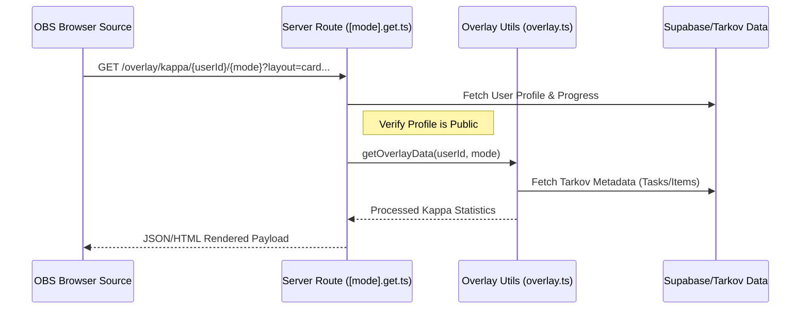
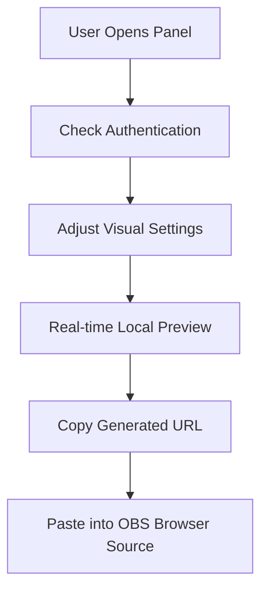

<details>
<summary>Relevant source files</summary>

The following files were used as context for generating this wiki page:

- [app/features/streamer-tools/StreamerToolsPanel.vue](app/features/streamer-tools/StreamerToolsPanel.vue)
- [app/server/routes/overlay/kappa/\[userId\]/\[mode\].get.ts](app/server/routes/overlay/kappa/%5BuserId%5D/%5Bmode%5D.get.ts)
- [app/server/utils/overlay.ts](app/server/utils/overlay.ts)
- [app/locales/en.json](app/locales/en.json)
- [README.md](README.md)
- [AGENTS.md](AGENTS.md)
</details>

# Streamer Tools & Overlays

Streamer Tools & Overlays in TarkovTracker provide content creators with dynamic, real-time widgets designed for use as browser sources in broadcasting software such as OBS Studio, Streamlabs, XSplit, and vMix. These tools specifically track and display progress toward major game milestones, such as the "Kappa" secure container, by aggregating task and item data directly from the user's synced profile.

The system is split into a user-facing configuration panel and a server-side rendering pipeline. The configuration panel allows for extensive visual customization—including layout, color accents, and transparency—while the backend serves live data optimized for low-latency updates during raids.

Sources: [app/features/streamer-tools/StreamerToolsPanel.vue](app/features/streamer-tools/StreamerToolsPanel.vue), [README.md](README.md)

## System Architecture

The overlay system utilizes a decoupled architecture where the UI generates a parameterized URL that points to a specialized Nitro server route. This route fetches progress data and returns a structured response that the browser source renders.

### Component Overview

- **Configuration Panel (`StreamerToolsPanel.vue`)**: A Vue 3 component using the Nuxt UI framework to provide a real-time preview of the overlay. It manages local state for visual preferences and constructs the final Browser Source URL.
- **Data Utility (`overlay.ts`)**: Contains the core logic for calculating Kappa progress. It filters tasks and items based on "Kappa-required" metadata and computes completion percentages.
- **API Endpoint (`[mode].get.ts`)**: A server route located at `/overlay/kappa/[userId]/[mode]`. it validates the user's sharing settings and serves the processed data to the overlay.

### Data Flow for Overlay Rendering

The following diagram illustrates the lifecycle of an overlay request from the streaming software to the TarkovTracker backend.



Sources: [app/server/routes/overlay/kappa/\[userId\]/\[mode\].get.ts:1-25](), [app/server/utils/overlay.ts:10-50](app/server/utils/overlay.ts#L10-L50)

## Configuration and Customization

Users customize their overlays through the Streamer Tools Panel. This panel generates a unique URL containing query parameters that the backend uses to modify the widget's appearance and behavior.

### Visual Options

The overlay supports multiple layouts and aesthetic configurations to fit different stream styles:

| Category | Options | Description |
| :--- | :--- | :--- |
| **Layout** | Full Card, Minimal Pill, Text Only | Defines the density and shape of the widget. |
| **Accent** | Red (Kappa), Cyan (Info), Green, Orange | Changes the primary theme color of progress bars and highlights. |
| **Alignment** | 9-Grid (Top-Left to Bottom-Right) | Positions the widget within a full-screen canvas. |
| **Background** | Transparent, Custom Color/Opacity | Controls the visibility of the widget container. |
| **Metric** | Tasks, Items, Combined Summary | Selects which progress data points to display. |

Sources: [app/features/streamer-tools/StreamerToolsPanel.vue:200-400](app/features/streamer-tools/StreamerToolsPanel.vue#L200-L400), [app/locales/en.json:streamer_tools](app/locales/en.json:streamer_tools)

### URL Parameter Structure

The generated URL follows a specific pattern to ensure the server correctly interprets user preferences:
`https://tarkovtracker.org/overlay/kappa/{userId}/{mode}?layout={layout}&accent={color}&align={alignment}...`



Sources: [app/features/streamer-tools/StreamerToolsPanel.vue:420-450](app/features/streamer-tools/StreamerToolsPanel.vue#L420-L450)

## Implementation Details

### Progress Calculation Logic

The `getOverlayData` utility function is responsible for the heavy lifting of progress calculation. It utilizes the `useTarkovStore` patterns to determine what is currently "needed" versus "collected".

```typescript
// Simplified logic from app/server/utils/overlay.ts
export async function getOverlayData(userId: string, mode: GameMode) {
  const metadata = await fetchTarkovMetadata();
  const userProgress = await fetchUserProgress(userId, mode);

  const kappaTasks = metadata.tasks.filter(t => t.kappaRequired);
  const completedCount = kappaTasks.filter(t => userProgress.tasks[t.id]?.completed).length;
  
  return {
    total: kappaTasks.length,
    completed: completedCount,
    percent: (completedCount / kappaTasks.length) * 100
  };
}
```

Sources: [app/server/utils/overlay.ts:15-60](app/server/utils/overlay.ts#L15-L60)

### Security and Privacy

Overlay data is only accessible if the user has enabled **Public Sharing** for the specific game mode (PvP or PvE) in their Account Settings. If a profile is set to private, the server route returns a 404 or a "Private Mode" notification to prevent unauthorized data exposure.

Sources: [app/server/routes/overlay/kappa/\[userId\]/\[mode\].get.ts:30-45](), [app/locales/en.json:streamer_tools.mode_private](app/locales/en.json:streamer_tools.mode_private)

## Integration Workflow

For optimal performance in OBS Studio, the system recommends specific "Platform Setup" steps to avoid common issues like scaling blur or high CPU usage.

1. **Scene Canvas Mode**: The source matches the stream resolution (e.g., 1920x1080). The widget is positioned via the "Alignment" setting.
2. **Self-Contained Mode**: The source is sized only to the widget's bounds. The streamer positions the source manually by dragging it in the OBS preview.
3. **Native Rendering**: The overlay uses CSS scaling rather than OBS scaling handles to maintain native font and border quality.

Sources: [app/features/streamer-tools/StreamerToolsPanel.vue:500-580](app/features/streamer-tools/StreamerToolsPanel.vue#L500-L580), [app/locales/en.json:streamer_tools.setup_scaling_warning](app/locales/en.json:streamer_tools.setup_scaling_warning)

## Summary

The Streamer Tools and Overlays system provides a robust bridge between a player's progression data and their broadcast. By combining a flexible Vue-based configuration UI with a performant Nitro server backend, TarkovTracker allows streamers to share their journey toward "Kappa" with minimal setup. The system ensures privacy through authenticated sharing controls while offering professional-grade visual customization suitable for high-production-value streams.
