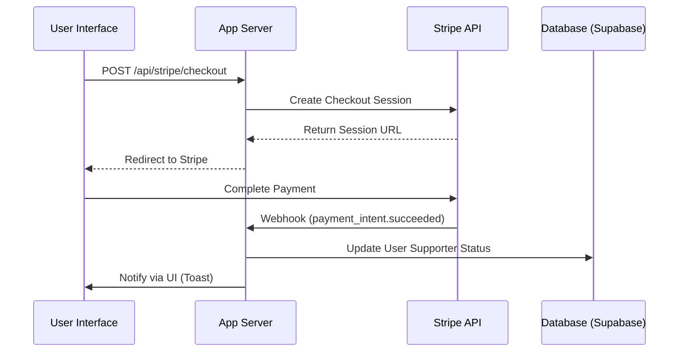
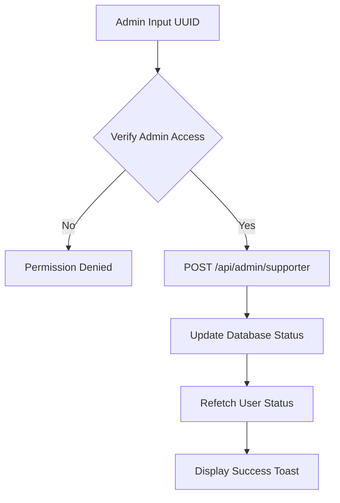

Relevant source files

The following files were used as context for generating this wiki page:

- [app/features/supporter/supporterPricing.ts](app/features/supporter/supporterPricing.ts)
- [app/features/supporter/SupporterOneTime.vue](app/features/supporter/SupporterOneTime.vue)
- [app/features/admin/AdminSupporterAccessCard.vue](app/features/admin/AdminSupporterAccessCard.vue)
- [app/features/supporter/__tests__/supporterPricing.test.ts](app/features/supporter/__tests__/supporterPricing.test.ts)
- [app/pages/terms-of-service.vue](app/pages/terms-of-service.vue)
- [app/pages/privacy.vue](app/pages/privacy.vue)
- [app/locales/zh.json](app/locales/zh.json)

# Supporter & Payment System

The Supporter & Payment System within TarkovTracker provides a mechanism for users to contribute to the project's development and maintenance via voluntary payments. It supports both recurring subscriptions and one-time contributions, processed through Stripe. This system is integrated with the application's authentication and authorization layers, granting supporters specific perks such as profile badges, Discord roles, and extended data retention.

Sources: [app/pages/terms-of-service.vue:641-653](app/pages/terms-of-service.vue#L641-L653), [app/features/supporter/SupporterOneTime.vue:5-15](app/features/supporter/SupporterOneTime.vue#L5-L15)

## System Architecture

The system utilizes a client-server architecture where the frontend handles user interactions and pricing displays, while a backend (Nitro server routes and Supabase Edge Functions) manages secure payment processing and webhook integrations.

### Core Components
*  **Stripe Integration:** Handles actual payment processing, recurring billing, and secure card storage.
*  **Pricing Engine:** A set of utility functions to calculate charges, discounts, and Stripe fees.
*  **Admin Overrides:** A specialized administrative interface allowing manual adjustment of supporter tiers for testing or community management.
*  **Supporter Perks:** Application-level logic that unlocks specific features (e.g., higher API limits, Discord roles) based on active supporter status.

Sources: [app/features/supporter/supporterPricing.ts:1-20](app/features/supporter/supporterPricing.ts#L1-L20), [app/features/admin/AdminSupporterAccessCard.vue:10-30](app/features/admin/AdminSupporterAccessCard.vue#L10-L30), [app/pages/terms-of-service.vue:660-675](app/pages/terms-of-service.vue#L660-L675)

### Payment Flow Diagram
The following diagram illustrates the sequence from a user initiating a contribution to the application granting perks.

Sources: [app/features/supporter/SupporterOneTime.vue:106-130](app/features/supporter/SupporterOneTime.vue#L106-L130), [app/pages/terms-of-service.vue:712-718](app/pages/terms-of-service.vue#L712-L718)

## Subscription Tiers and Pricing

TarkovTracker offers three primary subscription tiers, differentiated by their naming and associated perks. Pricing is calculated dynamically based on the selected interval (Monthly, 6 Months, or Yearly).

### Supporter Tiers
| Tier ID | Label | Tagline |
| :--- | :--- | :--- |
| `scav` | Scav | Just trying to get by |
| `timmy` | Timmy | Learning the ropes (Featured Tier) |
| `chad` | Chad | True veteran supporter |

Sources: [app/features/supporter/supporterPricing.ts:14-38](app/features/supporter/supporterPricing.ts#L14-L38), [app/locales/zh.json:657-662](app/locales/zh.json#L657-L662)

### Pricing Logic
Pricing includes built-in discounts for longer commitment periods and ensures that transaction fees are covered if the user opts in.

*  **Monthly:** Base price, no discount.
*  **6 Months:** 10% discount on the base monthly rate.
*  **Yearly:** 20% discount on the base monthly rate.
*  **Stripe Fees:** Calculated as a combination of a fixed rate (e.g., $0.30) and a percentage (e.g., 2.9% or 3.6% for subscriptions).

Sources: [app/features/supporter/supporterPricing.ts:50-100](app/features/supporter/supporterPricing.ts#L50-L100), [app/features/supporter/__tests__/supporterPricing.test.ts:20-40](app/features/supporter/__tests__/supporterPricing.test.ts#L20-L40)

## Contribution Types

### One-Time Contributions
Users can send a one-time gift with a minimum value of $3.00 and a maximum of $500.00. The UI allows users to "Cover Stripe fees" to ensure the full intended amount reaches the developers.

Sources: [app/features/supporter/SupporterOneTime.vue:66-70](app/features/supporter/SupporterOneTime.vue#L66-L70), [app/features/supporter/supporterPricing.ts:133-145](app/features/supporter/supporterPricing.ts#L133-L145)

### Recurring Subscriptions
Subscriptions are billed automatically at the end of every interval. Users can manage or cancel their subscriptions through a dedicated billing portal.

Sources: [app/pages/terms-of-service.vue:734-740](app/pages/terms-of-service.vue#L734-L740), [app/locales/zh.json:694-698](app/locales/zh.json#L694-L698)

## Administrative Controls

The system includes an **Admin Supporter Access Card** used for production testing or manual status adjustments. This component allows administrators to:
1.  Target a specific user by their Supabase UUID.
2.  Assign a specific tier (`scav`, `timmy`, `chad`, or generic `supporter`).
3.  Enable or disable the status without requiring a Stripe transaction.

Sources: [app/features/admin/AdminSupporterAccessCard.vue:35-55](app/features/admin/AdminSupporterAccessCard.vue#L35-L55), [app/locales/zh.json:88-100](app/locales/zh.json#L88-L100)

## Data Retention and Privacy

Supporter status influences how the platform handles user data, particularly concerning inactive accounts.

*  **Standard Retention:** Inactive accounts (e.g., no login for 6+ months) may be eligible for deletion.
*  **Supporter Retention:** Active supporters receive an extended retention window as a perk, protecting their progress from deletion during long breaks from the game.
*  **Security:** Payment information is processed by Stripe; TarkovTracker does not store full credit card details, only transaction identifiers and tier status.

Sources: [app/pages/privacy.vue:310-325](app/pages/privacy.vue#L310-L325), [app/pages/terms-of-service.vue:565-575](app/pages/terms-of-service.vue#L565-L575), [app/locales/zh.json:667-668](app/locales/zh.json#L667-L668)

## Conclusion
The Supporter & Payment System is a critical component for the sustainability of TarkovTracker. By providing clear pricing, multiple contribution paths, and administrative overrides, it ensures a robust infrastructure for community-supported development while maintaining high standards for user privacy and data security.
