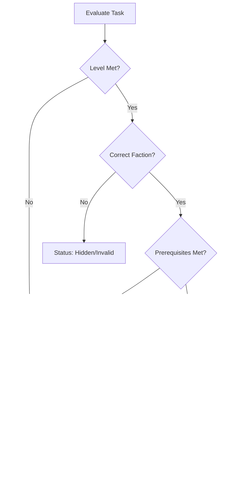
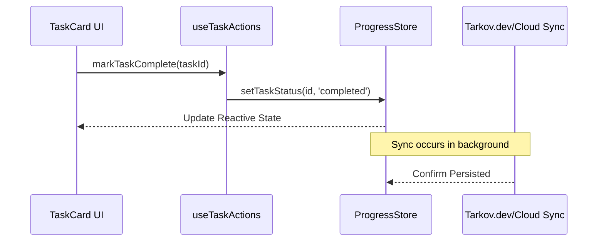

<details>
<summary>Relevant source files</summary>

The following files were used as context for generating this wiki page:

- [app/features/tasks/TaskCard.vue](app/features/tasks/TaskCard.vue)
- [app/features/tasks/QuestObjectives.vue](app/features/tasks/QuestObjectives.vue)
- [app/features/tasks/TaskCardHeader.vue](app/features/tasks/TaskCardHeader.vue)
- [app/stores/useMetadata.ts](app/stores/useMetadata.ts)
- [app/composables/useTaskActions.ts](app/composables/useTaskActions.ts)
- [app/features/tasks/TaskLink.vue](app/features/tasks/TaskLink.vue)
</details>

# Task Tracking

The Task Tracking system in TarkovTracker is a comprehensive framework designed to manage and visualize player progression through quests in Escape from Tarkov. It handles complex data relationships including multi-step objectives, prerequisite task chains, trader loyalty requirements, and faction-specific availability. The system supports separate tracking for PvP and PvE game modes and integrates with external data sources like tarkov.dev and the community wiki.

Sources: [app/stores/useMetadata.ts](app/stores/useMetadata.ts), [app/features/tasks/TaskCard.vue:1-50](app/features/tasks/TaskCard.vue#L1-L50)

## Task Data Architecture

The system's core relies on a centralized metadata store that processes raw game data into a traversable graph. This architecture allows the application to determine task availability based on a user's current state, including their player level, trader reputation, and previously completed tasks.

### Core Data Structures
The task tracking logic uses several specialized data structures to manage the state and relationships of quests:

| Structure | Purpose |
| :--- | :--- |
| `Task` | The primary object containing ID, name, trader info, and requirements. |
| `TaskObjective` | Specific requirements within a task (e.g., "Find 3 Salewas"). |
| `TaskGraph` | A directed graph representing the dependency chain between tasks. |
| `FinishRewards` | Data structure containing items, XP, and standing gained upon completion. |

Sources: [app/stores/useMetadata.ts:60-120](app/stores/useMetadata.ts#L60-L120), [app/features/tasks/TaskCard.vue:460-500](app/features/tasks/TaskCard.vue#L460-L500)

### Dependency Flow
The following diagram illustrates how the system determines if a task is "Available" or "Locked" based on parent task statuses and level requirements.



The system evaluates player level first, then filters by faction and evaluates the `predecessors` array in the metadata to determine the final UI state of a task card.
Sources: [app/features/tasks/TaskCard.vue:420-450](app/features/tasks/TaskCard.vue#L420-L450), [app/stores/useMetadata.ts:1000-1050](app/stores/useMetadata.ts#L1000-L1050)

## Task State Management

Task states are managed through specialized composables and stores that handle reactive updates when a user interacts with the UI.

### Task Actions
The `useTaskActions` composable provides a standard interface for mutating task states. It interacts with the `ProgressStore` to persist changes.



Sources: [app/composables/useTaskActions.ts](app/composables/useTaskActions.ts), [app/features/tasks/TaskCard.vue:240-250](app/features/tasks/TaskCard.vue#L240-L250)

### Failure Conditions and Blockers
Tasks can become "Invalid" or "Failed" based on choices made in other tasks (alternative quest branches). The system monitors `failConditions` and `alternativeTaskSources` to automatically update the state of mutually exclusive quests.
Sources: [app/features/tasks/TaskCard.vue:513-550](app/features/tasks/TaskCard.vue#L513-L550), [app/stores/useMetadata.ts:1100-1130](app/stores/useMetadata.ts#L1100-L1130)

## User Interface Components

The tracking system is visualized through a hierarchy of Vue components that display task details and allow interaction.

### Task Card (TaskCard.vue)
This is the primary unit of the task list. It utilizes sub-components to organize information:
- **Header:** Displays trader icon, faction icon, quest name, and external links.
- **Objectives:** A collapsible section showing individual requirements.
- **Rewards:** Displays XP and items granted on completion.
- **Badges:** Shows level requirements, Fence reputation needs, and "Kappa Required" status.

Sources: [app/features/tasks/TaskCard.vue:5-150](app/features/tasks/TaskCard.vue#L5-L150), [app/features/tasks/TaskCardHeader.vue:1-60](app/features/tasks/TaskCardHeader.vue#L1-L60)

### Objective Tracking (QuestObjectives.vue)
Objectives are tracked with varying logic depending on their type. For item-based objectives, the system provides increment/decrement controls.

```typescript
// Example of objective hydration with item data
const hydrateObjective = (objective: TaskObjective): TaskObjective => {
  return {
    ...objective,
    item: pickItemLite(objective.item),
    markerItem: pickItemLite(objective.markerItem),
    requiredKeys: pickItemMatrix(objective.requiredKeys)
  };
};
```

Sources: [app/features/tasks/QuestObjectives.vue](app/features/tasks/QuestObjectives.vue), [app/stores/useMetadata.ts:1140-1160](app/stores/useMetadata.ts#L1140-L1160)

## Metadata Hydration and Caching

To maintain high performance with over 200 tasks, the system uses a phased loading approach managed by `useMetadata.ts`.

1.  **Bootstrap:** Fetches minimal data (player levels) for immediate rendering.
2.  **Tasks Core:** Fetches task IDs, names, and basic relationships.
3.  **Objectives/Rewards:** Fetches heavy objective descriptions and reward payloads incrementally.
4.  **Local Caching:** All data is stored in IndexedDB with specific TTLs to minimize network requests.

Sources: [app/stores/useMetadata.ts:700-850](app/stores/useMetadata.ts#L700-L850)

## Conclusion

The Task Tracking system provides a robust engine for managing the complex web of quests in Escape from Tarkov. By separating core metadata from player-specific progress and using a graph-based dependency model, it ensures accurate representation of a player's journey toward major milestones like the Kappa container. The multi-layered UI components and optimized caching strategy allow the system to remain responsive even while managing thousands of data points across different game modes.

Sources: [app/features/tasks/TaskCard.vue](app/features/tasks/TaskCard.vue), [app/stores/useMetadata.ts](app/stores/useMetadata.ts)
