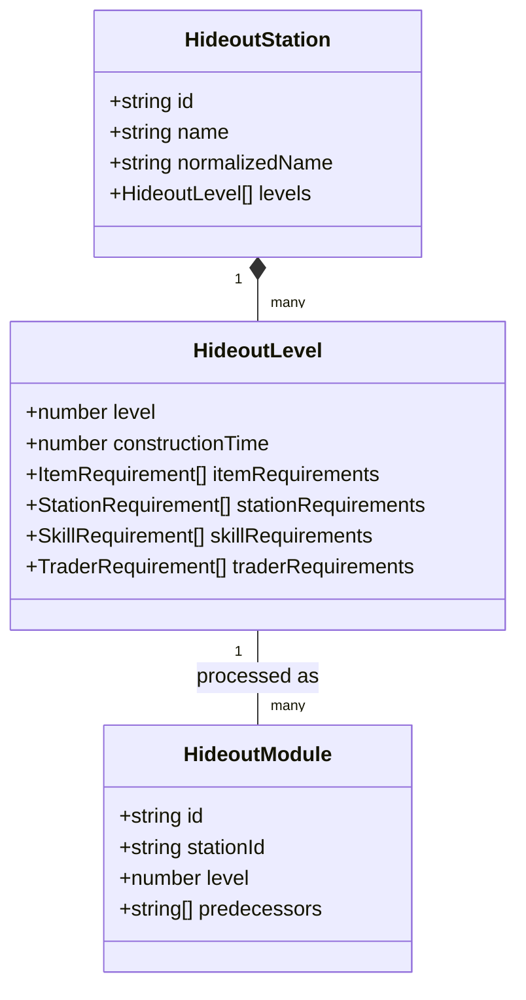
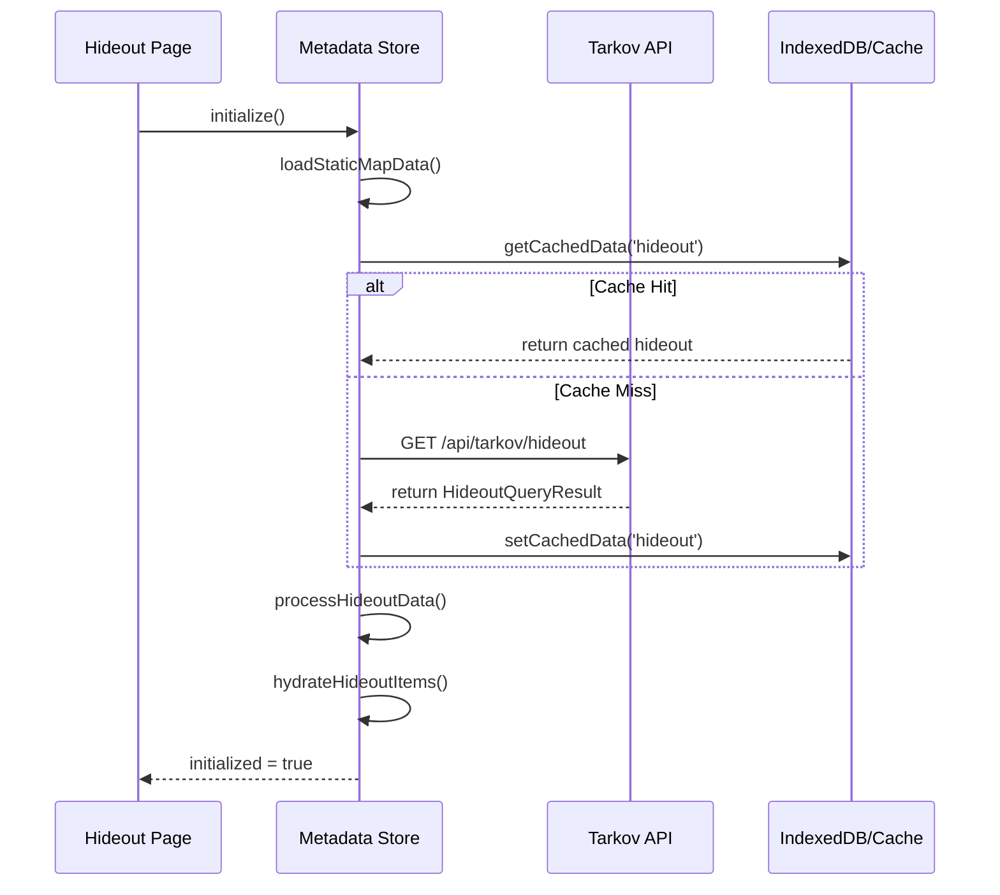
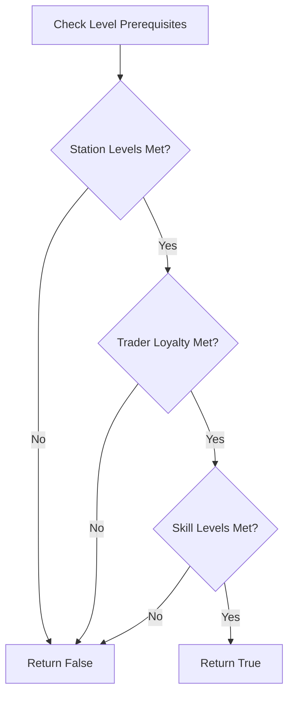

Relevant source files

The following files were used as context for generating this wiki page:

- [app/pages/hideout.vue](app/pages/hideout.vue)
- [app/stores/useMetadata.ts](app/stores/useMetadata.ts)
- [app/composables/useHideoutStationStatus.ts](app/composables/useHideoutStationStatus.ts)
- [app/features/hideout/HideoutCard.vue](app/features/hideout/HideoutCard.vue)
- [app/features/hideout/StationLink.vue](app/features/hideout/StationLink.vue)
- [public/llms.txt](public/llms.txt)

# Hideout Management

Hideout Management in TarkovTracker is a specialized module designed to help players track their progress through the complex upgrade paths of the Escape from Tarkov hideout system. It aggregates data on station levels, item requirements, skills, and trader loyalty to provide a real-time overview of what is currently buildable, what is locked, and what materials are needed for future progression. 

The system relies on a reactive architecture using Nuxt 3/4, Pinia for state management, and specialized composables to handle complex business logic such as prerequisite verification and filtering. Users can switch between PvP and PvE modes, with progress persisting locally or syncing to a cloud account for authenticated users.

Sources: [app/pages/hideout.vue:12-18](app/pages/hideout.vue#L12-L18), [public/llms.txt:3-6](public/llms.txt#L3-L6), [app/stores/useMetadata.ts:145-160](app/stores/useMetadata.ts#L145-L160)

## Architecture and Data Flow

The Hideout Management system follows a centralized data flow where game metadata is fetched from an external API (proxied via `/api/tarkov/hideout`) and processed into specialized state structures.

### Data Model and State
The `useMetadataStore` acts as the primary orchestrator for hideout data. It maintains raw `HideoutStation` objects and processes them into a `hideoutGraph` for dependency resolution.

Sources: [app/stores/useMetadata.ts:60-120](app/stores/useMetadata.ts#L60-L120), [app/stores/useMetadata.ts:1140-1160](app/stores/useMetadata.ts#L1140-L1160)

### Initialization Sequence
When the Hideout page is accessed, the application follows a strict initialization sequence to ensure all dependencies (items, levels, and prerequisites) are available before rendering.

Sources: [app/stores/useMetadata.ts:250-300](app/stores/useMetadata.ts#L250-L300), [app/stores/useMetadata.ts:1010-1035](app/stores/useMetadata.ts#L1010-L1035)

## Station Status Logic

A critical part of hideout management is determining the status of a station based on user progress and game requirements. This logic is encapsulated in the `useHideoutStationStatus` composable.

### Status Determination
The system classifies each station into one of four primary views:

| Status | Description |
| :--- | :--- |
| `maxed` | The station has reached the maximum level defined in game data. |
| `available` | The next level is buildable (all prerequisites and items are met). |
| `locked` | The next level is known, but one or more prerequisites are unmet. |
| `all` | A comprehensive list of all stations regardless of status. |

Sources: [app/pages/hideout.vue:430-465](app/pages/hideout.vue#L430-L465), [app/composables/useHideoutStationStatus.ts:15-30](app/composables/useHideoutStationStatus.ts#L15-L30)

### Prerequisite Verification
The `arePrereqsMet` function evaluates if a specific `HideoutLevel` can be constructed. It checks three primary types of constraints:
1. **Station Requirements**: Other hideout modules must be at a specific level.
2. **Trader Requirements**: Specific loyalty levels (LL) with traders.
3. **Skill Requirements**: Character skills (e.g., Strength, Stress Resistance) at specific levels.

Sources: [app/composables/useHideoutStationStatus.ts:40-80](app/composables/useHideoutStationStatus.ts#L40-L80), [app/stores/useMetadata.ts:550-575](app/stores/useMetadata.ts#L550-L575)

## UI Components

### HideoutCard
`HideoutCard.vue` is the primary display unit for a station. It reactively updates based on the user's current progress in the `useProgressStore`. It manages:
- **Collapsible State**: Automatically collapses maxed stations if user preferences allow.
- **Deep Linking**: Responds to `?station=id` query parameters to highlight and scroll to specific modules.
- **Requirement Interactions**: Allows users to mark items as collected directly from the card.

Sources: [app/features/hideout/HideoutCard.vue:10-50](app/features/hideout/HideoutCard.vue#L10-L50), [app/pages/hideout.vue:550-580](app/pages/hideout.vue#L550-L580)

### StationLink
`StationLink.vue` provides cross-module navigation. When a station upgrade requires another station (e.g., Medstation Level 3 requiring Nutrition Unit Level 2), this component creates a link that:
1. Updates the active view filter to match the target station's status.
2. Scrolls the target station into the center of the viewport.
3. Highlights the target station visually.

Sources: [app/features/hideout/StationLink.vue:15-35](app/features/hideout/StationLink.vue#L15-L35), [app/pages/hideout.vue:565-595](app/pages/hideout.vue#L565-L595)

## User Preferences and Filtering

The hideout experience is highly customizable through the `usePreferencesStore`. These settings change how the frontend calculates "Available" vs "Locked" modules without altering the underlying game data.

| Configuration Option | Effect |
| :--- | :--- |
| `hideoutCollapseCompleted` | Automatically minimizes station cards that are at max level. |
| `hideoutSortReadyFirst` | Reorders the list to show buildable stations at the top. |
| `hideoutRequireStationLevels` | Toggles whether other station levels act as hard blockers for status. |
| `hideoutRequireSkillLevels` | Toggles character skill requirements as blockers. |
| `hideoutRequireTraderLoyalty` | Toggles trader loyalty levels as blockers. |

Sources: [app/pages/hideout.vue:470-500](app/pages/hideout.vue#L470-L500), [app/stores/useMetadata.ts:100-120](app/stores/useMetadata.ts#L100-L120)

## Performance Optimization

Because hideout data includes hundreds of item requirements and complex dependency graphs, the system implements several optimizations:
- **markRaw**: Large arrays of tasks and stations are wrapped in `markRaw` to prevent Vue from creating expensive proxy objects for immutable metadata.
- **Infinite Scroll**: Stations are rendered in batches (default size: 4) using a sentinel-based `useInfiniteScroll` composable to maintain high FPS.
- **Lazy Loading**: Full item metadata is only loaded on-demand via `ensureItemsFullLoaded` when the user interacts with specific requirements.

Sources: [app/pages/hideout.vue:350-380](app/pages/hideout.vue#L350-L380), [app/stores/useMetadata.ts:160-190](app/stores/useMetadata.ts#L160-L190), [app/stores/useMetadata.ts:930-950](app/stores/useMetadata.ts#L930-L950)

## Summary

Hideout Management in TarkovTracker transforms static game data into an interactive progression tool. By combining a centralized metadata store with reactive status calculation and specialized UI components, it allows players to plan builds and track materials efficiently. The system's ability to toggle prerequisite enforcement allows for both strict "build now" views and broader "planning" perspectives.
