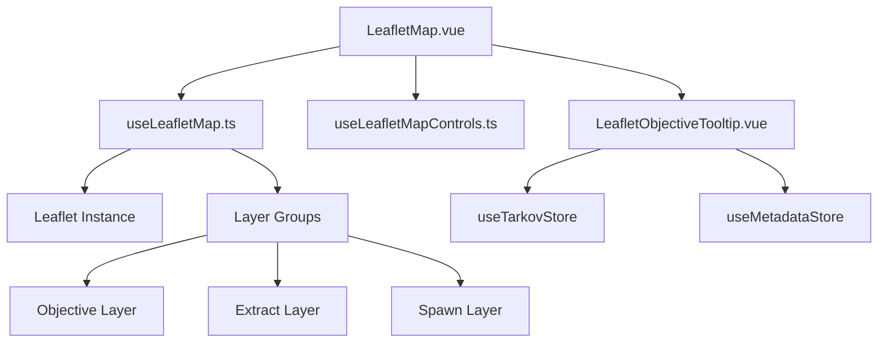
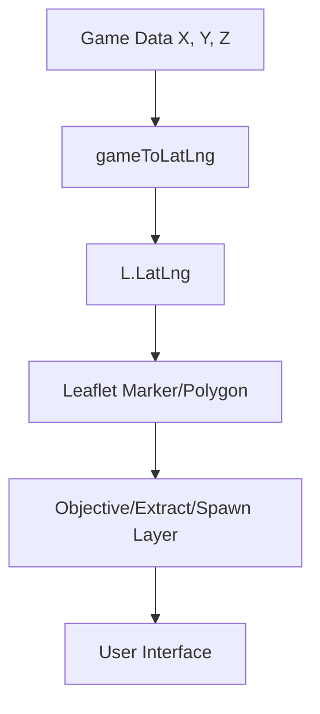

<details>
<summary>Relevant source files</summary>

The following files were used as context for generating this wiki page:

- [app/features/maps/LeafletMap.vue](app/features/maps/LeafletMap.vue)
- [app/features/maps/LeafletObjectiveTooltip.vue](app/features/maps/LeafletObjectiveTooltip.vue)
- [app/composables/useLeafletMap.ts](app/composables/useLeafletMap.ts)
- [app/features/maps/composables/useLeafletMapControls.ts](app/features/maps/composables/useLeafletMapControls.ts)
- [app/stores/usePreferences.ts](app/stores/usePreferences.ts)
- [app/utils/mapCoordinates.ts](app/utils/mapCoordinates.ts)
</details>

# Interactive Maps Integration

The Interactive Maps Integration in TarkovTracker provides a robust system for visualizing game-world locations, including task objectives, spawn points, and extraction zones. Built upon the Leaflet.js library, this module translates coordinate systems from the Escape from Tarkov game engine into geographical coordinates usable on a 2D map interface.

This system allows users to track their progress in real-time, offering interactive tooltips for objectives, floor-switching for multi-level maps, and extensive customization for visibility and colors.

Sources: [app/features/maps/LeafletMap.vue](app/features/maps/LeafletMap.vue), [app/composables/useLeafletMap.ts](app/composables/useLeafletMap.ts)

## System Architecture

The maps integration is structured as a hierarchical Vue-based system that manages Leaflet instances, data layers, and user interactions.

### Component Hierarchy

The integration relies on a primary container that initializes the mapping environment and several sub-systems for specific features.



Sources: [app/features/maps/LeafletMap.vue:185-210](app/features/maps/LeafletMap.vue#L185-L210), [app/composables/useLeafletMap.ts](app/composables/useLeafletMap.ts)

### Core Components and Composables

| Component / Composable | Purpose |
| :--- | :--- |
| `LeafletMap.vue` | The primary UI component. Manages the lifecycle of the map, keyboard controls, and marker updates. |
| `useLeafletMap.ts` | Handles the initialization of the Leaflet instance, tile/SVG layers, and specific coordinate transforms. |
| `useLeafletMapControls.ts` | Manages the state for map visibility toggles (PMC/Scav extracts, spawns) and preference synchronization. |
| `LeafletObjectiveTooltip.vue` | A dynamically mounted Vue application within Leaflet popups providing objective details and controls. |

Sources: [app/features/maps/LeafletMap.vue:180-220](app/features/maps/LeafletMap.vue#L180-L220), [app/composables/useLeafletMap.ts](app/composables/useLeafletMap.ts), [app/features/maps/LeafletObjectiveTooltip.vue](app/features/maps/LeafletObjectiveTooltip.vue)

## Data Flow and Coordinate Transformation

The system must convert 3D game coordinates ($X, Y, Z$) into Leaflet's geographical $Lat, Lng$ system. This is handled via utility functions that apply specific offsets and scaling based on map metadata.

### Coordinate Mapping Process

The transformation follows a strict logic to ensure markers appear at accurate locations regardless of map resolution or type (SVG vs. Tiles).



Sources: [app/utils/mapCoordinates.ts](app/utils/mapCoordinates.ts), [app/features/maps/LeafletMap.vue:680-700](app/features/maps/LeafletMap.vue#L680-L700)

## Key Features

### Objective Interaction
Objectives are represented as either `L.CircleMarker` for point locations or `L.Polygon` for area zones. These markers are interactive, allowing users to toggle completion status directly from the map.

- **Dynamic Tooltips**: When a marker is hovered or clicked, a `LeafletObjectiveTooltip` is mounted. This component provides the objective description and a "Go to" button that updates the router query to highlight the task in the main list.
- **Visual Feedback**: Markers change color when selected or completed, utilizing colors defined in `usePreferencesStore`.

Sources: [app/features/maps/LeafletMap.vue:740-800](app/features/maps/LeafletMap.vue#L740-L800), [app/features/maps/LeafletObjectiveTooltip.vue:150-180](app/features/maps/LeafletObjectiveTooltip.vue#L150-L180)

### Multi-Floor Support
Maps with multiple levels (e.g., Interchange, Labs) use a floor-switching system. The `useLeafletMap` composable manages a `selectedFloor` state, which filters available markers and updates the background layer.

Sources: [app/composables/useLeafletMap.ts](app/composables/useLeafletMap.ts), [app/features/maps/LeafletMap.vue:35-65](app/features/maps/LeafletMap.vue#L35-L65)

### Keyboard Navigation
A comprehensive keyboard control loop allows for panning and zooming without a mouse.

| Key | Action |
| :--- | :--- |
| `WASD` / `Arrows` | Pan the map view. |
| `Q` / `E` | Zoom out / Zoom in. |
| `F` | Dispatch a click event at the map center. |
| `R` | Reset the view to default. |
| `Shift` + `Scroll` | High-speed zoom. |

Sources: [app/features/maps/LeafletMap.vue:246-320](app/features/maps/LeafletMap.vue#L246-L320)

### Marker Clustering
PMC Spawn points utilize a clustering algorithm when zoomed out to prevent visual clutter. As the user zooms in past the `SPAWN_CLUSTER_ZOOM_THRESHOLD` (default 3.5), the clusters expand into individual markers.

Sources: [app/features/maps/LeafletMap.vue:815-860](app/features/maps/LeafletMap.vue#L815-L860), [app/features/maps/composables/useLeafletMapControls.ts](app/features/maps/composables/useLeafletMapControls.ts)

## Configuration and Customization

The map behavior is highly configurable through the `usePreferencesStore`.

| Option | Default Range | Description |
| :--- | :--- | :--- |
| `mapZoomSpeed` | 0.1 - 2.0 | Multiplier for zoom delta and snap increments. |
| `mapPanSpeed` | 0.1 - 2.0 | Multiplier for keyboard-based panning velocity. |
| `mapZoneOpacity` | 0.0 - 1.0 | Fill opacity for objective zone polygons. |
| `mapTooltipDensity` | `default` / `compact` | Controls the minimum width and padding of objective tooltips. |

Sources: [app/features/maps/LeafletMap.vue:115-150](app/features/maps/LeafletMap.vue#L115-L150), [app/stores/usePreferences.ts](app/stores/usePreferences.ts)

## Implementation Details

### Objective Marker Lifecycle
When the `marks` prop or `mapInstance` changes, the system regenerates markers. To prevent unnecessary re-renders of the DOM within Leaflet, the system calculates a hash of the markers (`getMarksHash`) using an FNV-1a non-cryptographic hash function.

```typescript
function getMarksHash(marks: MapMark[], mapId: string): string {
  let hash = updateFnv1a(FNV1A_OFFSET_BASIS, mapId);
  hash = updateFnv1a(hash, marks.length);
  // ... hashes zones and locations
  return hash.toString(16).padStart(8, '0');
}
```

Sources: [app/features/maps/LeafletMap.vue:644-672](app/features/maps/LeafletMap.vue#L644-L672)

## Summary

The Interactive Maps Integration provides a specialized spatial tracking interface for TarkovTracker. By combining Leaflet's powerful mapping engine with Vue 3's reactive stores and custom coordinate translation utilities, the system delivers an accurate and highly interactive experience for navigating complex game environments. Key architectural decisions, such as FNV-1a hashing for marker updates and dynamic component mounting for tooltips, ensure the system remains performant even with hundreds of active objectives.
