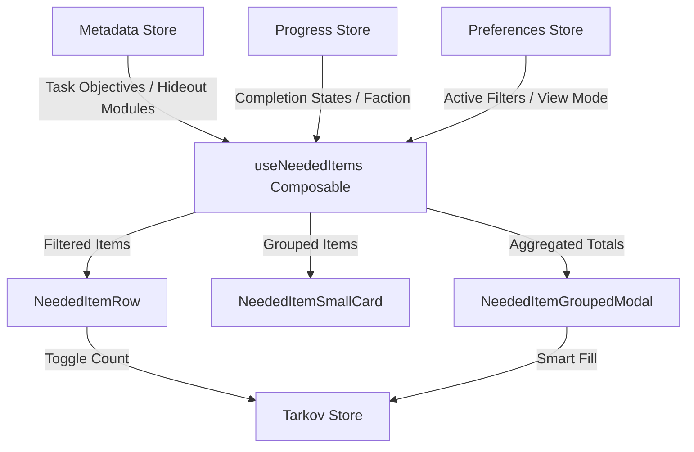
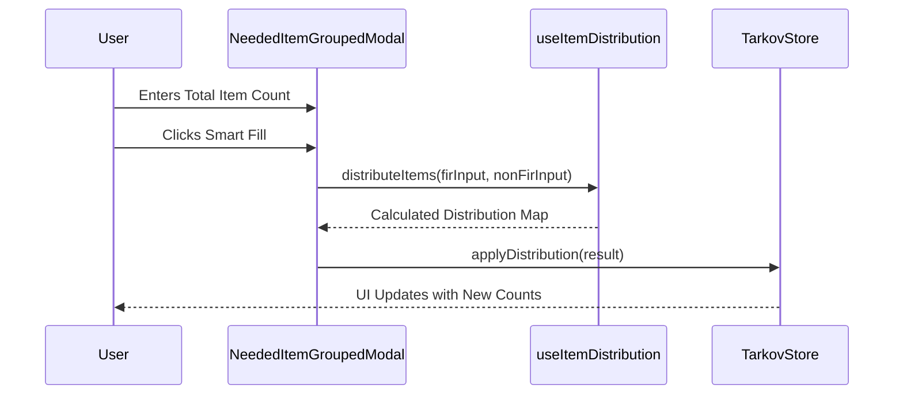
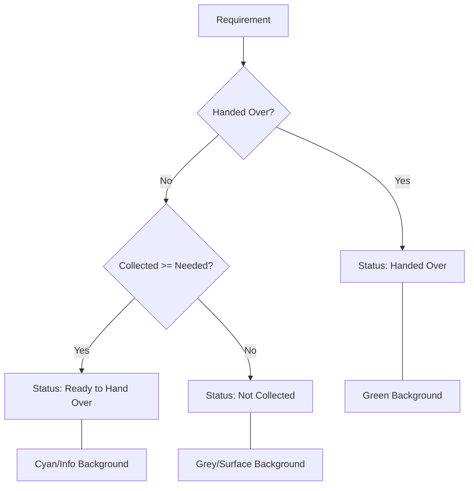

Relevant source files

The following files were used as context for generating this wiki page:

- [app/features/neededitems/NeededItemRow.vue](app/features/neededitems/NeededItemRow.vue)
- [app/features/neededitems/NeededItemGroupedCard.vue](app/features/neededitems/NeededItemGroupedCard.vue)
- [app/composables/useNeededItems.ts](app/composables/useNeededItems.ts)
- [app/composables/__tests__/useNeededItems.test.ts](app/composables/__tests__/useNeededItems.test.ts)
- [app/features/neededitems/NeededItemGroupedModal.vue](app/features/neededitems/NeededItemGroupedModal.vue)
- [app/features/neededitems/NeededItemSmallCard.vue](app/features/neededitems/NeededItemSmallCard.vue)

# Needed Items Tracker

The Needed Items Tracker is a core progression feature in TarkovTracker that aggregates and manages all items required for active [Tasks](#tasks) and [Hideout](#hideout) upgrades. It provides players with a consolidated "shopping list" that automatically updates as they complete objectives or upgrade their stations. The system handles complex logic such as "Found in Raid" (FIR) status requirements, item alternatives, and team-based item coordination.

Sources: [public/llms.txt](public/llms.txt), [app/features/neededitems/NeededItemRow.vue:44-59](app/features/neededitems/NeededItemRow.vue#L44-L59), [app/composables/useNeededItems.ts](app/composables/useNeededItems.ts)

## System Architecture

The tracker is built on a reactive data pipeline that transforms raw task and hideout metadata into actionable item requirements. It uses a composable-based architecture to share state and filtering logic across multiple view components.

### Data Flow Overview

The following diagram illustrates how item requirements are aggregated from various data stores and filtered for the UI:

Sources: [app/composables/useNeededItems.ts](app/composables/useNeededItems.ts), [app/features/neededitems/NeededItemGroupedModal.vue:157-175](app/features/neededitems/NeededItemGroupedModal.vue#L157-L175), [app/composables/__tests__/useNeededItems.test.ts:133-149](app/composables/__tests__/useNeededItems.test.ts#L133-L149)

### Key Components

| Component | Description |
| :--- | :--- |
| `useNeededItems` | The primary business logic layer responsible for filtering, sorting, and grouping items. |
| `NeededItemRow` | A list-view component showing detailed item information, including related task/station links. |
| `NeededItemSmallCard` | A compact card-view component optimized for grid layouts. |
| `NeededItemGroupedModal` | Provides bulk management features like "Smart Fill" and "Reset" for items needed across multiple objectives. |
| `ItemCountControls` | Interface for manual increment/decrement of item collection progress. |

Sources: [app/features/neededitems/NeededItemRow.vue:128-144](app/features/neededitems/NeededItemRow.vue#L128-L144), [app/features/neededitems/NeededItemSmallCard.vue:145-162](app/features/neededitems/NeededItemSmallCard.vue#L145-L162), [app/features/neededitems/NeededItemGroupedModal.vue:179-195](app/features/neededitems/NeededItemGroupedModal.vue#L179-L195)

## Logic and Filtering

The system implements several layers of filtering to ensure users only see items relevant to their current game state.

### Item Aggregation Logic
Items are collected from two main sources:
1.  **Task Objectives**: Objectives marked as "find" or "hand over" in the task metadata.
2.  **Hideout Modules**: Item requirements for building or upgrading hideout stations.

The `useNeededItems` composable excludes items from "Invalid Tasks" (tasks hidden by edition or faction) and tasks that are already complete, unless the user specifically selects the "Completed" tab.

Sources: [app/composables/useNeededItems.ts](app/composables/useNeededItems.ts), [app/composables/__tests__/useNeededItems.test.ts:205-225](app/composables/__tests__/useNeededItems.test.ts#L205-L225)

### Filtering States
The tracker supports multiple high-level filter tabs:
*  **All**: Every currently active item requirement.
*  **Tasks**: Requirements originating specifically from quests.
*  **Hideout**: Requirements for station upgrades.
*  **Completed**: A history of requirements that have already been met.

Additionally, secondary filters allow users to toggle "Found in Raid" (FIR) requirements, hide items already owned, or filter specifically for Kappa-required quests.

Sources: [app/composables/useNeededItems.ts](app/composables/useNeededItems.ts), [app/composables/__tests__/useNeededItems.test.ts:241-285](app/composables/__tests__/useNeededItems.test.ts#L241-L285)

## Grouping and Distribution

One of the most complex features is the **Grouped View**, which aggregates identical items needed for different purposes (e.g., 5 Wires for a task and 10 Wires for the Workbench).

### Smart Fill Distribution
When a user manually enters a total count of items in the Grouped Modal, the `useItemDistribution` utility applies a "Smart Fill" algorithm. This algorithm prioritizes fulfilling requirements in a specific order:
1.  **FIR Requirements**: Items marked as FIR must be satisfied using the user's FIR-collected pool.
2.  **Task Priority**: Tasks are often prioritized over hideout modules to reflect progression importance.

Sources: [app/features/neededitems/NeededItemGroupedModal.vue:185-201](app/features/neededitems/NeededItemGroupedModal.vue#L185-L201), [app/features/neededitems/NeededItemGroupedModal.vue:245-259](app/features/neededitems/NeededItemGroupedModal.vue#L245-L259)

## Visual Indicators and Rarity

The UI uses visual cues to communicate item importance and status immediately to the player.

*  **Borders**: The left border color of item rows and cards denotes either the item's rarity (Grey, Purple, Orange) or the source type (Task vs. Hideout) if rarity is unavailable.
*  **Indicators**: Icons indicate if an item is Craftable, required for the Kappa container, or required for Lightkeeper.
*  **Status Badges**: Requirements are labeled as "Not Collected", "Ready to Hand Over", or "Handed Over".

Sources: [app/features/neededitems/NeededItemRow.vue:173-181](app/features/neededitems/NeededItemRow.vue#L173-L181), [app/features/neededitems/NeededItemSmallCard.vue:203-207](app/features/neededitems/NeededItemSmallCard.vue#L203-L207)

### Item Status Mapping

Sources: [app/features/neededitems/NeededItemRow.vue:185-199](app/features/neededitems/NeededItemRow.vue#L185-L199), [app/features/neededitems/NeededItemRow.vue:201-209](app/features/neededitems/NeededItemRow.vue#L201-L209)

## Conclusion

The Needed Items Tracker serves as the central hub for resource management in TarkovTracker. By abstracting the complex relationships between tasks, hideout upgrades, and item requirements, it allows players to focus on gameplay while the system handles the bookkeeping of "Found in Raid" statuses and multi-source item aggregation.
