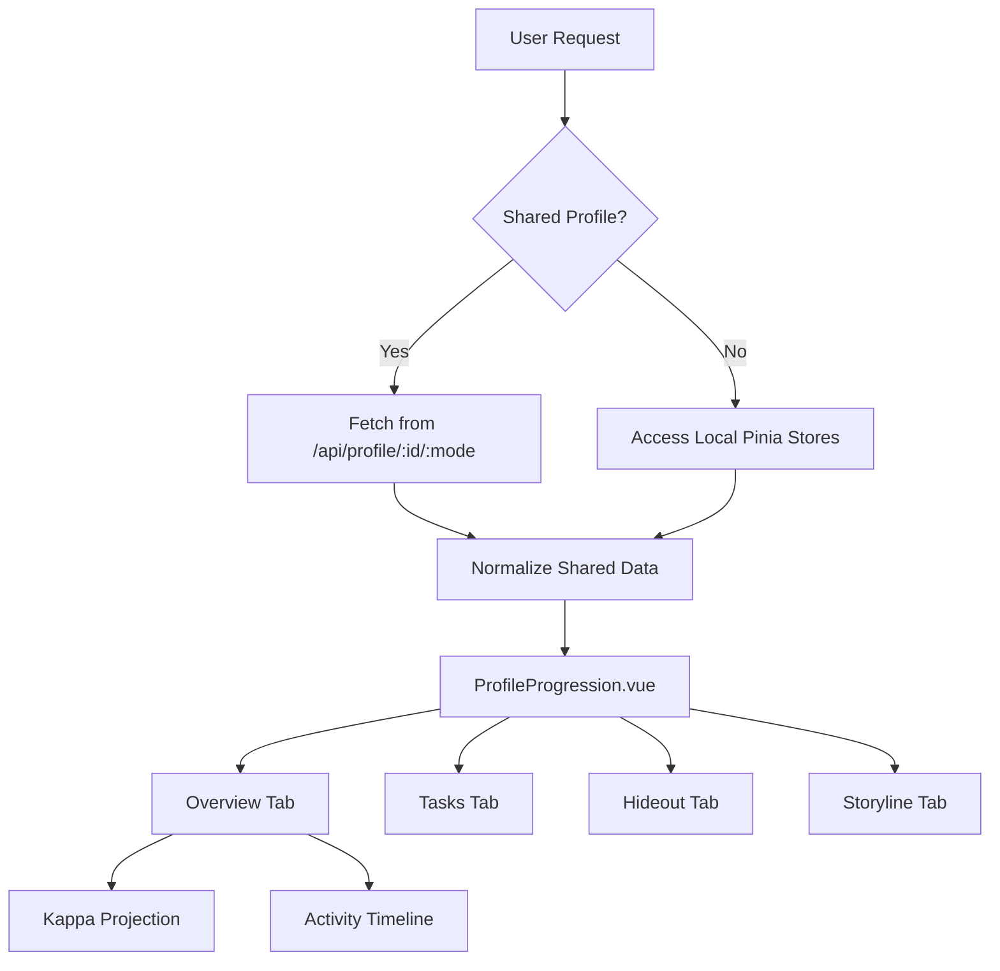
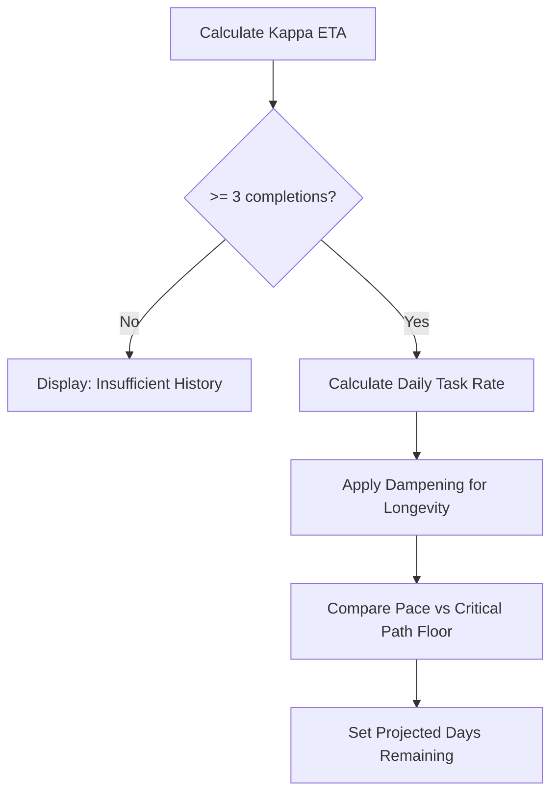

Relevant source files

The following files were used as context for generating this wiki page:

- [app/features/profile/ProfileProgression.vue](app/features/profile/ProfileProgression.vue)
- [app/locales/en.json](app/locales/en.json)
- [README.md](README.md)
- [DESIGN.md](DESIGN.md)
- [app/features/tasks/TaskCardHeader.vue](app/features/tasks/TaskCardHeader.vue)

# Player Profile & Storyline

The Player Profile and Storyline systems in TarkovTracker provide a centralized interface for users to visualize and manage their progression across "Escape from Tarkov" tasks, hideout modules, and narrative chapters. These modules are designed to support both PvP (regular) and PvE game modes separately, offering a data-driven overview of a player's achievements, momentum, and projected goals such as the Kappa Secure Container.

The system serves as a visual narrative of the player's journey, aggregating data from the `useTarkovStore` and `useProgressStore` to display interactive timelines, achievement rows, and milestone projections. Users can share these profiles via public links, allowing others to view their current level, faction status, and quest completion percentages.

## Profile Architecture and Data Flow

The profile system is primarily implemented in `ProfileProgression.vue`, which acts as a heavy feature container for aggregating player statistics. It utilizes a reactive architecture to switch between PvP and PvE data sets dynamically.

### Core Data Structures
The system relies on the `UserProgressData` structure to track state:
- **Task Completions**: Mapping of task IDs to completion/failure statuses.
- **Task Objectives**: Tracking specific counts and completion flags for sub-objectives.
- **Hideout Progress**: Tracking levels of various hideout stations and delivered parts.
- **Storyline Chapters**: Tracking progress through narrative-focused quest chains.

Sources: [app/features/profile/ProfileProgression.vue:185-201](app/features/profile/ProfileProgression.vue#L185-L201), [app/locales/en.json:1153-1250](app/locales/en.json#L1153-L1250)

### Visual Themes and Game Modes
The UI applies distinct themes based on the active `GameMode` (PvP or PvE) to provide clear visual feedback to the user.

| Mode | Icon | Theme Class / Tint |
| :--- | :--- | :--- |
| **PvP** | `i-mdi-sword-cross` | `bg-pvp-900`, `text-pvp-300` |
| **PvE** | `i-mdi-account-group` | `bg-pve-900`, `text-pve-300` |

Sources: [app/features/profile/ProfileProgression.vue:218-232](app/features/profile/ProfileProgression.vue#L218-L232), [DESIGN.md:20-25](DESIGN.md#L20-L25)

### Profile Data Flow Diagram
The following diagram illustrates how user progress data is fetched, normalized, and displayed in the profile interface.

Sources: [app/features/profile/ProfileProgression.vue:274-325](app/features/profile/ProfileProgression.vue#L274-L325)

## Progression Tracking and Milestones

The progression system calculates high-level metrics to show a player's standing in the current "wipe" or season.

### Statistic Aggregation
The profile aggregates four primary categories of progress:
1.  **Player Level**: Calculated automatically from total XP or set manually.
2.  **Tasks**: Ratio of completed tasks to total relevant tasks for the player's faction and edition.
3.  **Objectives**: Granular tracking of individual quest requirements.
4.  **Hideout**: Completion percentage of all available station modules.

Sources: [app/features/profile/ProfileProgression.vue:750-785](app/features/profile/ProfileProgression.vue#L750-L785), [app/locales/en.json:1265-1275](app/locales/en.json#L1265-L1275)

### Kappa Projection Logic
One of the most complex features is the **Kappa Timeline**, which estimates the days remaining until a player completes all tasks required for the Kappa container.

- **Sample Size**: Requires a minimum of 3 timestamped task completions.
- **Pace Calculation**: Uses `dampenPace` and `countDaysInclusive` to determine tasks completed per day.
- **Critical Path**: Accounts for sequential prerequisite chains and level gates that may override raw pace data.
- **Confidence Levels**: High, Medium, or Low based on the sample size and duration of tracking.

Sources: [app/features/profile/ProfileProgression.vue:595-673](app/features/profile/ProfileProgression.vue#L595-L673)

## Storyline System

The Storyline feature provides a narrative-focused view of progression, grouping tasks into thematic chapters rather than simple lists.

### Chapter and Objective Logic
The system uses the `ProfileStorylineTab` to render narrative progress. It supports:
- **Linear Objectives**: Toggling a chapter can automatically toggle linear objectives within it.
- **Mutually Exclusive Routes**: Some objectives in chapters are mutually exclusive; completing one may block another.
- **Chapter Requirements**: Visualizing what is required to discover or start a chapter (e.g., specific tasks or levels).

Sources: [app/features/profile/ProfileProgression.vue:495-545](app/features/profile/ProfileProgression.vue#L495-L545), [app/locales/en.json:493-518](app/locales/en.json#L493-L518)

### Storyline Data Model

| Field | Description |
| :--- | :--- |
| **Chapters** | Groupings of objectives representing major story beats. |
| **Main Objectives** | Requirements necessary to complete a chapter. |
| **Optional Objectives** | Side tasks that provide extra context or rewards. |
| **Discovery** | Chapters can be "Discovered" before they are "Auto-started". |

Sources: [app/features/profile/ProfileProgression.vue:815-840](app/features/profile/ProfileProgression.vue#L815-L840), [app/locales/en.json:1205-1215](app/locales/en.json#L1205-L1215)

## Profile Sharing and Privacy

TarkovTracker allows users to share their progression via public URLs.

- **Visibility States**: Profiles can be set to "Public" or "Private" per game mode (PvP vs PvE).
- **Public URL Format**: Typically includes a unique user ID and the specific game mode: `/profile/[userId]/[mode]`.
- **Snapshot Copying**: Users can copy a text-based summary of their profile (Level, Tasks, Hideout, Kappa ETA) to the clipboard for sharing in communities or social media.

Sources: [app/features/profile/ProfileProgression.vue:722-748](app/features/profile/ProfileProgression.vue#L722-L748), [app/locales/en.json:1172-1185](app/locales/en.json#L1172-L1185), [README.md:28-35](README.md#L28-L35)

## Navigation and UI Interaction

The Player Profile is integrated into the application shell via the `NavigationDrawer`.

- **Mode Switching**: Users can toggle between PvP and PvE modes, which updates the profile view and all underlying progression metrics.
- **Manual Level Adjustment**: While automatic calculation is preferred, the profile header allows for manual level increment/decrement if needed.
- **External Integration**: If a `TarkovUid` is available, the profile provides a direct link to the user's data on `tarkov.dev`.

Sources: [app/features/profile/ProfileProgression.vue:64-100](app/features/profile/ProfileProgression.vue#L64-L100), [app/features/tasks/TaskCardHeader.vue:44-55](app/features/tasks/TaskCardHeader.vue#L44-L55), [app/locales/en.json:1410-1425](app/locales/en.json#L1410-L1425)
