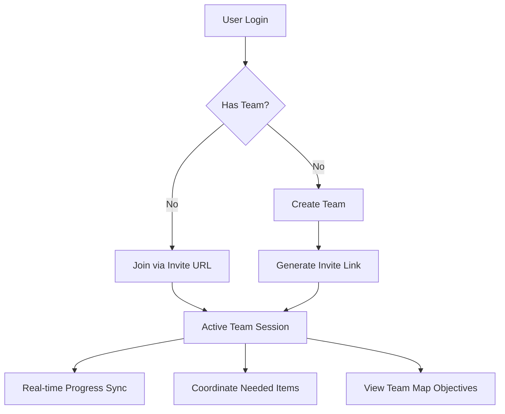
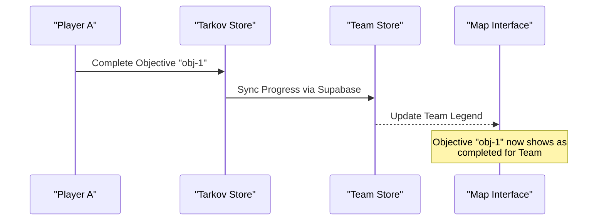

Relevant source files

The following files were used as context for generating this wiki page:

- [app/features/team/MyTeam.vue](app/features/team/MyTeam.vue)
- [app/features/team/TeamMemberCard.vue](app/features/team/TeamMemberCard.vue)
- [app/features/neededitems/TeamNeedsDisplay.vue](app/features/neededitems/TeamNeedsDisplay.vue)
- [app/features/maps/LeafletObjectiveTooltip.vue](app/features/maps/LeafletObjectiveTooltip.vue)
- [AGENTS.md](AGENTS.md)
- [README.md](README.md)

# Team Collaboration

Team Collaboration in TarkovTracker is a suite of real-time features that allow players to synchronize their progress, share task statuses, and coordinate item collection with group members. This system is designed to streamline the group experience in Escape from Tarkov by reducing the need for manual progress reporting between teammates.

The system relies on a registered user account and uses Supabase for authentication, database storage, and real-time synchronization. While basic tracking works locally in the browser, team features require a cloud connection to broadcast updates to other group members instantly.
Sources: [README.md](README.md), [AGENTS.md](AGENTS.md)

## Team Management and Lifecycle

Team management is handled primarily through the `MyTeam.vue` component. Users can create a new team, which assigns them as the "Owner," or join an existing one via a shareable invite URL.

### Membership Actions
The system supports several state-changing operations for teams:
- **Creation**: Authenticated users can generate a new team instance.
- **Invitation**: Owners can generate and display a unique `Team Invite URL`.
- **Leaving/Disbanding**: Members can leave a team, and owners have the option to disband the entire group or kick specific members.
- **Role Assignment**: The system distinguishes between the "Owner" and standard members, with owners having administrative privileges over the team roster.

Sources: [app/features/team/MyTeam.vue](app/features/team/MyTeam.vue), [app/features/team/TeamMemberCard.vue](app/features/team/TeamMemberCard.vue)

### Team Interaction Flow
The following diagram illustrates the lifecycle of a team session:

The diagram shows the transition from authentication to active collaboration features. 
Sources: [app/features/team/MyTeam.vue](app/features/team/MyTeam.vue), [README.md](README.md)

## Real-time Progress Sharing

Progress sharing allows teammates to see each other's task completion statistics. This is visualized through the `TeamMemberCard.vue` component, which displays the number of tasks completed versus the total tasks available for each member.

### Technical Implementation
- **Supabase Realtime**: The backend uses Supabase Realtime to broadcast progress changes (e.g., marking a task as complete) to all connected team members.
- **Member Visualization**: Each member's card shows their avatar, display name, and a progress bar or text string indicating their task completion status.
- **Self Identification**: The UI explicitly identifies the local user within the team list (e.g., using strings like "this is you").

Sources: [app/features/team/TeamMemberCard.vue](app/features/team/TeamMemberCard.vue), [AGENTS.md](AGENTS.md)

## Coordination Tools

TarkovTracker provides specific views to coordinate resource gathering and tactical objectives.

### Needed Items Coordination
The `TeamNeedsDisplay.vue` component aggregates item requirements from all team members. This allows players to know if an item they find in-raid is needed by a teammate for a quest or hideout upgrade.

| Feature | Description |
| :--- | :--- |
| **Teammate Item Needs** | Lists items required by others, filtered by game mode (PvP/PvE). |
| **Requirement Source** | Indicates if the item is for a task or a hideout module. |
| **Progress Tracking** | Shows how many of a specific item a teammate has already collected. |

Sources: [app/features/neededitems/TeamNeedsDisplay.vue](app/features/neededitems/TeamNeedsDisplay.vue)

### Tactical Map Objectives
In the interactive map feature, team collaboration is integrated directly into the `LeafletObjectiveTooltip.vue`. When a user views an objective on the map, the system can distinguish between personal objectives and those belonging to the team.

The diagram shows how an individual action updates the shared team state on the map.
Sources: [app/features/maps/LeafletObjectiveTooltip.vue](app/features/maps/LeafletObjectiveTooltip.vue), [app/features/team/MyTeam.vue](app/features/team/MyTeam.vue)

## Summary

The Team Collaboration system transforms TarkovTracker from a solo progress log into a collective tactical tool. By leveraging real-time data synchronization via Supabase, teams can manage their roster, monitor group-wide quest progress, and efficiently allocate looted items based on shared needs. These features are accessible through the `/team` and `/needed-items` areas of the application, provided the user is authenticated and part of a group. 
Sources: [README.md](README.md), [app/features/team/MyTeam.vue](app/features/team/MyTeam.vue)
