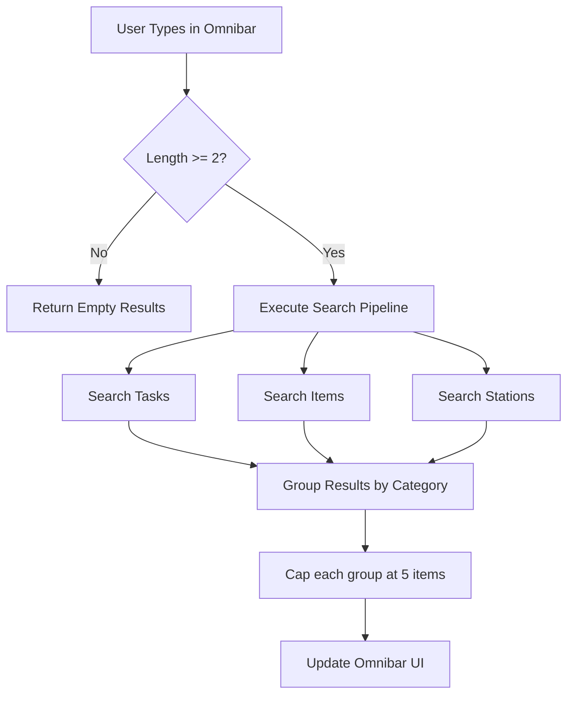
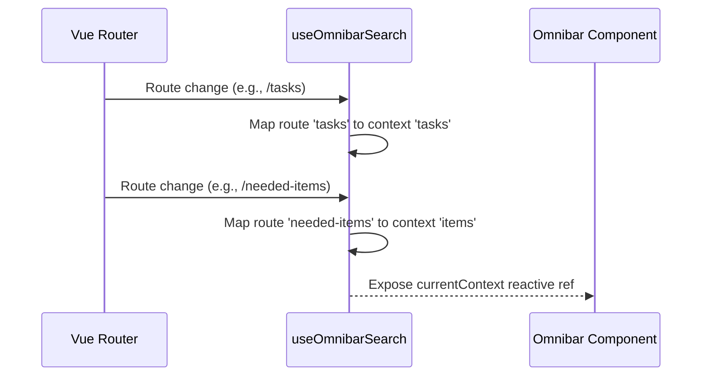

<details>
<summary>Relevant source files</summary>

The following files were used as context for generating this wiki page:

- [app/features/omnibar/useOmnibarSearch.ts](app/features/omnibar/useOmnibarSearch.ts)
- [app/features/omnibar/__tests__/useOmnibarSearch.test.ts](app/features/omnibar/__tests__/useOmnibarSearch.test.ts)
- [app/locales/en.json](app/locales/en.json)
- [README.md](README.md)
- [DESIGN.md](DESIGN.md)
- [app/features/tasks/TaskCardHeader.vue](app/features/tasks/TaskCardHeader.vue)
</details>

# Omnibar Global Search

The Omnibar is a central navigation and discovery tool within the TarkovTracker application. It provides a unified search interface that allows users to quickly locate tasks (quests), items needed for progression, and hideout stations from any page in the single-page application (SPA). By aggregating data from multiple domain slices, the Omnibar reduces navigation friction and serves as a high-speed alternative to manual menu browsing.

Architecturally, the search logic is decoupled from the UI via a specialized composable, `useOmnibarSearch.ts`. This composable interfaces with the application's metadata stores to perform real-time filtering against game data. The feature supports context-aware searching, where the search priority or focus can shift based on the user's current route, such as the Tasks page or the Hideout view.

## Core Architecture and Data Flow

The Omnibar utilizes a reactive search pipeline that monitors user input and triggers filtering across three primary data categories: tasks, items, and hideout modules.

### Search Execution Logic
The search operation is gated by a minimum character requirement to prevent unnecessary processing on short or ambiguous strings. The system requires at least two characters before results are computed. Once the threshold is met, the logic filters through the cached game data stored in the `MetadataStore`.



Sources: [app/features/omnibar/useOmnibarSearch.ts:1-20](app/features/omnibar/useOmnibarSearch.ts#L1-L20), [app/features/omnibar/__tests__/useOmnibarSearch.test.ts:77-82](app/features/omnibar/__tests__/useOmnibarSearch.test.ts#L77-L82)

### Search Categories and Matching Criteria
The search logic employs specific matching strategies for different types of game data. This ensures that users can find entities not only by their primary name but also by associated attributes like traders or map locations.

| Category | Matching Attributes | Data Source |
| :--- | :--- | :--- |
| **Tasks** | Task Name, Map Name, Trader Name, Reward Item Names, Offer Unlock Names | `metadataStore.tasks` |
| **Items** | Item Name, Short Name (e.g., "BTC", "GPU") | `metadataStore.items` |
| **Hideout** | Station Name | `metadataStore.hideoutStations` |

Sources: [app/features/omnibar/useOmnibarSearch.ts:25-60](app/features/omnibar/useOmnibarSearch.ts#L25-L60), [app/features/omnibar/__tests__/useOmnibarSearch.test.ts:30-70](app/features/omnibar/__tests__/useOmnibarSearch.test.ts#L30-L70)

## Implementation Details

### Result Processing and Capping
To maintain a compact and performant UI (as specified in the tactical and fast-to-scan design principles), the search results are automatically truncated. Each result category—Tasks, Items, and Hideout—is capped at a maximum of five entries. This prevents the Omnibar from becoming an unmanageable list and ensures the most relevant matches remain visible.

```typescript
// Example of result capping logic in useOmnibarSearch.ts
results.value = {
  tasks: filteredTasks.slice(0, 5),
  items: filteredItems.slice(0, 5),
  hideout: filteredHideout.slice(0, 5)
};
```

Sources: [app/features/omnibar/useOmnibarSearch.ts:65](app/features/omnibar/useOmnibarSearch.ts#L65), [app/features/omnibar/__tests__/useOmnibarSearch.test.ts:108-115](app/features/omnibar/__tests__/useOmnibarSearch.test.ts#L108-L115), [DESIGN.md](DESIGN.md)

### Context Awareness
The Omnibar derives a "context" from the active application route. This context allows the UI to potentially adapt its placeholder or display logic based on where the user is in the application.



Sources: [app/features/omnibar/useOmnibarSearch.ts:70-85](app/features/omnibar/useOmnibarSearch.ts#L70-L85), [app/features/omnibar/__tests__/useOmnibarSearch.test.ts:117-125](app/features/omnibar/__tests__/useOmnibarSearch.test.ts#L117-L125)

## User Interface and Experience

### Localization and Labels
The Omnibar uses localized strings defined in the project's i18n files. Key UI elements such as the placeholder text and group headings are dynamically retrieved based on the user's selected language.

| Key | English Value |
| :--- | :--- |
| `omnibar.placeholder` | "Search tasks, needed items, hideout..." |
| `omnibar.hint_min_chars` | "Type at least 2 characters to search..." |
| `omnibar.group_tasks` | "Tasks / Quests" |
| `omnibar.group_items` | "Needed Items" |
| `omnibar.group_hideout` | "Hideout Stations" |

Sources: [app/locales/en.json:88-100](app/locales/en.json#L88-L100)

### Interaction and Shortcuts
The Omnibar is typically triggered via a global keyboard shortcut, allowing for "keyboard-first" navigation. Users can type a query, navigate the results using directional keys, and select an item to navigate to the specific task or item detail view. For tasks, selecting a result often redirects to the main tasks page with a specific query parameter (e.g., `?task=ID`) to focus the relevant card.

Sources: [app/features/tasks/TaskCardHeader.vue:104-106](app/features/tasks/TaskCardHeader.vue#L104-L106), [app/locales/en.json:90](app/locales/en.json#L90)

## Summary
The Omnibar Global Search is a high-performance discovery system that integrates tasks, items, and hideout modules into a single interface. By leveraging reactive Vue 3 patterns and a capped result strategy, it provides immediate feedback to user queries while adhering to the project's dense and tactical design aesthetic. Its context-awareness and comprehensive matching criteria make it a primary navigation hub for users tracking complex Tarkov progression.
