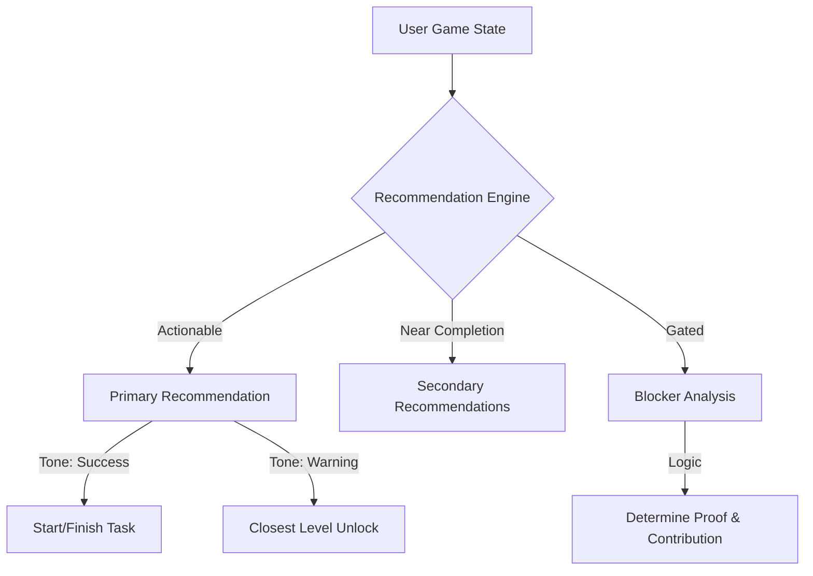
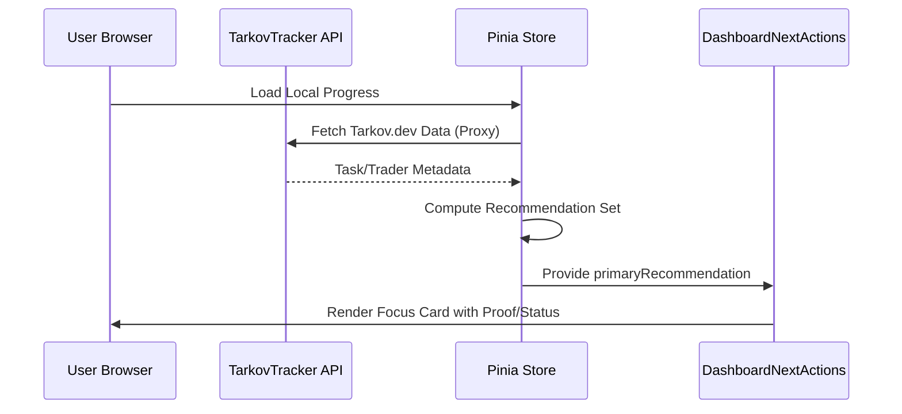

Relevant source files

The following files were used as context for generating this wiki page:

- [app/features/dashboard/DashboardNextActions.vue](app/features/dashboard/DashboardNextActions.vue)
- [app/locales/en.json](app/locales/en.json)
- [DESIGN.md](DESIGN.md)
- [README.md](README.md)
- [public/llms.txt](public/llms.txt)
- [app/features/tasks/TaskCardHeader.vue](app/features/tasks/TaskCardHeader.vue)
- [app/server/routes/overlay/kappa/[userId]/[mode].get.ts](app/server/routes/overlay/kappa/%5BuserId%5D/%5Bmode%5D.get.ts)

# Dashboard & Recommendations

The Dashboard & Recommendations system in TarkovTracker provides players with a tactical overview of their progression in Escape from Tarkov. It serves as the primary landing page, consolidating task progress, hideout upgrades, and item requirements into actionable insights. The core focus of this system is the "Next Actions" engine, which dynamically calculates and recommends the most efficient progression steps based on the user's current game state and active filters.

Sources: [README.md:10-15](README.md#L10-L15), [public/llms.txt:19-21](public/llms.txt#L19-L21), [app/features/dashboard/DashboardNextActions.vue:350-360](app/features/dashboard/DashboardNextActions.vue#L350-L360)

## Recommendation Engine Architecture

The recommendation engine is primarily implemented via the `useDashboardRecommendations` composable, which evaluates tasks and progression data to surface "What should I do next?". It categorizes tasks based on their immediate impact and provides reasons for specific recommendations.

### Recommendation Kinds and Logic
Recommendations are ranked and filtered based on the following criteria:
- **Impact**: Tasks that open the largest number of follow-up tasks.
- **Unlock**: Steps required to unlock a specific Trader or milestone (e.g., Kappa or Lightkeeper).
- **Close**: Tasks that are near completion (e.g., only one objective remaining).
- **Blocked**: Identified as the "closest unlock" when no tasks are currently actionable due to level or prerequisite gates.
- **Filters**: Prompting the user to review filters if viable tasks are hidden.

Sources: [app/features/dashboard/DashboardNextActions.vue:463-540](app/features/dashboard/DashboardNextActions.vue#L463-L540), [app/locales/en.json:450-480](app/locales/en.json#L450-L480)

### Blocker Analysis
The system tracks why a task is not yet actionable using a Blocker model:
- `level`: Minimum player level not met.
- `prerequisite`: Specific previous tasks remain incomplete.
- `fence`: Reputation requirements with Fence (Scav Karma) are not satisfied.
- `trader-unlock`: A trader is currently locked behind a specific quest chain.

Sources: [app/features/dashboard/DashboardNextActions.vue:566-610](app/features/dashboard/DashboardNextActions.vue#L566-L610), [app/locales/en.json:522-540](app/locales/en.json#L522-L540)

The diagram shows the logic flow from raw user state to the final UI presentation in the dashboard focus card.
Sources: [app/features/dashboard/DashboardNextActions.vue:463-630](app/features/dashboard/DashboardNextActions.vue#L463-L630)

## UI Components and Tones

The dashboard uses a sophisticated "Tone" system to visually communicate the priority and nature of recommendations. Each tone maps to specific CSS classes and semantic colors defined in the project's design contract.

### Tone Mapping Table
| Tone | Usage Scenario | Visual Characteristics |
| :--- | :--- | :--- |
| `primary` | Standard progression tasks | Golden-tan theme (`primary` palette) |
| `kappa` | Tasks required for the Kappa Secure Container | Red theme (`error` palette) |
| `lightkeeper` | Tasks for the Lightkeeper trader | Orange/Yellow theme (`warning` palette) |
| `success` | Ready to finish or turn-in tasks | Green theme (`success` palette) |
| `info` | Informational or filter-related steps | Cyan/Teal theme (`accent` palette) |
| `warning` | Level-blocked or high-priority gates | Orange theme (`warning` palette) |

Sources: [app/features/dashboard/DashboardNextActions.vue:363-440](app/features/dashboard/DashboardNextActions.vue#L363-L440), [DESIGN.md:14-30](DESIGN.md#L14-L30)

### Component: DashboardNextActions
This component renders the "Focus Card," which includes:
- **Eyebrow Label**: Categorizes the recommendation (e.g., "Best special-chain progress").
- **Primary Heading**: Dynamic action text (e.g., "Finish {task}").
- **Proof Card**: Explains "Why it won" based on data metrics like impact count or objective proximity.
- **Secondary Recommendations**: A list of alternate actionable tasks or closest unlocks.

Sources: [app/features/dashboard/DashboardNextActions.vue:20-150](app/features/dashboard/DashboardNextActions.vue#L20-L150), [app/locales/en.json:463-518](app/locales/en.json#L463-L518)

## Data Flow for Metrics

Dashboard metrics are derived from proxied game data and local state. The application differentiates between PvP and PvE progression, maintaining separate counts for each mode.

### Progression Breakdown
The dashboard provides a statistical breakdown across several domains:
1.  **Tasks**: Total and completed task counts.
2.  **Objectives**: Granular progress across individual task steps.
3.  **Items**: Tracked items needed for both Tasks and Hideout upgrades.
4.  **Milestones**: Long-term checkpoints like "Getting Started," "Halfway There," and "Almost Done."

Sources: [app/locales/en.json:542-570](app/locales/en.json#L542-L570), [README.md:17-25](README.md#L17-L25)

This sequence illustrates how recommendations are computed after reconciling local progress with external game metadata.
Sources: [AGENTS.md:58-75](AGENTS.md#L58-L75), [public/llms.txt:10-15](public/llms.txt#L10-L15), [app/features/dashboard/DashboardNextActions.vue:350-360](app/features/dashboard/DashboardNextActions.vue#L350-L360)

## External Tools and Overlays

The recommendation system extends beyond the main dashboard into Streamer Tools and Overlays. A specific Kappa Progress overlay route (`/overlay/kappa/[userId]/[mode]`) provides a real-time, widget-sized view of dashboard metrics.

### Overlay Metrics Logic
The overlay handler supports different metric views:
- `tasks`: Completed vs. remaining Kappa-required tasks.
- `items`: Collected vs. total Kappa items.
- `summary`: A combined grid showing both task and item progress.

Sources: [app/server/routes/overlay/kappa/[userId]/[mode].get.ts:40-70](), [app/locales/en.json:1150-1175](app/locales/en.json#L1150-L1175)

## Design Implementation

Following the tactical, high-density design philosophy, the dashboard utilizes a "surface ladder" for depth and visual hierarchy.

- **Canvas (`surface-950`)**: The base background.
- **Panel (`surface-850`)**: The background for the recommendations focus card.
- **Proof Cards**: Use specific tone-based borders (e.g., `border-primary-400/30`) and halos (`bg-primary-500/18`) to draw attention to the most important next step.

Sources: [DESIGN.md:95-115](DESIGN.md#L95-L115), [app/features/dashboard/DashboardNextActions.vue:363-440](app/features/dashboard/DashboardNextActions.vue#L363-L440)

### Conclusion
The Dashboard & Recommendations system is the central intelligence hub of TarkovTracker. By combining task impact analysis, objective proximity, and blocker detection, it guides users through the complex progression of Escape from Tarkov while maintaining a clean, tactical interface that adapts to both PvP and PvE playstyles.
