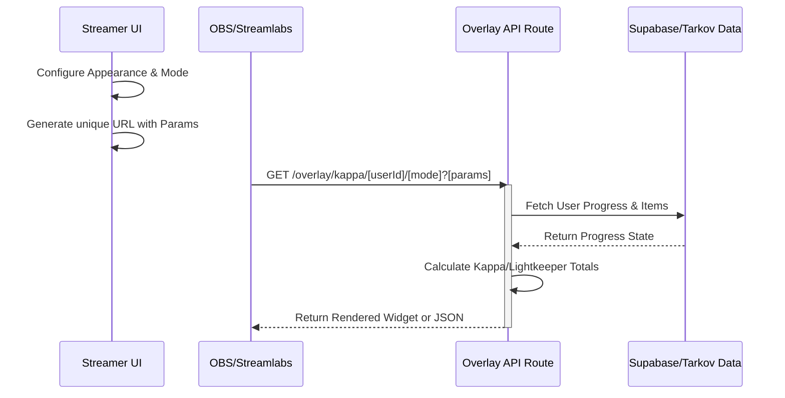
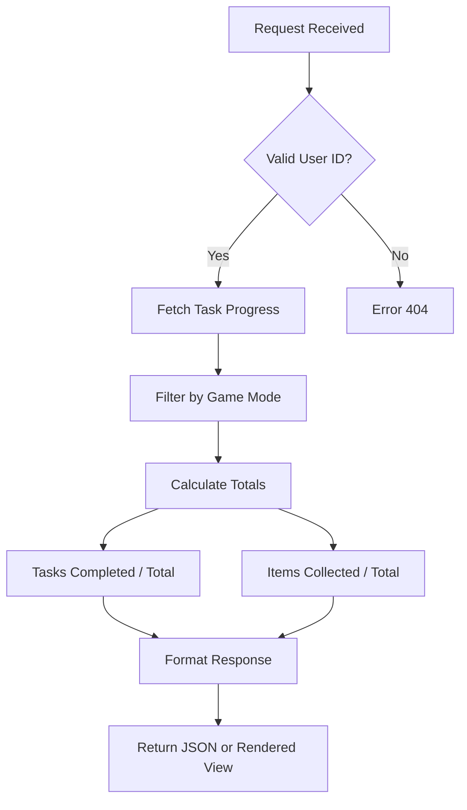

<details>
<summary>Relevant source files</summary>

The following files were used as context for generating this wiki page:

- [app/features/streamer-tools/StreamerToolsPanel.vue](app/features/streamer-tools/StreamerToolsPanel.vue)
- [app/features/kappa/TrackerSummary.vue](app/features/kappa/TrackerSummary.vue)
- [app/server/routes/overlay/kappa/\[userId\]/\[mode\].get.ts](app/server/routes/overlay/kappa/%5BuserId%5D/%5Bmode%5D.get.ts)
- [docs/SYSTEMS.md](docs/SYSTEMS.md)
- [app/locales/en.json](app/locales/en.json)
</details>

# Streamer Tools & Overlays

Streamer Tools & Overlays provide a specialized set of features designed to integrate a player's progress tracking directly into live broadcast software such as OBS Studio, Streamlabs, and XSplit. The system generates unique, browser-source URLs that render real-time progression widgets for specific game modes (PvP or PvE) and progression metrics, primarily focusing on "Kappa" container and "Lightkeeper" requirements.

The system is split between a user-facing configuration panel for visual customization and a server-side route that serves the raw progression data or rendered overlay. These tools enable viewers to see the streamer's current status regarding tasks and items without requiring the streamer to manually update their broadcast scene.
Sources: [app/features/streamer-tools/StreamerToolsPanel.vue](app/features/streamer-tools/StreamerToolsPanel.vue), [app/locales/en.json:1159-1163](app/locales/en.json#L1159-L1163)

## System Architecture and Data Flow

The overlay system functions as a decoupled data provider. A streamer configures their preferences in the UI, which generates a specific URL. This URL is then requested by a streaming client (like OBS), triggering a server-side process to aggregate user progress.



The diagram above illustrates the request flow from configuration to the broadcast client.
Sources: [app/server/routes/overlay/kappa/\[userId\]/\[mode\].get.ts:1-20](), [app/features/streamer-tools/StreamerToolsPanel.vue:350-400](app/features/streamer-tools/StreamerToolsPanel.vue#L350-L400)

## Configuration and Customization

Streamers can customize the technical and visual properties of their overlays via the `StreamerToolsPanel`. This panel manages a state of `StreamerSettings` that are appended as query parameters to the browser-source URL.

### Technical Settings
| Setting | Options | Description |
| :--- | :--- | :--- |
| **Game Mode** | PvP, PvE | Determines which progression database to pull from. |
| **Metric/Widget** | Tasks, Items, Summary | Selects the specific progression data to display. |
| **Resolution** | 1080p, 1440p, Custom | Sets the base canvas size for native rendering. |
| **Container** | Scene Canvas, Self Contained | "Canvas" fills the stream resolution; "Self" fits the widget size. |
| **Refresh Interval** | 60s, 120s, 300s, 600s | Frequency of data polling from the server. |

Sources: [app/features/streamer-tools/StreamerToolsPanel.vue:20-60](app/features/streamer-tools/StreamerToolsPanel.vue#L20-L60), [app/locales/en.json:1225-1245](app/locales/en.json#L1225-L1245)

### Visual Styles
The system supports several layout variations to fit different stream aesthetics:
- **Full Card**: A complete widget with background and borders.
- **Minimal Pill**: A condensed, rounded indicator.
- **Text Only**: Raw text for custom integration.
- **Alignment**: Nine-point alignment (e.g., Top Left, Center, Bottom Right) for "Scene Canvas" mode.

Sources: [app/features/streamer-tools/StreamerToolsPanel.vue:65-90](app/features/streamer-tools/StreamerToolsPanel.vue#L65-L90), [app/locales/en.json:1246-1250](app/locales/en.json#L1246-L1250)

## Server-Side Data Aggregation

The server route located at `/overlay/kappa/[userId]/[mode]` acts as the backend for these tools. It is responsible for identifying the user and mode from the URL path and fetching the relevant progression data.

### Progress Calculation Logic
The server calculates progress by comparing the user's completed objectives against the master list of requirements for specific milestones.
- **Kappa Tasks**: Filters all game tasks for those flagged as mandatory for the Kappa container.
- **Kappa Items**: Aggregates items required specifically for the quest "The Collector".
- **Lightkeeper**: Tracks progress through the high-level Lightkeeper quest chain.



The logic flow for processing an overlay data request.
Sources: [app/server/routes/overlay/kappa/\[userId\]/\[mode\].get.ts:15-50](), [app/features/kappa/TrackerSummary.vue:15-30](app/features/kappa/TrackerSummary.vue#L15-L30)

## Implementation Details

### Overlay State Management
The `StreamerToolsPanel` uses a reactive `streamerSettings` object to build the dynamic URL. If the user's game mode is set to private, the system displays a warning, as the overlay route requires public visibility to function in external software.

```typescript
// Example parameter construction
const overlayUrl = computed(() => {
  const baseUrl = `${window.location.origin}/overlay/kappa/${userId.value}/${settings.mode}`;
  const params = new URLSearchParams({
    layout: settings.layout,
    theme: settings.accent,
    size: settings.textSize,
    // ...other visual params
  });
  return `${baseUrl}?${params.toString()}`;
});
```

Sources: [app/features/streamer-tools/StreamerToolsPanel.vue:364-394](app/features/streamer-tools/StreamerToolsPanel.vue#L364-L394), [app/locales/en.json:1161-1162](app/locales/en.json#L1161-L1162)

### Component Architecture
The `TrackerSummary` component is often utilized as the visual basis for the "Combined Summary" widget. It displays a high-level view of:
1. **Kappa Progression**: A percentage-based or fractional (Completed/Total) view of required tasks.
2. **Lightkeeper Status**: A similar metric for the Lightkeeper chain.
3. **Item Checkpoints**: Counts for collected items vs. those still needed.

Sources: [app/features/kappa/TrackerSummary.vue:1-12](app/features/kappa/TrackerSummary.vue#L1-L12), [app/locales/en.json:1238-1243](app/locales/en.json#L1238-L1243)

## Platform Integration

The system is optimized for different broadcast software requirements:
- **OBS / Streamlabs**: Supports transparent backgrounds natively and allows "Scene Canvas" mode where width/height are set to the stream resolution (e.g., 1920x1080).
- **XSplit / vMix**: Specialized configuration hints are provided to ensure transparency and proper aspect ratio handling.
- **Scaling Warning**: The documentation explicitly warns against dragging handles in OBS to resize, as it causes blur. Instead, it directs users to use the "Text Size" or "Custom Scale" parameters to trigger a native re-render at the higher resolution.

Sources: [app/features/streamer-tools/StreamerToolsPanel.vue:450-500](app/features/streamer-tools/StreamerToolsPanel.vue#L450-L500), [app/locales/en.json:1200-1224](app/locales/en.json#L1200-L1224)

Streamer Tools & Overlays serve as a vital link between the TarkovTracker progression database and the content creation ecosystem, providing a low-friction method for streamers to share their "Escape from Tarkov" journey with their audience in real-time.
