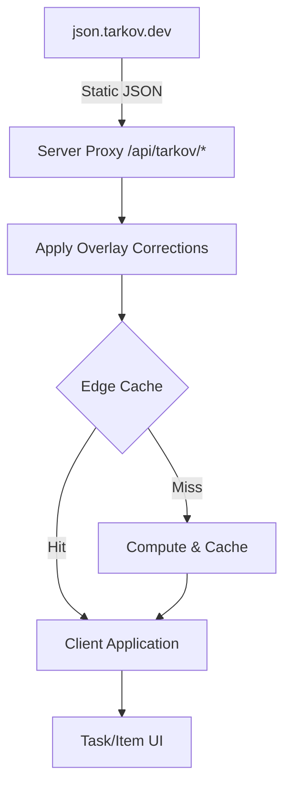
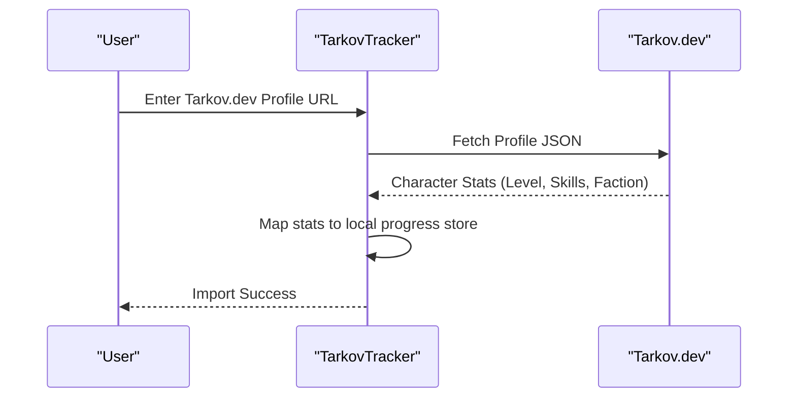

Relevant source files

The following files were used as context for generating this wiki page:

- [README.md](README.md)
- [public/llms.txt](public/llms.txt)
- [AGENTS.md](AGENTS.md)
- [app/locales/en.json](app/locales/en.json)
- [app/features/tasks/TaskCardHeader.vue](app/features/tasks/TaskCardHeader.vue)

# Tarkov.dev Integration

TarkovTracker utilizes [Tarkov.dev](https://tarkov.dev) as its primary authoritative source for Escape from Tarkov game data, including items, tasks, traders, and hideout requirements. The integration is designed to provide up-to-date game information while maintaining high performance through a multi-layer caching and proxy system.

Sources: [README.md](README.md), [public/llms.txt](public/llms.txt)

## Data Acquisition Architecture

The project implements a server-side proxy layer for all game data requests. Instead of clients connecting directly to external APIs, requests are routed through `/api/tarkov/*` endpoints.

### JSON API vs. GraphQL
TarkovTracker specifically uses the static JSON endpoints provided by `json.tarkov.dev` rather than the `api.tarkov.dev` GraphQL API. This architectural choice is enforced to ensure compatibility with the project's data fetching pipeline and to facilitate edge caching.

Sources: [public/llms.txt](public/llms.txt), [AGENTS.md](AGENTS.md)

### Data Fetching Pipeline
The integration follows a structured pipeline to ensure data integrity and performance:
1.  **Upstream Fetch**: Data is retrieved from static JSON files at `json.tarkov.dev`.
2.  **Overlay Corrections**: TarkovTracker applies a custom "overlay" layer to correct or supplement data from the upstream source before it reaches the user.
3.  **Edge Caching**: Processed data is cached at the network edge (Cloudflare) to reduce latency and origin load.
4.  **Client Delivery**: The final, corrected JSON payload is served to the Nuxt single-page application.

Sources: [README.md](README.md), [AGENTS.md](AGENTS.md)

### Pipeline Flow Diagram
The following diagram illustrates the flow of game data from the source to the end-user interface.

The diagram shows how TarkovTracker acts as an intermediary, applying fixes and caching to the raw Tarkov.dev data.

## Profile Import System

TarkovTracker allows users to import their character progression directly from Tarkov.dev profiles. This system automates the setup of player levels, skills, and faction progress.

### Imported Data Points
The integration extracts several key character attributes from the Tarkov.dev JSON profile:
*  **Character Metadata**: Nickname, Faction (USEC/BEAR), and current Level.
*  **Progression**: Prestige level and specific Skill values.
*  **Status**: Detected game edition (e.g., Edge of Darkness, Unheard).

Sources: [app/locales/en.json:1150-1180](app/locales/en.json#L1150-L1180)

### Import Process
Users initiate an import by providing their Tarkov.dev player URL (e.g., `https://tarkov.dev/players/regular/ID`). TarkovTracker then fetches the profile metadata and applies it to the user's active session.

This sequence details the synchronization between the two platforms for character data.

Sources: [app/locales/en.json:1150-1180](app/locales/en.json#L1150-L1180)

## User Interface Integration

Tarkov.dev is deeply integrated into the functional components of the application, particularly within task and item management.

### Task Connectivity
Each task card in TarkovTracker contains a direct link to the corresponding documentation on Tarkov.dev. This is implemented in the `TaskCardHeader.vue` component using a specific URL pattern: `https://tarkov.dev/task/${task.id}`.

Sources: [app/features/tasks/TaskCardHeader.vue:83](app/features/tasks/TaskCardHeader.vue#L83)

### Feature Summary
| Feature | Implementation | Description |
| :--- | :--- | :--- |
| **Game Data Proxy** | `/api/tarkov/*` | Proxies items, tasks, and hideout data with edge caching. |
| **Task Links** | `TaskCardHeader` | Direct navigation to Tarkov.dev task pages for detailed guides. |
| **Character Sync** | Profile Import | Imports Level, Skills, and Faction via Tarkov.dev Player IDs. |
| **Data Correction** | Overlay System | Fixes upstream data inconsistencies before client delivery. |

Sources: [README.md](README.md), [public/llms.txt](public/llms.txt), [app/features/tasks/TaskCardHeader.vue](app/features/tasks/TaskCardHeader.vue)

## Integration Constraints

To maintain system stability and data consistency, developers must adhere to specific integration rules:
*  **GraphQL Restriction**: Usage of the `api.tarkov.dev` GraphQL endpoint is prohibited; all game data must flow through the server proxy using static JSON sources.
*  **Discriminators**: Task objectives and prestige conditions are discriminated using the upstream `type` field; synthetic discriminators like `__typename` are explicitly removed.
*  **User-Agent Requirements**: Clients accessing public progress APIs must send a valid `User-Agent` (5–200 characters) for usage reporting.

Sources: [AGENTS.md](AGENTS.md)

The Tarkov.dev integration is a critical infrastructure component that enables TarkovTracker to provide accurate, real-time data without the overhead of manual data entry for every game update. By leveraging static JSON and edge caching, the system remains resilient during high-traffic "wipe" periods.
