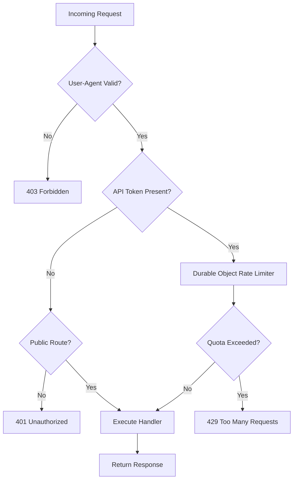

Relevant source files

The following files were used as context for generating this wiki page:

- [workers/api-gateway/src/index.ts](workers/api-gateway/src/index.ts)
- [workers/api-gateway/src/openapi.ts](workers/api-gateway/src/openapi.ts)
- [workers/api-gateway/src/handlers/progress.ts](workers/api-gateway/src/handlers/progress.ts)
- [wrangler.toml](wrangler.toml)
- [AGENTS.md](AGENTS.md)
- [code_review.md](code_review.md)

# Cloudflare API Gateway

The Cloudflare API Gateway is a specialized edge service designed to provide a secure and rate-limited interface for public programmatic access to user progress data. It serves as the primary entry point for third-party integrations, such as community bots and streamer overlays, while shielding the core infrastructure from abuse and excessive load.

The gateway is implemented as a Cloudflare Worker and utilizes Durable Objects for globally consistent, atomic rate limiting. It manages API token validation, enforces usage quotas, and proxies requests to underlying services like Supabase for data persistence and retrieval.

Sources: [AGENTS.md:52-52](AGENTS.md#L52), [wrangler.toml:7-14](wrangler.toml#L7-L14)

## System Architecture

The architecture relies on the synergy between Cloudflare Workers and Durable Objects. The gateway acts as a middleware layer that intercepts incoming HTTP requests, performs security checks, and routes them to specific handlers based on the request path.

### Request Flow and Processing
When a request hits the gateway, it undergoes a series of validations before any business logic is executed. The system enforces strict header requirements, particularly the `User-Agent` string, to identify and track client applications.

The diagram above illustrates the high-level logic used by the gateway to filter and authorize incoming traffic.
Sources: [workers/api-gateway/src/index.ts:182-210](workers/api-gateway/src/index.ts#L182-L210), [AGENTS.md:95-97](AGENTS.md#L95-L97)

### Components and Bindings
The gateway uses several Cloudflare bindings to perform its tasks:
- **API_GATEWAY_LIMITER**: A Durable Object binding used for atomic, globally-consistent rate limiting.
- **TARKOV_DATA**: A KV Namespace used for reading precomputed game data payloads.
- **Environment Variables**: Variables such as `SUPABASE_URL` and `SUPABASE_ANON_KEY` for backend communication.

Sources: [wrangler.toml:10-14](wrangler.toml#L10-L14), [wrangler.toml:24-27](wrangler.toml#L24-L27)

## Rate Limiting and Durable Objects

The `ApiGatewayRateLimiter` is a Durable Object class that provides an atomic counter system. Unlike standard edge caching, which is eventually consistent and per-datacenter, Durable Objects allow the gateway to enforce precise limits across the entire Cloudflare network.

### Rate Limiter Logic
The limiter tracks usage based on the API token and the current day. It stores counters in Durable Object storage and utilizes an alarm system for lazy expiration of stale state to minimize overhead.

| Feature | Implementation |
| :--- | :--- |
| **Storage** | Durable Object transactional storage (single-writer) |
| **Consistency** | Globally consistent / Atomic |
| **Cleanup** | Lazy expiration via DO Alarms |
| **Identification** | Normalized `User-Agent` + API Token |

Sources: [wrangler.toml:10-14](wrangler.toml#L10-L14), [code_review.md:46-52](code_review.md#L46-L52)

## API Endpoints and OpenAPI Specification

The gateway serves multiple functional routes, including public metadata and protected user progress. These are documented via an OpenAPI 3.0.3 specification defined within the codebase.

### Progress Handlers
The progress handlers manage the retrieval and updating of task completion states and hideout upgrades.

- **GET `/progress`**: Fetches the current user's progress.
- **POST `/progress`**: Updates specific progress markers (e.g., tasks or hideout stations).

Sources: [workers/api-gateway/src/handlers/progress.ts:1-20](workers/api-gateway/src/handlers/progress.ts#L1-L20), [workers/api-gateway/src/openapi.ts:5-15](workers/api-gateway/src/openapi.ts#L5-L15)

### OpenAPI Schema Definition
The gateway exposes its own schema and validation logic. Key components of the schema include:

| Component | Type | Description |
| :--- | :--- | :--- |
| `TaskProgress` | Object | Map of Task IDs to completion status |
| `StationProgress` | Object | Map of Hideout Station IDs to levels |
| `ApiResponse` | Object | Standard wrapper for successful or failed operations |

Sources: [workers/api-gateway/src/openapi.ts:40-60](workers/api-gateway/src/openapi.ts#L40-L60), [workers/api-gateway/package.json:10-15](workers/api-gateway/package.json#L10-L15)

## Security and Compliance

The gateway enforces several security policies to protect user data and ensure service availability:

1.  **User-Agent Enforcement**: Programmatic clients must send a `User-Agent` header between 5 and 200 characters. Infrastructure routes are exempt.
2.  **CORS Management**: The gateway handles CORS preflight requests and caches them to reduce latency, but ensures that proxy headers do not invalidate the cache incorrectly.
3.  **Token Validation**: All progress-related requests require a valid API token, which is used to look up the user's Supabase identity.
4.  **No SSR Features**: As the project is a SPA, the gateway avoids SSR-only features and server-only middleware that might break the client-side execution model.

Sources: [AGENTS.md:95-97](AGENTS.md#L95-L97), [code_review.md:36-39](code_review.md#L36-L39), [code_review.md:61-65](code_review.md#L61-L65)

## Operational Management

Maintenance and deployment of the gateway are handled via the `wrangler` CLI.

### Common Commands
| Task | Command |
| :--- | :--- |
| **Development** | `pnpm run dev` (within `workers/api-gateway`) |
| **Deployment** | `pnpm run deploy` |
| **Validation** | `pnpm run validate:openapi` |
| **Rollback** | `wrangler rollback` |

Sources: [workers/api-gateway/package.json:5-9](workers/api-gateway/package.json#L5-L9), [code_review.md:108-111](code_review.md#L108-L111)

### Data Precomputation
Heavy payloads, such as `tasks-core`, are precomputed into the `TARKOV_DATA` KV namespace by a scheduled GitHub Actions workflow. The API gateway request handlers attempt to read these precomputed entries first, falling back to the standard Cache API if the KV entry is absent.

Sources: [AGENTS.md:55-60](AGENTS.md#L55-L60), [wrangler.toml:23-27](wrangler.toml#L23-L27)
