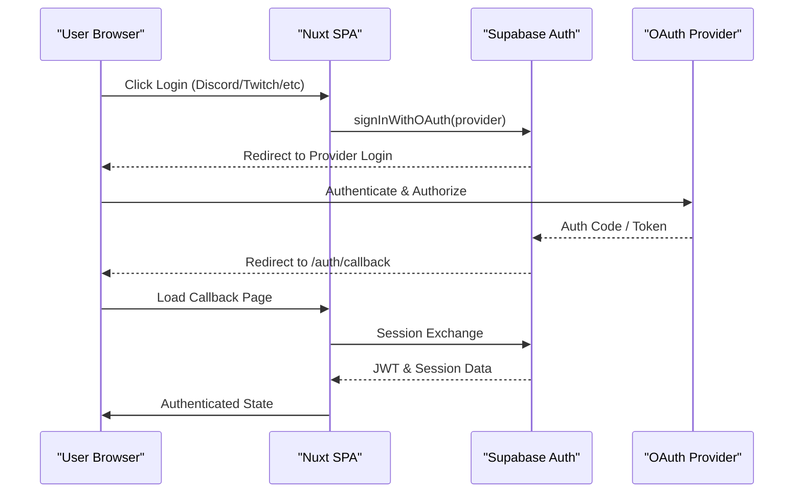

Relevant source files

The following files were used as context for generating this wiki page:

- [README.md](README.md)
- [AGENTS.md](AGENTS.md)
- [supabase/config.toml](supabase/config.toml)
- [app/pages/terms-of-service.vue](app/pages/terms-of-service.vue)
- [app/pages/privacy.vue](app/pages/privacy.vue)
- [code_review.md](code_review.md)

# Authentication & Account

The Authentication and Account system in TarkovTracker is designed to be optional, allowing players to track progress immediately via local browser storage without creating an account. The system utilizes Supabase as a backend provider for identity management, database storage, and real-time synchronization.

When a user chooses to authenticate, the system enables several advanced features:
- **Synchronization**: Syncing quest and hideout progress across multiple devices and browsers.
- **Team Collaboration**: Joining or creating teams to share progress in real-time.
- **API Access**: Generating tokens to programmatically read progress data.
- **Data Protection**: Server-side backups to prevent loss from browser local storage clearing.

Sources: [README.md:12-25](README.md#L12-L25), [AGENTS.md:38-39](AGENTS.md#L38-L39)

## Authentication Architecture

TarkovTracker implements a Single Page Application (SPA) authentication flow using Supabase Auth. The system relies on third-party OAuth providers for identity verification rather than maintaining a custom password database.

### OAuth Workflow
The application supports multiple external identity providers. The following diagram illustrates the authentication flow between the client, Supabase, and the OAuth provider.

The flow ensures that sensitive credentials never touch the TarkovTracker servers directly. 

Sources: [supabase/config.toml:311-355](supabase/config.toml#L311-L355), [app/pages/terms-of-service.vue:209-216](app/pages/terms-of-service.vue#L209-L216), [code_review.md:121-125](code_review.md#L121-L125)

### Auth Configuration
The Supabase backend is configured with specific parameters for JWT handling and redirection.

| Parameter | Value | Description |
| :--- | :--- | :--- |
| `jwt_expiry` | 3600 seconds | Tokens are valid for 1 hour. |
| `refresh_token_rotation` | Enabled | New refresh tokens are issued on every use. |
| `site_url` | `https://tarkovtracker.org` | Primary authorized origin. |
| `minimum_password_length` | 6 | Minimum length for any internal email/pass (if enabled). |

Sources: [supabase/config.toml:231-263](supabase/config.toml#L231-L263), [supabase/config.toml:264-270](supabase/config.toml#L264-L270)

## Account Management & Data Handling

### Data Synchronization & Merging
TarkovTracker handles the transition from "Guest" to "Authenticated" user through specific merge logic.

- **New Accounts**: Local progress is uploaded to the cloud on the first login.
- **Returning Users**: If the browser has local changes, they are merged with existing cloud progress.
- **New Browser/Same Account**: Cloud progress takes precedence over any existing guest data in the new browser.

Sources: [README.md:27-31](README.md#L27-L31)

### Data Retention and Deletion
The project enforces strict data retention policies to maintain performance and comply with privacy regulations.

1. **Manual Deletion**: Users can initiate account deletion via settings. This removes personal data and progress within 30 days, with backups retained for up to 90 days.
2. **Inactive Account Purging**:
  - **Standard Accounts**: Eligible for deletion after 6+ months of login inactivity.
  - **Supporter Accounts**: Granted an extended retention window as a perk.
3. **Team Ownership**: Upon deletion, team ownership is transferred to the next oldest member or deleted if the team is empty.

Sources: [app/pages/terms-of-service.vue:448-454](app/pages/terms-of-service.vue#L448-L454), [app/pages/privacy.vue:342-362](app/pages/privacy.vue#L342-L362), [app/pages/terms-of-service.vue:741-750](app/pages/terms-of-service.vue#L741-L750)

## Security and Compliance

### Technical Security Measures
- **Encryption**: Data is encrypted in transit via HTTPS/TLS and at rest within Supabase databases.
- **Session Lifecycle**: Implements token refresh and session restoration on reload.
- **Access Control**: Row Level Security (RLS) policies in Supabase ensure users can only access their own data.

Sources: [app/pages/privacy.vue:226-235](app/pages/privacy.vue#L226-L235), [code_review.md:121-125](code_review.md#L121-L125)

### Eligibility Requirements
Users must be at least 13 years of age (or higher depending on local jurisdiction, such as 16 in parts of the EEA under GDPR). Users under 18 must have the consent of a parent or guardian.

Sources: [app/pages/terms-of-service.vue:198-207](app/pages/terms-of-service.vue#L198-L207)

### Account Providers
Supported OAuth providers configured in the system:

| Provider | Enabled | Environment Variable Reference |
| :--- | :--- | :--- |
| Google | Yes | `SUPABASE_AUTH_EXTERNAL_GOOGLE_CLIENT_ID` |
| Discord | Yes | (Managed via manual linking) |
| GitHub | Yes | (Managed via Supabase) |
| Twitch | Yes | (Managed via Supabase) |

Sources: [supabase/config.toml:340-355](supabase/config.toml#L340-L355), [README.md:22-24](README.md#L22-L24)

## Summary
The Authentication & Account system provides a bridge between local-only usage and a cloud-synced experience. By leveraging Supabase and OAuth 2.0, TarkovTracker maintains a lightweight security footprint while offering robust data synchronization, team collaboration, and long-term progress preservation for the Escape from Tarkov community.
