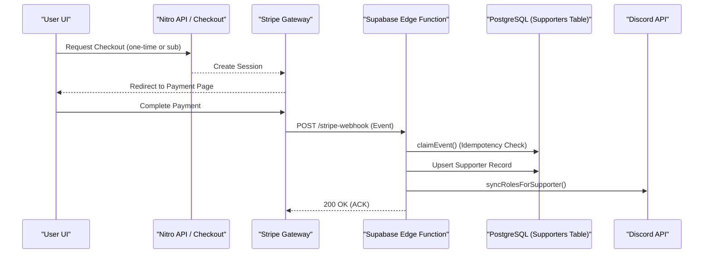
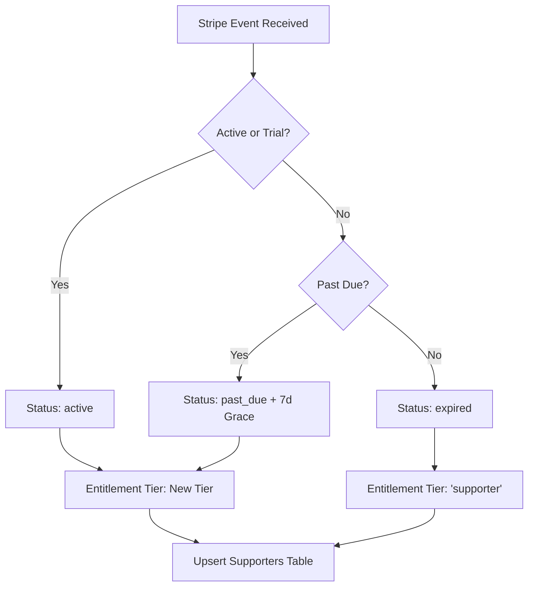

Relevant source files

The following files were used as context for generating this wiki page:

- [app/features/supporter/SupporterOneTime.vue](app/features/supporter/SupporterOneTime.vue)
- [app/features/supporter/__tests__/supporterPricing.test.ts](app/features/supporter/__tests__/supporterPricing.test.ts)
- [supabase/functions/stripe-webhook/index.ts](supabase/functions/stripe-webhook/index.ts)
- [app/features/admin/AdminSupporterAccessCard.vue](app/features/admin/AdminSupporterAccessCard.vue)
- [app/pages/terms-of-service.vue](app/pages/terms-of-service.vue)
- [app/pages/privacy.vue](app/pages/privacy.vue)

# Supporter System & Stripe Billing

The Supporter System is a voluntary contribution framework designed to fund the ongoing development, hosting, and maintenance of TarkovTracker. It allows users to contribute via one-time payments or recurring subscriptions processed through Stripe. While the core features of TarkovTracker remain free and open-source, supporters receive non-essential perks such as profile badges, Discord roles, and extended data retention for inactive accounts.

Sources: [app/pages/terms-of-service.vue:490-502](app/pages/terms-of-service.vue#L490-L502), [app/pages/privacy.vue:64-70](app/pages/privacy.vue#L64-L70)

## Architecture and Components

The system is built as a distributed architecture involving the Nuxt frontend, Supabase Edge Functions for webhook processing, and Stripe as the payment gateway. It handles complex state transitions including subscription renewals, tier upgrades, and payment failures.

### Supporter Tiers
The system defines three primary subscription tiers, ordered by "rank":
- **Scav**: The base entry-level tier.
- **Timmy**: The middle, "featured" tier.
- **Chad**: The highest veteran tier.

Sources: [app/features/supporter/__tests__/supporterPricing.test.ts:14-22](app/features/supporter/__tests__/supporterPricing.test.ts#L14-L22), [app/features/admin/AdminSupporterAccessCard.vue:10-15](app/features/admin/AdminSupporterAccessCard.vue#L10-L15)

### Data Flow Overview
The following diagram illustrates the lifecycle of a supporter contribution from the initial UI request to the final database update and external role synchronization.

The system ensures idempotency by recording every processed Stripe event ID in a `stripe_events` table before executing side effects.

Sources: [supabase/functions/stripe-webhook/index.ts:114-128](supabase/functions/stripe-webhook/index.ts#L114-L128), [app/features/supporter/SupporterOneTime.vue:128-140](app/features/supporter/SupporterOneTime.vue#L128-L140)

## Pricing and Fees

The system incorporates Stripe's fee structure directly into the user interface to ensure transparency. It supports a "Cover Stripe fees" feature where the user can choose to add the transaction costs to their base contribution.

### Pricing Logic
Pricing is calculated based on intervals and base rates. Subscriptions often include discounts for longer commitment periods (e.g., 10% for 6 months, 20% for yearly).

| Interval | Month Count | Discount |
| :--- | :--- | :--- |
| Monthly | 1 | 0% |
| 6-Month | 6 | 10% |
| Yearly | 12 | 20% |

Sources: [app/features/supporter/__tests__/supporterPricing.test.ts:25-40](app/features/supporter/__tests__/supporterPricing.test.ts#L25-L40)

### Fee Calculation
The standard transaction rate used in calculations is 2.9% plus a fixed $0.30 fee. The system rounds up to the next cent to ensure transaction costs are fully covered without undercharging.

Sources: [app/features/supporter/SupporterOneTime.vue:25-30](app/features/supporter/SupporterOneTime.vue#L25-L30), [app/features/supporter/__tests__/supporterPricing.test.ts:54-65](app/features/supporter/__tests__/supporterPricing.test.ts#L54-L65)

## Webhook Processing Logic

The Supabase Edge Function (`stripe-webhook`) acts as the central controller for supporter state management. It processes various Stripe event types to reconcile the application's local database with the gateway's state.

### Event Handling Table

| Event Type | Action |
| :--- | :--- |
| `checkout.session.completed` | Activates supporter row; grants perks. |
| `customer.subscription.deleted` | Expires subscription; removes tier-specific roles. |
| `invoice.payment_failed` | Updates status to `past_due`; triggers grace period. |
| `charge.refunded` | Revokes perks if it was the only/first payment. |
| `charge.dispute.created` | Immediate full revocation of all supporter access. |

Sources: [supabase/functions/stripe-webhook/index.ts:503-535](supabase/functions/stripe-webhook/index.ts#L503-L535)

### Subscription Reconciliation
The system maintains a state machine for subscriptions to handle edge cases like "Past Due" statuses.

Sources: [supabase/functions/stripe-webhook/index.ts:311-345](supabase/functions/stripe-webhook/index.ts#L311-L345)

## Admin and Manual Overrides

For production testing and support scenarios, an administrative interface allows manual overrides of a user's supporter state. This bypasses Stripe and updates the Supabase `supporters` table directly.

### Admin Supporter Access
Admins can set:
- **Target User ID**: The Supabase auth UUID of the user.
- **Tier**: Scav, Timmy, or Chad.
- **Enabled State**: Toggle to turn perks on or off.

Sources: [app/features/admin/AdminSupporterAccessCard.vue:35-50](app/features/admin/AdminSupporterAccessCard.vue#L35-L50)

## Supporter Perks & Terms

The legal framework defines the specific benefits provided to supporters and the conditions under which they are granted or revoked.

### Provided Perks
- **Profile Badge**: A visual indicator on the user's TarkovTracker profile.
- **Discord Roles**: Tier-specific roles within the community Discord server.
- **Data Retention**: Standard accounts may be purged after 6 months of inactivity; supporter accounts receive an extended window.
- **API Limits**: Recurring subscribers may receive higher API rate limits.

Sources: [app/pages/terms-of-service.vue:504-526](app/pages/terms-of-service.vue#L504-L526), [app/pages/privacy.vue:246-258](app/pages/privacy.vue#L246-L258)

### Revocation Policy
Access is revoked under the following conditions:
1. **Subscription Expiration**: Perks lapse at the end of the paid period.
2. **Refunds**: If a first payment is refunded, all perks are removed.
3. **Disputes/Chargebacks**: Classified as adversarial; results in immediate and permanent revocation of all supporter access and potentially the user account.

Sources: [supabase/functions/stripe-webhook/index.ts:446-465](supabase/functions/stripe-webhook/index.ts#L446-L465), [app/pages/terms-of-service.vue:565-573](app/pages/terms-of-service.vue#L565-L573)

## Conclusion

The TarkovTracker Supporter System is a robust billing integration that prioritizes idempotency and transparency. By leveraging a combination of Stripe Webhooks and automated Discord synchronization, it manages the full lifecycle of a supporter's contribution while providing administrative tools to handle edge cases and manual support requests. Through its integration with terms of service and privacy policies, it maintains a clear legal distinction between voluntary support and the core free service.
