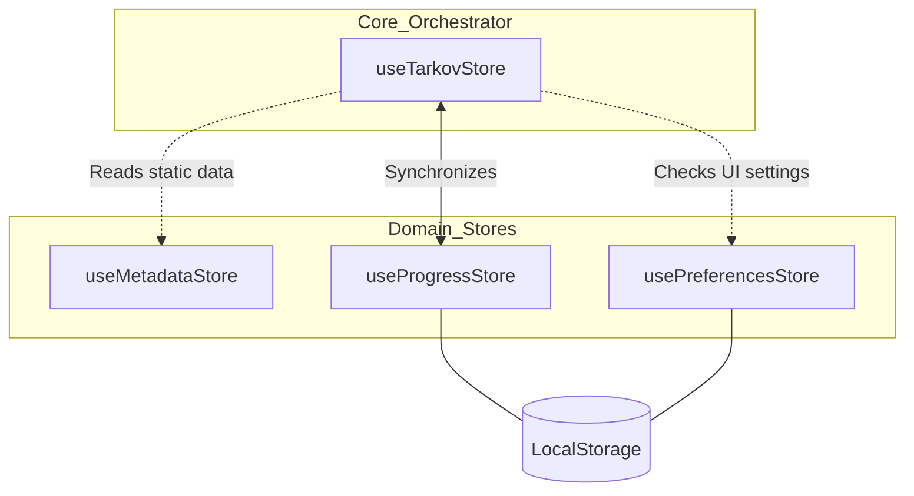
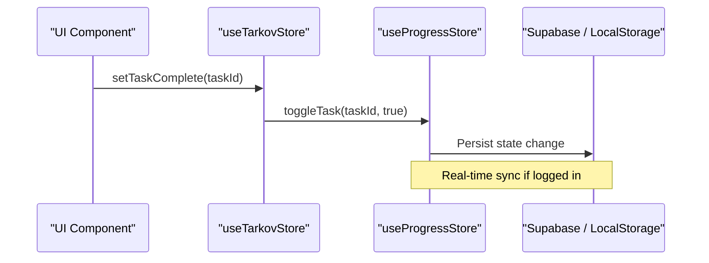

Relevant source files

The following files were used as context for generating this wiki page:

- [app/stores/useTarkov.ts](app/stores/useTarkov.ts)
- [app/stores/useProgress.ts](app/stores/useProgress.ts)
- [app/stores/usePreferences.ts](app/stores/usePreferences.ts)
- [app/stores/useMetadata.ts](app/stores/useMetadata.ts)
- [AGENTS.md](AGENTS.md)
- [code_review.md](code_review.md)
- [app/composables/__tests__/useXpCalculation.test.ts](app/composables/__tests__/useXpCalculation.test.ts)

# Pinia State Management

TarkovTracker utilizes Pinia as its central state management library to handle game data, user progress, and application preferences. The architecture is built around a "Core State" model where `useTarkovStore` acts as the primary orchestrator, coordinating with specialized stores for metadata, persistent progress, and UI preferences. This system ensures that the application can function in an offline-first manner using browser local storage while supporting real-time cloud synchronization when a user is authenticated.

The state management is strictly client-side as the project is a Nuxt 4 Single Page Application (SPA). It relies on the `pinia-plugin-persistedstate` to ensure that data remains consistent across browser refreshes and sessions.

Sources: [AGENTS.md:55-58](AGENTS.md#L55-L58), [AGENTS.md:129-130](AGENTS.md#L129-L130), [code_review.md:113-120](code_review.md#L113-L120)

## Store Architecture

The state is divided into four primary domains, each managed by a dedicated Pinia store. These stores are auto-registered by Nuxt and reside in the `app/stores/` directory.

### Store Hierarchy and Relationships

The following diagram illustrates the relationship between the core `useTarkovStore` and its supporting domain stores.

The `useTarkovStore` acts as the central hub, while `useProgressStore` and `usePreferencesStore` handle persistent user-specific data. `useMetadataStore` provides the static game data required to interpret progress.

Sources: [AGENTS.md:55-58](AGENTS.md#L55-L58), [code_review.md:113-120](code_review.md#L113-L120)

### Key Store Responsibilities

| Store | Primary Purpose | Persistence |
| :--- | :--- | :--- |
| `useTarkovStore` | Core state orchestrator. Manages active game mode (PvP/PvE), level tracking, and action dispatching. | Limited (Mode) |
| `useMetadataStore` | Static game data. Holds tasks, items, hideout modules, and level requirements fetched from APIs. | No |
| `useProgressStore` | Persistent user progress. Stores completed tasks, objective counts, and hideout module levels. | Yes |
| `usePreferencesStore` | UI and functional preferences. Manages language settings, map density, and filter states. | Yes |

Sources: [app/stores/useTarkov.ts](app/stores/useTarkov.ts), [app/stores/useMetadata.ts](app/stores/useMetadata.ts), [app/stores/useProgress.ts](app/stores/useProgress.ts), [app/stores/usePreferences.ts](app/stores/usePreferences.ts)

## Core Orchestration (`useTarkovStore`)

The `useTarkovStore` is responsible for managing the high-level state of the player's session. It handles the switching between game modes and provides a unified interface for checking the status of tasks and objectives.

### Game Mode Management
TarkovTracker maintains separate progress for PvP and PvE modes. The `useTarkovStore` tracks the `currentGameMode` and ensures that all progress checks (e.g., `isTaskComplete`) are routed to the correct data set within `useProgressStore`.

### Progression Logic
The store provides utility methods to calculate player progress:
- **Task Status**: Methods like `isTaskComplete(taskId)` and `isTaskFailed(taskId)` check the underlying progress store.
- **Objective Tracking**: Manages the completion of specific sub-objectives within a task.
- **XP Calculation**: Interacts with `useMetadataStore` to derive levels from total XP and completions.

Sources: [app/stores/useTarkov.ts:10-50](app/stores/useTarkov.ts#L10-L50), [app/composables/__tests__/useXpCalculation.test.ts:74-90](app/composables/__tests__/useXpCalculation.test.ts#L74-L90)

## Progress and Persistence

Persistent state is primarily handled by `useProgressStore`. This store is critical for the "no account required" feature, as it saves data to `localStorage`.

### Data Flow for User Actions
When a user completes a task in the UI, the data flows through the stores as follows:

The sequence demonstrates how the orchestrator triggers changes in the persistent layer.

Sources: [app/stores/useTarkov.ts](app/stores/useTarkov.ts), [app/stores/useProgress.ts](app/stores/useProgress.ts), [code_review.md:114-118](code_review.md#L114-L118)

### Synchronization and Merging
For authenticated users, the state management system handles merging local browser progress with cloud data.
- **Merge RPC**: Uses `add_merge_progress_rpc` to reconcile differences between local and server states.
- **Conflict Handling**: If a user signs into an existing account with existing cloud progress on a new browser, the cloud data takes precedence.

Sources: [code_review.md:54](code_review.md#L54), [AGENTS.md:105-110](AGENTS.md#L105-L110)

## Metadata Management

The `useMetadataStore` serves as a read-only cache for game data. It does not persist to local storage because it is expected to be refreshed from the `/api/tarkov/*` proxy endpoints.

### Data Structures
The store manages several complex arrays:
- `tasks`: Full quest definitions including requirements and rewards.
- `items`: Item definitions for "Needed Items" calculations.
- `hideoutStations`: Definitions for hideout module upgrade paths.
- `playerLevels`: A mapping of XP thresholds to level numbers.

Sources: [app/stores/useMetadata.ts](app/stores/useMetadata.ts), [app/composables/__tests__/useXpCalculation.test.ts:25-31](app/composables/__tests__/useXpCalculation.test.ts#L25-L31)

## UI and Preferences

`usePreferencesStore` manages the "feel" of the application. It includes settings for:
- **Localization**: User-selected language (snake_case keys).
- **Map Behavior**: `zoom_speed`, `pan_speed`, and `tooltip_density`.
- **Filtering**: Default task filter states (Kappa required, lightkeeper required, etc.).

Sources: [app/stores/usePreferences.ts](app/stores/usePreferences.ts), [AGENTS.md:150-155](AGENTS.md#L150-L155)

## Conclusion

Pinia state management in TarkovTracker is designed to be robust and reactive. By separating static metadata from mutable user progress and UI preferences, the project maintains a clean data flow that supports both local-only and cloud-synced sessions. The orchestration provided by `useTarkovStore` allows the rest of the application to remain agnostic of whether data is stored locally or in Supabase.

Sources: [AGENTS.md:55-58](AGENTS.md#L55-L58), [code_review.md:113-120](code_review.md#L113-L120)
