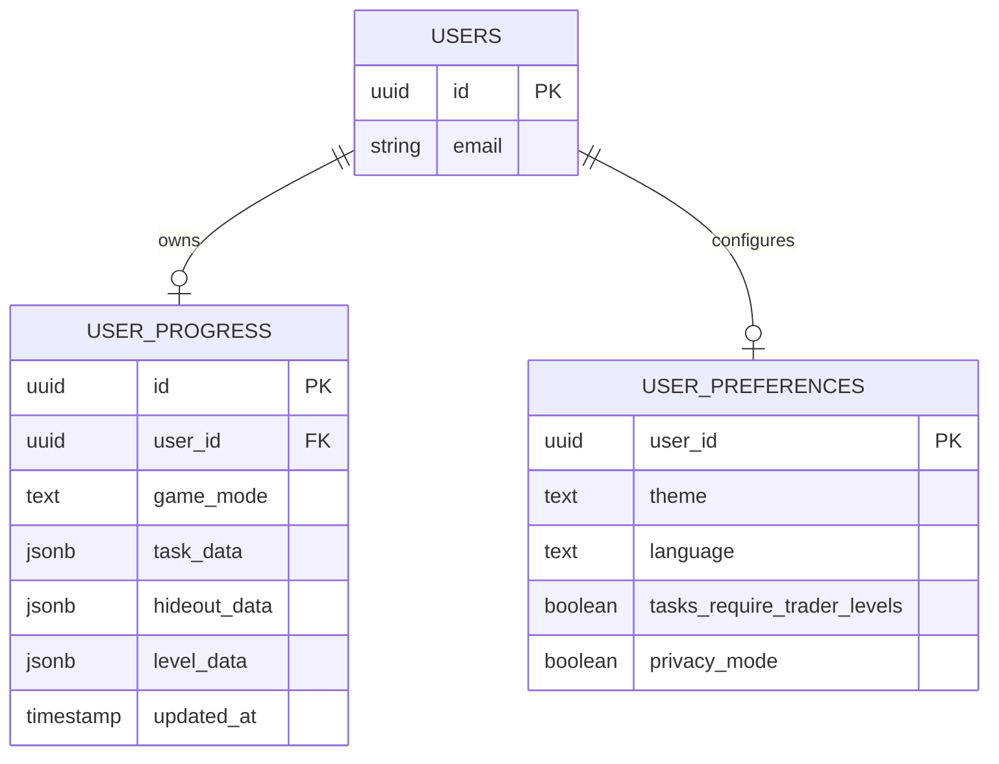
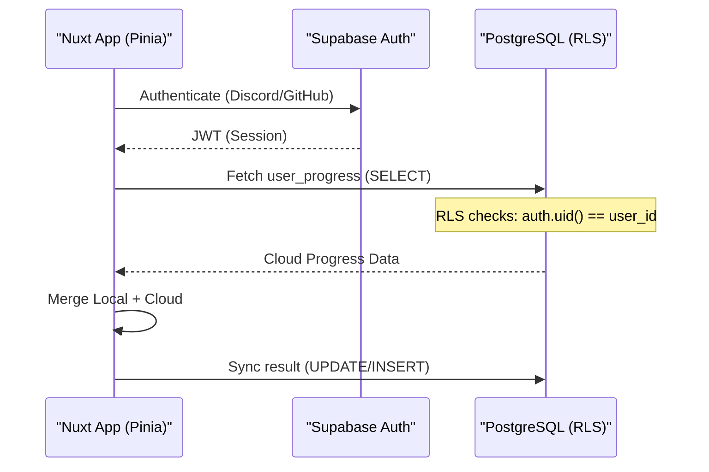

<details>
<summary>Relevant source files</summary>

The following files were used as context for generating this wiki page:

- [supabase/migrations/20251130104000\_create\_user\_progress\_table.sql](supabase/migrations/20251130104000_create_user_progress_table.sql)
- [supabase/migrations/20251130121500\_create\_user\_preferences.sql](supabase/migrations/20251130121500_create_user_preferences.sql)
- [supabase/config.toml](supabase/config.toml)
- [README.md](README.md)
- [AGENTS.md](AGENTS.md)
- [code\_review.md](code_review.md)
</details>

# Database Schema & RLS

TarkovTracker utilizes Supabase as its primary backend for data persistence, authentication, and real-time synchronization. The database architecture is designed to support a hybrid model where progress is tracked locally in the browser's storage by default but can be synchronized to a cloud-based PostgreSQL database once a user signs in.

The schema focuses on two core domains: tracking game progression (tasks, hideout, and levels) and managing user-specific application preferences. Access to this data is strictly controlled via PostgreSQL Row Level Security (RLS), ensuring that users can only interact with their own data records.

Sources: [README.md](README.md), [AGENTS.md](AGENTS.md), [code_review.md](code_review.md)

## Core Database Tables

The database schema is defined through incremental migrations. The primary tables reside in the `public` schema and are linked to Supabase's internal `auth.users` table.

### User Progress Table
The `user_progress` table is the central repository for a player's journey. It separates data between "regular" (PvP) and "pve" game modes, storing complex progression state as JSONB structures to allow for flexible updates to task objectives and hideout modules.

| Column | Type | Constraints | Description |
| :--- | :--- | :--- | :--- |
| `id` | UUID | PRIMARY KEY, DEFAULT gen_random_uuid() | Unique identifier for the progress record. |
| `user_id` | UUID | REFERENCES auth.users, NOT NULL | The owner of the progress data. |
| `game_mode` | TEXT | NOT NULL | Typically 'regular' or 'pve'. |
| `task_data` | JSONB | DEFAULT '{}' | Stores completion status and objective progress for tasks. |
| `hideout_data`| JSONB | DEFAULT '{}' | Stores upgrade levels and item counts for hideout stations. |
| `level_data` | JSONB | DEFAULT '{}' | Stores player level, XP, and skill offsets. |
| `updated_at` | TIMESTAMPTZ| DEFAULT now() | Timestamp of the last synchronization. |

Sources: [supabase/migrations/20251130104000_create_user_progress_table.sql:1-15](supabase/migrations/20251130104000_create_user_progress_table.sql#L1-L15)

### User Preferences Table
This table stores application-wide settings that affect the UI/UX and calculation logic, such as theme, language, and task availability rules.

| Column | Type | Constraints | Description |
| :--- | :--- | :--- | :--- |
| `user_id` | UUID | PRIMARY KEY, REFERENCES auth.users | Maps preferences directly to a specific user. |
| `theme` | TEXT | DEFAULT 'dark' | UI theme preference. |
| `language` | TEXT | DEFAULT 'en' | User interface locale. |
| `tasks_require_trader_levels` | BOOLEAN | DEFAULT true | Logic toggle for task availability. |
| `privacy_mode` | BOOLEAN | DEFAULT false | Toggle for sensitive information visibility. |

Sources: [supabase/migrations/20251130121500_create_user_preferences.sql:1-12](supabase/migrations/20251130121500_create_user_preferences.sql#L1-L12)

## Data Relationships

The following entity relationship diagram illustrates how user data is isolated and linked to the authentication system.



The diagram shows a one-to-many relationship between users and progress (one per game mode) and a one-to-one relationship with preferences.

Sources: [supabase/migrations/20251130104000_create_user_progress_table.sql](supabase/migrations/20251130104000_create_user_progress_table.sql), [supabase/migrations/20251130121500_create_user_preferences.sql](supabase/migrations/20251130121500_create_user_preferences.sql)

## Row Level Security (RLS)

RLS is enabled on all tables to prevent unauthorized data access. The policies leverage the `auth.uid()` function provided by Supabase to compare the requester's ID with the `user_id` column in the table.

### Progression Access Policies
For the `user_progress` table, the following policies are enforced:
1.  **Select**: Users can only view their own progress records.
2.  **Insert**: Users can only create progress records where the `user_id` matches their authenticated ID.
3.  **Update**: Users can only modify their own records.
4.  **Delete**: Users can only delete their own records.

```sql
-- Example RLS Policy for user_progress
ALTER TABLE public.user_progress ENABLE ROW LEVEL SECURITY;

CREATE POLICY "Users can view own progress" 
ON public.user_progress FOR SELECT 
USING (auth.uid() = user_id);

CREATE POLICY "Users can update own progress" 
ON public.user_progress FOR UPDATE 
USING (auth.uid() = user_id);
```

Sources: [supabase/migrations/20251130104000_create_user_progress_table.sql:20-35](supabase/migrations/20251130104000_create_user_progress_table.sql#L20-L35), [code_review.md:45-50](code_review.md#L45-L50)

## Synchronization Logic

TarkovTracker follows a "Cloud-Merge" strategy. When a user signs in, the client-side Pinia stores sync with the Supabase database. If local progress exists, it is merged with the cloud data; however, cloud data generally takes precedence for existing accounts.



The synchronization ensures that progress follows the user across different browsers and devices.

Sources: [README.md](README.md), [AGENTS.md](AGENTS.md), [code_review.md:65-70](code_review.md#L65-L70)

## Operational Considerations

### Database Management
-  **Automated Timestamps**: Tables include triggers or default values to handle `updated_at` timestamps, ensuring that the latest data state is always trackable.
-  **Forward Compatibility**: Migrations are strictly checked to be forward-compatible. No destructive `ALTER TABLE` operations are permitted without a staged approach (add column -> backfill -> drop old).
-  **Real-time Features**: The `user_progress` table is configured to support Supabase Realtime, enabling features like shared team progress.

Sources: [code_review.md:40-45](code_review.md#L40-L45), [supabase/migrations/20251130121500_create_user_preferences.sql:15-20](supabase/migrations/20251130121500_create_user_preferences.sql#L15-L20), [supabase/config.toml](supabase/config.toml)

### Summary
The TarkovTracker database system is built for resilience and security. By using JSONB fields for game-specific data, the schema remains decoupled from the specific quests or items in the game, allowing the application to update its logic without requiring frequent database structural changes. RLS serves as the definitive security boundary, preventing data leaks in a multi-user environment.

Sources: [AGENTS.md](AGENTS.md), [code_review.md](code_review.md)
