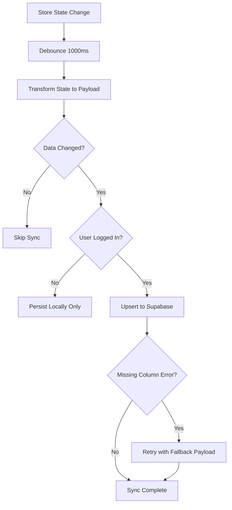
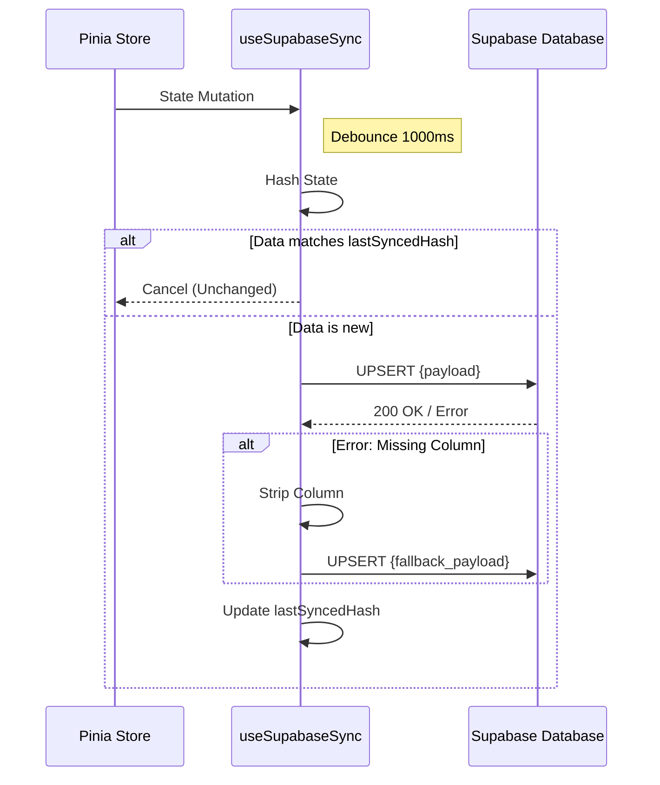

<details>
<summary>Relevant source files</summary>

The following files were used as context for generating this wiki page:

- [app/composables/supabase/useSupabaseSync.ts](app/composables/supabase/useSupabaseSync.ts)
- [app/plugins/supabase.client.ts](app/plugins/supabase.client.ts) (Inferred from project snapshot and code review policy)
- [AGENTS.md](AGENTS.md)
- [code_review.md](code_review.md)
- [supabase/config.toml](supabase/config.toml)
</details>

# Supabase Realtime Sync

The Supabase Realtime Sync system is a core architectural component of TarkovTracker that enables seamless data synchronization between the client-side Pinia stores and the Supabase backend. It ensures that user progress, hideout status, and team data are persisted in the cloud while providing real-time updates across multiple devices and browsers for authenticated users.

This system operates in an "offline-first" manner where the app remains functional using `localStorage` for guest users, but promotes data to the Supabase database upon login. It leverages a combination of debounced store subscriptions for outgoing data (upserts) and realtime listeners for incoming changes, ensuring high performance and reduced network egress.
Sources: [README.md](README.md), [AGENTS.md](AGENTS.md), [app/composables/supabase/useSupabaseSync.ts:121-125](app/composables/supabase/useSupabaseSync.ts#L121-L125)

## Architecture and Data Flow

The sync architecture is centered around the `useSupabaseSync` composable, which bridges Pinia stores with Supabase database tables. The system uses a reactive approach, watching for changes in the local state and intelligently syncing them to the backend.

### Sync Logic Flow
The following diagram illustrates the high-level flow of a synchronization event triggered by a state change:



Sources: [app/composables/supabase/useSupabaseSync.ts:89-115](app/composables/supabase/useSupabaseSync.ts#L89-L115), [app/composables/supabase/useSupabaseSync.ts:121-140](app/composables/supabase/useSupabaseSync.ts#L121-L140)

### Key Components

| Component | Responsibility |
| :--- | :--- |
| `useSupabaseSync` | Primary composable managing debounced upserts, data hashing, and error recovery. |
| `Supabase Client` | Client-side plugin providing access to `$supabase.client` and user session state. |
| `Pinia Stores` | Source of truth for local state (e.g., `user_progress`, `user_preferences`). |
| `PostgREST` | API layer used for upserting data via `$supabase.client.from(table).upsert()`. |
| `Realtime` | Supabase engine used for broadcasting changes to other active client instances. |
Sources: [app/composables/supabase/useSupabaseSync.ts:17-40](app/composables/supabase/useSupabaseSync.ts#L17-L40), [AGENTS.md](AGENTS.md), [supabase/config.toml:84-88](supabase/config.toml#L84-L88)

## Outgoing Sync Logic (Client to Server)

TarkovTracker implements an intelligent outgoing sync mechanism to minimize unnecessary database writes and handle schema evolution gracefully.

### Change Detection via Hashing
To avoid expensive deep JSON comparisons, the system uses a fast string hashing function to detect if the state has actually changed before initiating a network request. Syncing is skipped if the current state hash matches the `lastSyncedHash`.
Sources: [app/composables/supabase/useSupabaseSync.ts:46-55](app/composables/supabase/useSupabaseSync.ts#L46-L55), [app/composables/supabase/useSupabaseSync.ts:133-138](app/composables/supabase/useSupabaseSync.ts#L133-L138)

### Schema Fallback Mechanism
The sync engine includes a robust fallback system for "Missing Column" errors (`PGRST204`). This is critical for forward compatibility during rolling deployments where the frontend might attempt to sync a new state field to an old database schema.

```typescript
function getFallbackPayload(
  payload: Record<string, unknown>,
  missingColumn: string
): Record<string, unknown> | null {
  if (!(missingColumn in payload)) return null;

  const fallbackPayload = Object.fromEntries(
    Object.entries(payload).filter(([key]) => key !== missingColumn)
  );

  // Specialized mapping for renamed columns
  if (missingColumn === 'only_tasks_with_required_keys' && 
      !('only_tasks_with_suggested_keys' in fallbackPayload)) {
    fallbackPayload.only_tasks_with_suggested_keys = payload[missingColumn];
  }
  return fallbackPayload;
}
```

Sources: [app/composables/supabase/useSupabaseSync.ts:72-88](app/composables/supabase/useSupabaseSync.ts#L72-L88), [app/composables/supabase/useSupabaseSync.ts:153-176](app/composables/supabase/useSupabaseSync.ts#L153-L176)

### Abort and Retry Handling
The system handles transient request aborts by implementing a retry mechanism with an `ABORT_RETRY_DELAY_MS` (150ms).
Sources: [app/composables/supabase/useSupabaseSync.ts:12](app/composables/supabase/useSupabaseSync.ts#L12), [app/composables/supabase/useSupabaseSync.ts:178-185](app/composables/supabase/useSupabaseSync.ts#L178-L185)

## Inbound Sync and Listeners

While `useSupabaseSync` handles data persistence, the system relies on listeners to maintain state consistency across tabs and devices.

### Sync Operations Sequence



Sources: [app/composables/supabase/useSupabaseSync.ts:121-205](app/composables/supabase/useSupabaseSync.ts#L121-L205), [code_review.md](code_review.md)

## Configuration and Defaults

The sync behavior is configurable per store/table mapping.

| Option | Type | Default | Description |
| :--- | :--- | :--- | :--- |
| `debounceMs` | `number` | `1000` | Delay before syncing changes to prevent spamming the database. |
| `table` | `string` | N/A | The Supabase database table name to target (e.g., `user_progress`). |
| `transform` | `function` | N/A | Optional function to map Pinia state to the DB payload schema. |
| `onSynced` | `function` | N/A | Callback executed after a successful sync operation. |
Sources: [app/composables/supabase/useSupabaseSync.ts:17-25](app/composables/supabase/useSupabaseSync.ts#L17-L25), [app/composables/supabase/useSupabaseSync.ts:106-114](app/composables/supabase/useSupabaseSync.ts#L106-L114)

## Summary

The Supabase Realtime Sync module provides a resilient, reactive bridge between the Vue frontend and the PostgreSQL backend. By utilizing debouncing, hashing for change detection, and a sophisticated fallback mechanism for schema mismatches, it ensures that TarkovTracker remains performant and data-consistent even during infrastructure updates. The system effectively manages the transition from local-only storage to cloud-synced state, enabling advanced features like real-time team progress tracking.
Sources: [AGENTS.md](AGENTS.md), [app/composables/supabase/useSupabaseSync.ts](app/composables/supabase/useSupabaseSync.ts), [supabase/config.toml](supabase/config.toml)
