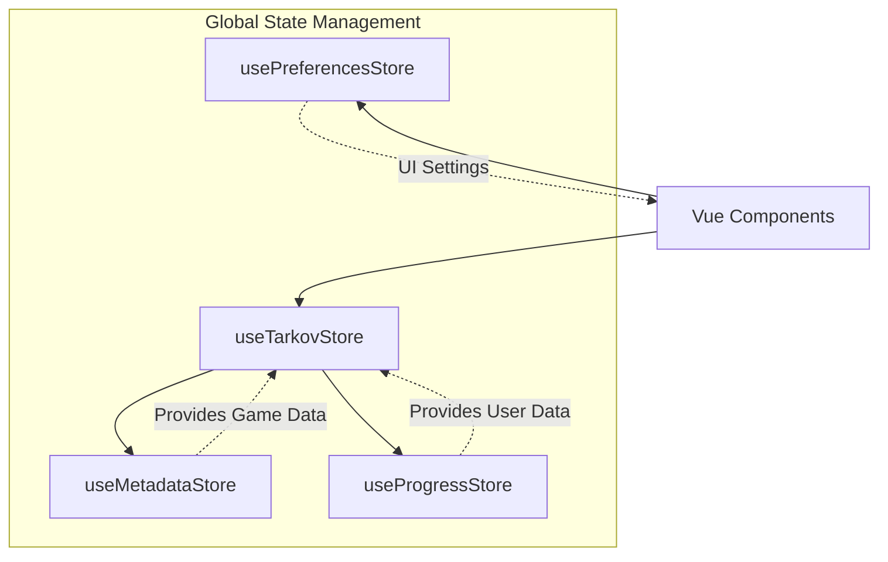
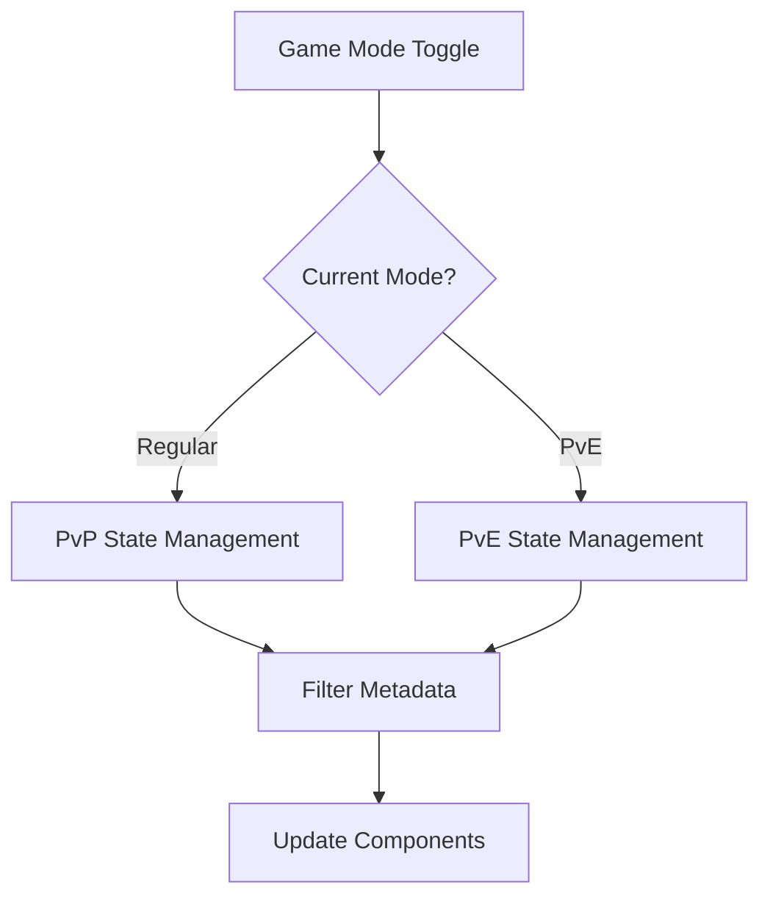
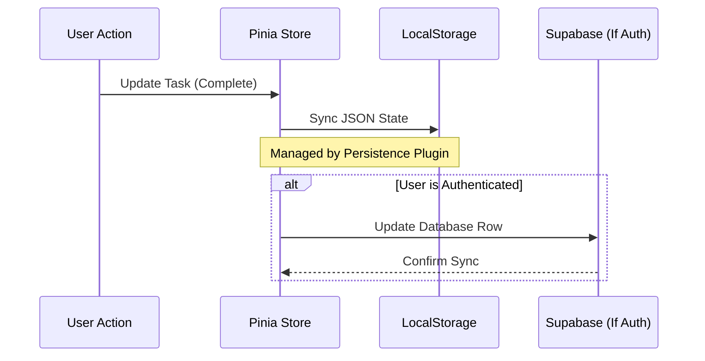

Relevant source files

The following files were used as context for generating this wiki page:

- [app/stores/useTarkov.ts](app/stores/useTarkov.ts)
- [app/stores/useProgress.ts](app/stores/useProgress.ts)
- [app/stores/useMetadata.ts](app/stores/useMetadata.ts)
- [app/stores/usePreferences.ts](app/stores/usePreferences.ts)
- [AGENTS.md](AGENTS.md)
- [code_review.md](code_review.md)

# Pinia State Management

TarkovTracker utilizes Pinia as its primary state management solution within the Nuxt 4 SPA architecture. The state is divided into specialized stores that handle static game metadata, dynamic user progression, and interface preferences. These stores coordinate to provide a seamless experience across different game modes (PvP and PvE) and ensure data consistency through local persistence.

The architecture emphasizes a "Core State" pattern where `useTarkovStore` acts as the central coordinator, interacting with `useMetadataStore`, `useProgressStore`, and `usePreferencesStore` to provide derived computed values and cross-domain logic.

Sources: [AGENTS.md:73-77](AGENTS.md#L73-L77), [code_review.md:120-125](code_review.md#L120-L125)

## Store Architecture Overview

The system is built on four primary Pinia stores. Each store has a distinct responsibility, ranging from immutable game data to user-defined UI settings.

### Relationships and Data Flow

The following diagram illustrates how the different stores interact and which stores depend on one another for context.

The `useTarkovStore` serves as the primary interface for components, abstracting the complexity of checking task status or hideout progress by querying both metadata and user progress simultaneously.

Sources: [app/stores/useTarkov.ts](app/stores/useTarkov.ts), [AGENTS.md:73-77](AGENTS.md#L73-L77)

## Primary Stores

### 1. Metadata Store (`useMetadataStore`)
The Metadata Store manages "read-only" game data fetched from the TarkovTracker API proxy. This data is essential for rendering tasks, items, traders, and maps but is not modified by the user.

| Feature | Description |
| :--- | :--- |
| **Tasks** | Core task data including requirements and rewards. |
| **Items** | Database of all items needed for quests or hideout. |
| **Maps** | Location data and objective coordinates. |
| **Traders** | Trader levels, reputation requirements, and icons. |

Sources: [app/stores/useMetadata.ts](app/stores/useMetadata.ts), [AGENTS.md:143-145](AGENTS.md#L143-L145)

### 2. Progress Store (`useProgressStore`)
The Progress Store tracks all user-specific completion data. It is highly dynamic and uses `pinia-plugin-persistedstate` to ensure progress is saved across browser sessions.

- **Task Status**: Tracking if a task is available, completed, or failed.
- **Hideout Modules**: Tracking the current level of various hideout stations.
- **Objective Counts**: Tracking partial progress on multi-stage objectives (e.g., "Find 5 items").

Sources: [app/stores/useProgress.ts](app/stores/useProgress.ts), [code_review.md:120-125](code_review.md#L120-L125)

### 3. Tarkov Store (`useTarkovStore`)
This is the core state management file. It manages the application's global context, specifically the toggle between game modes.

The Tarkov Store handles the logic for `currentGameMode` (either `regular` or `pve`) and provides utility functions like `isTaskComplete(taskId)` which look up the specific ID in the Progress Store based on the active mode.

Sources: [app/stores/useTarkov.ts:1-50](app/stores/useTarkov.ts#L1-L50), [code_review.md:120-125](code_review.md#L120-L125)

### 4. Preferences Store (`usePreferencesStore`)
Manages UI/UX settings. This store is isolated from game logic and focuses on how data is presented to the user.

- **Interface Density**: Toggling between "Comfortable" and "Compact" views.
- **Visibility Toggles**: Showing or hiding specific task categories (Kappa-required, Lightkeeper, etc.).
- **Map Settings**: Zoom speed, pan speed, and zone opacity.

Sources: [app/stores/usePreferences.ts](app/stores/usePreferences.ts)

## State Persistence and Sync

All user-driven state (Progress and Preferences) is persisted locally. TarkovTracker uses the `pinia-plugin-persistedstate` to automatically sync the store state to `localStorage`.

### Data Lifecycle Diagram

When a user signs in, the state management system initiates a migration flow to move local data into the cloud-synced database managed by Supabase.

Sources: [AGENTS.md:20-25](AGENTS.md#L20-L25), [code_review.md:110-115](code_review.md#L110-L115)

## State Integrity and Validation

The project maintains strict rules regarding store modifications to prevent data corruption, particularly during game updates (wipes).

- **No SSR Dependency**: Because the project is configured as `ssr: false`, stores are strictly client-side and should not use server-only features.
- **Type Safety**: Stores are implemented with strict TypeScript interfaces. Task IDs and Item IDs are treated as unique strings to ensure consistent lookups between the Metadata and Progress stores.
- **Backward Compatibility**: Any changes to the persisted state shape must be backward-compatible to avoid corrupting existing user sessions stored in `localStorage`.

Sources: [AGENTS.md:135-140](AGENTS.md#L135-L140), [code_review.md:120-125](code_review.md#L120-L125)

## Summary

Pinia state management in TarkovTracker is a multi-layered system designed for high performance and offline-first reliability. By separating static game data (Metadata) from user actions (Progress) and UI settings (Preferences), the application remains responsive even when handling thousands of task and item relationships. The `useTarkovStore` centralizes the dual PvP/PvE mode logic, ensuring that the entire interface updates automatically when the player switches their active profile.
