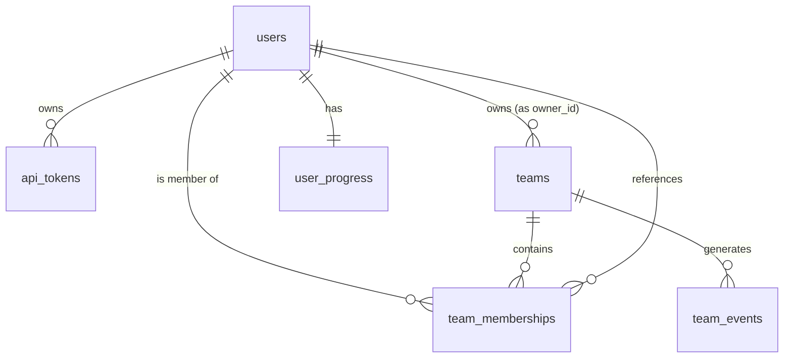
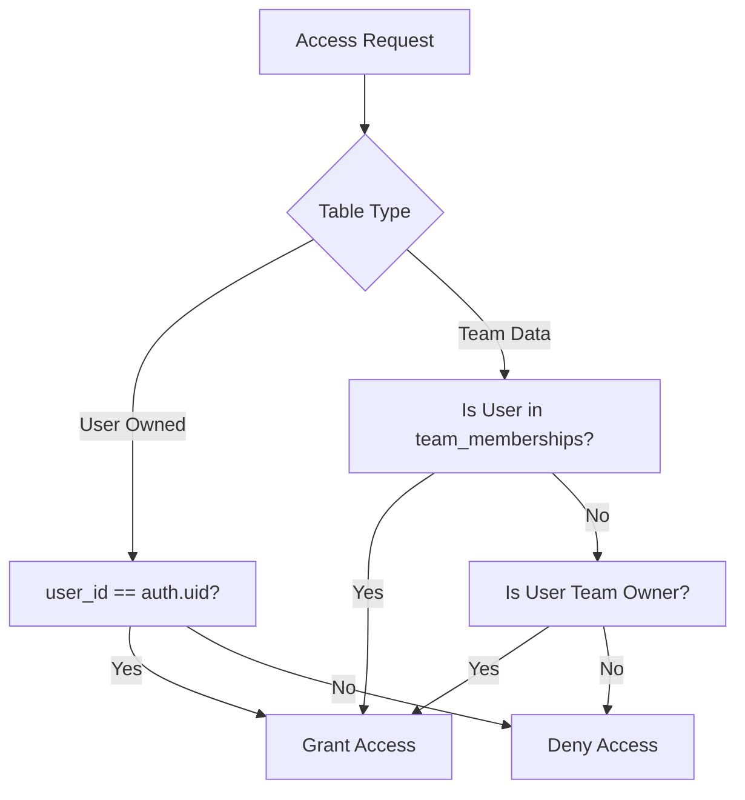
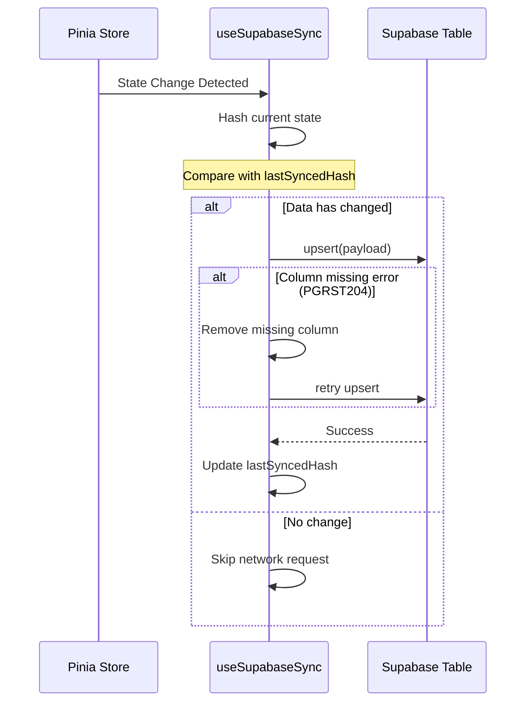

Relevant source files

The following files were used as context for generating this wiki page:

- [supabase/migrations/20251130112639_cleanup_rls_and_indexes.sql](supabase/migrations/20251130112639_cleanup_rls_and_indexes.sql)
- [app/composables/supabase/useSupabaseSync.ts](app/composables/supabase/useSupabaseSync.ts)
- [supabase/config.toml](supabase/config.toml)
- [README.md](README.md)
- [AGENTS.md](AGENTS.md)
- [code_review.md](code_review.md)

# Supabase Schema & RLS Policies

TarkovTracker utilizes Supabase as its primary backend for authentication, database storage, and real-time synchronization. The system is designed to facilitate progress tracking for both solo players and teams, using Row Level Security (RLS) to ensure data isolation and secure access.

The backend infrastructure supports essential features such as cross-device syncing, team collaboration, and public API access via tokens. This document outlines the database schema structure, the security policies governing data access, and the client-side synchronization logic.

## Database Architecture & Schema

The database is built on PostgreSQL (version 17) and is exposed via the Supabase PostgREST API. The schema is organized into several key tables that manage user progress, team structures, and authentication tokens.

### Key Database Tables

| Table | Description |
| :--- | :--- |
| `user_progress` | Stores detailed progression data including task completions and hideout status for PvP and PvE. |
| `teams` | Manages team entities, including ownership and metadata. |
| `team_memberships` | Links users to teams and defines roles (e.g., owner, member). |
| `team_events` | Logs activities within a team for real-time updates. |
| `api_tokens` | Stores user-generated tokens for programmatic access to the public API. |
| `user_system` | Stores system-level user data and settings. |

Sources: [supabase/config.toml:34](supabase/config.toml#L34), [supabase/migrations/20251130112639_cleanup_rls_and_indexes.sql:14-148](supabase/migrations/20251130112639_cleanup_rls_and_indexes.sql#L14-L148), [app/composables/supabase/useSupabaseSync.ts:134](app/composables/supabase/useSupabaseSync.ts#L134)

### Data Relationships

The following diagram illustrates the relationships between core entities in the Supabase schema:

The schema relies heavily on `user_id` (linked to `auth.uid()`) to maintain data integrity and enforce security boundaries.
Sources: [supabase/migrations/20251130112639_cleanup_rls_and_indexes.sql:14-148](supabase/migrations/20251130112639_cleanup_rls_and_indexes.sql#L14-L148)

## Row Level Security (RLS) Policies

RLS is the primary security mechanism used to protect user and team data. Policies are optimized to use `(select auth.uid())` to avoid per-row re-evaluation overhead.

### Authentication & User Isolation
Most user-specific tables (like `api_tokens` and `user_system`) restrict actions strictly to the owner.
*  **Select/Insert/Update/Delete**: Restricted where `user_id = auth.uid()`.

### Team Security Logic
Team data access is more complex, requiring checks across memberships to allow collaboration.

| Table | Policy Type | Logic |
| :--- | :--- | :--- |
| `teams` | SELECT | User must be in `team_memberships` for that `team_id`. |
| `teams` | ALL (Modify) | `auth.uid()` must match `owner_id`. |
| `team_memberships` | SELECT | User is viewing own membership OR is the owner of the team. |
| `team_events` | SELECT | User must be a member of the team associated with the event. |

Sources: [supabase/migrations/20251130112639_cleanup_rls_and_indexes.sql:4-148](supabase/migrations/20251130112639_cleanup_rls_and_indexes.sql#L4-L148), [code_review.md:55-60](code_review.md#L55-L60)

## Client-Side Synchronization (`useSupabaseSync`)

The application uses a debounced synchronization strategy to push local state changes to Supabase. This process includes change detection (hashing) to minimize unnecessary network traffic and a fallback mechanism for schema transitions.

### Synchronization Flow

### Key Synchronization Logic
*  **Debouncing**: Syncing is debounced (default 1000ms) to prevent excessive writes during rapid UI updates.
*  **Change Detection**: Uses a fast 32-bit integer hash of the JSON state to determine if an update is necessary.
*  **Schema Fallback**: If an `upsert` fails due to a missing column (often during rolling deployments), the compositor attempts to remove the problematic field and retry.

Sources: [app/composables/supabase/useSupabaseSync.ts:50-80](app/composables/supabase/useSupabaseSync.ts#L50-L80), [app/composables/supabase/useSupabaseSync.ts:149-165](app/composables/supabase/useSupabaseSync.ts#L149-L165), [app/composables/supabase/useSupabaseSync.ts:184-212](app/composables/supabase/useSupabaseSync.ts#L184-L212)

## Real-time and API Configuration

The Supabase environment is configured to handle high-concurrency real-time events and external API interactions.

### API & Connection Pooling
*  **Max Rows**: API requests are limited to 1000 rows to prevent malicious or accidental payload bloat.
*  **Transaction Mode**: The database pooler (when enabled) operates in `transaction` mode to maximize efficiency.
*  **Edge Functions**: Custom Deno-based edge functions handle sensitive operations like team management (`team-kick`, `team-join`) and token revocation.

### Auth Providers
The system supports multiple OAuth providers, with Google enabled by default in the configuration. It uses manual linking to allow users to attach multiple identities (e.g., Discord) to a single account.

Sources: [supabase/config.toml:16](supabase/config.toml#L16), [supabase/config.toml:50](supabase/config.toml#L50), [supabase/config.toml:142-158](supabase/config.toml#L142-L158), [supabase/config.toml:255-325](supabase/config.toml#L255-L325)

## Conclusion

TarkovTracker leverages Supabase's RLS and PostgreSQL capabilities to provide a secure, scalable backend. By utilizing debounced client-side syncing and strict membership-based security policies, the architecture ensures that team and individual progress data remains isolated and consistent across devices. The use of migration-driven schema updates allows the project to maintain forward compatibility during continuous deployment.
