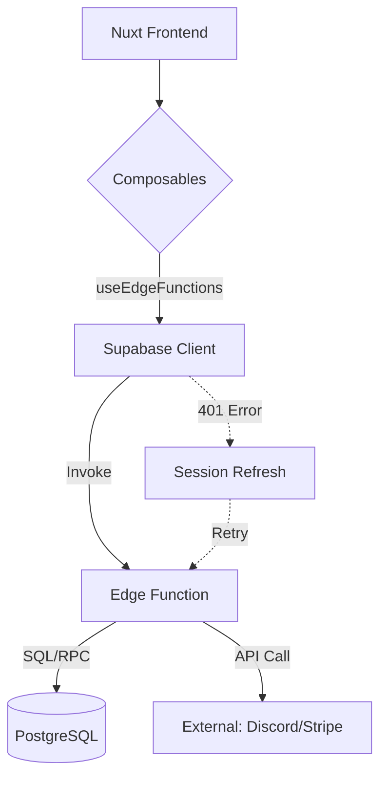
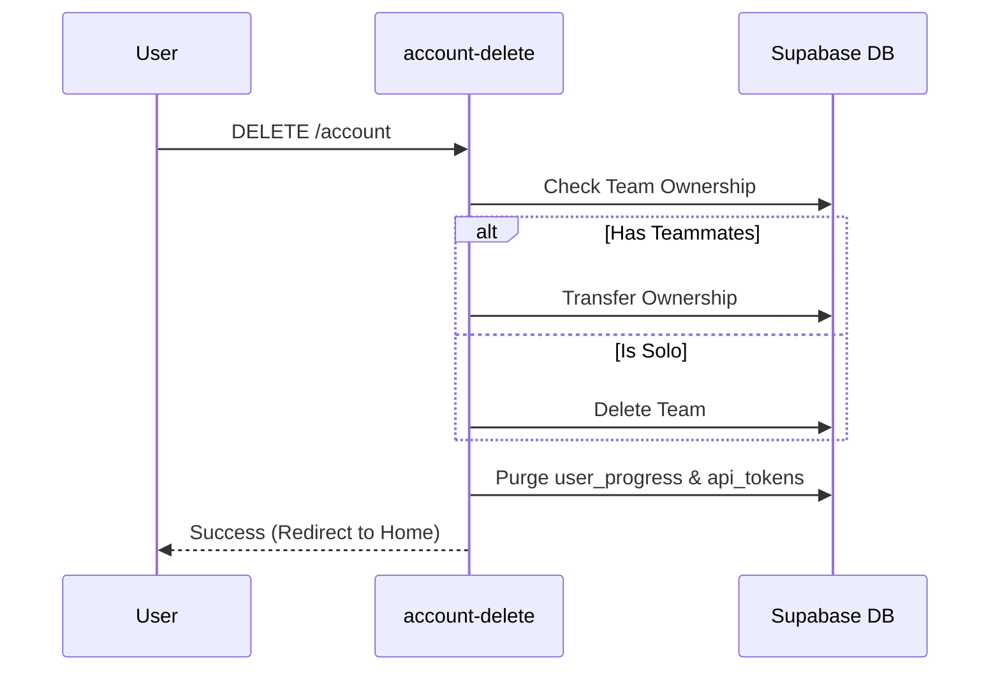

Relevant source files

The following files were used as context for generating this wiki page:

- [supabase/functions/discord-role-sync/index.ts](supabase/functions/discord-role-sync/index.ts)
- [supabase/functions/account-delete/index.ts](supabase/functions/account-delete/index.ts)
- [supabase/functions/team-create/index.ts](supabase/functions/team-create/index.ts)
- [supabase/config.toml](supabase/config.toml)
- [app/composables/__tests__/useEdgeFunctions.test.ts](app/composables/__tests__/useEdgeFunctions.test.ts)
- [AGENTS.md](AGENTS.md)
- [code_review.md](code_review.md)

# Supabase Edge Functions

Supabase Edge Functions serve as the server-side logic layer for TarkovTracker, handling operations that require elevated privileges, interaction with third-party APIs (like Discord or Stripe), or complex database transactions that bypass standard Row Level Security (RLS). These functions are written in TypeScript and executed in a Deno-based runtime environment.

Sources: [AGENTS.md:45](AGENTS.md#L45), [supabase/config.toml:304-312](supabase/config.toml#L304-L312), [code_review.md:34-36](code_review.md#L34-L36)

## Architecture and Runtime

The edge function infrastructure is built on Deno (Major Version 2) and is configured to allow hot-reloading during local development using the `per_worker` policy. Functions are accessed via the Supabase client on the frontend or through the Cloudflare API gateway.

Sources: [supabase/config.toml:304-312](supabase/config.toml#L304-L312), [AGENTS.md:65](AGENTS.md#L65)

### Request Flow

When the TarkovTracker frontend needs to perform a secure action (e.g., creating a team or revoking an API token), it invokes the corresponding Edge Function. The system is designed with a retry mechanism that refreshes expired sessions automatically if a `401 Unauthorized` error is encountered during invocation.

This diagram illustrates the flow from the user interface through the client-side composables to the server-side logic in Supabase.
Sources: [app/composables/__tests__/useEdgeFunctions.test.ts:80-91](app/composables/__tests__/useEdgeFunctions.test.ts#L80-L91), [app/composables/__tests__/useEdgeFunctions.test.ts:168-193](app/composables/__tests__/useEdgeFunctions.test.ts#L168-L193)

## Core Function Modules

The project defines several specific edge functions, most of which have `verify_jwt` disabled in the configuration to allow the functions to handle authentication logic internally or to accommodate external webhooks.

Sources: [supabase/config.toml:314-350](supabase/config.toml#L314-L350)

### Functional Overview Table

| Function Name | JWT Verify | Primary Purpose |
| :--- | :---: | :--- |
| `team-create` | False | Initializes new teams with join codes and member limits. |
| `account-delete` | False | Performs irreversible removal of user progress and personal data. |
| `discord-role-sync` | False | Synchronizes supporter tiers with roles in the TarkovTracker Discord. |
| `stripe-webhook` | False | Handles payment deliveries (validates via Stripe-Signature). |
| `token-create` | False | Generates public API tokens for external integration. |
| `admin-cache-purge` | False | Triggered by administrators to clear Tarkov data or static assets. |

Sources: [supabase/config.toml:314-350](supabase/config.toml#L314-L350), [supabase/functions/team-create/index.ts](supabase/functions/team-create/index.ts), [supabase/functions/account-delete/index.ts](supabase/functions/account-delete/index.ts)

## Implementation Details

### Team Management
The `team-create` function is responsible for setting up team metadata, including the game mode (PvP/PvE), join codes, and maximum member capacity. Even if a custom gateway URL is configured for team operations, the client invokes this function directly via the Supabase client.

Sources: [supabase/functions/team-create/index.ts](supabase/functions/team-create/index.ts), [app/composables/__tests__/useEdgeFunctions.test.ts:121-140](app/composables/__tests__/useEdgeFunctions.test.ts#L121-L140)

### API Token Lifecycle
Tokens are managed through `token-create` and `token-revoke`. The revocation logic includes a fallback mechanism: if the dedicated edge function fails (e.g., returns a `404`), the client-side logic attempts a direct delete operation on the `api_tokens` table.

Sources: [supabase/config.toml:330-333](supabase/config.toml#L330-L333), [app/composables/__tests__/useEdgeFunctions.test.ts:219-255](app/composables/__tests__/useEdgeFunctions.test.ts#L219-L255)

### Data Privacy and Deletion
The `account-delete` module handles the complex task of wiping a user's existence from the platform. This includes:
1.  Clearing progress tracking data.
2.  Transferring team ownership to the oldest member or disbanding teams.
3.  Revoking all active API tokens.

This sequence demonstrates the logic executed within the account-deletion edge function to ensure no orphaned teams remain.
Sources: [supabase/functions/account-delete/index.ts](supabase/functions/account-delete/index.ts), [app/pages/terms-of-service.vue (contextual)](app/pages/terms-of-service.vue (contextual))

## Security and Validation

Every code change affecting `supabase/functions/` must be manually inspected for Deno API compatibility, as they are not covered by the standard project-wide Vitest suite.

Sources: [code_review.md:14-16](code_review.md#L14-L16), [code_review.md:34-36](code_review.md#L34-L36)

### Error Handling
The client-side wrappers normalize errors from these functions into `SupabaseFunctionError` objects, which include:
*  `status`: The HTTP status code returned by the function.
*  `functionName`: The name of the function that failed.
*  `data`: The JSON error payload from the function body.

Sources: [app/composables/__tests__/useEdgeFunctions.test.ts:194-217](app/composables/__tests__/useEdgeFunctions.test.ts#L194-L217)

## Conclusion

Supabase Edge Functions represent the authoritative backend logic for TarkovTracker. By utilizing the Deno runtime, the project separates sensitive data manipulation and external integrations from the client application, ensuring that operations like payment processing, team creation, and account deletion are handled securely and consistently.

Sources: [AGENTS.md:45](AGENTS.md#L45), [supabase/config.toml:304-312](supabase/config.toml#L304-L312)
