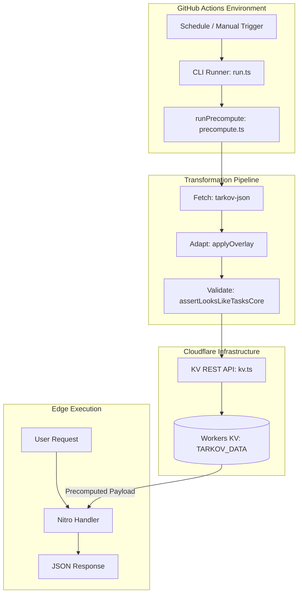

<details>
<summary>Relevant source files</summary>

The following files were used as context for generating this wiki page:

- [scripts/precompute/precompute.ts](scripts/precompute/precompute.ts)
- [scripts/precompute/kv.ts](scripts/precompute/kv.ts)
- [scripts/precompute/run.ts](scripts/precompute/run.ts)
- [AGENTS.md](AGENTS.md)
- [code_review.md](code_review.md)
- [wrangler.toml](wrangler.toml)

</details>

# Data Precomputation Pipeline

The Data Precomputation Pipeline is a standalone system designed to process heavy game data payloads—specifically the "tasks-core" dataset—before they are requested by clients. By executing the resource-intensive fetch, adapt, and overlay transformations ahead of time, the project avoids Cloudflare Workers' CPU limits and prevents request timeouts (Cloudflare Error 1102) on cold or low-traffic edge locations.

The pipeline reuses the core server-side logic from the main application but runs within GitHub Actions. The resulting processed JSON blobs are stored in a Cloudflare Workers KV namespace, which Nitro request handlers then read to serve data globally with minimal latency.
Sources: [scripts/precompute/precompute.ts:1-18](scripts/precompute/precompute.ts#L1-L18), [AGENTS.md:65-71](AGENTS.md#L65-L71)

## Architecture and Components

The pipeline consists of a CLI runner, a KV storage adapter, and the core precompute logic. It is architected to be environment-agnostic, allowing for local execution via flags or automated execution via GitHub Actions.

### Component Overview

| Component | Responsibility | Source |
| :--- | :--- | :--- |
| **GitHub Actions** | Orchestrates the 12h schedule and manages secrets for Cloudflare access. | [scripts/precompute/run.ts:3-5](scripts/precompute/run.ts#L3-L5) |
| **CLI Runner (`run.ts`)** | Parses environment variables/flags and initializes the KV writer. | [scripts/precompute/run.ts:25-40](scripts/precompute/run.ts#L25-L40) |
| **Pipeline Logic (`precompute.ts`)** | Iterates through language/mode combinations and performs data validation. | [scripts/precompute/precompute.ts:60-91](scripts/precompute/precompute.ts#L60-L91) |
| **KV REST Writer (`kv.ts`)** | Provides a thin wrapper over the Cloudflare KV REST API to persist payloads. | [scripts/precompute/kv.ts](scripts/precompute/kv.ts) |
| **Nitro Handlers** | Read from the `TARKOV_DATA` KV binding with a fallback to the Cache API. | [wrangler.toml:22-30](wrangler.toml#L22-L30) |

### Data Flow

The following diagram illustrates the lifecycle of a data transformation from the upstream source to the edge KV store:



The pipeline uses a sequential processing model for language and game mode combinations to maintain a flat memory profile and avoid overloading upstream APIs.
Sources: [scripts/precompute/precompute.ts:74-80](scripts/precompute/precompute.ts#L74-L80), [scripts/precompute/run.ts:3-12](scripts/precompute/run.ts#L3-L12)

## Processing Logic

The core logic handles the iteration through all supported `lang` and `gameMode` combinations defined in the application constants.

### Validation and Sanity Checks
To prevent "poisoning" the global KV store with broken data (e.g., an empty upstream response that still parses as valid JSON), the pipeline performs strict structural validation. If a payload contains no tasks or malformed objective arrays, the pipeline throws an error and refuses to write the key. The previous KV entry remains active, as entries are configured with a 7-day TTL to survive temporary pipeline outages.
Sources: [scripts/precompute/precompute.ts:26-27](scripts/precompute/precompute.ts#L26-L27), [scripts/precompute/precompute.ts:100-125](scripts/precompute/precompute.ts#L100-L125)

### Key Generation
Keys are generated using the same utility functions used by the server routes to ensure consistency between the writer and the reader.
- **Pattern**: `tasks-core:[lang]:[gameMode]`
- **TTL**: 604,800 seconds (7 days).
Sources: [scripts/precompute/precompute.ts:26](scripts/precompute/precompute.ts#L26), [scripts/precompute/precompute.ts:81-87](scripts/precompute/precompute.ts#L81-L87)

## Infrastructure Configuration

The pipeline requires specific bindings and environment variables to interact with Cloudflare's edge storage.

### Cloudflare KV Binding
The `wrangler.toml` file defines the `TARKOV_DATA` namespace used by both the production and preview environments. This allows the precompute workflow to populate data once for all deployments.

```toml
[[kv_namespaces]]
binding = "TARKOV_DATA"
id = "6034d8d7b7534946bf04110c33ac3b88"
```

Sources: [wrangler.toml:22-35](wrangler.toml#L22-L35), [wrangler.toml:79-82](wrangler.toml#L79-L82)

### Required Environment Variables
The CLI runner expects the following secrets to be present in the GitHub Actions environment:

| Variable | Scope | Description |
| :--- | :--- | :--- |
| `CLOUDFLARE_API_TOKEN` | Workers KV | Must have `Workers KV Storage: Edit` permissions. |
| `CLOUDFLARE_ACCOUNT_ID` | Account | The ID of the account owning the namespace. |
| `TARKOV_DATA_KV_NAMESPACE_ID` | Namespace | The unique ID for the `TARKOV_DATA` bucket. |

Sources: [scripts/precompute/run.ts:11-17](scripts/precompute/run.ts#L11-L17), [scripts/precompute/run.ts:41-45](scripts/precompute/run.ts#L41-L45)

## Integration with Nitro Handlers

Nitro request handlers are designed to be "KV-aware." They attempt to read from the `TARKOV_DATA` binding using the `edgeCache` utility's `precomputed` option. 

### Fallback Mechanism
If the KV binding is missing (e.g., in a local development environment without Cloudflare access) or if a specific entry is absent, the handlers automatically fall back to the standard per-colo Cache API path. This ensures that a pipeline failure or misconfiguration results in degraded performance rather than a total system outage.
Sources: [AGENTS.md:68-71](AGENTS.md#L68-L71), [code_review.md:71-78](code_review.md#L71-L78), [wrangler.toml:25-30](wrangler.toml#L25-L30)

## Conclusion

The Data Precomputation Pipeline is a critical performance optimization for TarkovTracker. It shifts the heavy lifting of data processing from the request-time edge execution to a scheduled CI/CD environment. This architecture allows the application to serve complex, localized game data payloads within the strict CPU and memory constraints of Cloudflare's serverless platform.
