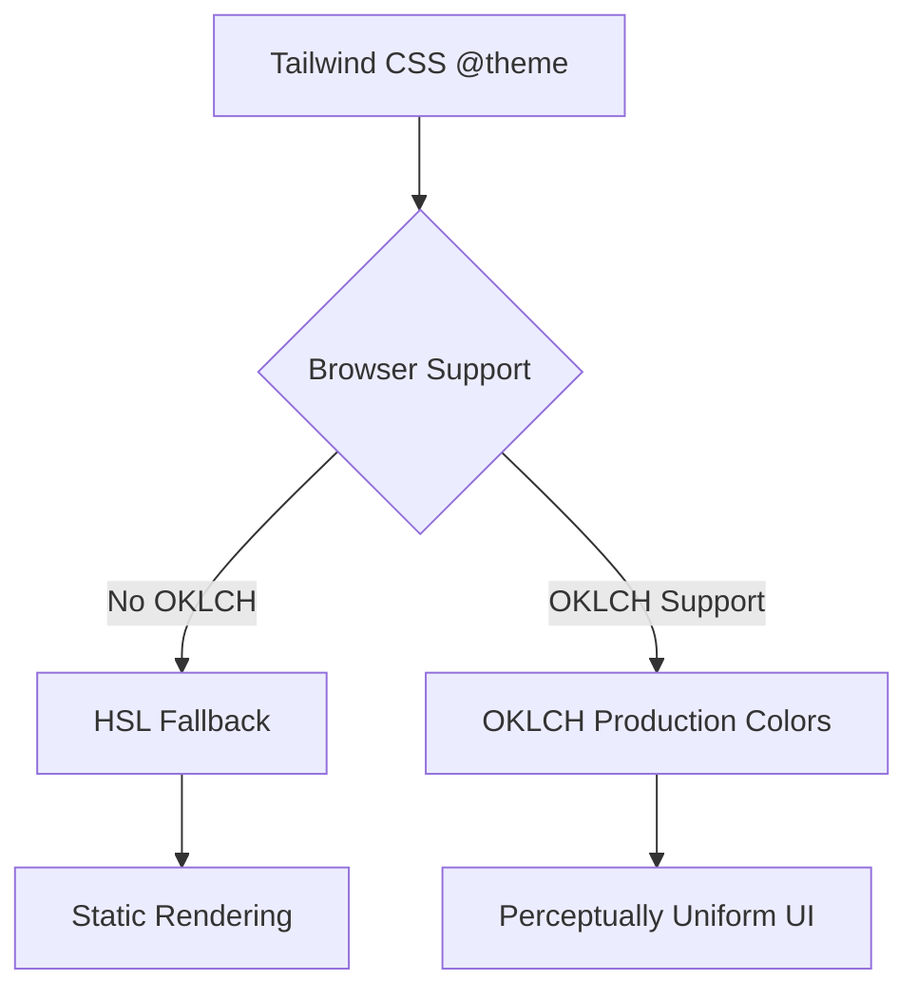
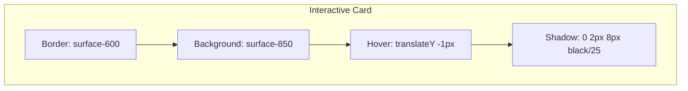

Relevant source files

The following files were used as context for generating this wiki page:

- [app/assets/css/tailwind.css](app/assets/css/tailwind.css)
- [DESIGN.md](DESIGN.md)
- [AGENTS.md](AGENTS.md)
- [app/features/tasks/TaskCardHeader.vue](app/features/tasks/TaskCardHeader.vue)
- [app/components/ui/GlobalHelpLauncher.vue](app/components/ui/GlobalHelpLauncher.vue)
- [app/features/hideout/HideoutRequirement.vue](app/features/hideout/HideoutRequirement.vue)

# UI Design System & Tailwind

TarkovTracker utilizes a dense, tactical UI design system built primarily on Nuxt 4, Vue 3, and Tailwind CSS v4. The system is designed to provide high functional density, allowing players to scan complex task and item data quickly. It emphasizes a dark "tactical" aesthetic using a specific color ladder and monospace typography for readability across dense data surfaces.

Sources: [DESIGN.md:14-19](DESIGN.md#L14-L19), [AGENTS.md:38-40](AGENTS.md#L38-L40)

## Core Design Principles

The design system prioritizes professional, compact app ergonomics over marketing-style spacing. It adheres to a dark surface ladder that creates depth through contrast rather than decorative elements like gradients or glows.

### Visual Architecture
The UI is structured around a "surface ladder" that defines background and component colors based on their elevation in the interface:

*  **Canvas:** The base page background.
*  **Shell:** Application chrome (sidebars, app bars).
*  **Panel:** Content containers.
*  **Raised:** Interactive controls and cards.

Sources: [DESIGN.md:55-66](DESIGN.md#L55-L66), [app/assets/css/tailwind.css:126-137](app/assets/css/tailwind.css#L126-L137)

### Two-Layer Color Architecture
The system employs a dual-layer strategy for color rendering to ensure both compatibility and high-fidelity output. HSL values provide static fallbacks for older browsers, while OKLCH values (perceptually tuned) are used in modern browsers for uniform chroma and natural desaturation.

Sources: [DESIGN.md:46-53](DESIGN.md#L46-L53), [app/assets/css/tailwind.css:144-150](app/assets/css/tailwind.css#L144-L150)

## Color Palettes & Semantic Mapping

Colors are strictly controlled via Tailwind v4 theme tokens. Hex values are prohibited in Vue templates to maintain consistency.

### Primary and Accent Colors
The "brand" identity is defined by a golden-tan primary palette and teal secondary accents.

| Palette | Usage | CSS Token |
| :--- | :--- | :--- |
| **Primary** | Main actions and branding | `--color-primary-*` |
| **Secondary** | General UI accents | `--color-secondary-*` |
| **Accent** | Deep forest/teal for informational tones | `--color-accent-*` |
| **Success** | Vibrant teal-green for completions | `--color-success-*` |
| **Error** | Muted red for failures or requirements | `--color-error-*` |

Sources: [DESIGN.md:27-38](DESIGN.md#L27-L38), [app/assets/css/tailwind.css:17-80](app/assets/css/tailwind.css#L17-L80)

### Game Mode Palettes
The system includes dedicated tokens for game modes to avoid ad-hoc styling:
*  **PvP:** In-game tan shades (`--color-pvp-*`).
*  **PvE:** In-game blue shades (`--color-pve-*`).

Sources: [DESIGN.md:68-69](DESIGN.md#L68-L69), [app/assets/css/tailwind.css:98-124](app/assets/css/tailwind.css#L98-L124)

## Typography & Spacing

### Font Stack
The application uses a monospace stack for both interface controls and display text to reinforce the "tactical" aesthetic.

*  **Body:** Monospace (14px, 400 weight).
*  **Heading:** Monospace (20px, 700 weight).

Sources: [DESIGN.md:39-44](DESIGN.md#L39-L44), [app/assets/css/tailwind.css:9-15](app/assets/css/tailwind.css#L9-L15)

### Layout & Spacing Scale
Functional density is preferred. The system uses a standard radius and spacing scale to ensure uniformity.

| Type | Small (sm) | Medium (md) | Large (lg) |
| :--- | :--- | :--- | :--- |
| **Rounded Corners** | 4px | 8px | 12px |
| **Spacing Gap** | 8px | 16px | 24px |

Sources: [DESIGN.md:78-83](DESIGN.md#L78-L83), [app/assets/css/tailwind.css:14-16](app/assets/css/tailwind.css#L14-L16)

## Component Design System

Components are built primarily using Nuxt UI primitives (`UButton`, `UInput`, `UCard`) extended with custom styles and feature-specific components.

### Card Architecture
Cards use the `surface-800` (raised) background. They are often interactive, featuring subtle hover transformations.

Sources: [DESIGN.md:94-96](DESIGN.md#L94-L96), [app/assets/css/tailwind.css:327-340](app/assets/css/tailwind.css#L327-L340)

### Component Examples
Many components integrate icons and tooltips to maintain high density without sacrificing clarity:
*  **TaskCardHeader:** Combines trader images, faction icons, and wiki links in a compact flex container.
*  **HideoutRequirement:** Uses a grid-based card layout for items, including status badges (FiR) and count progress.
*  **GlobalHelpLauncher:** A complex UI element using `UPopover` and `UModal` for onboarding, styled with `surface-900/98` for high contrast.

Sources: [app/features/tasks/TaskCardHeader.vue:2-20](app/features/tasks/TaskCardHeader.vue#L2-L20), [app/features/hideout/HideoutRequirement.vue:4-38](app/features/hideout/HideoutRequirement.vue#L4-L38), [app/components/ui/GlobalHelpLauncher.vue:90-110](app/components/ui/GlobalHelpLauncher.vue#L90-L110)

## Implementation Standards

Developers must follow strict guidelines to preserve the design system's integrity:

1.  **Tailwind v4 only:** No `<style>` blocks, SCSS, or scoped CSS are allowed in components.
2.  **No Hex Codes:** All colors must reference theme tokens (e.g., `text-primary-500` instead of `#9a8866`).
3.  **Monospace Only:** All text should utilize the pre-configured monospace stack.
4.  **Density First:** Prefer `gap-4`, `p-4`, and functional density over excessive white space.

Sources: [DESIGN.md:46-47](DESIGN.md#L46-L47), [DESIGN.md:73-74](DESIGN.md#L73-L74), [AGENTS.md:144-148](AGENTS.md#L144-L148)

## Conclusion
The TarkovTracker UI Design System leverages the modern OKLCH color space and Tailwind v4 to deliver a high-performance, visually consistent "tactical" interface. By enforcing token-based styling and a strict surface ladder, the system ensures that complex data tracking remains readable and efficient for users across various game modes and devices.
