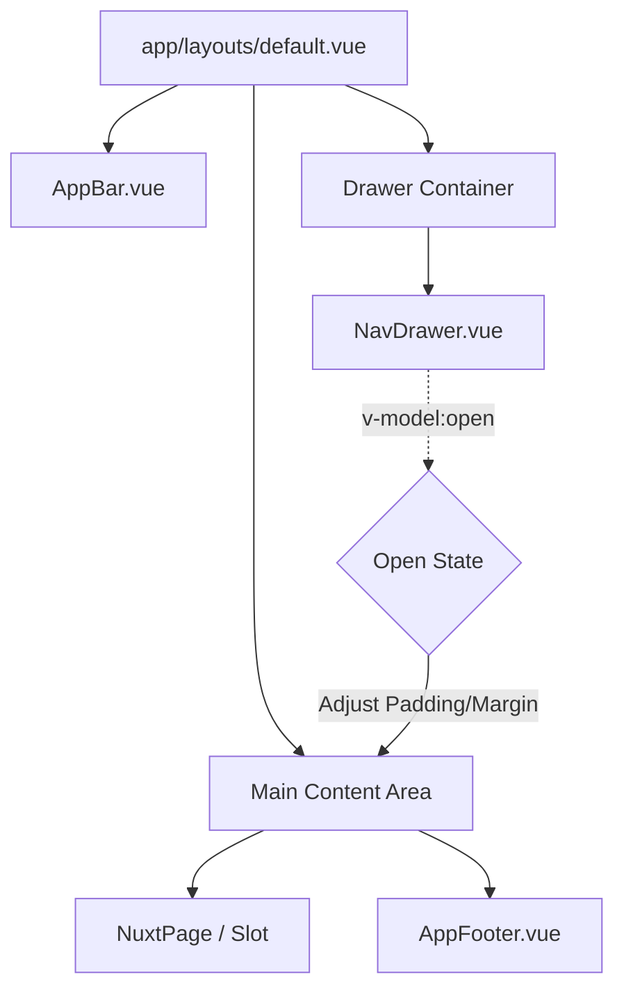
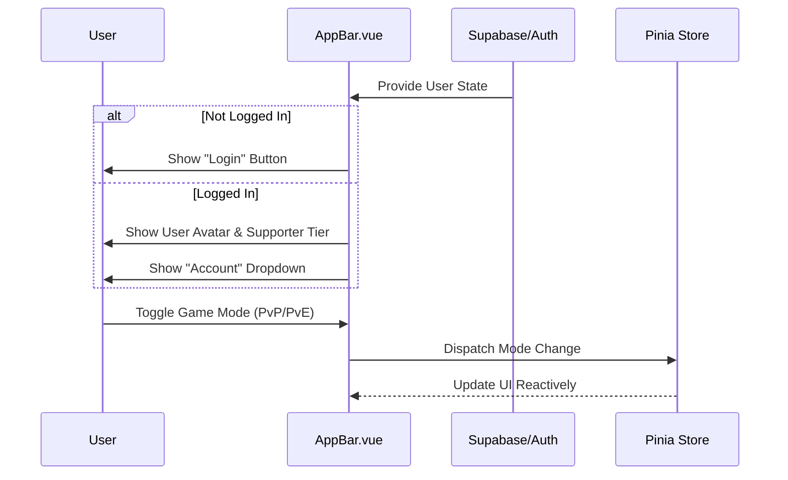

Relevant source files

The following files were used as context for generating this wiki page:

- [app/shell/AppBar.vue](app/shell/AppBar.vue)
- [app/shell/NavDrawer.vue](app/shell/NavDrawer.vue)
- [app/shell/AppFooter.vue](app/shell/AppFooter.vue)
- [app/layouts/default.vue](app/layouts/default.vue)
- [DESIGN.md](DESIGN.md)
- [AGENTS.md](AGENTS.md)

# App Shell & Navigation

The App Shell of TarkovTracker serves as the structural foundation of the single-page application (SPA), providing a persistent user interface for navigation, status monitoring, and global actions. Built with Nuxt 4 and Vue 3, it follows a "tactical" design philosophy characterized by dark application chrome, high functional density, and high-speed scanability. The shell ensures that critical tools like task tracking, hideout management, and team collaboration are always accessible while maintaining separate progress states for PvP and PvE game modes.

Sources: [DESIGN.md:104-108](DESIGN.md#L104-L108), [AGENTS.md:73-77](AGENTS.md#L73-L77), [app/layouts/default.vue](app/layouts/default.vue)

## Core Architecture

The application layout is orchestrated within a primary layout component that organizes the major UI regions. It utilizes a combination of a top bar, a collapsible side drawer, and a main content area that responds to the drawer's state.

### Structural Components

| Component | Description | File Path |
| :--- | :--- | :--- |
| **AppBar** | The top navigation bar containing global search, game mode switching, and user account management. | `app/shell/AppBar.vue` |
| **NavDrawer** | The primary navigation menu containing links to all functional domain slices (Tasks, Hideout, Maps, etc.). | `app/shell/NavDrawer.vue` |
| **AppFooter** | The bottom section containing legal links, community links (Discord/GitHub), and support calls to action. | `app/shell/AppFooter.vue` |
| **Default Layout** | The root layout container that manages the visibility and arrangement of the shell components. | `app/layouts/default.vue` |

Sources: [app/shell/AppBar.vue](app/shell/AppBar.vue), [app/shell/NavDrawer.vue](app/shell/NavDrawer.vue), [app/shell/AppFooter.vue](app/shell/AppFooter.vue), [app/layouts/default.vue](app/layouts/default.vue)

### Layout Rendering Flow
The default layout manages the spatial relationship between the drawer and the content. It tracks the open/closed state of the `NavDrawer` to adjust the margins and padding of the main content area, ensuring that navigation elements do not overlap user-interactive content on larger screens.

The diagram shows the hierarchical structure of the app shell and how the state of the navigation drawer influences the layout of the main content area.
Sources: [app/layouts/default.vue](app/layouts/default.vue), [app/shell/NavDrawer.vue](app/shell/NavDrawer.vue)

## Navigation Drawer (NavDrawer)

The `NavDrawer` is the primary vertical navigation system. It is organized into semantic sections that group related features and tools.

### Domain Slices
The drawer provides access to specific domain slices defined in the project structure:
- **Core Tracking**: Home (Dashboard), Tasks, Hideout, Needed Items, Storyline.
- **Advanced Tools**: Kappa & Lightkeeper Tracker, Maps.
- **Social/Account**: Team, Profile, Settings.
- **External/Community**: Support, Credits, Resources.

Sources: [AGENTS.md:73-82](AGENTS.md#L73-L82), [app/shell/NavDrawer.vue](app/shell/NavDrawer.vue)

### Interaction Logic
- **Collapsibility**: On desktop, the drawer can be collapsed to an icon-only view or expanded to show text labels. On mobile, it behaves as a full-screen or partial overlay.
- **Game Mode Context**: The drawer displays the current player level and faction, which are reactive to the selected game mode (PvP or PvE).
- **Active States**: Links are automatically highlighted based on the current route metadata.

Sources: [app/shell/NavDrawer.vue](app/shell/NavDrawer.vue), [DESIGN.md:139-142](DESIGN.md#L139-L142)

## Application Bar (AppBar)

The `AppBar` acts as the global command center for the user. It remains fixed at the top of the viewport and facilitates high-frequency actions.

### Key Features
1.  **Game Mode Switcher**: A toggle to switch between PvP and PvE modes, triggering a global state change that updates task progress and hideout data across the entire shell.
2.  **Global Search (Omnibar)**: Provides quick access to items, tasks, and traders.
3.  **User Identity**: Displays user avatars (proxied from OAuth providers) and supporter badges.
4.  **Help Launcher**: A global help button that triggers onboarding flows or page-specific guides.

Sources: [app/shell/AppBar.vue](app/shell/AppBar.vue), [AGENTS.md:73-77](AGENTS.md#L73-L77), [DESIGN.md:120-125](DESIGN.md#L120-L125)

### User State Sequence
The AppBar UI changes dynamically based on the authentication state provided by the Supabase plugin.

The sequence illustrates how the AppBar handles authentication state and user-driven game mode changes to update the application's global context.
Sources: [app/shell/AppBar.vue](app/shell/AppBar.vue), [AGENTS.md:144-150](AGENTS.md#L144-L150)

## Visual and Ergonomic Standards

The shell follows specific design constraints to ensure a "quiet" and fast user experience.

### Color Ladder
The shell chrome uses a specific "surface ladder" defined in the design spec to maintain contrast and depth without excessive decoration:
- **Chrome/Shell**: `surface-900`
- **Raised Controls**: `surface-800`
- **Dividers**: `surface-600`
- **Primary Actions**: Tan (`primary`)
- **Informational Accents**: Teal (`secondary`/`accent`)

Sources: [DESIGN.md:126-133](DESIGN.md#L126-L133)

### Spacing and Density
- **Functional Density**: The shell avoids "marketing-style" spacing, preferring tight, predictable Tailwind spacing (e.g., `gap-4`, `p-4`).
- **Typography**: Uses a monospace font stack (`ui-monospace`) for both interface controls and data displays to reinforce the tactical feel.

Sources: [DESIGN.md:134-138](DESIGN.md#L134-L138), [DESIGN.md:143-148](DESIGN.md#L143-L148)

## Summary

The App Shell & Navigation system in TarkovTracker is a reactive, client-side framework that prioritizes functional efficiency. By isolating navigation into the `NavDrawer` and global state management into the `AppBar`, the system allows users to seamlessly switch between different game modes and tracking modules. The use of Nuxt 4 and Tailwind CSS v4 enables a dense, highly-performant UI that adapts to both complex desktop workflows and quick mobile checks.

Sources: [AGENTS.md:95-98](AGENTS.md#L95-L98), [DESIGN.md:104-110](DESIGN.md#L104-L110)
