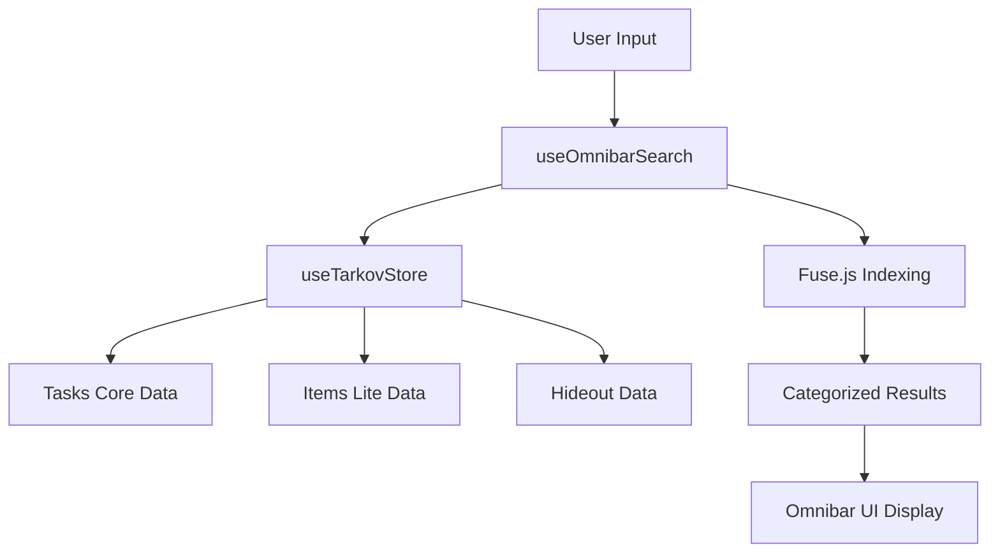
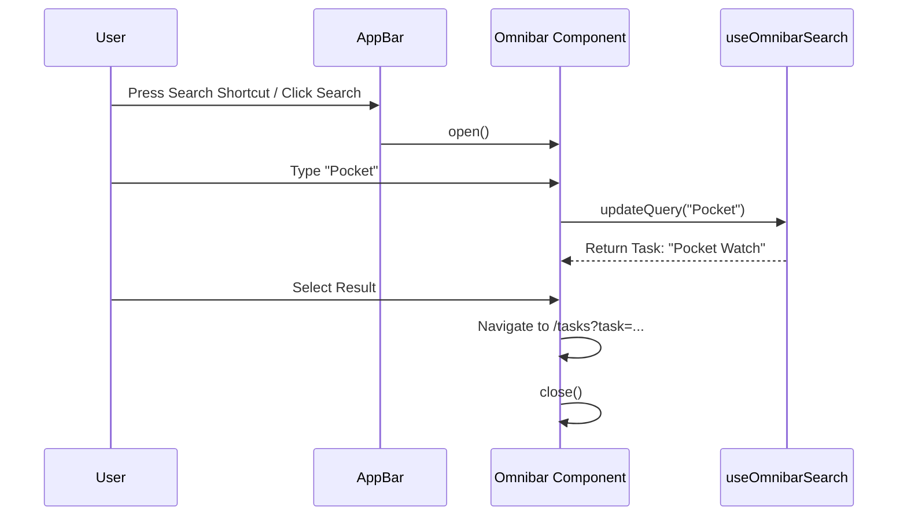

Relevant source files

The following files were used as context for generating this wiki page:

- [app/features/omnibar/Omnibar.vue](app/features/omnibar/Omnibar.vue)
- [app/features/omnibar/useOmnibarSearch.ts](app/features/omnibar/useOmnibarSearch.ts)
- [app/locales/en.json](app/locales/en.json)
- [DESIGN.md](DESIGN.md)
- [app/shell/AppBar.vue](app/shell/AppBar.vue)
- [app/stores/useTarkovStore.ts](app/stores/useTarkovStore.ts)

# Omnibar & Search

The Omnibar is a central navigation and discovery component within TarkovTracker, providing a unified search interface for tasks, items, and hideout stations. It functions as a global command palette that allows users to quickly locate game entities and navigate to relevant sections of the application without manual menu traversal.

The search system utilizes a fuzzy matching logic powered by the `fuse.js` library, indexing data across multiple domains including the task list, item requirements, and hideout modules. This system is integrated into the application shell, ensuring availability across all game modes and pages.

## Architecture and Components

The search feature is built as a modular system consisting of a UI component, a specialized composable for search logic, and integration with the central state management.

### Component Structure
The primary interface is `Omnibar.vue`, which leverages the `UModal` and `UCommandPalette` components from the Nuxt UI library. It provides a tactile, keyboard-driven interface consistent with the project's tactical and dark design aesthetic.

Sources: [app/features/omnibar/Omnibar.vue:1-50](app/features/omnibar/Omnibar.vue#L1-L50), [DESIGN.md:10-25](DESIGN.md#L10-L25)

### Search Composable
`useOmnibarSearch.ts` serves as the logic layer. It initializes the search indexes and handles the filtering of results based on user input. It aggregates data from the `useTarkovStore`, ensuring that the search results reflect the user's current game mode (PvP or PvE) and progress.

Sources: [app/features/omnibar/useOmnibarSearch.ts:1-20](app/features/omnibar/useOmnibarSearch.ts#L1-L20), [app/stores/useTarkovStore.ts](app/stores/useTarkovStore.ts)

### Data Flow Diagram

The following diagram illustrates how user input flows through the Omnibar system to produce categorized results.

The diagram shows the aggregation of game data into a centralized index for fuzzy searching. 
Sources: [app/features/omnibar/useOmnibarSearch.ts:25-45](app/features/omnibar/useOmnibarSearch.ts#L25-L45), [app/features/omnibar/Omnibar.vue:15-30](app/features/omnibar/Omnibar.vue#L15-L30)

## Search Categories and Logic

The Omnibar organizes results into specific groups to improve scannability.

### Indexed Domains
| Group | Description | Data Source |
| :--- | :--- | :--- |
| **Tasks / Quests** | Searchable by task name and trader. | `tarkovStore.tasks` |
| **Needed Items** | Items required for active tasks or hideout upgrades. | `tarkovStore.items` |
| **Hideout Stations** | Functional modules within the player hideout. | `tarkovStore.hideout` |

Sources: [app/locales/en.json:65-75](app/locales/en.json#L65-L75), [app/features/omnibar/useOmnibarSearch.ts:50-65](app/features/omnibar/useOmnibarSearch.ts#L50-L65)

### Fuzzy Search Configuration
The system uses `Fuse.js` to handle approximate matching. This allows for typos or partial names to still return relevant results. The indexing is weighted toward entity names but also considers secondary metadata like trader names for tasks.

Sources: [app/features/omnibar/useOmnibarSearch.ts:10-30](app/features/omnibar/useOmnibarSearch.ts#L10-L30)

## User Interface and Interaction

The Omnibar follows the "tactical and quiet" design philosophy outlined in the project's design contract.

### Visual Style
- **Color Palette**: Uses the `surface-900` shell color and `surface-850` content panels.
- **Typography**: Employs a monospace stack for high information density.
- **Feedback**: Provides a "Minimum characters" hint and "No results" states localized via the i18n system.

Sources: [DESIGN.md:30-45](DESIGN.md#L30-L45), [app/locales/en.json:68-72](app/locales/en.json#L68-L72)

### Interaction Flow
The following sequence diagram describes the user interaction when opening the Omnibar and selecting a result.

Interaction sequence from trigger to navigation.
Sources: [app/features/omnibar/Omnibar.vue:35-55](app/features/omnibar/Omnibar.vue#L35-L55), [app/shell/AppBar.vue:10-25](app/shell/AppBar.vue#L10-L25)

## Key Functions and Data Structures

### `useOmnibarSearch` Composable
- **`searchQuery`**: A reactive string tracking user input.
- **`results`**: A computed property that returns an array of objects categorized by type (Task, Item, Station).
- **`minChars`**: Logic enforcing a 2-character minimum before search execution to preserve performance.

### `Omnibar.vue` Logic
- **`onSelect(item)`**: Handles the navigation logic when a result is clicked or selected via Enter. It routes the user to specific pages with query parameters (e.g., `task_id`).
- **`isOpen`**: Reactive boolean controlled by global keyboard listeners (standard shortcut is often `/` or `Ctrl+K`).

Sources: [app/features/omnibar/useOmnibarSearch.ts:5-20](app/features/omnibar/useOmnibarSearch.ts#L5-L20), [app/features/omnibar/Omnibar.vue:5-25](app/features/omnibar/Omnibar.vue#L5-L25), [app/locales/en.json:69-70](app/locales/en.json#L69-L70)

## Summary

The Omnibar and Search system in TarkovTracker provide a high-efficiency entry point for data discovery. By aggregating tasks, items, and hideout modules into a single fuzzy-searchable interface, the application enables rapid progress tracking. The implementation leverages `Fuse.js` for robust matching and follows a strict dark-themed design language to maintain visual consistency with the Escape from Tarkov universe.
