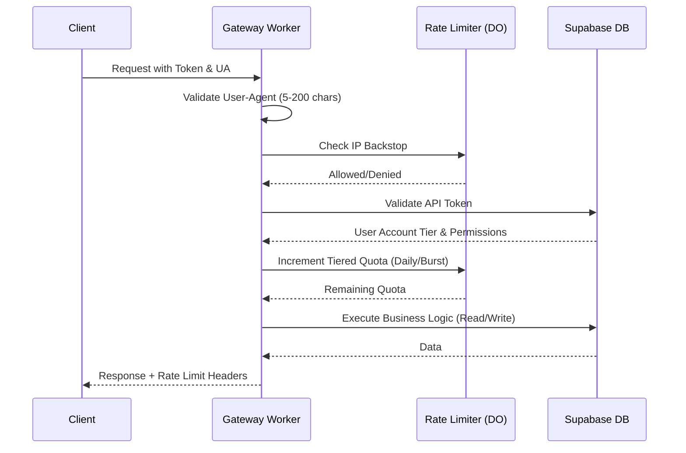
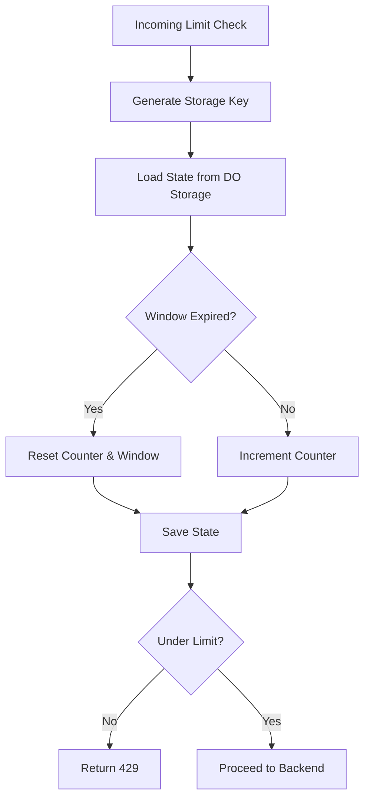

Relevant source files

The following files were used as context for generating this wiki page:

- [workers/api-gateway/src/index.ts](workers/api-gateway/src/index.ts)
- [workers/api-gateway/src/limits.ts](workers/api-gateway/src/limits.ts)
- [workers/api-gateway/wrangler.toml](workers/api-gateway/wrangler.toml)
- [workers/api-gateway/src/openapi.ts](workers/api-gateway/src/openapi.ts)
- [workers/api-gateway/src/__tests__/gateway.test.ts](workers/api-gateway/src/__tests__/gateway.test.ts)
- [docs/RATE_LIMITING.md](docs/RATE_LIMITING.md)

# API Gateway & Rate Limiting

The API Gateway is a Cloudflare Worker-based service that acts as the primary entry point for public programmatic access to TarkovTracker user and team progression data. Its primary purpose is to provide a secure, authenticated, and rate-limited interface for external tools while protecting the underlying Supabase infrastructure from abuse. Sources: [workers/api-gateway/src/openapi.ts:6-9](workers/api-gateway/src/openapi.ts#L6-L9), [workers/api-gateway/wrangler.toml](workers/api-gateway/wrangler.toml)

The gateway manages authentication via API tokens, enforces tiered rate limits based on user account status, and proxies requests to backend storage or external data sources like tarkov.dev. It specifically handles progress reads/writes, team data, and token metadata inspection. Sources: [workers/api-gateway/src/index.ts:1-20](workers/api-gateway/src/index.ts#L1-L20), [workers/api-gateway/src/openapi.ts:10-25](workers/api-gateway/src/openapi.ts#L10-L25)

## Architecture and Components

The system is built using Cloudflare Workers and leverages Durable Objects for globally consistent stateful rate limiting. Sources: [workers/api-gateway/wrangler.toml:31-34](workers/api-gateway/wrangler.toml#L31-L34), [workers/api-gateway/src/index.ts:315-320](workers/api-gateway/src/index.ts#L315-L320)

### Gateway Worker
The main Worker script handles request routing, User-Agent validation, and authentication checks. It validates API tokens against a Supabase database and maintains a memory cache for Tarkov game data to reduce external API pressure. Sources: [workers/api-gateway/src/index.ts:50-100](workers/api-gateway/src/index.ts#L50-L100), [workers/api-gateway/src/index.ts:500-520](workers/api-gateway/src/index.ts#L500-L520)

### Durable Object Rate Limiter
The `ApiGatewayRateLimiter` class is a Durable Object (DO) that tracks request counts for specific keys (IP addresses or User IDs). It provides atomic increment operations to ensure rate limits are accurate across the global edge network. Sources: [workers/api-gateway/src/index.ts:315-350](workers/api-gateway/src/index.ts#L315-L350), [wrangler.toml:11-15](wrangler.toml#L11-L15)

### Data Flow Overview
The following diagram illustrates the lifecycle of an incoming API request through the gateway.

The diagram represents the multi-stage validation process before any backend data is accessed. Sources: [workers/api-gateway/src/index.ts:50-250](workers/api-gateway/src/index.ts#L50-L250), [workers/api-gateway/src/openapi.ts:10-20](workers/api-gateway/src/openapi.ts#L10-L20)

## Rate Limiting Logic

TarkovTracker implements a multi-layered rate limiting strategy to prevent abuse while allowing high-volume access for supporters. Sources: [workers/api-gateway/src/openapi.ts:13-20](workers/api-gateway/src/openapi.ts#L13-L20), [workers/api-gateway/src/limits.ts](workers/api-gateway/src/limits.ts)

### 1. Per-IP Backstop
A hard limit enforced by the client's IP address to catch distributed abuse from multiple accounts or unauthenticated requests.
- **Read limit**: 600 per hour
- **Write limit**: 200 per hour
Sources: [workers/api-gateway/src/openapi.ts:16-17](workers/api-gateway/src/openapi.ts#L16-L17), [workers/api-gateway/src/limits.ts](workers/api-gateway/src/limits.ts)

### 2. Tiered Daily Quotas
Enforced per user account based on their supporter status. These quotas reset at 00:00 UTC.

| Account Tier | Daily Read Quota | Daily Write Quota |
| :--- | :--- | :--- |
| Free | 1,000 | 100 |
| Scav | 5,000 | 500 |
| Timmy | 10,000 | 1,000 |
| Chad | 50,000 | 5,000 |

Sources: [workers/api-gateway/src/openapi.ts:13-15](workers/api-gateway/src/openapi.ts#L13-L15), [workers/api-gateway/src/limits.ts](workers/api-gateway/src/limits.ts)

### 3. Per-Minute Burst Limit
A sliding 60-second window to prevent rapid-fire spikes that could overwhelm the database, regardless of daily quota remaining. Sources: [workers/api-gateway/src/openapi.ts:15-16](workers/api-gateway/src/openapi.ts#L15-L16), [workers/api-gateway/src/limits.ts](workers/api-gateway/src/limits.ts)

### Rate Limit Headers
Every protected response includes standard headers to assist client implementations:
- `X-RateLimit-Limit`: Maximum requests permitted per day.
- `X-RateLimit-Remaining`: Remaining requests in the daily quota.
- `X-RateLimit-Reset`: Unix timestamp (seconds) of the next daily reset.
- `Retry-After`: (On 429 errors) Seconds to wait before retrying.
Sources: [workers/api-gateway/src/openapi.ts:100-115](workers/api-gateway/src/openapi.ts#L100-L115), [workers/api-gateway/src/index.ts:600-610](workers/api-gateway/src/index.ts#L600-L610)

## Authentication & Permissions

Authentication is handled via Bearer tokens in the `Authorization` header. Tokens use game-mode specific prefixes (`PVP_` or `PVE_`). Sources: [workers/api-gateway/src/openapi.ts:10-12](workers/api-gateway/src/openapi.ts#L10-L12), [workers/api-gateway/src/index.ts:400-410](workers/api-gateway/src/index.ts#L400-L410)

### Permission Scopes
The gateway enforces granular permissions (scopes) for every request:

| Scope | Code | Description |
| :--- | :--- | :--- |
| Progress Read | `GP` | Allows fetching user progression data. |
| Progress Write | `WP` | Allows updating task, objective, and level states. |
| Team Progress | `TP` | Allows access to shared team progression views. |

Sources: [workers/api-gateway/src/openapi.ts:125-130](workers/api-gateway/src/openapi.ts#L125-L130), [workers/api-gateway/src/index.ts:450-460](workers/api-gateway/src/index.ts#L450-L460)

## Implementation Details

### User-Agent Validation
A non-standard but critical requirement for the API is a valid `User-Agent` header between 5 and 200 characters. This is used for usage reporting and identifying client applications. Infrastructure routes like `/health` are exempt. Sources: [workers/api-gateway/src/openapi.ts:21-25](workers/api-gateway/src/openapi.ts#L21-L25), [workers/api-gateway/src/__tests__/gateway.test.ts:125-140](workers/api-gateway/src/__tests__/gateway.test.ts#L125-L140)

### Legacy Redirects
The gateway handles legacy API paths (e.g., `/api/v2/*`) by issuing `308 Permanent Redirect` status codes to the new `api.tarkovtracker.org` subdomain when the `LEGACY_API_REDIRECT` flag is enabled. Sources: [workers/api-gateway/src/index.ts:70-85](workers/api-gateway/src/index.ts#L70-L85), [workers/api-gateway/wrangler.toml:45](workers/api-gateway/wrangler.toml#L45)

### Storage Management
The Rate Limiter Durable Object utilizes an alarm system for lazy cleanup of expired rate limit state. This prevents storage bloat in the DO while ensuring that active limits remain enforced. Sources: [workers/api-gateway/src/index.ts:350-380](workers/api-gateway/src/index.ts#L350-L380), [workers/api-gateway/src/__tests__/gateway.test.ts:450-480](workers/api-gateway/src/__tests__/gateway.test.ts#L450-L480)

This flowchart represents the internal logic within the `ApiGatewayRateLimiter` Durable Object. Sources: [workers/api-gateway/src/index.ts:320-350](workers/api-gateway/src/index.ts#L320-L350), [workers/api-gateway/src/__tests__/gateway.test.ts:400-430](workers/api-gateway/src/__tests__/gateway.test.ts#L400-L430)

## Conclusion

The API Gateway & Rate Limiting system provides a robust protective layer for the TarkovTracker ecosystem. By combining global edge execution with atomic Durable Object state, it ensures that external integrations remain performant and fair according to the user's supporter status. The tiered system incentivizes project support while maintaining generous free access for the community. Sources: [workers/api-gateway/src/openapi.ts:5-25](workers/api-gateway/src/openapi.ts#L5-L25), [workers/api-gateway/src/limits.ts](workers/api-gateway/src/limits.ts)
