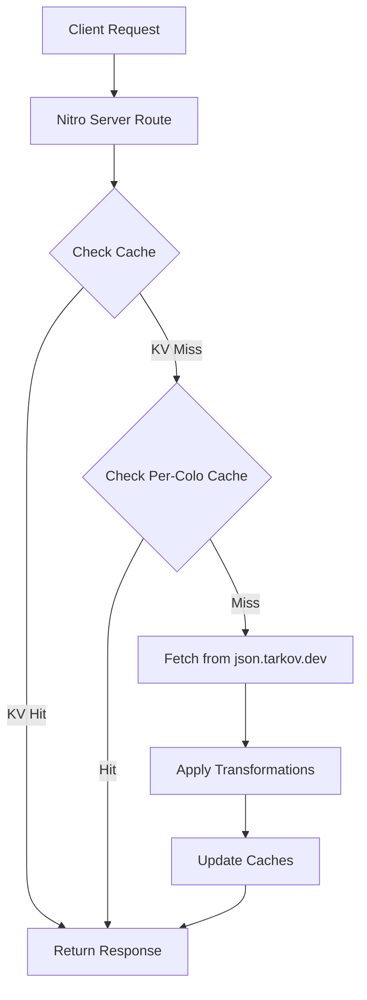

<details>
<summary>Relevant source files</summary>

The following files were used as context for generating this wiki page:

- [app/server/api/tarkov/bootstrap.get.ts](app/server/api/tarkov/bootstrap.get.ts)
- [app/server/api/tarkov/tasks-core.get.ts](app/server/api/tarkov/tasks-core.get.ts)
- [app/server/utils/precomputedTarkov.ts](app/server/utils/precomputedTarkov.ts)
- [AGENTS.md](AGENTS.md)
- [public/llms.txt](public/llms.txt)
- [README.md](README.md)
</details>

# Tarkov.dev Proxy & Nitro Routes

The TarkovTracker project utilizes a sophisticated data-fetching pipeline to provide low-latency game data to its client application. Game data is primarily sourced from `json.tarkov.dev` and served through a proxy layer implemented as Nitro server routes. This system incorporates multi-layer caching, including edge-side caching and a precomputed Key-Value (KV) storage mechanism to bypass execution limits on serverless environments.

Sources: [AGENTS.md:58-61](AGENTS.md#L58-L61), [public/llms.txt:7-10](public/llms.txt#L7-L10)

## Architecture Overview

The system architecture revolves around Nitro server routes located in `app/server/api/tarkov/`. These routes act as an intermediary between the client and the upstream `tarkov.dev` API. The proxy layer handles query parameters such as `lang` (language) and `gameMode` (PvP/regular vs. PvE), applies overlay corrections where necessary, and manages caching logic.

Sources: [AGENTS.md:54-57](AGENTS.md#L54-L57), [public/llms.txt:12-15](public/llms.txt#L12-L15)

### Data Flow Diagram

The following diagram illustrates the lifecycle of a request through the proxy routes:



The diagram shows the tiered caching strategy, starting from the precomputed KV namespace and falling back to regional caches before fetching from the origin.

Sources: [app/server/utils/precomputedTarkov.ts:13-25](app/server/utils/precomputedTarkov.ts#L13-L25), [AGENTS.md:65-72](AGENTS.md#L65-L72)

## Tiered Caching Strategy

To ensure high availability and performance, TarkovTracker implements three layers of caching:

1.  **Precomputed KV Storage:** Heavy payloads (such as `tasks-core`) are precomputed by a scheduled GitHub Actions workflow and stored in a Cloudflare KV namespace called `TARKOV_DATA`. This is the primary source for production requests.
2.  **Per-Colo Cache:** A secondary cache layer that resides in specific data centers (colocations) using the Cloudflare Workers Cache API.
3.  **Edge Cache Utility:** Individual routes use an `edgeCache` utility that orchestrates looking up precomputed values and falling back to the Cache API.

Sources: [AGENTS.md:65-72](AGENTS.md#L65-L72), [app/server/utils/precomputedTarkov.ts:13-17](app/server/utils/precomputedTarkov.ts#L13-L17)

### Precomputed Logic Implementation

The `getPrecomputedTarkovData` function serves as the core utility for retrieving cached game data.

```typescript
// Example logic derived from app/server/utils/precomputedTarkov.ts
export async function getPrecomputedTarkovData(event: H3Event, key: string) {
  const runtimeConfig = useRuntimeConfig(event);
  const binding = runtimeConfig.tarkovData; // KV Namespace binding

  if (binding) {
    const data = await binding.get(key, 'json');
    if (data) return data;
  }
  // Fallback logic follows...
}
```

Sources: [app/server/utils/precomputedTarkov.ts:13-25](app/server/utils/precomputedTarkov.ts#L13-L25)

## Primary Nitro Routes

Public JSON APIs are exposed under the `/api/tarkov/*` namespace. These endpoints are designed for programmatic access and accept parameters for localization and game mode filtering.

### Key API Endpoints

| Endpoint | Purpose | Parameters |
| :--- | :--- | :--- |
| `bootstrap` | Minimal level and XP data. | `lang`, `gameMode` |
| `tasks-core` | Core task, map, and trader metadata. | `lang`, `gameMode` |
| `tasks-objectives` | Task objectives and fail conditions. | `lang`, `gameMode` |
| `items` | Full item data index. | `lang`, `gameMode` |
| `hideout` | Station requirements and crafts. | `lang`, `gameMode` |

Sources: [public/llms.txt:26-36](public/llms.txt#L26-L36), [app/server/api/tarkov/bootstrap.get.ts](app/server/api/tarkov/bootstrap.get.ts), [app/server/api/tarkov/tasks-core.get.ts](app/server/api/tarkov/tasks-core.get.ts)

## Request Handling Details

Route handlers are implemented as `defineEventHandler` functions. They extract query parameters and call the caching utility to serve data efficiently.

### Example: Bootstrap Handler
The `bootstrap` route provides essential metadata for player leveling. It utilizes the `edgeCache` configuration with a specific key and a TTL (Time-To-Live).

Sources: [app/server/api/tarkov/bootstrap.get.ts:1-12](app/server/api/tarkov/bootstrap.get.ts#L1-L12)

### Example: Tasks Core Handler
The `tasks-core` route handles more complex data. It is specifically mentioned in the project documentation as one of the "heavy payloads" that relies heavily on the precompute pipeline to avoid exceeding Worker CPU limits.

Sources: [app/server/api/tarkov/tasks-core.get.ts:1-12](app/server/api/tarkov/tasks-core.get.ts#L1-L12), [AGENTS.md:65-68](AGENTS.md#L65-L68)

## Supported Parameters

The proxy layer normalizes requests using the following parameters:

*  **lang:** Supported values include `cs`, `de`, `en`, `es`, `fr`, `hu`, `it`, `ja`, `ko`, `pl`, `pt`, `ro`, `ru`, `sk`, `tr`, `zh`. Unsupported values default to `en`.
*  **gameMode:** Common values are `regular` (PvP) and `pve`.

Sources: [public/llms.txt:12-16](public/llms.txt#L12-L16)

## Summary

The Tarkov.dev Proxy system is a critical infrastructure component that abstracts upstream API complexities while providing a robust, cached, and localized data layer. By leveraging Nitro server routes and Cloudflare KV precomputation, the project maintains high performance even under strict serverless execution constraints.

Sources: [README.md:126-128](README.md#L126-L128), [AGENTS.md:65-72](AGENTS.md#L65-L72)
