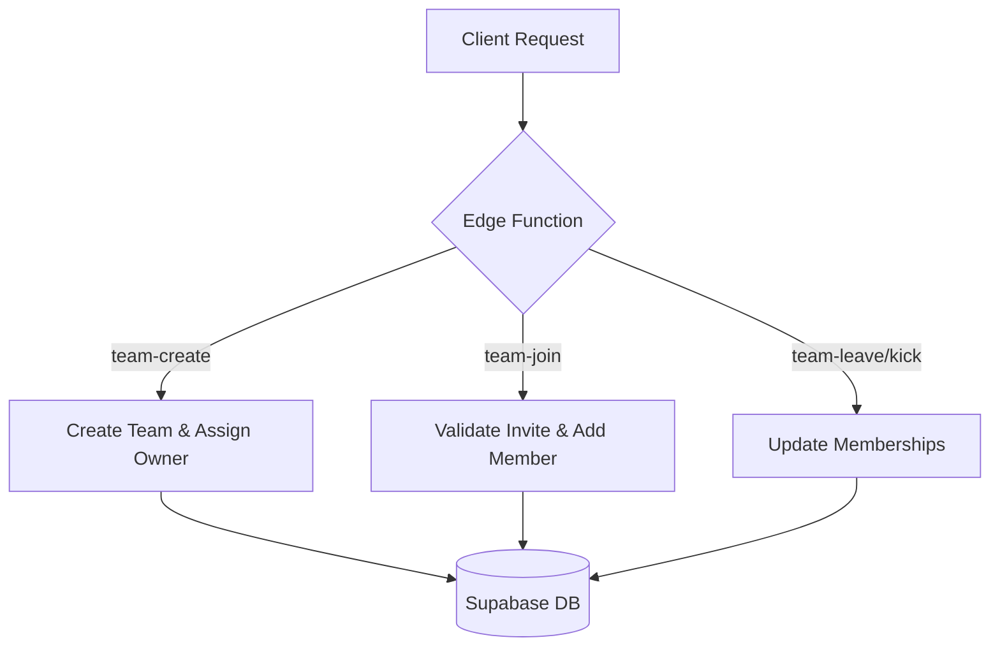
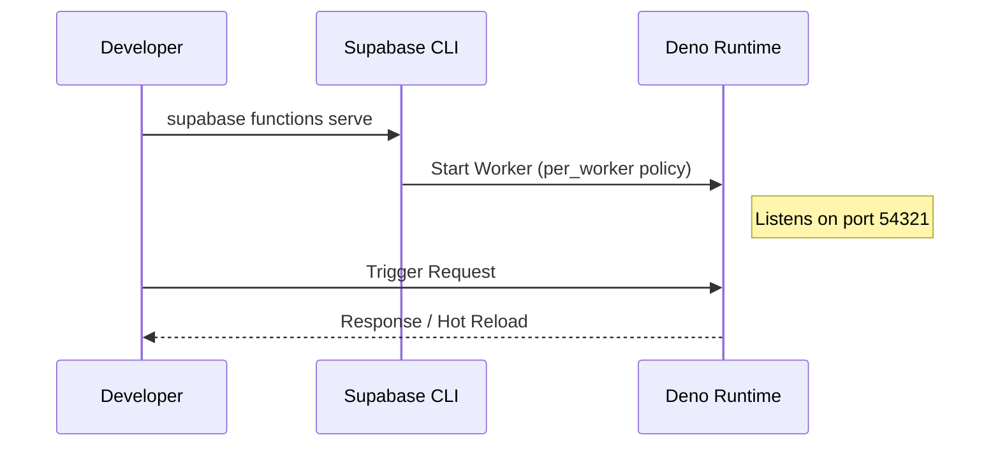

Relevant source files

The following files were used as context for generating this wiki page:

- [supabase/config.toml](supabase/config.toml)
- [AGENTS.md](AGENTS.md)
- [code_review.md](code_review.md)
- [supabase/functions/account-delete/index.ts](supabase/functions/account-delete/index.ts)
- [supabase/functions/team-create/index.ts](supabase/functions/team-create/index.ts)
- [supabase/functions/discord-role-sync/index.ts](supabase/functions/discord-role-sync/index.ts)

# Supabase Edge Functions

Supabase Edge Functions in the TarkovTracker project are server-side TypeScript functions that run on Deno. They handle logic that requires elevated privileges, interaction with third-party APIs (like Discord or Stripe), or complex database operations that should not be exposed to the client-side SPA. These functions provide a secure execution environment for sensitive tasks such as account deletion, team management, and external service synchronization.

Sources: [supabase/config.toml:292-343](supabase/config.toml#L292-L343), [AGENTS.md:57-59](AGENTS.md#L57-L59), [code_review.md:14-16](code_review.md#L14-L16)

## Architecture and Runtime

The project utilizes the Supabase Edge Runtime, which is based on Deno. These functions are stored in the `supabase/functions/` directory. For local development, the runtime supports hot reloading using a `per_worker` request policy. The project specifically targets Deno version 2.

Sources: [supabase/config.toml:292-301](supabase/config.toml#L292-L301), [AGENTS.md:57-59](AGENTS.md#L57-L59)

### Execution Environment
- **Runtime**: Deno (v2)
- **Language**: TypeScript
- **Local Debugging**: Chrome inspector port 8083 is configured for debugging.
- **Security**: Functions can be configured to verify JSON Web Tokens (JWT). Many project-specific functions (e.g., `team-create`, `account-delete`) have `verify_jwt` set to `false` in `config.toml`, suggesting internal validation or specialized authentication logic (such as Stripe signatures) is handled within the function code itself.

Sources: [supabase/config.toml:292-336](supabase/config.toml#L292-L336), [code_review.md:14-16](code_review.md#L14-L16)

## Functional Modules

The system is divided into several specialized functions, each handling a distinct domain of the application's backend logic.

### Account and Identity Management
These functions handle sensitive user data operations, specifically ensuring that when a user leaves the platform, their data is handled according to the [Privacy Policy](#privacy-policy) and [Terms of Service](#terms-of-service).

| Function Name | JWT Verification | Description |
| :--- | :--- | :--- |
| `account-delete` | Disabled | Orchestrates the permanent removal of user progress, tokens, and personal info. |
| `account-delete-reconcile` | Disabled | Handles cleanup tasks and data consistency checks after an account is flagged for deletion. |
| `discord-unlink` | Disabled | Removes the association between a TarkovTracker account and a Discord identity. |

Sources: [supabase/config.toml:319-325](supabase/config.toml#L319-L325), [supabase/config.toml:342-343](supabase/config.toml#L342-L343)

### Team Collaboration
Edge functions facilitate team operations to ensure data integrity and prevent unauthorized membership changes.

*The diagram above illustrates the flow of team-related requests through the Edge Functions to the database.*

Sources: [supabase/config.toml:303-317](supabase/config.toml#L303-L317)

### External Integrations
The project integrates with several third-party services, requiring secure endpoints for webhooks and role synchronization.

- **Discord Role Sync**: Synchronizes supporter roles between the TarkovTracker database and the project's Discord server.
- **Stripe Webhook**: Processes payment events from Stripe. It verifies the `Stripe-Signature` header rather than a Supabase JWT to ensure the delivery is authentic.

Sources: [supabase/config.toml:331-340](supabase/config.toml#L331-L340)

## Configuration and Deployment

Function behavior is governed by the `supabase/config.toml` file.

### Environment Variables
Edge Functions use platform-native naming conventions for environment variables. Key variables include:
- `SUPABASE_URL` / `SUPABASE_ANON_KEY`
- `STRIPE_SECRET_KEY` (used in `stripe-webhook`)
- `DISCORD_BOT_TOKEN` (used in `discord-role-sync`)

Sources: [AGENTS.md:204-206](AGENTS.md#L204-L206), [code_review.md:68-71](code_review.md#L68-L71)

### Local Development and Testing
Because Edge Functions run on Deno, they are not covered by the standard project test suite (`pnpm run test`). Developers must manually inspect them for Deno API compatibility.

*The sequence diagram shows the local development loop for testing Edge Functions.*

Sources: [supabase/config.toml:292-301](supabase/config.toml#L292-L301), [code_review.md:14-16](code_review.md#L14-L16)

## Security and Risk Mitigation

Edge functions represent a high-risk area for the project due to their elevated permissions.

### Row Level Security (RLS) and RPC
RLS policy changes in migrations must be carefully vetted to ensure they do not unintentionally widen access. While Edge Functions often bypass RLS using service role keys, any Remote Procedure Calls (RPC) added to the database must not bypass these protections unless intentionally designed for administrative use.

Sources: [code_review.md:23-28](code_review.md#L23-L28)

### Verification Patterns
Most functions in the current configuration have `verify_jwt = false`. This indicates that the project relies on manual token validation within the Deno script or relies on alternative authentication methods like webhook signatures.

Sources: [supabase/config.toml:303-343](supabase/config.toml#L303-L343)
