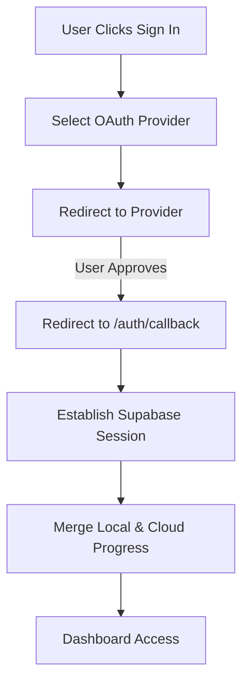

Relevant source files

The following files were used as context for generating this wiki page:

- [README.md](README.md)
- [AGENTS.md](AGENTS.md)
- [app/pages/privacy.vue](app/pages/privacy.vue)
- [app/pages/terms-of-service.vue](app/pages/terms-of-service.vue)
- [supabase/config.toml](supabase/config.toml)
- [code_review.md](code_review.md)

# Authentication Flow

## Introduction
The Authentication Flow in TarkovTracker is designed as an optional enhancement to the core client-only tracking experience. While the application allows users to track progress locally using browser storage without an account, authentication enables advanced features such as cross-device synchronization, real-time team collaboration, public profile sharing, and access to programmatically generated API tokens.

The system utilizes a Single Page Application (SPA) architecture powered by Nuxt 4 and Supabase. It relies on industry-standard OAuth 2.0 protocols to delegate identity management to trusted third-party providers, ensuring that sensitive credentials are never stored directly by the Service.

Sources: [README.md:16-32](README.md#L16-L32), [AGENTS.md:52-54](AGENTS.md#L52-L54), [app/pages/privacy.vue:151-155](app/pages/privacy.vue#L151-L155)

## Core Architecture
The authentication infrastructure is built on the Supabase Auth platform, which manages user sessions, JWT issuance, and secure redirects. The client-side implementation is integrated via a dedicated Supabase client plugin and managed through Pinia stores for state persistence.

### Key Components
| Component | Responsibility |
| :--- | :--- |
| **Supabase Client** | Handles session restoration, token refresh, and communication with Supabase Auth services. |
| **OAuth Providers** | Third-party services (Discord, Twitch, Google, GitHub) that verify user identity. |
| **Nitro Server Routes** | Acts as an API proxy for authenticated requests and handles server-side validation. |
| **Pinia Stores** | `useTarkovStore` and `useProgressStore` consume auth state to trigger data synchronization. |

Sources: [AGENTS.md:52-54](AGENTS.md#L52-L54), [code_review.md:56-62](code_review.md#L56-L62), [supabase/config.toml:132-135](supabase/config.toml#L132-L135)

## Authentication Lifecycle
The system follows a standard OAuth 2.0 flow initiated by the client. Users are redirected to a third-party provider, and upon successful verification, they are returned to a configured callback URL to establish a secure session.

### Initial Login and Redirects
The application defines a strict allow-list for redirect URLs to prevent open-redirect vulnerabilities. These include production domains, local development environments, and specific callback paths.

Sources: [supabase/config.toml:136-160](supabase/config.toml#L136-L160), [README.md:34-37](README.md#L34-L37)

### Session Management
Once authenticated, the Supabase client manages the session lifecycle:
1.  **Token Persistence**: Sessions are restored on page reload using the Supabase client plugin.
2.  **Token Refresh**: The client automatically handles JWT refresh before the `jwt_expiry` (default 3600 seconds) is reached.
3.  **Refresh Token Rotation**: Enabled to enhance security by invalidating old refresh tokens upon use.

Sources: [supabase/config.toml:161-171](supabase/config.toml#L161-L171), [code_review.md:56-60](code_review.md#L56-L60)

## Data Integration and Synchronization
Authentication triggers a transition from local `localStorage` tracking to cloud-backed storage. This process involves sophisticated merging logic to ensure user progress is not lost during the initial sign-in.

### Progress Merging Logic
*  **New Accounts**: Local progress is uploaded to the cloud account on the first login.
*  **Returning Users (Same Browser)**: A merge of local and cloud progress is performed.
*  **New Browser/Existing Account**: Cloud data takes precedence; local guest progress is not merged to prevent accidental data overwriting.

Sources: [README.md:34-37](README.md#L34-L37), [code_review.md:29-33](code_review.md#L29-L33)

### API Token Authentication
Authenticated users can generate up to three API tokens for programmatic access. These tokens are used by external tools like TarkovMonitor to sync progress via the public API gateway.
*  **Validation**: Tokens must be verified against the Supabase database.
*  **Reporting**: Usage reporting normalized per token/day is performed at the edge.

Sources: [AGENTS.md:144-146](AGENTS.md#L144-L146), [app/pages/privacy.vue:87-90](app/pages/privacy.vue#L87-L90), [code_review.md:36-40](code_review.md#L36-L40)

## Security and Compliance
The authentication flow is governed by Row Level Security (RLS) policies within Supabase, ensuring users can only access their own data.

### Security Configurations
| Feature | Setting | Description |
| :--- | :--- | :--- |
| **JWT Expiry** | 3600s | Duration for which an access token remains valid. |
| **Manual Linking** | Enabled | Allows attaching additional identities (e.g., Discord) to an existing account. |
| **Password Min Length**| 6 | Minimum length for accounts using email/password (if enabled). |
| **Rate Limiting** | 30/5min | Limit for sign-in and sign-up requests per IP address. |

Sources: [supabase/config.toml:161-190](supabase/config.toml#L161-L190), [AGENTS.md:144-146](AGENTS.md#L144-L146)

### Third-Party Data Handling
When users authenticate through OAuth providers, TarkovTracker collects basic profile data including email addresses and usernames. This data is used solely for service provision and security, such as maintaining session integrity and preventing unauthorized access.

Sources: [app/pages/privacy.vue:52-56](app/pages/privacy.vue#L52-L56), [app/pages/privacy.vue:108-111](app/pages/privacy.vue#L108-L111)

## Conclusion
The Authentication Flow provides a bridge between a standalone client application and a cloud-synced progression system. By leveraging Supabase and OAuth 2.0, TarkovTracker ensures a secure, reliable, and frictionless transition for users who wish to utilize advanced team and backup features while maintaining a "no account required" entry point for the community.
