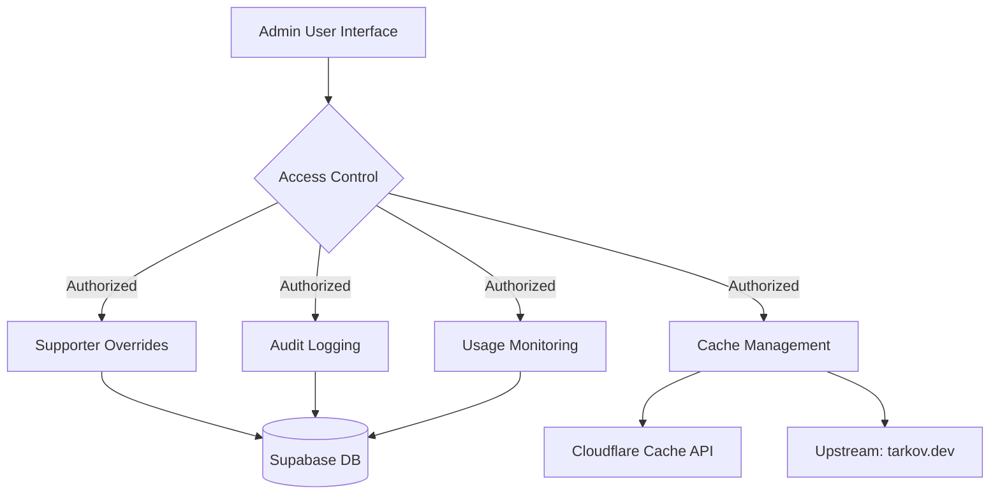
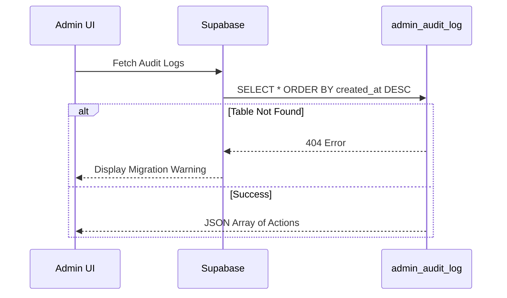

Relevant source files

The following files were used as context for generating this wiki page:

- [app/features/admin/AdminAuditLog.vue](app/features/admin/AdminAuditLog.vue)
- [app/features/admin/AdminCacheCard.vue](app/features/admin/AdminCacheCard.vue)
- [app/server/api/admin/api-usage.get.ts](app/server/api/admin/api-usage.get.ts)
- [app/locales/en.json](app/locales/en.json)
- [AGENTS.md](AGENTS.md)

# Admin Tools

The Admin Tools system in TarkovTracker is a restricted administrative interface designed to manage global application state, monitor system-wide usage, and ensure accountability through action auditing. It is located within the `admin` domain slice of the application features.

Sources: [AGENTS.md:67](AGENTS.md#L67), [app/locales/en.json:2-63](app/locales/en.json#L2-L63)

## System Architecture

The administration module interacts with three primary backends to perform its duties:
1.  **Supabase**: For identity management, audit logging, and supporter status overrides.
2.  **Cloudflare**: For global cache management and edge-level purging.
3.  **tarkov.dev**: The upstream source for game data, which can be re-fetched via admin triggers.

The diagram shows the relationship between the admin UI, internal authorization checks, and the various external services managed by the toolset.
Sources: [app/features/admin/AdminCacheCard.vue](app/features/admin/AdminCacheCard.vue), [app/features/admin/AdminAuditLog.vue](app/features/admin/AdminAuditLog.vue), [app/locales/en.json:3-23](app/locales/en.json#L3-L23)

## Cache Management

TarkovTracker utilizes a multi-layer caching strategy. Admin Tools provide two distinct methods for cache invalidation to ensure users receive up-to-date game data.

### Purge Types
| Action | Scope | Impact |
| :--- | :--- | :--- |
| **Purge Game Data** | Tarkov Data Cache | Clears cached tasks, hideout, and items. Triggers a fresh fetch from tarkov.dev on the next user request. |
| **Purge Everything** | Full Cache Purge | Clears all content from Cloudflare, including static assets (JS, CSS, fonts). Increases origin load temporarily. |

Sources: [app/features/admin/AdminCacheCard.vue:74-118](app/features/admin/AdminCacheCard.vue#L74-L118), [app/locales/en.json:11-23](app/locales/en.json#L11-L23)

### Cache Behavior Logic
When a purge is triggered, the metadata timestamp is updated. The application logic ensures that the subsequent request from any user bypasses the current edge cache to fetch fresh data, which is then re-cached for the entire user base.

Sources: [app/features/admin/AdminCacheCard.vue:12-32](app/features/admin/AdminCacheCard.vue#L12-L32), [app/locales/en.json:18-20](app/locales/en.json#L18-L20)

## Action Auditing

The Audit Log system provides a verifiable trail of all administrative actions. This ensures that changes to global cache or user permissions are tracked by user ID and timestamp.

### Technical Implementation
The system relies on a specific Supabase table named `admin_audit_log`. The UI component handles states for missing migrations, unauthorized access, and empty logs.

This sequence illustrates the data flow for retrieving administrative history.
Sources: [app/features/admin/AdminAuditLog.vue:15-54](app/features/admin/AdminAuditLog.vue#L15-L54), [app/locales/en.json:36-46](app/locales/en.json#L36-L46)

## API Usage Monitoring

The system monitors usage of the public progress API to track load and client diversity.

### Usage Metrics
The backend tracks the latest normalized `User-Agent` per token per day. Admin tools can retrieve a summary of these interactions to identify high-traffic tokens or potential abuse.

| Parameter | Type | Description |
| :--- | :--- | :--- |
| `days` | Integer | (Internal) Number of historical days to retrieve. |
| `token_id` | UUID | Filter usage by a specific API token. |

Sources: [app/server/api/admin/api-usage.get.ts:1-35](app/server/api/admin/api-usage.get.ts#L1-L35), [AGENTS.md:121-122](AGENTS.md#L121-L122)

## Supporter Access Overrides

Admins can manually set a user's supporter state. This is primarily used for production testing or granting status without requiring a Stripe transaction.

### Configuration Options
- **Target User**: Identified by Supabase auth user UUID.
- **Supporter Tiers**: Scav, Timmy, Chad, or General Supporter.
- **State**: Toggle between Enabled and Disabled.

Sources: [app/locales/en.json:47-62](app/locales/en.json#L47-L62)

## Security and Authorization

Access to these tools is strictly gated. The UI includes a verification phase (`verifying_access`) before rendering any administrative components. 

### Constraints
- **Admin Privileges**: Users without specific admin roles are met with an "Unauthorized" state.
- **Audit Requirement**: Destructive actions (like cache purges) are logged to the audit system automatically upon completion.

Sources: [app/features/admin/AdminCacheCard.vue:44-55](app/features/admin/AdminCacheCard.vue#L44-L55), [app/locales/en.json:3-10](app/locales/en.json#L3-L10), [app/features/admin/AdminAuditLog.vue:64-74](app/features/admin/AdminAuditLog.vue#L64-L74)

## Summary
Admin Tools in TarkovTracker centralize critical operational tasks including Cloudflare edge cache invalidation, API consumption monitoring, and user permission overrides. By integrating directly with Supabase and Cloudflare, the system provides real-time control over the application's global state while maintaining a permanent audit trail of all changes.
