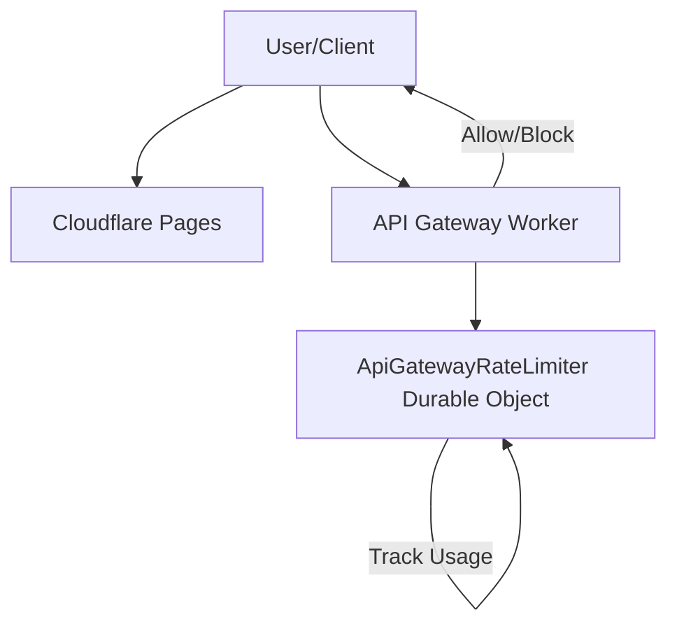
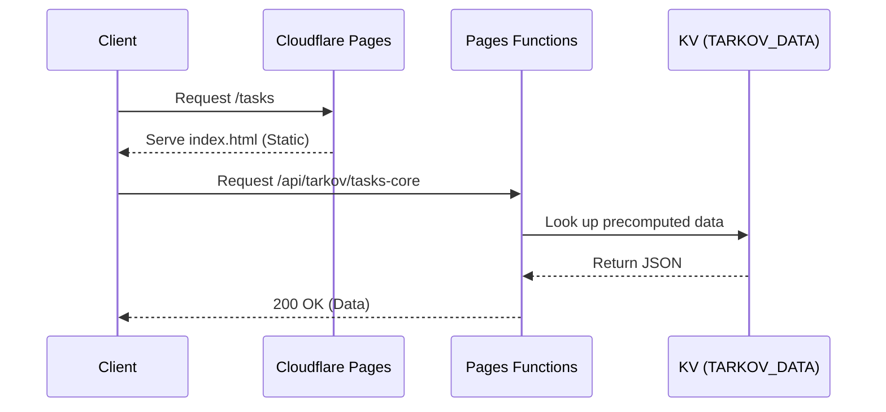

Relevant source files

The following files were used as context for generating this wiki page:

- [wrangler.toml](wrangler.toml)
- [README.md](README.md)
- [AGENTS.md](AGENTS.md)
- [code_review.md](code_review.md)
- [app/utils/__tests__/nuxtSecurityConfig.test.ts](app/utils/__tests__/nuxtSecurityConfig.test.ts)
- [app/utils/__tests__/csp.test.ts](app/utils/__tests__/csp.test.ts)

# Cloudflare Infrastructure

TarkovTracker utilizes a multi-layered Cloudflare infrastructure to serve its single-page application (SPA), manage public API traffic, and optimize data delivery for heavy game-data payloads. The architecture primarily consists of **Cloudflare Pages** for the frontend hosting and **Cloudflare Workers** for specialized backend logic and rate limiting.

The infrastructure is designed for high availability and performance by leveraging edge computing components such as **Durable Objects** for globally consistent rate limiting and **KV Namespaces** for replicating precomputed game data across Cloudflare’s global network.
Sources: [README.md](README.md), [wrangler.toml:1-12](wrangler.toml#L1-L12), [AGENTS.md](AGENTS.md)

## Core Components

### Cloudflare Pages
The frontend is deployed as a static SPA using Cloudflare Pages. It serves the Nuxt 4 application shell and assets from the `dist` directory. To ensure proper SPA behavior, the build process promotes the `200.html` fallback to `index.html` for the static Pages entrypoint.
Sources: [wrangler.toml:5](wrangler.toml#L5), [app/utils/__tests__/nuxtSecurityConfig.test.ts:14-23](app/utils/__tests__/nuxtSecurityConfig.test.ts#L14-L23), [AGENTS.md](AGENTS.md)

### API Gateway & Rate Limiting
The project includes a dedicated Cloudflare Worker located in `workers/api-gateway`. This worker manages the public API surface and implements a globally consistent rate limiter using a **Durable Object** named `ApiGatewayRateLimiter`.

*Figure 1: High-level flow of API requests through the Cloudflare Gateway and Rate Limiter.*
Sources: [wrangler.toml:12-16](wrangler.toml#L12-L16), [AGENTS.md](AGENTS.md), [code_review.md](code_review.md)

### KV Data Precomputing
To handle heavy routes such as `tasks-core`, the infrastructure uses a globally-replicated **KV Namespace** named `TARKOV_DATA`. Data is precomputed via a scheduled GitHub Actions workflow and written to this namespace. Nitro request handlers on the frontend read from this KV binding as a primary source, falling back to the per-colo Cache API if the binding or entry is absent.
Sources: [wrangler.toml:25-33](wrangler.toml#L25-L33), [AGENTS.md](AGENTS.md), [code_review.md](code_review.md)

## Configuration & Environment Management

The infrastructure is managed via `wrangler.toml`, which defines both production and preview environments. Most environment variables are inherited or explicitly defined to prevent production analytics (GA/Clarity) from instrumenting preview builds.

### Infrastructure Bindings
| Binding Name | Type | Purpose |
| :--- | :--- | :--- |
| `API_GATEWAY_LIMITER` | Durable Object | Atomic, globally-consistent rate limiting shared with the `api-gateway` Worker. |
| `TARKOV_DATA` | KV Namespace | Store for precomputed heavy-route payloads (e.g., tasks-core). |
Sources: [wrangler.toml:12-33](wrangler.toml#L12-L33)

### Environment Variables (Vars)
The following key environment variables are configured at the infrastructure level:
*  **`APP_URL`**: Canonical URL (https://tarkovtracker.org).
*  **`SUPABASE_URL` & `SUPABASE_ANON_KEY`**: Configuration for the Supabase backend.
*  **`GA_MEASUREMENT_ID`**: Google Analytics ID.
*  **`CLARITY_PROJECT_ID`**: Microsoft Clarity project ID.
Sources: [wrangler.toml:36-47](wrangler.toml#L36-L47)

## Security and Routing

Cloudflare infrastructure enforce security policies through Content Security Policy (CSP) headers and specific routing rules defined in `_routes.json`. 

### Route Rules
The Pages Functions build is restricted to specific paths to avoid a catch-all configuration. Only `/api/*` and `/overlay/*` are routed through Functions, while other requests are served as static assets.
Sources: [app/utils/__tests__/nuxtSecurityConfig.test.ts:34-55](app/utils/__tests__/nuxtSecurityConfig.test.ts#L34-L55), [AGENTS.md](AGENTS.md)

### Content Security Policy (CSP)
The infrastructure implements different CSP levels for different parts of the application:
*  **App-wide CSP**: Includes sources for Supabase, Google Analytics, and Microsoft Clarity.
*  **Overlay CSP**: Stricter than the app-wide rule, specifically targeting streamer tool overlays. It uses `default-src 'none'` and restricts `frame-ancestors 'self'`.
Sources: [app/utils/__tests__/nuxtSecurityConfig.test.ts:56-68](app/utils/__tests__/nuxtSecurityConfig.test.ts#L56-L68), [app/utils/__tests__/csp.test.ts:36-81](app/utils/__tests__/csp.test.ts#L36-L81)

*Figure 2: Data retrieval sequence showing the interaction between static hosting, Functions, and KV storage.*
Sources: [wrangler.toml:25-33](wrangler.toml#L25-L33), [AGENTS.md](AGENTS.md), [code_review.md](code_review.md)

## Conclusion
TarkovTracker's Cloudflare Infrastructure provides a robust foundation for a high-performance gaming tool. By separating static hosting from edge-computed API logic and utilizing KV storage for precomputed data, the system minimizes latency and origin load while maintaining strict security through edge-defined CSP and routing policies.
Sources: [AGENTS.md](AGENTS.md), [code_review.md](code_review.md)
