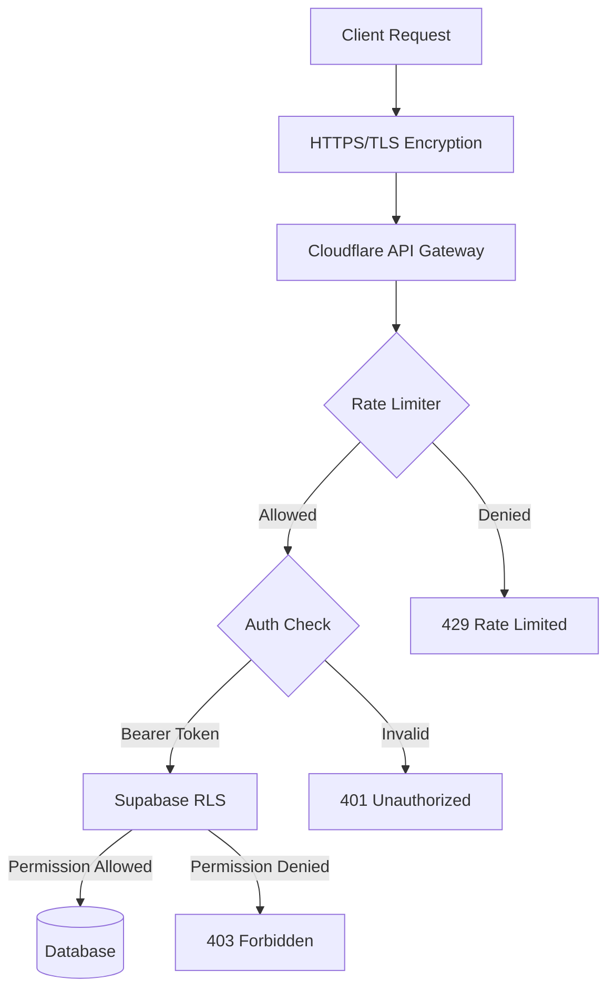
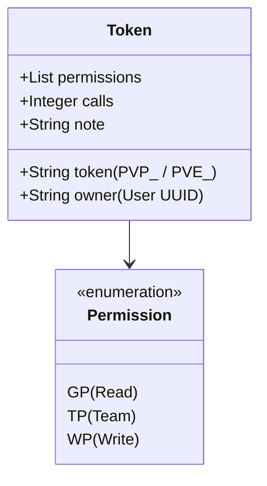

Relevant source files

The following files were used as context for generating this wiki page:

- [SECURITY.md](SECURITY.md)
- [workers/api-gateway/src/openapi.ts](workers/api-gateway/src/openapi.ts)
- [app/pages/privacy.vue](app/pages/privacy.vue)
- [AGENTS.md](AGENTS.md)
- [code_review.md](code_review.md)

# Security & Rate Limiting

TarkovTracker employs a multi-layered security architecture designed to protect user data while ensuring high availability through robust rate limiting and abuse prevention. The system's security scope encompasses the web application, Nitro server routes, Cloudflare Workers, and Supabase Edge Functions, utilizing industry-standard protocols such as OAuth 2.0 and HTTPS/TLS for all data transmissions.

The rate limiting strategy is specifically tailored to differentiate between standard users and supporters, providing tiered daily quotas and burst protection. This infrastructure is managed primarily through the `api-gateway` Cloudflare Worker, which acts as a protective shield for the underlying data services.

## Security Architecture & Policies

The project's security model is built on transparency and least-privilege access. While the codebase is open-source, administrative access to production databases and authentication systems is restricted to the project owner. Contributors do not have access to user data or production credentials.

### Encryption and Authentication
All data transmission is secured via HTTPS/TLS protocols. Sensitive data stored within Supabase databases is encrypted at rest. Authentication is handled through third-party OAuth providers (Twitch, Discord, Google, GitHub), ensuring that TarkovTracker does not directly manage user passwords.

Sources: [app/pages/privacy.vue:159-170](app/pages/privacy.vue#L159-L170), [app/pages/privacy.vue:425-433](app/pages/privacy.vue#L425-L433)

### Database Security
Security at the data layer is enforced through Supabase Row Level Security (RLS) policies. These policies ensure that users can only access their own progress data and team-specific information. The code review policy mandates that RLS changes must never widen access unintentionally and that RPC (Remote Procedure Call) additions must not bypass these protections.

Sources: [SECURITY.md:65-67](SECURITY.md#L65-L67), [code_review.md:55-58](code_review.md#L55-L58)

### Security Flow Overview
The following diagram illustrates the request flow from a client through the security layers:

The flow ensures that every request is encrypted, rate-limited, and authenticated before reaching the data layer.
Sources: [app/pages/privacy.vue:159-170](app/pages/privacy.vue#L159-L170), [workers/api-gateway/src/openapi.ts:72-130](workers/api-gateway/src/openapi.ts#L72-L130)

## Rate Limiting Strategy

Rate limiting is implemented at multiple granularities to prevent abuse and ensure fair resource distribution. The `api-gateway` enforces tiered daily quotas, per-minute burst limits, and per-IP backstops.

### Tiered Quotas
API quotas are keyed by user account. Standard accounts have lower limits, while recurring supporter subscriptions scale up. These quotas reset daily at 00:00 UTC.

| Limit Type | Standard (Free) | Notes |
| :--- | :--- | :--- |
| **Daily Read Quota** | 1,000 requests | Reset at 00:00 UTC |
| **Daily Write Quota** | 100 requests | Reset at 00:00 UTC |
| **Burst Limit** | Per-minute | 60-second sliding window |
| **IP Backstop (Read)** | 600 / hour | Catches multi-account abuse |
| **IP Backstop (Write)**| 200 / hour | Catches multi-account abuse |

Sources: [workers/api-gateway/src/openapi.ts:11-23](workers/api-gateway/src/openapi.ts#L11-L23)

### Client Requirements
To interact with protected API endpoints (progress, team, tokens), clients must provide a descriptive `User-Agent` header between 5 and 200 characters. Requests missing this header or providing an invalid string are rejected with a 400 Bad Request error. Infrastructure routes such as `/health` or `/docs` are exempt from this requirement.

Sources: [workers/api-gateway/src/openapi.ts:25-30](workers/api-gateway/src/openapi.ts#L25-L30), [workers/api-gateway/src/openapi.ts:110-120](workers/api-gateway/src/openapi.ts#L110-L120)

### API Response Headers
The API Gateway includes headers in every response to inform clients of their current quota status:

- `X-RateLimit-Limit`: Maximum requests permitted per UTC day.
- `X-RateLimit-Remaining`: Requests remaining in the current daily quota.
- `X-RateLimit-Reset`: Unix timestamp when the quota resets.
- `Retry-After`: Returned on `429` responses, indicating seconds to wait.

Sources: [workers/api-gateway/src/openapi.ts:15-20](workers/api-gateway/src/openapi.ts#L15-L20), [workers/api-gateway/src/openapi.ts:133-150](workers/api-gateway/src/openapi.ts#L133-L150)

## API Token Management

TarkovTracker limits the exposure and volume of API tokens to maintain a secure environment.

### Token Lifecycle
Each user account is limited to a maximum of 3 active API tokens. Token creation is rate-limited to 3 per hour via a specific Edge Function. Tokens use prefixes like `PVP_` or `PVE_` to indicate the game mode they are authorized to access.

Sources: [workers/api-gateway/src/openapi.ts:10-11](workers/api-gateway/src/openapi.ts#L10-L11), [workers/api-gateway/src/openapi.ts:21-24](workers/api-gateway/src/openapi.ts#L21-L24)

### Permissions Model
Tokens are granted specific permissions which are validated by the API Gateway:
- **GP**: Progress Read
- **TP**: Team Progress
- **WP**: Progress Write

This permission model ensures tokens can be restricted to specific use cases, such as read-only access for a dashboard or write access for a monitoring tool.
Sources: [workers/api-gateway/src/openapi.ts:182-192](workers/api-gateway/src/openapi.ts#L182-L192), [workers/api-gateway/src/openapi.ts:200-215](workers/api-gateway/src/openapi.ts#L200-L215)

## Reporting and Vulnerabilities

TarkovTracker maintains a private vulnerability reporting channel. Volumetric flooding or Denial-of-Service (DoS) attacks are explicitly out of scope for the security policy, as the platform relies on Cloudflare's infrastructure for protection against such attacks.

### Reporting Channels
1. **GitHub Private Reporting**: Preferred method for coordinated disclosure.
2. **Email**: `security@tarkovtracker.org`

Impacted components include the web application (`app/`), Nitro routes (`app/server/`), Cloudflare Workers (`workers/`), and Supabase Edge Functions.

Sources: [SECURITY.md:10-25](SECURITY.md#L10-L25), [SECURITY.md:46-55](SECURITY.md#L46-L55)

## Summary

Security and Rate Limiting in TarkovTracker represent a coordinated effort between application logic and infrastructure providers. By offloading authentication to trusted OAuth providers and enforcing strict rate limits at the Cloudflare edge, the system protects user progression data while remaining open for community tool integration. The tiered supporter model provides a sustainable path for power users needing higher API throughput without compromising the stability of the platform for the general player base.
