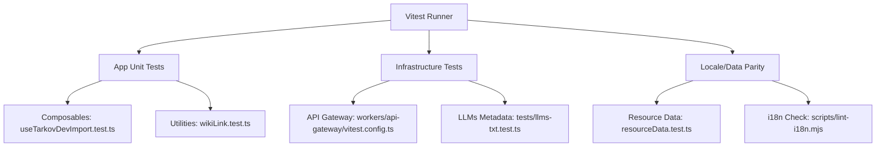
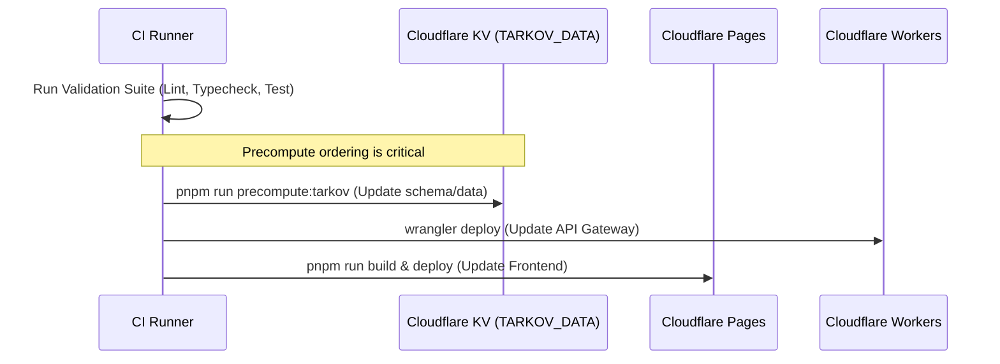

Relevant source files

The following files were used as context for generating this wiki page:

- [AGENTS.md](AGENTS.md)
- [code_review.md](code_review.md)
- [package.json](package.json)
- [tests/llms-txt.test.ts](tests/llms-txt.test.ts)
- [app/composables/__tests__/useTarkovDevImport.test.ts](app/composables/__tests__/useTarkovDevImport.test.ts)
- [app/features/resources/__tests__/resourceData.test.ts](app/features/resources/__tests__/resourceData.test.ts)

# Testing & CI/CD Strategies

Testing and CI/CD strategies for TarkovTracker ensure the reliability of its Single Page Application (SPA) architecture and its various integrations. The project employs a multi-layered validation approach, combining automated linting, type-checking, unit testing with Vitest, and specialized integration tests for edge components like the Cloudflare API gateway. These strategies are governed by a strict maintenance contract and validation policy that ensures code quality before any changes are merged into the production environment.

Sources: [AGENTS.md](AGENTS.md), [code_review.md](code_review.md)

## Validation Pipeline

The project utilizes a structured validation pipeline that must be followed by both human contributors and AI agents. This pipeline is designed to catch issues early in the development cycle, starting from local pre-commit hooks to comprehensive CI checks.

### Pre-commit and Local Validation
Local development relies on `husky` and `lint-staged` to enforce formatting and linting rules automatically on staged files. The primary tools used are Prettier for formatting and ESLint for code quality, particularly enforcing rules such as the "No parent-relative imports" policy (using `@/` aliases).

Sources: [AGENTS.md:104-106](AGENTS.md#L104-L106), [package.json:115-156](package.json#L115-L156)

### Mandatory CI Commands
The following sequence of commands represents the core validation suite that must pass before a "READY" verdict is issued for any deployment:

| Command | Purpose |
|---------|---------|
| `pnpm run typecheck` | Validates TypeScript strict typing across the Nuxt 4 app and precompute scripts. |
| `pnpm run lint` | Enforces coding conventions and design constraints (zero warnings allowed). |
| `pnpm run test` | Executes the Vitest suite for unit and component testing. |
| `pnpm run i18n:check` | Validates snake_case naming in `en.json` and ensures locale consistency. |
| `pnpm run validate:openapi` | Validates API schemas against the OpenAPI specification. |
| `pnpm run test:api-gateway` | Runs specialized tests for Cloudflare Workers/API Gateway logic. |

Sources: [code_review.md:12-25](code_review.md#L12-L25), [package.json:86-105](package.json#L86-L105)

## Automated Testing Architecture

TarkovTracker uses Vitest as its primary testing framework. The architecture distinguishes between standard application tests and specialized infrastructure tests.

### Test Categories and Tools
The testing suite covers various domain slices, including feature data, composable logic, and public metadata.

The diagram shows the distribution of testing responsibilities across different modules using the Vitest runner.
Sources: [package.json:86-105](package.json#L86-L105), [tests/llms-txt.test.ts](tests/llms-txt.test.ts), [app/features/resources/__tests__/resourceData.test.ts](app/features/resources/__tests__/resourceData.test.ts)

### Testing Invariants
To maintain deterministic and reliable tests, the project follows several core invariants:
*  **Mocking:** Supabase and network calls must be mocked in tests to avoid external dependencies.
*  **JUnit Reports:** When `CI=true`, Vitest is configured to output `test-report.junit.xml` for CI consumption.
*  **Coverage:** Code coverage is uploaded to Codecov via the GitHub Actions `test` job.
*  **Deterministic State:** Tests must reset modules and mocks between runs to prevent side effects.

Sources: [AGENTS.md:107-111, 169](AGENTS.md#L107-L111), [app/composables/__tests__/useTarkovDevImport.test.ts:80-83](app/composables/__tests__/useTarkovDevImport.test.ts#L80-L83)

## CI/CD and Deployment Strategy

The deployment architecture is split across Cloudflare Pages (frontend SPA) and Cloudflare Workers (API gateway and precompute tasks), with Supabase handling the backend database and authentication.

### Deployment Workflow
The deployment process follows a specific order to prevent schema mismatches, particularly for precomputed data.

The sequence diagram illustrates the requirement that precompute schemas must be updated in KV before handler changes are deployed to avoid application errors.
Sources: [AGENTS.md:78-83](AGENTS.md#L78-L83), [code_review.md:104-110](code_review.md#L104-L110)

### Rollback Procedures
The project defines specific rollback strategies for each platform component:
*  **Frontend (Cloudflare Pages):** Rollbacks are performed via the Cloudflare dashboard by targeting a specific production deployment.
*  **Workers:** Managed via `wrangler rollback`, which allows interactive selection of preceding versions.
*  **Supabase:** High-risk migrations require a manual rollback plan. If a "down" migration exists, it must be verified against the "up" migration.

Sources: [code_review.md:94-103](code_review.md#L94-L103)

## Production Readiness Review

A dedicated `code_review.md` policy defines the severity calibration for issues found during the CI or review phase. This ensures that critical risks are addressed before deployment.

### Severity Calibration
| Level | Criteria |
|-------|----------|
| **P0 (Critical)** | Data loss in Supabase, auth bypass, service-role key exposure, or broken site load. |
| **P1 (High)** | Features broken for user segments, KV key shape mismatches, or CI-blocking i18n violations. |
| **P2 (Medium)** | Missing test coverage for risky changes or performance regressions on hot paths. |
| **P3 (Low)** | Minor naming issues or non-blocking cleanup tasks. |

Sources: [code_review.md:83-92](code_review.md#L83-L92)

## Summary
The TarkovTracker testing and CI/CD strategy is a comprehensive framework designed to maintain the stability of a complex, data-heavy SPA. By enforcing strict local validation, a multi-step CI pipeline, and specific deployment ordering, the project minimizes the risk of regression and data corruption across its distributed architecture of Cloudflare and Supabase.
