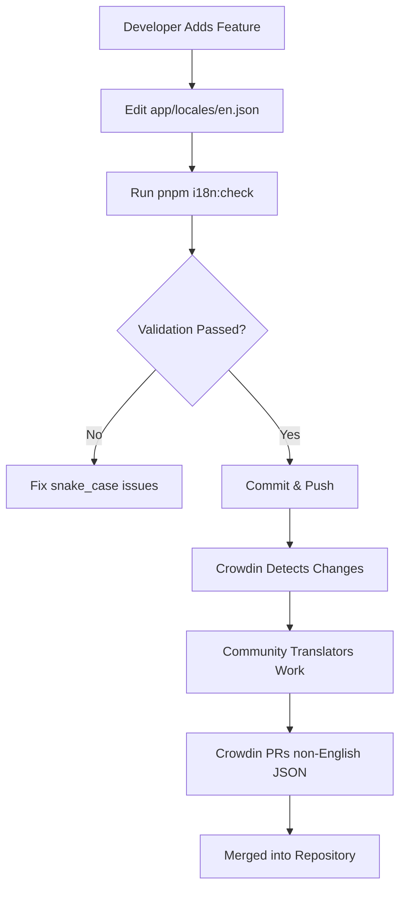
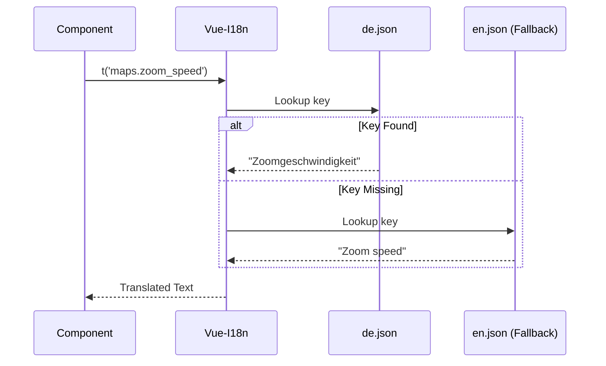

<details>
<summary>Relevant source files</summary>

The following files were used as context for generating this wiki page:

- [AGENTS.md](AGENTS.md)
- [code_review.md](code_review.md)
- [tests/llms-txt.test.ts](tests/llms-txt.test.ts)
- [app/locales/en.json](app/locales/en.json)
- [app/locales/de.json](app/locales/de.json)
- [app/locales/zh.json](app/locales/zh.json)
- [app/locales/pt.json](app/locales/pt.json)
- [app/features/maps/LeafletObjectiveTooltip.vue](app/features/maps/LeafletObjectiveTooltip.vue)

</details>

# Internationalization (i18n)

The Internationalization (i18n) system in TarkovTracker is a multi-layered implementation designed to provide a localized user interface and game data for a global player base. It primarily leverages `vue-i18n` for the frontend SPA and supports various languages for both UI elements and proxied game data from external APIs.

The system is built around a "Source-of-Truth" model where English serves as the primary development language. Localization efforts are coordinated through Crowdin, allowing community contributors to maintain non-English translations while developers focus on the core logic and English source keys.

Sources: [AGENTS.md:144-146](AGENTS.md#L144-L146), [README.md:55-57](README.md#L55-L57)

## Architecture and Workflow

The i18n architecture distinguishes between **UI Locales** (used for the application interface) and **API Languages** (used for game data fetched from the backend). While there is overlap, the sets are managed differently to accommodate the capabilities of upstream data providers like `tarkov.dev`.

### Translation Workflow
TarkovTracker uses a specific automated workflow to manage translations. Developers only modify the source English file, and an external service handles the distribution to other languages.



The workflow ensures that the codebase remains the source of truth for structure, while community experts handle the nuances of language.

Sources: [AGENTS.md:144-154](AGENTS.md#L144-L154), [code_review.md:55-58](code_review.md#L55-L58)

### UI Locales vs. API Languages
The application differentiates between the supported interface languages and the languages supported by the game data API.

| Category | Supported Codes | Source of Truth |
| :--- | :--- | :--- |
| **UI Locales** | `en`, `de`, `es`, `fr`, `ru`, `uk`, `zh`, `ko` | `app/locales/en.json` |
| **API Languages** | `cs`, `de`, `en`, `es`, `fr`, `hu`, `it`, `ja`, `ko`, `pl`, `pt`, `ro`, `ru`, `sk`, `tr`, `zh` | `json.tarkov.dev` |

Sources: [public/llms.txt:7-11](public/llms.txt#L7-L11), [tests/llms-txt.test.ts:70-80](tests/llms-txt.test.ts#L70-L80)

## Implementation Details

### JSON Locale Structure
Locales are stored as flat or nested JSON files in `app/locales/`. Every key in these files must follow `snake_case` naming conventions.

```json
{
  "generic": {
    "close_button": "Close"
  },
  "maps": {
    "zoom_speed": "Zoom speed",
    "tooltip": {
      "go_to": "Go to objective"
    }
  }
}
```

Sources: [app/locales/en.json:1099-1101](app/locales/en.json#L1099-L1101), [app/locales/en.json:444-460](app/locales/en.json#L444-L460), [AGENTS.md:149](AGENTS.md#L149)

### Frontend Usage
Components access translations using the `useI18n` composable. It is a strict project rule to avoid hard-coded user-facing strings in Vue templates.

- **Standard Translation**: `t('key.path')`
- **With Fallback**: `t('key.path', 'Fallback String')` - This provides a human-readable default if the key is missing in the current locale.
- **Pluralization/Interpolation**: Keys can accept variables, such as `{count}` or `{name}`.

Sources: [app/features/maps/LeafletObjectiveTooltip.vue:104-122](app/features/maps/LeafletObjectiveTooltip.vue#L104-L122), [AGENTS.md:149-153](AGENTS.md#L149-L153)

### Locale Fallback System
The system is configured to use `en` as the fallback locale. If a specific translation key is missing in a non-English file (e.g., `de.json`), the application automatically renders the English version to prevent UI breakage.



Sources: [AGENTS.md:147-148](AGENTS.md#L147-L148), [code_review.md:55-58](code_review.md#L55-L58)

## Validation and Maintenance

To maintain consistency across multiple languages and deep JSON structures, the project employs several automated checks.

### Mandatory Checks
Before any code is considered production-ready, it must pass the following internationalization-specific validations:
1. **i18n Check**: Triggered via `pnpm run i18n:check`. This is fatal for `snake_case` naming violations in the source `en.json`.
2. **Missing Keys**: While missing keys in non-English files are informational (due to the fallback system), they are tracked to guide community translators.
3. **Manual Edits**: Developers are strictly forbidden from manually editing non-English locale files unless fixing a broken Crowdin export.

Sources: [code_review.md:10-15](code_review.md#L10-L15), [AGENTS.md:144-154](AGENTS.md#L144-L154)

### Data Localization
Game data (tasks, items, traders) fetched via the `/api/tarkov/*` proxy accepts a `lang` parameter. This ensures that the dense game information matches the user's selected UI language where possible.

Sources: [public/llms.txt:13-25](public/llms.txt#L13-L25), [AGENTS.md:103-108](AGENTS.md#L103-L108)

## Summary
The internationalization system in TarkovTracker is a robust framework that separates UI logic from linguistic content. By enforcing a strict "English-first" development cycle and using `en` as a reliable fallback, the project maintains a high degree of stability while supporting community-driven localizations across more than a dozen languages. The dual-path approach for UI and API data ensures that both the application chrome and the complex game data remain accessible to a diverse user base.
